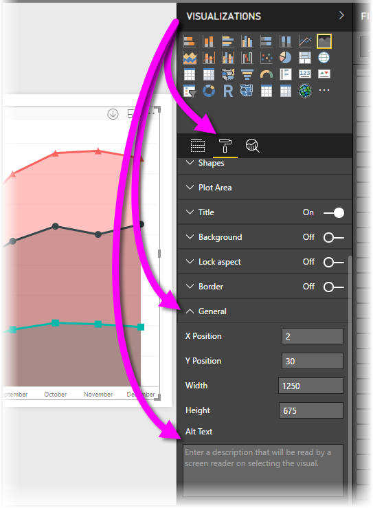

# การช่วยสำหรับการเข้าถึง ในรายงาน Power BI Desktop
Power BI มีคุณลักษณะที่ช่วยให้ผู้ทุพพลภาพสามารถใช้ และโต้ตอบกับรายงาน Power BI ได้อย่างง่ายขึ้น คุณลักษณะเหล่านี้รวมถึง ความสามารถในการใช้รายงานโดยใช้แป้นพิมพ์ หรือใช้โปรแกรมอ่านหน้าจอ แตะเพื่อโฟกัสบนวัตถุต่าง ๆ บนหน้า และใช้เครื่องหมายในการแสดงภาพที่ได้คิดถี่ถ่วนแล้ว

> [!NOTE]
> คุณลักษณะการช่วยสำหรับการเข้าถึงเหล่านี้ มีตั้งแต่ **Power BI Desktop** รุ่นเดือนมิถุนายน 2017 และที่ใหม่กว่า การช่วยสำหรับการเข้าถึง มีแผนเพิ่มขีดความสามารถขึ้นอีก ในการเผยแพร่ในอนาคต
> 
> 

## การใช้รายงาน Power BI Desktop ด้วยแป้นพิมพ์ หรือโปรแกรมอ่านหน้าจอ
เริ่มตั้งแต่การเผยแพร่เดือนกันยายน 2017 ของ **Power BI Desktop** คุณสามารถกดปุ่ม **?** เพื่อแสดงหน้าต่างที่อธิบายเกี่ยวกับ แป้นพิมพ์ลัด การช่วยสำหรับการเข้าถึงใน **Power BI Desktop**

ด้วยการปรับปรุงการช่วยสำหรับการเข้าถึง คุณสามารถใช้รายงาน Power BI โดยใช้แป้นพิมพ์หรือโปรแกรมอ่านหน้าจอ ด้วยเทคนิคต่างๆ ต่อไปนี้:

คุณสามารถสลับโฟกัสระหว่างแท็บหน้ารายงาน หรือวัตถุบนหน้ารายงาน โดยใช้ **Ctrl+F6** ได้

* เมื่อโฟกัสอยู่บน*แท็บหน้ารายงาน* ใช้แป้น*แท็บ*หรือ*ลูกศร* เพื่อย้ายโฟกัสจากรายงานหน้าหนึ่งไปอีกหน้าหนึ่ง ชื่อของหน้ารายงาน และสถานะการเลือกในปัจจุบัน จะถูกอ่านออกเสียง ด้วยโปรแกรมอ่านหน้าจอ เพื่อโหลดหน้ารายงานที่กำลังโฟกัสในขณะนี้ ใช้แป้น *Enter*หรือ*ช่องว่าง*
* เมื่อโฟกัสอยู่บน*หน้ารายงาน*ที่โหลด ใช้แป้น*แท็บ*เพื่อเลื่อนโฟกัสไปยังแต่ละวัตถุบนหน้า ซึ่งรวมถึงกล่องข้อความ รูปภาพ รูปร่าง และแผนภูมิทั้งหมด โปรแกรมอ่านหน้าจอจะอ่านชนิดของวัตถุ ชื่อเรื่องของวัตถุหากมีหนึ่งชื่อ และคำอธิบายของวัตถุนั้นหากมีให้โดยผู้เขียนรายงาน 

ในขณะที่คุณนำทางระหว่างภาพ ถ้าคุณต้องการโต้ตอบเพิ่มเติม คุณสามารถกด **Alt+Shift+F10** เพื่อย้ายโฟกัสไปยังหัวข้อภาพ ซึ่งมีตัวเลือกต่างๆ รวมถึงการเรียงลำดับ การส่งออกข้อมูลที่อยู่เบื้องหลังแผนภูมิ และโหมดโฟกัส 

คุณสามารถกด **Alt+Shift+F11** เพื่อแสดงเวอร์ชันที่สามารถเข้าถึงได้ของหน้าต่าง *แสดงข้อมูล* ซึ่งจะช่วยให้คุณสำรวจข้อมูลที่ใช้ในภาพในตาราง HTML โดยใช้แป้นพิมพ์ลัดเดียวกันกับที่คุณใช้กับโปรแกรมอ่านหน้าจอของคุณตามปกติ 

> [!NOTE]
> คุณลักษณะการแสดงข้อมูลจะสามารถเข้าถึงโปรแกรมอ่านหน้าจอผ่านแป้นพิมพ์ลัดนี้เท่านั้น หากคุณเปิดการแสดงข้อมูลผ่านตัวเลือกในส่วนหัวของภาพ จะไม่สามารถเข้าถึงโปรแกรมอ่านหน้าจอได้
> 
> 

การช่วยสำหรับการเข้าถึงที่เพิ่มเติมเข้ามา ช่วยให้ให้ผู้ใช้สามารถใช้รายงาน Power BI ด้วยโปรแกรมอ่านหน้าจอและนำทางโดยแป้นพิมพ์ได้

## เคล็ดลับการสร้างรายงานที่สามารถเข้าถึงได้
เคล็ดลับต่อไปนี้สามารถช่วยให้คุณสร้างรายงาน **Power BI Desktop** ที่สามารถเข้าถึงได้มากขึ้น

* สำหรับแผนภูมิ**เส้น**, **แผนภูมิพื้นที่**และ**แผนภูมิผสม** เช่นเดียวกับ**แผนภูมิกระจาย**และ**แผนภูมิฟอง** เปิดใช้การทำเครื่องหมาย และใช้*รูปร่างเครื่องหมาย*ที่แตกต่างกันสำหรับแต่ละเส้น
  
  * เพื่อเปิดการ*ทำเครื่องหมาย* เลือกส่วน**รูปแบบ**ในบานหน้าต่าง**การจัดรูปแบบการแสดงข้อมูล** ขยายส่วน**รูปร่าง** จากนั้นเลื่อนลงไป ค้นหา **ทำเครื่องหมาย** และสลับให้เป็น*เปิด*
  * จากนั้น เลือกชื่อของแต่ละเส้น (หรือ พื้นที่ ถ้าใช้แผนภูมิ**พื้นที่**) จากกล่องรายการดรอปดาวน์ในส่วน**รูปร่าง** ด้านล่างเมนูดรอปดาวน์ คุณสามารถปรับเปลี่ยนลักษณะต่าง ๆ ของเครื่องหมายที่ใช้สำหรับเส้นที่เลือก รวมไปถึงรูปร่าง สี และขนาด
  
  
  
  * ใช้*รูปร่างเครื่องหมาย*ที่แตกต่างกันสำหรับแต่ละเส้น ทำให้ง่ายสำหรับผู้บริโภครายงาน เพื่อแยกแยะเส้น (หรือพื้นที่) ออกจากกัน
* เพิ่มเติมจากหัวข้อที่แล้ว อย่าใช้สีเพื่อสื่อข้อมูล นอกจากการใช้รูปร่างบนเส้นและแผนภูมิกระจาย ไม่ควรใช้การจัดรูปแบบตามเงื่อนไขเพื่อให้ข้อมูลเชิงลึกในตารางและมาตรวัด 
* เลือกลำดับการจัดเรียงที่ตั้งใจสำหรับแต่ละภาพบนรายงานของคุณ เมื่อผู้ใช้โปรแกรมอ่านหน้าจอนำทางข้อมูลเบื้องหลังแผนภูมิ แผนภูมิดังกล่าวจะเลือกลำดับการจัดเรียงเดียวกันเป็นภาพ
* เลือก*ธีม* ที่มีความคมชัด และเป็นมิตรกับคนตาบอดสี จากแกลเลอรีธีม และนำเข้าโดยใช้ [คุณลักษณะตัวอย่าง**การกำหนดธีม**](desktop-report-themes.md)
* สำหรับทุก ๆ วัตถุบนรายงาน ใส่*ข้อความแสดงแทน* การทำอย่างนั้นช่วยให้ ผู้บริโภครายงานของคุณความเข้าใจสิ่งที่คุณพยายามสื่อสารด้วยวิชวล แม้ว่าพวกเขาไม่สามารถมองเห็นวิชวล รูปภาพ รูปร่าง หรือกล่องข้อความ คุณสามารถใส่*ข้อความแสดงแทน* สำหรับวัตถุใด ๆ บนรายงาน **Power BI Desktop** โดยการเลือกวัตถุ (เช่นวิชวล รูปร่าง และอื่น ๆ) และในบานหน้าต่าง**การจัดรูปแบบการแสดงข้อมูล** เลือกส่วน**รูปแบบ** ขยาย**ทั่วไป** แล้วเลื่อนลงไปด้านล่าง และกรอกข้อมูลในกล่องข้อความ**ข้อความแสดงแทน**
  
  
* ตรวจสอบให้แน่ใจว่า รายงานของคุณมีความเปรียบต่างเพียงพอ ระหว่างข้อความและสีพื้นหลัง มีเครื่องมือมากมาย เช่น [การวิเคราะห์ความคมชัดของสี](https://developer.paciellogroup.com/resources/contrastanalyser/) ที่คุณสามารถใช้เพื่อตรวจสอบสีรายงานของคุณได้ 
* ใช้ขนาดข้อความและแบบอักษรที่อ่านง่าย ข้อความขนาดเล็ก หรือแบบอักษรที่ยากต่อการอ่าน ไม่ได้ช่วยสำหรับการเข้าถึง
* ใส่ชื่อให้กับ ป้ายชื่อแกน และป้ายชื่อข้อมูล ในทุกวิชวล
* ใช้ชื่อเรื่องที่สื่อความหมายสำหรับหน้ารายงานทั้งหมด
* หลีกเลี่ยงการตกแต่งรูปร่างและรูปภาพในรายงานของคุณถ้าเป็นไปได้ เนื่องจากมีอยู่ในลำดับแท็บของรายงานแล้ว ถ้าคุณจำเป็นต้องมีวัตถุตกแต่งในรายงานของคุณ ให้ปรับปรุงข้อความแสดงแทนของวัตถุเพื่อให้ผู้ใช้โปรแกรมอ่านหน้าจอทราบว่าไว้สำหรับตกแต่ง

## การสนับสนุนความคมชัดสูงสำหรับรายงาน

เมื่อคุณใช้โหมดความคมชัดสูงใน Windows การตั้งค่าเหล่านั้นและชุดแบบสีที่คุณเลือก จะนำไปใช้กับรายงานใน **Power BI Desktop** ด้วย 

**Power BI Desktop** ตรวจหาธีมความคมชัดสูงที่กำลังใช้ใน Windows โดยอัตโนมัติ และใช้การตั้งค่าเหล่านั้นในรายงานของคุณ สีความคมชัดสูงเหล่านั้น จะติดตามไปกับรายงาน เมื่อเผยแพร่ไปยังบริการของ Power BI หรือที่อื่น ๆ

บริการของ Power BI ยังพยายามที่จะตรวจหาการตั้งค่าความคมชัดสูงที่เลือกสำหรับ Windows แต่ประสิทธิภาพและแม่นยำของตรวจหา ขึ้นอยู่กับเบราว์เซอร์ที่ใช้สำหรับบริการของ Power BI ถ้าคุณต้องการตั้งค่าธีมด้วยตนเองในบริการของ Power BI คุณสามารถเลือก **มุมมอง > สีความคมชัดสูง** แล้วเลือกธีมที่คุณต้องการนำไปใช้กับรายงานได้

เมื่ออยู่ใน **Power BI Desktop** สังเกตว่าบางพื้นที่ เช่น เขตข้อมูล**การแสดงภาพ**และ**เขตข้อมูล** ไม่สะท้อนแบบแผนชุดสีความคมชัดสูงของ Windows ที่เลือก

## ข้อควรพิจารณาและข้อจำกัด
มีปัญหาที่ทราบแล้วและข้อจำกัดบางประการ ของคุณลักษณะการช่วยสำหรับการเข้าถึง ที่จะอธิบายไว้ในรายการต่อไปนี้:

* เมื่อใช้โปรแกรมอ่านหน้าจอด้วย **Power BI Desktop**คุณจะมีประสบการณ์การใช้งานที่ดีที่สุดถ้าคุณเปิดโปรแกรมอ่านหน้าจอที่เลือกก่อนที่จะเปิดไฟล์ใดๆ ใน Power BI Desktop
* ถ้าคุณกำลังใช้โปรแกรมผู้บรรยาย จะมีข้อจำกัดบางอย่างรอบๆ การนำทางแสดงข้อมูลเป็นตาราง HTML

## ขั้นตอนถัดไป
* [ใช้ธีมรายงานใน Power BI Desktop (ตัวอย่าง)](desktop-report-themes.md)

