# ใช้บุ๊กมาร์กเพื่อแชร์ข้อมูลเชิงลึก และสร้างเรื่องราวใน Power BI 
การใช้**บุ๊กมาร์ก**ใน Power BI ช่วยให้คุณจับภาพมุมมองที่กำหนดค่าไว้ในปัจจุบันของหน้ารายงาน รวมถึงการกรองและสถานะของวิชวล และช่วยให้คุณกลับไปยังสถานะดังกล่าวในภายหลัง เพียงแค่เลือกบุ๊กมาร์กที่บันทึกไว้ 

คุณยังสามารถสร้างคอลเลกชันของบุ๊กมาร์ก จัดเรียงรายการต่าง ๆ ในลำดับที่คุณต้องการ เพื่อในภายหลัง คุณสามารถไปยังทีละบุ๊กมาร์ค เพื่อนำเสนอชุดข้อมูลเชิงลึก หรือเรื่องราวที่คุณต้องการบอก ด้วยวิชวลและรายงานของคุณได้ 

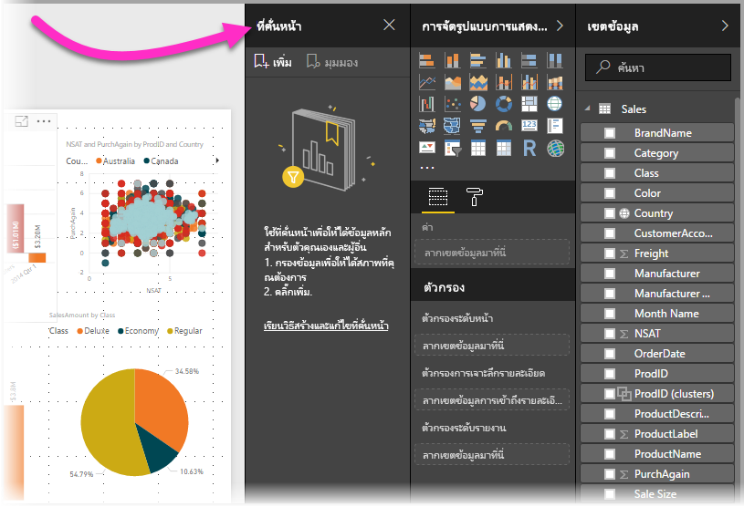

บุ๊กมาร์กสามารถใช้งานได้หลายทาง คุณสามารถใช้เพื่อติดตามความคืบหน้าของคุณเองในการสร้างรายงาน (บุ๊กมาร์ก เพิ่ม ลบ และเปลี่ยนชื่อง่าย) และคุณสามารถสร้างบุ๊กมาร์กเพื่อสร้างงานนำเสนอที่คล้ายกับ PowerPoint โดยการไปยังบุ๊กมาร์กต่าง ๆ ตามลำดับ เพื่อบอกเล่าเรื่องราวรายงานของคุณ อาจมีการใช้งานอื่น ๆ ด้วย ขึ้นอยู่กับคุณว่าจะใช้บุ๊กมาร์กดีที่สุดวิธีไหน

### เปิดใช้งานตัวอย่าง บุ๊กมาร์ก (เวอร์ชันก่อนเดือนมีนาคม 2018)
เริ่มตั้งแต่เวอร์ชัน มีนาคม 2018 ของ Power BI Desktop บุ๊กมาร์กมีให้ใช้งานโดยทั่วไปแล้ว 

เราแนะนำให้คุณอัปเกรดเป็นการเผยแพร่ล่าสุดเสมอ แต่ถ้าเวอร์ชัน Power BI Desktop ของคุณเป็นการเผยแพร่ก่อนหน้านั้น คุณยังสามารถลองคุณลักษณะ**บุ๊กมาร์ก** เริ่มตั้งแต่การเผยแพร่ **ตุลาคม 2017** ของ **Power BI Desktop** และสำหรับรายงานที่เปิดใช้งานบุ๊กมาร์กใน **บริการของ Power BI** เช่นเดียวกัน เพื่อเปิดใช้งานคุณลักษณะตัวอย่าง เลือก**ไฟล์ > ตัวเลือกและการตั้งค่า > ตัวเลือก > คุณลักษณะตัวอย่าง** แล้ว เลือกกล่องกาเครื่องหมายข้าง**บุ๊กมาร์ก** 

คุณจะต้องรีสตาร์ท **Power BI Desktop** หลังจากที่คุณทำการเลือกเพื่อเปิดใช้งานเวอร์ชันตัวอย่างของบุ๊กมาร์กแล้ว

## การใช้บุ๊กมาร์ก
เพื่อใช้บุ๊กมาร์ก เลือก ribbon **มุมมอง** จากนั้นเลือกกล่องสำหรับ **บานหน้าต่างที่คั่นหน้า** 

เมื่อคุณสร้างบุ๊กมาร์ก องค์ประกอบต่อไปนี้จะถูกบันทึกพร้อมบุ๊กมาร์ก:

* หน้าปัจจุบัน
* ตัวกรอง
* ตัวแบ่งส่วนข้อมูล
* ลำดับการจัดเรียง
* ตำแหน่งที่ดูรายละเอียด
* การมองเห็น (ของวัตถุ โดยใช้บานหน้าต่าง**เลือก**)
* โหมดโฟกัส หรือ**สปอตไลต์**ของวัตถุใด ๆ ที่มองเห็นได้

บุ๊กมาร์กไม่บันทึกสถานะการไฮไลต์เชื่อมโยงในขณะนี้ 

กำหนดค่าหน้ารายงานตามที่คุณต้องการให้ปรากฏในบุ๊กมาร์ก เมื่อหน้ารายงานของคุณและวิชวล ถูกจัดเรียงในแบบที่คุณต้องการแล้ว เลือก**เพิ่ม**จากบานหน้าต่าง**บุ๊กมาร์ก**เพื่อเพิ่มบุ๊กมาร์ก 

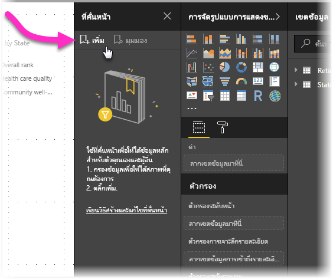

**Power BI Desktop** สร้างบุ๊กมาร์ก และตั้งชื่อทั่วไปให้ คุณสามารถ*เปลี่ยนชื่อ*, *ลบ* หรือ*อัปเดด*บุ๊กมาร์ก ได้อย่างง่ายดาย โดยการเลือกจุดไข่ปลา ที่อยู่ถัดจากชื่อบุ๊กมาร์ก จากนั้นเลือกการดำเนินการจากเมนูที่ปรากฏขึ้น

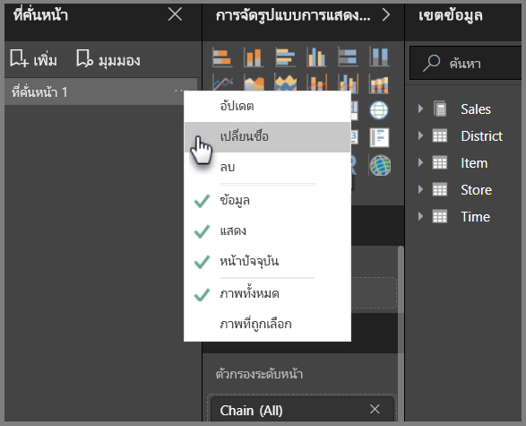

เมื่อคุณมีบุ๊กมาร์กแล้ว คุณสามารถแสดงโดยคลิกบนบุ๊กมาร์กในบานหน้าต่าง**บุ๊กมาร์ก** 

## การจัดเรียงบุ๊กมาร์ก
เมื่อคุณสร้างบุ๊กมาร์ก คุณอาจพบว่า ลำดับที่คุณสร้างขึ้นไม่จำเป็นต้องเป็นลำดับเดียวกับที่คุณต้องการนำเสนอผู้ชมของคุณ ไม่เป็นไร คุณสามารถเรียงลำดับบุ๊กมาร์กใหม่ได้อย่างง่ายดาย

ในบานหน้าต่าง**บุ๊กมาร์ก** เพียงแค่ลากบุ๊กมาร์กแล้วปล่อยเพื่อเปลี่ยนลำดับ ดังแสดงในรูปต่อไปนี้ แถบสีเหลืองระหว่างบุ๊กมาร์ก แสดงตำแหน่งที่บุ๊กมาร์กที่กำลังลากจะถูกวาง

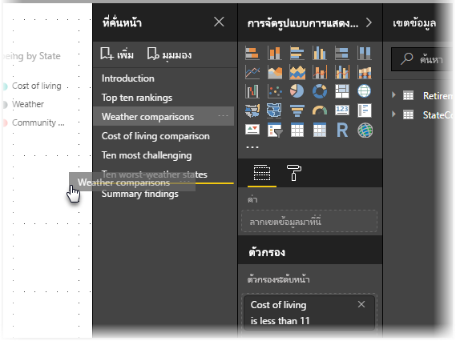

ลำดับของบุ๊กมาร์กคุณเป็นเรื่องสำคัญ เมื่อคุณใช้คุณลักษณะ**มุมมอง**ของบุ๊กมาร์ก ตามที่จะอธิบายในส่วนถัดไปได้

## ใช้บุ๊กมาร์กนำเสนอภาพนิ่ง
เมื่อคุณมีคอลเลกชันบุ๊กมาร์ก ที่คุณต้องการนำเสนอตามลำดับ คุณสามารถเลือก**มุมมอง**จากบานหน้าต่าง**บุ๊กมาร์ก** เพื่อเริ่มการนำเสนอภาพนิ่ง

เมื่ออยู่ในโหมด**มุมมอง** มีบางคุณสมบัติที่สังเกตได้:

1. ชื่อบุ๊กมาร์กปรากฏในแถบชื่อเรื่องบุ๊กมาร์ก ซึ่งอยู่ด้านล่างของพื้นที่ทำงาน
2. แถบชื่อเรื่องบุ๊กมาร์ก มีลูกศรที่ช่วยให้คุณสามารถไปยังบุ๊กมาร์กถัดไป หรือก่อนหน้าได้
3. คุณสามารถออกจากโหมด**มุมมอง** โดยการเลือก**ออกจาก**จากบานหน้าต่าง**บุ๊กมาร์ก** หรือโดยการเลือก **X** ในแถบชื่อเรื่องบุ๊กมาร์กได้ 

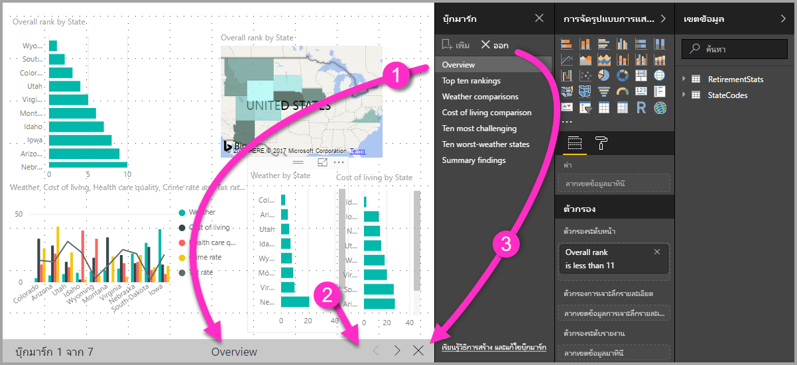

เมื่อคุณอยู่ในโหมด**มุมมอง** คุณสามารถปิดบานหน้าต่าง**บุ๊กมาร์ก** (โดยการคลิก X บนบานหน้าต่างนั้น) เพื่อให้มีพื้นที่เพิ่มเติมสำหรับงานนำเสนอของคุณได้ และ ขณะที่อยู่ในโหมด**มุมมอง** วิชวลทั้งหมดเป็นแบบโต้ตอบ และพร้อมสำหรับการไฮไลต์แบบเชื่อมโยง เหมือนกับทีโต้ตอบกับวิชวลเหล่านั้นตามปกติ 

## การมองเห็น - ด้วยบานหน้าต่างการเลือก
บานหน้าต่าง**การเลือก**ใหม่ อยู่ในการเผยแพร่พร้อมกับบุ๊กมาร์ก บานหน้าต่าง**การเลือก**แสดงรายการของวัตถุทั้งหมดบนหน้าปัจจุบัน และให้คุณสามารถเลือกวัตถุ และระบุว่าวัตถุที่กำหนดมองเห็นได้หรือไม่ 

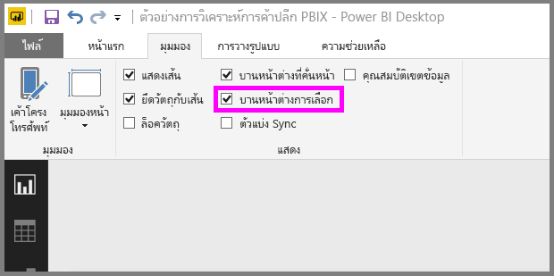

คุณสามารถเลือกวัตถุ โดยใช้บานหน้าต่าง**การเลือก**ได้ นอกจากนี้ คุณยังสามารถสลับว่าวัตถุสามารถมองเห็นได้หรือไม่ โดยการคลิกที่ไอคอนรูปตา ที่ด้านขวาของวิชวล 

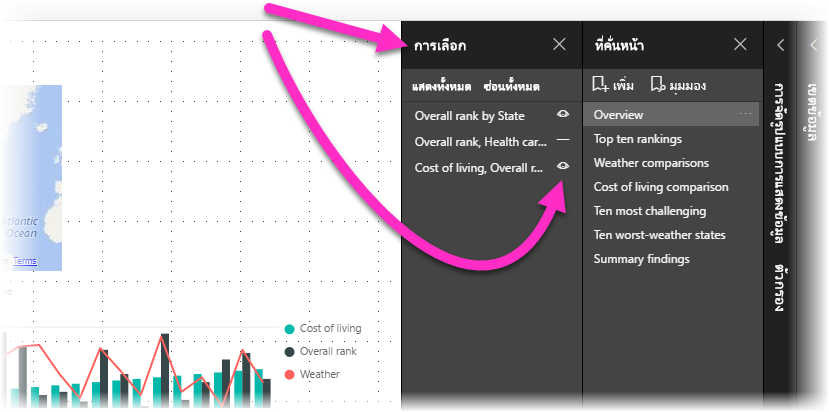

เมื่อเพิ่มบุ๊กมาร์ก สถานะการมองเห็นของแต่ละวัตถุจะถูกบันทึกด้วย ตามการตั้งค่าในบานหน้าต่าง**การเลือก** 

สิ่งสำคัญที่ต้องทราบคือ **ตัวแบ่งส่วนข้อมูล**ยังคงกรองหน้ารายงาน โดยไม่คำนึงถึงว่าตัวแบ่งส่วนข้อมูลจะมองเห็นได้หรือไม่ ด้วยเหตุนี้ คุณสามารถสร้างบุ๊กมาร์กจำนวนมาก โดยมีการตั้งค่าตัวแบ่งส่วนข้อมูลที่แตกต่างกัน และทำให้หน้ารายงานดูแตกต่างกันได้มาก (และไฮไลต์ข้อมูลเชิงลึกที่แตกต่างกัน) ในแต่ละบุ๊กมาร์ก

## บุ๊กมาร์กสำหรับรูปร่างและรูปภาพ
คุณยังสามารถเชื่อมโยงรูปร่างและรูปภาพไปยังบุ๊กมาร์ก ด้วยคุณลักษณะนี้ เมื่อคุณคลิกที่วัตถุ จะแสดงบุ๊กมาร์กที่เชื่อมโยงกับวัตถุนั้น 

เพื่อกำหนดบุ๊กมาร์กแก่วัตถุ เลือกวัตถุ จากนั้นเลือก**ลิงค์**จากบานหน้าต่าง**กำหนดแบบรูปทรง** ดังที่แสดงในรูปต่อไปนี้

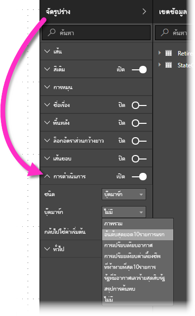

เมื่อคุณเปิดแถบเลื่อน**ลิงค์**ไปเป็น**เปิด** คุณสามารถเลือกว่าวัตถุเป็นลิงค์ หรือบุ๊กมาร์กได้ ถ้าคุณเลือกบุ๊กมาร์ก คุณสามารถว่าวัตถุจะเชื่อมโยงไปบุ๊กมาร์กไหน

มีหลายสิ่งที่น่าสนใจ ที่คุณสามารถทำได้ ด้วยการเชื่อมโยงจากวัตถุไปเป็นบุ๊กมาร์กได้ คุณสามารถสร้างสารบัญวิชวลบนหน้ารายงานของคุณ หรือคุณสามารถมอบมุมมองต่าง ๆ (เช่นชนิดของวิชวล) ของข้อมูลเดียวกัน เพียงคลิกที่วัตถุต่าง ๆ

เมื่อคุณอยู่ในโหมดการแก้ไข คุณสามารถใช้ ctrl+คลิก เพื่อไปที่ลิงก์ และเมื่อไม่อยู่ในโหมดแก้ไข เพียงแค่คลิกวัตถุจะไปที่ลิงก์ 

## การใช้สปอตไลต์
อีกคุณลักษณะที่เผยแพร่พร้อมกับบุ๊กมาร์กคือ **สปอตไลต์** ด้วย**สปอตไลต์** คุณสามารถดึงดูดความสนใจลงในเฉพาะแผนภูมิ เช่น เมื่อนำเสนอบุ๊กมาร์กของคุณในโหมด**มุมมอง**ได้

เรามาเปรียบเทียบโหมด**สปอตไลต์**กับ**โฟกัส** เพื่อดูความแตกต่างของทั้งสองโหมด

1. ในโหมด**โฟกัส** คุณสามารถมีวิชวลเดียวที่ขยายจนเต็มพื้นที่ทำงาน โดยการเลือกไอคอน**โหมดโฟกัส**ได้
2. เมื่อใช้**สปอตไลต์** คุณสามารถไฮไลต์วิชวลหนึ่งในขนาดเดิม โดยทำให้วิชวลอื่น ๆ ทั้งหมดซีดหายไปเกือบจะโปร่งใสได้ 

เมื่อวิชวลในภาพก่อนหน้า มีการเลือกไอคอน**โฟกัส** หน้ารายงานจะมีลักษณะดังต่อไปนี้:

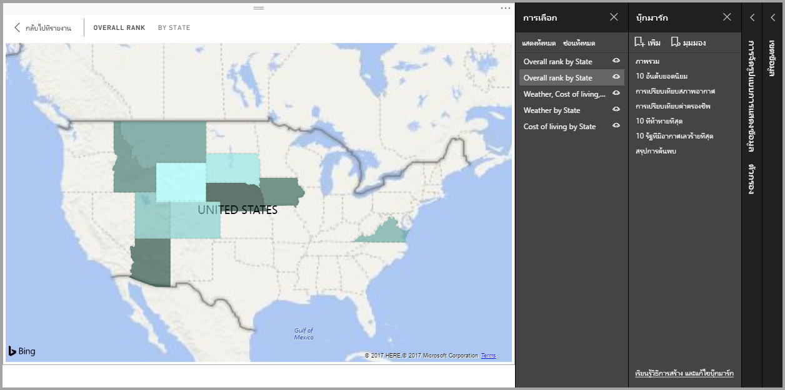

ในทางตรงข้าม เมื่อ**สปอตไลต์**ถูกเลือกจากเมนูจุดไข่ปลาของวิชวล หน้ารายงานจะดูเหมือนรูปต่อไปนี้:

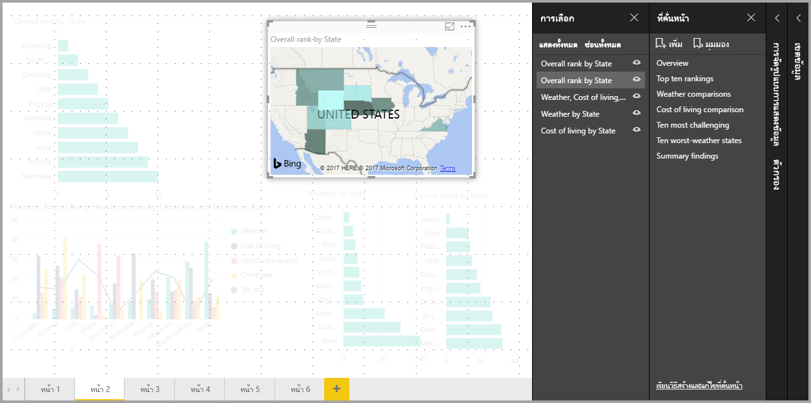

ถ้าโหมดใดโหมดหนึ่งถูกเลือกขณะที่เพิ่มบุ๊กมาร์ก โหมดนั้น (โฟกัสหรือสปอตไลต์) จะคงอยู่ในบุ๊กมาร์ก

## บุ๊กมาร์กในบริการของ Power BI
เมื่อคุณเผยแพร่รายงานไปยัง**บริการของ Power BI** ที่มีอย่างน้อยหนึ่งบุ๊กมาร์ก คุณสามารถดูและโต้ตอบกับบุ๊กมาร์กเหล่านั้นใน**บริการของ Power BI** ได้ สำหรับแต่ละรายงานที่คุณเผยแพร่ คุณต้องมีอย่างน้อยหนึ่งบุ๊กมาร์กที่สร้างขึ้นในรายงาน ก่อนที่คุณเผยแพร่ เพื่อให้คุณลักษณะบุ๊กมาร์ก มีให้ใช้งานใน**บริการของ Power BI**

เมื่อบุ๊กมาร์กมีให้ใช้งานในรายงาน คุณสามารถเลือก**มุมมอง > บานหน้าต่างการเลือก** หรือ**มุมมอง > บานหน้าต่างบุ๊กมาร์ก** เพื่อแสดงบานหน้าต่างเหล่านั้นได้

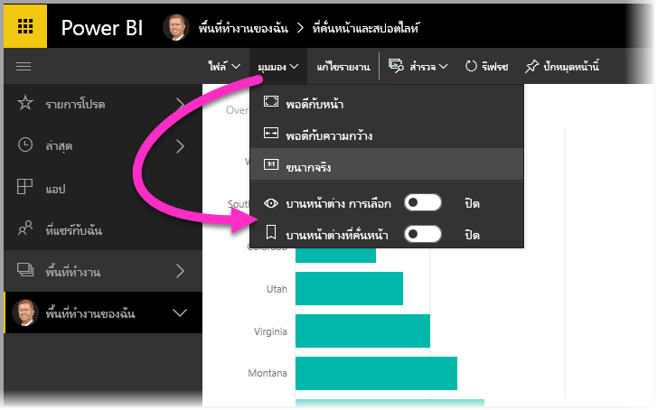

ใน**บริการของ Power BI** **บานหน้าต่างบุ๊กมาร์ก**ทำงานเหมือนกับที่ทำงานใน **Power BI Desktop** รวมไปถึงความสามารถในการเลือก**มุมมอง** เพื่อแสดงบุ๊กมาร์กของคุณตามลำดับ เหมือนกับการนำเสนอภาพนิ่ง

โปรดทราบว่า คุณต้องใช้แถบชื่อเรื่องบุ๊กมาร์กสีเทา เพื่อไปยังบุ๊กมาร์กต่าง ๆ ไม่ใช่ลูกศรสีดำ (ลูกศรสีดำจะพาคุณไปตามหน้าต่าง ๆ ของรายงาน ไม่ใช่บุ๊กมาร์ก)

## ข้อจำกัดและข้อควรพิจารณา
ในการเผยแพร่นี้ **บุ๊กมาร์ก**มีข้อจำกัดและข้อควรพิจารณาบางอย่าง

* วิชวลแบบกำหนดเองไม่ทำงานกับบุ๊กมาร์ก ถ้าวิชวลเหล่านั้นเป็น*แหล่ง*ของตัวกรอง ถ้าคุณกำลังใช้วิชวลแบบกำหนดเองเพื่อกรององค์ประกอบบนหน้า (ตัวอย่างเช่น Chiclet Slicer) และกลับไปยังหน้านั้นโดยใช้บุ๊กมาร์ก หน้าอาจถูกกรอง แต่วิชวลแบบกำหนดเองจะไม่ถูกอัปเดตเพื่อแสดงว่าหน้ากำลังถูกกรองอย่างไร 
* สถานะไฮไลต์แบบเชื่อมโยงของบานหน้าต่างรายงาน จะ*ไม่*ถูกบันทึกเมื่อคุณสร้างบุ๊กมาร์ก 
* ถ้าคุณเพิ่มวิชวลบนหน้ารายงานหลังจากการสร้างบุ๊กมาร์ก วิชวลจะแสดงในสถานะเริ่มต้น ซึ่งหมายความว่า ถ้าคุณเพิ่มตัวแบ่งส่วนข้อมูลลงในหน้าที่คุณเคยสร้างบุ๊กมาร์กไว้ก่อน ตัวแบ่งส่วนข้อมูลจะทำงานในสถานะเริ่มต้น
* การย้ายวิชวลหลังจากการสร้างบุ๊กมาร์ก จะมีผลในบุ๊กมาร์ก 
* คุณ*ต้อง*มีอย่างน้อยหนึ่งบุ๊กมาร์กในรายงานของคุณ เมื่อคุณเผยแพร่ใน**บริการของ Power BI** เพื่อให้มีบุ๊กมาร์กให้ใช้งานในบริการ นี่คือข้อกำหนดสำหรับแต่ละรายงานที่คุณเผยแพร่

## ขั้นตอนถัดไป
สำหรับข้อมูลเพิ่มเติมเกี่ยวกับลักษณะการทำงานที่คล้ายกัน หรือการโต้ตอบกับบุ๊กมาร์ก โปรดดูที่บทความต่อไปนี้:

* [ใช้ drillthrough ใน Power BI Desktop](desktop-drillthrough.md)
* [แสดงไทล์แดชบอร์ดหรือรายงานวิชวลในโหมดโฟกัส](service-focus-mode.md)

