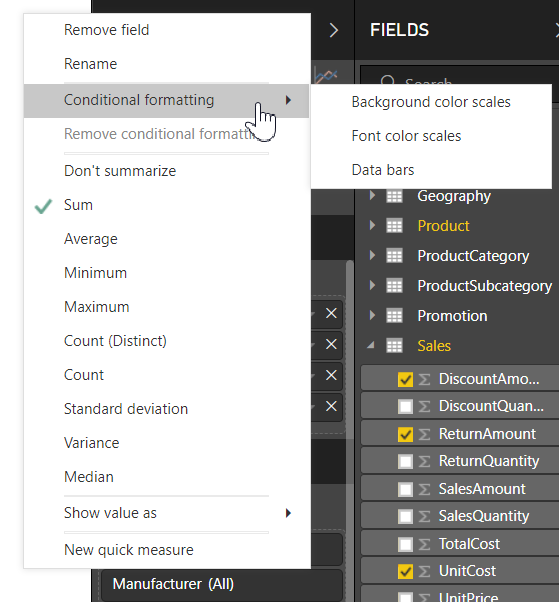
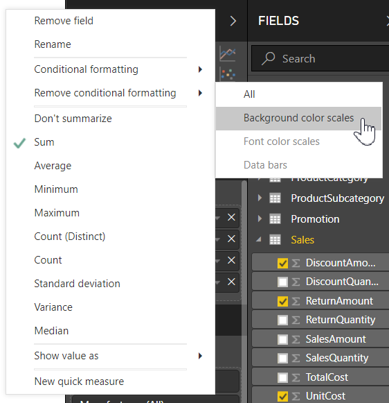
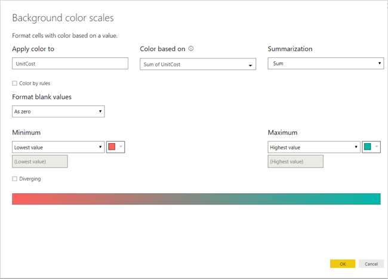
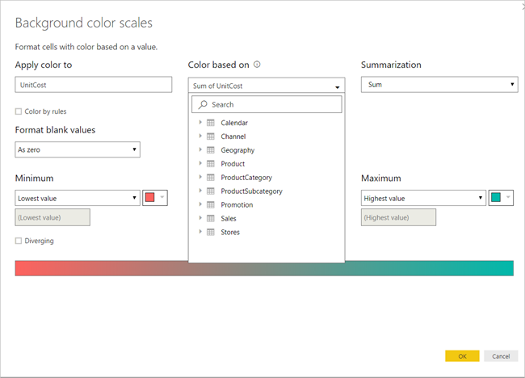
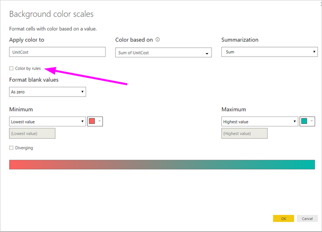
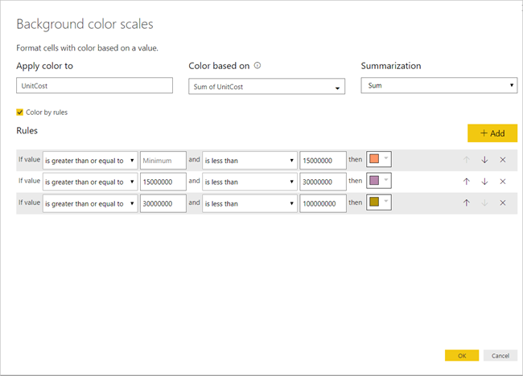
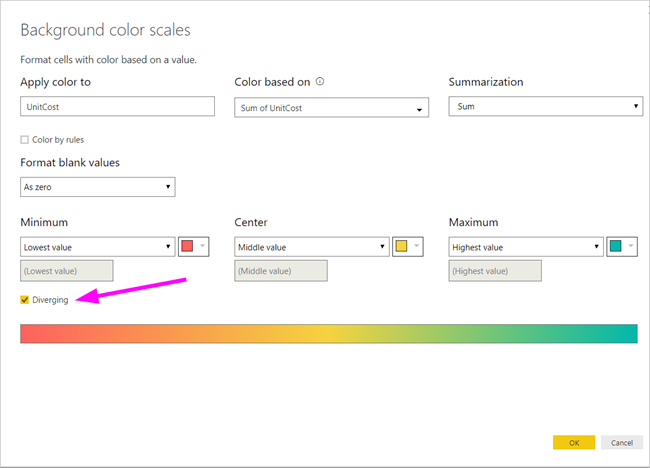
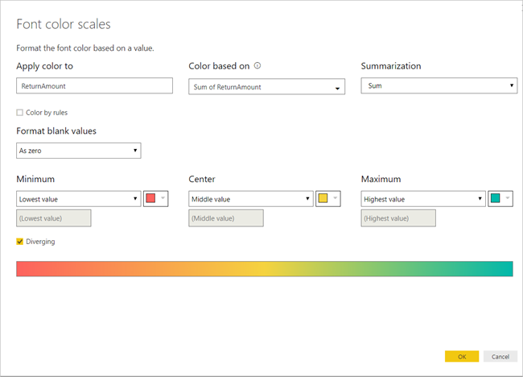
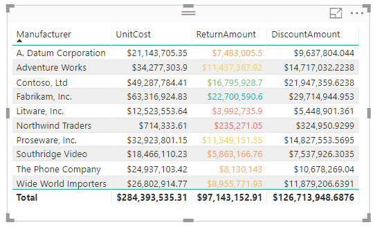
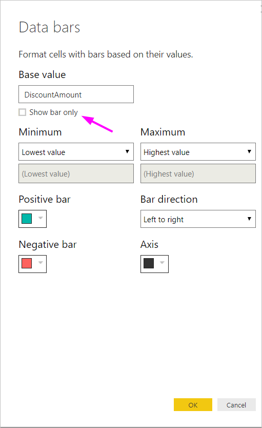

# การจัดรูปแบบตามเงื่อนไขในตาราง 
ด้วยการจัดรูปแบบตามเงื่อนไขสำหรับตาราง คุณสามารถระบุสีพื้นหลังของเซลล์ตามค่าของเซลล์ หรือตามค่าอื่นหรือเขตข้อมูลอื่น รวมถึงการไล่ระดับสี คุณยังสามารถแสดงค่าเซลล์ ด้วยแถบข้อมูล 

การเข้าถึงรูปแบบตามเงื่อนไข ในแอ่ง**ช่องข้อมูล**ของพื้นที่**การแสดงภาพ**ใน Power BI Desktop เลือกลูกศรชี้ลงข้าง ๆ ค่าในแอ่ง**ค่า**เดียวกับที่คุณต้องการจัดรูปแบบ (หรือคลิกขวาที่ช่องข้อมูล) คุณสามารถจัดการการจัดรูปแบบตามเงื่อนไขสำหรับช่องข้อมูลในพื้นที่**ค่า**ของแอ่ง**ช่องข้อมูล**ได้เท่านั้น

ส่วนต่อไปนี้อธิบายแต่ละตัวเลือกการจัดรูปแบบตามเงื่อนไขเหล่านี้ สามารถรวมตัวเลือกหนึ่งหรือหลายตัวเลือกในคอลัมน์เดียวของตารางได้

> [!NOTE]
> เมื่อนำไปใช้กับตาราง การจัดรูปแบบตามเงื่อนไขจะแทนที่สไตล์ตารางแบบกำหนดเองใด ๆ ที่ใช้กับเซลล์ที่ถูกจัดรูปแบบตามเงื่อนไข

เพื่อเอาการจัดรูปแบบตามเงื่อนไขออกจากวิชวล เพียงแค่คลิกขวาที่เขตข้อมูลอีกครั้ง เลือก**ลบการจัดรูปแบบตามเงื่อนไขออก** และเลือกชนิดของการจัดรูปแบบที่จะเอาออก

## สเกลสีพื้นหลัง

เลือก**จัดรูปแบบตามเงื่อนไข** แล้วเลือก**สเกลสีพื้นหลัง**จะแสดงกล่องโต้ตอบต่อไปนี้

คุณสามารถเลือกเขตข้อมูลจากรูปแบบข้อมูลของคุณที่จะใช้สีตามได้ โดยการตั้งค่า**สีตาม**กับเขตข้อมูลนั้น นอกจากนี้ คุณสามารถระบุชนิดการรวมสำหรับเขตข้อมูลที่เลือกด้วยค่า**การสรุปข้อมูล**ได้ เขตข้อมูลที่จะระบายสี จะระบุในเขตข้อมูล**ใช้สีกับ** เพื่อให้คุณสามารถติดตาม คุณสามารถใช้การจัดรูปแบบตามเงื่อนไขกับเขตข้อมูลข้อความและวันที่ได้ ตราบใดที่คุณเลือกค่าตัวเลขเป็นพื้นฐานของการจัดรูปแบบ

เพื่อใช้ค่าสีแบบไม่ต่อเนื่องสำหรับช่วงของค่าที่กำหนด เลือก**สีตามกฎ** เพื่อใช้สีต่อเนื่อง ปล่อยให้**สีตามกฎ**ไม่มีการเลือก 

### สีตามกฎ

เมื่อคุณเลือก**สีตามกฎ** คุณสามารถป้อนหนื่งหรือหลายช่วงของค่า โดยตั้งค่าสีสำหรับแต่ละช่วงได้  ค่าแต่ละช่วงเริ่มต้นจากเงื่อนไข*ถ้าค่า* เงื่อนไข*และ*ค่า และสี

เซลล์ตารางที่มีค่าในแต่ละช่วงถูกเติมด้วยสีที่กำหนด มีสามกฎในรูปต่อไปนี้

ตารางตัวอย่างตอนนี้มีลักษณะดังนี้:

### สีต่ำสุดถึงสูงสุด

คุณสามารถกำหนดค่า*ต่ำสุด*และ*สูงสุด*และสีค่านั้นได้ ถ้าคุณเลือกกล่อง**เลือกแยกจากกัน** คุณสามารถกำหนดค่า*ศูนย์กลาง*ที่เป็นทางเลือกได้เช่นกัน

ตารางตัวอย่างตอนนี้มีลักษณะดังนี้:

## สเกลสีฟอนต์

เลือก**จัดรูปแบบตามเงื่อนไข** แล้วเลือก**สเกลสีฟอนต์** จะแสดงกล่องโต้ตอบต่อไปนี้ กล่องโต้ตอบนี้จะคล้ายกับกล่องโต้ตอบ**สเกลสีพื้นหลัง** แต่จะเปลี่ยนสีฟอนต์แทนที่จะเป็นสีพื้นหลังของเซลล์

ตารางตัวอย่างตอนนี้มีลักษณะดังนี้:

## แถบข้อมูล

เลือก**จัดรูปแบบตามเงื่อนไข** แล้วเลือก**แถบข้อมูล** จะแสดงกล่องโต้ตอบต่อไปนี้ 

ตามค่าเริ่มต้น ตัวเลือก**แสดงแถบอย่างเดียว**จะไม่ได้เลือก ดังนั้น เซลล์ของตารางจะแสดงทั้งแถบและค่าจริง

ถ้าเลือกตัวเลือก**แสดงแถบอย่างเดียว** เซลล์ของตารางจะแสดงเฉพาะแถบเท่านั้น

## การจัดรูปแบบสีโดยค่าของเขตข้อมูล

คุณสามารถใช้หน่วยวัดหรือคอลัมน์ที่ระบุสี โดยใช้ค่าข้อความหรือโค้ดฐานสิบหก เพื่อใช้สีนั้นกับพื้นหลังของสีฟอนต์ของตารางหรือวิชวลเมทริกซ์ คุณสามารถสร้างตรรกะที่กำหนดเองสำหรับเขตข้อมูลที่ระบุ และมีตรรกะที่ใช้สีที่ต้องการกับฟอนต์หรือพื้นหลัง

ตัวอย่าง ในตารางต่อไปนี้จะมีสีที่เกี่ยวข้องกับแต่ละรุ่นผลิตภัณฑ์ 

เมื่อต้องการจัดรูปแบบเซลล์ตามค่าเขตข้อมูล เลือกกล่องโต้ตอบ**การจัดรูปแบบตามเงื่อนไข** โดยการคลิกขวาคอลัมน์*สี*สำหรับวิชวลนั้น และในกรณีนี้เลือก**สีพื้นหลัง**จากเมนู 

ในกล่องโต้ตอบที่ปรากฏขึ้น เลือก**ค่าเขตข้อมูล**ใน**การจัดรูปแบบโดย**พื้นทีดรอปดาวน์ ดังที่แสดงในรูปต่อไปนี้

คุณสามารถทำซ้ำกระบวนการสำหรับสีฟอนต์ และผลลัพธ์ในวิชวลจะเป็นสีทึบในคอลัมน์**สี** ดังที่แสดงในหน้าจอต่อไปนี้ได้

คุณยังสามารถสร้างการคำนวณ DAX ตามตรรกะทางธุรกิจ ที่แสดงผลรหัสฐานสิบหกอื่นตามเงื่อนไขที่คุณต้องการ ซึ่งโดยทั่วไปแล้วง่ายกว่าการสร้างกฎหลายกฎในกล่องโต้ตอบการจัดรูปแบบตามเงื่อนไข พิจารณาเขตข้อมูล*ColorKPI*ในรูปตัวอย่างต่อไปนี้

จากนั้นคุณสามารถตั้งค่าเขตข้อมูลสำหรับ**สีพื้นหลัง**ในวิธีต่อไปนี้

และคุณอาจจะได้รับผลลัพธ์เช่นเมทริกซ์ต่อไปนี้

มีหลายรูปแบบเพิ่มเติมที่คุณสามารถสร้าง เพียงแค่ใช้จินตนาการของคุณและ DAX เล็กน้อย

## ขั้นตอนถัดไป
สำหรับข้อมูลเพิ่มเติม โปรดดูบทความต่อไปนี้:  

* [คำแนะนำและเคล็ดลับในการจัดรูปแบบสีใน Power BI](visuals/service-tips-and-tricks-for-color-formatting.md)  

