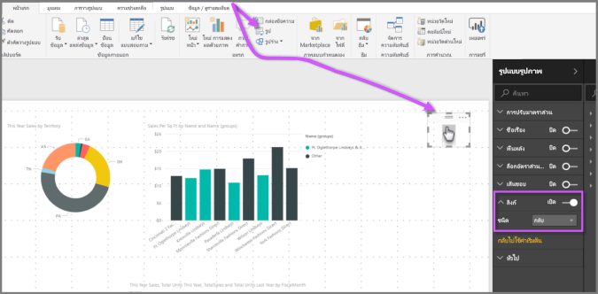

# ใช้ Drillthrough ใน Power BI Desktop
เมื่อใช้ **Drillthrough** ใน **Power BI Desktop** คุณก็สามารถสร้างหน้าในรายงานของคุณที่มุ่งเน้นเกี่ยวกับเอนทิตีตามที่ระบุ เช่น ผู้จัดหา หรือลูกค้า หรือผู้ผลิต ด้วยหน้ารายงานที่มีการมุ่งเน้นดังกล่าว ผู้ใช้ก็สามารถคลิกขวาที่จุดข้อมูลในหน้ารายงานอื่นๆ แล้วเข้าถึงรายละเอียดในหน้าที่มีการมุ่งเน้น เพื่อดูรายละเอียดที่กรองข้อมูลไปยังบริบทดังกล่าว

## การใช้ Drillthrough
เมื่อต้องการใช้ **Drillthrough** ให้สร้างหน้ารายงานที่มีภาพที่คุณต้องการดูเกี่ยวกับชนิดของเอนทิตีซึ่งคุณจะให้มีการเข้าถึงรายละเอียด ตัวอย่างเช่น ถ้าคุณสนใจให้เข้าถึงรายละเอียดเกี่ยวกับผู้ผลิต คุณอาจสร้างหน้า Drillthrough ด้วยภาพที่แสดงยอดขายรวม จำนวนหน่วยรวมที่จัดส่ง ยอดขายตามประเภท ยอดขายตามภูมิภาค และอื่นๆ ด้วยวิธีดังกล่าว เมื่อคุณเข้าถึงรายละเอียดในหน้านั้น ภาพก็จะมีความจำเพาะเจาะจงกับผู้ผลิตที่คุณคลิกแล้วเลือกที่จะเข้าถึงรายละเอียด

จากนั้นในหน้าการเข้าถึงรายละเอียดดังกล่าว ในส่วน**เขตข้อมูล**ของบานหน้าต่าง**การแสดงภาพ** ให้ลากเขตข้อมูลที่คุณต้องการเข้าถึงรายละเอียดใน**ตัวกรอง Drillthrough**ตามที่เหมาะสม

เมื่อคุณเพิ่มเขตข้อมูลไปยัง**ตัวกรองการเข้าถึงรายละเอียด**ตามที่เหมาะสม **Power BI Desktop** ก็จะสร้างปุ่ม*ย้อนกลับ*ให้โดยอัตโนมัติ ภาพดังกล่าวจะกลายเป็นปุ่มในรายงานที่เผยแพร่ และช่วยให้ผู้ใช้ที่กำลังใช้งานรายงานของคุณใน**บริการของ Power BI** สามารถกลับไปยังหน้ารายงานที่ออกมา (หน้าซึ่งได้เลือกไว้ เพื่อเข้าถึงรายละเอียด) ได้อย่างสะดวก

เนื่องจากปุ่ม*ย้อนกลับ*เป็นรูปภาพ คุณสามารถเปลี่ยนรูปภาพให้เป็นรูปภาพต่างๆ ที่คุณต้องการได้ และจะยังคงทำงานอย่างถูกต้องเป็นปุ่ม เมื่อต้องการแจ้งให้ผู้บริโภคกลับไปยังหน้าเริ่มต้นของผู้บริโภค เมื่อต้องการใช้รูปภาพของคุณเองเป็นปุ่มย้อนกลับ เพียงวางรูปภาพลงในหน้าการเข้าถึงรายละเอียด จากนั้นเลือกภาพ แล้วใส่แถบเลื่อน*ปุ่มย้อนกลับ*ลงไป ซึ่งจะทำให้รูปภาพของคุณทำหน้าที่เป็นปุ่ม*ย้อนกลับ*

หลังจากหน้า**การเข้าถึงรายละเอียด**ของคุณเสร็จสมบูรณ์ เมื่อผู้ใช้คลิกขวาบนจุดข้อมูลในรายงานของคุณที่ใช้เขตข้อมูลซึ่งวางลงใน**ตัวกรอง Drillthrough** ตามที่เหมาะสมในหน้าการเข้าถึงรายละเอียดของคุณ เมนูบริบทก็จะปรากฏขึ้น เพื่ออนุญาตให้ผู้ใช้สามารถเข้าถึงรายละเอียดในหน้านั้นได้

เมื่อผู้ใช้เลือกที่จะเข้าถึงรายละเอียด หน้าจะได้รับการกรองข้อมูล เพื่อแสดงข้อมูลเกี่ยวกับจุดข้อมูลที่ได้คลิกขวาไว้ ตัวอย่างเช่น ถ้าผู้ใช้คลิกขวาที่จุดข้อมูลเกี่ยวกับ Contoso (ผู้ผลิต) แล้วเลือกที่จะเข้าถึงรายละเอียด หน้าการเข้าถึงรายละเอียดที่เลือกไว้จะนำไปกรองข้อมูลเกี่ยวกับ Contoso

> [!NOTE]
> เฉพาะเขตข้อมูลที่อยู่ใน**ตัวกรอง Drillthrough** ตามที่เหมาะสมจะได้รับการส่งผ่านไปยังหน้ารายงานการเข้าถึงรายละเอียด ไม่มีการส่งผ่านข้อมูลตามบริบทอื่นๆ
> 
> 

และนั่นคือวิธีการทั้งหมดในการใช้งาน **Drillthrough** ในรายงานของคุณ ซึ่งเป็นวิธีการที่ดีเยี่ยม เมื่อต้องการดูข้อมูลในมุมมองขยายสำหรับข้อมูลเอนทิตีซึ่งคุณเลือกไว้สำหรับตัวกรองการเข้าถึงรายละเอียด

