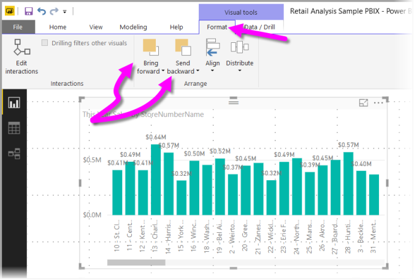
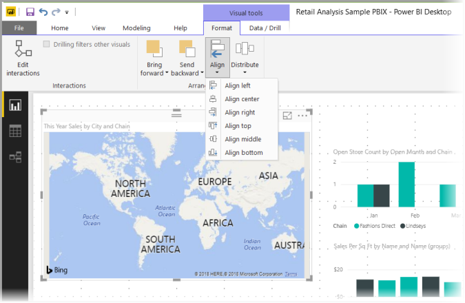
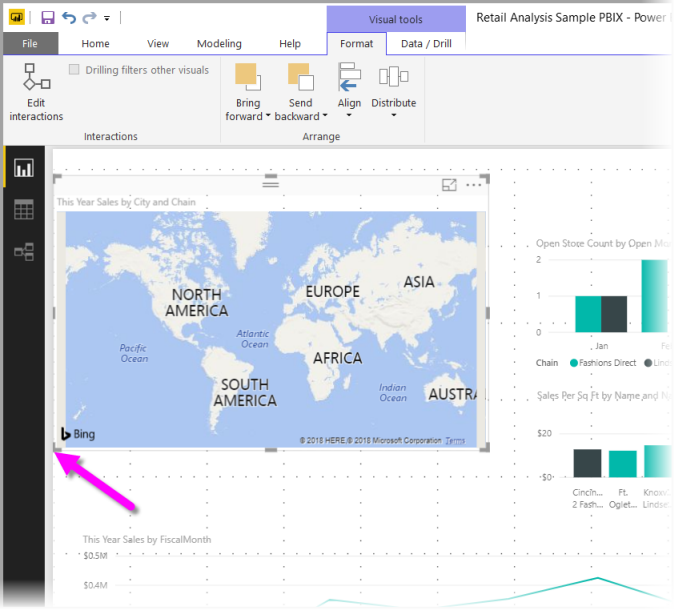
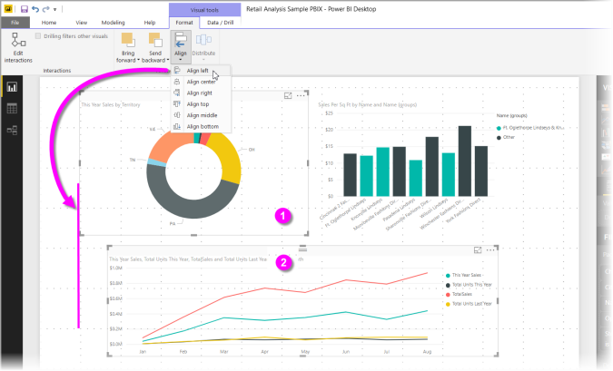
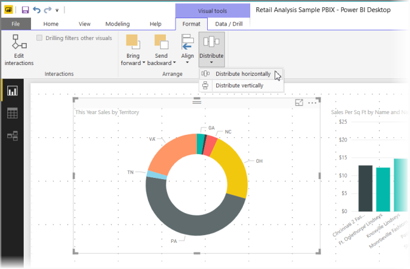

# ใช้เส้นตารางและจัดชิดกับเส้นตารางในรายงาน Power BI Desktop
พื้นที่รายงาน **Power BI Desktop** แสดงเส้นตารางที่ช่วยให้คุณจัดแนวภาพบนหน้ารายงานได้อย่างสมบูรณ์ และยังมีฟังก์ชันการทำงานจัดชิดกับเส้นตารงจึงทำให้ภาพในรายงานของคุณมีลักษณะสะอาด มีการจัดแนว และระยะห่างเท่ากัน

ใน**Power BI Desktop**คุณยังสามารถปรับลำดับแบบ Z (นำไปข้างหน้า ย้ายไปข้างหลัง) ของวัตถุบนรายงาน รวมถึงจัดแนว หรือกระจายภาพที่เลือกบนพื้นที่ทำงานให้เท่า ๆ กัน

### การเปิดใช้งานเส้นตารางและจัดชิดกับเส้นตาราง
เมื่อต้องการเปิดใช้งานเส้นตารางและจัดชิดกับเส้นตาราง เลือกแบบ**มุมมอง** Ribbon จากนั้นเปิดใช้กล่องกาเครื่องหมายสำหรับ**แสดงเส้นตาราง**และ**จัดชิดวัตถุกับเส้นตาราง** คุณสามารถเลือกหนึ่งกล่องหรือทั้งสองกล่อง ซึ่งทั้งสองทำงานอย่างเป็นอิสระ

> [!NOTE]
> ถ้า**การแสดงเส้นตาราง**และ**จัดชิดวัตถุกับเส้นตาราง**ถูกปิดใช้งาน ให้เชื่อมต่อกับแหล่งข้อมูลใด ๆ และพวกเขาจะถูกเปิดใช้งาน
> 
> 

### การใช้เส้นตาราง
เส้นตารางคือ เส้นบอกแนวแบบเป็นภาพที่ช่วยให้คุณเห็นว่าภาพสองภาพหรือมากกว่านั้นถูกจัดแนวอย่างถูกต้อง เมื่อคุณกำลังพยายามจะกำหนดว่า ภาพสองภาพ (หรือมากกว่า) จะถูกจัดแนวตามแนวนอนหรือแนวตั้ง คุณสามารถใช้เส้นตารางเพื่อกำหนดได้ด้วยการมองเห็นว่าเส้นขอบของพวกเขามีการจัดแนวหรือไม่

คุณสามารถใช้*CTRL + คลิก*เมื่อต้องเลือกภาพมากกว่าหนึ่งภาพในแต่ละครั้ง ซึ่งแสดงเส้นขอบของภาพที่เลือกทั้งหมด ทำให้คุณเห็นได้อย่างง่ายดายว่าภาพถูกจัดแนวอย่างเหมาะสมหรือไม่

#### การใช้เส้นตารางภายในภาพ
ใน Power BI ยังมีเส้นตารางภายในภาพ ซึ่งแสดงเส้นบอกแนวแบบเป็นภาพสำหรับการเปรียบเทียบจุดข้อมูลและค่าต่าง ๆ เริ่มต้นด้วยการวางจำหน่าย**Power BI Desktop**ในเดือน 2017 กันยายน ตอนนี้คุณสามารถจัดการเส้นตารางภายในภาพที่ใช้บัตร**แกน x**หรือ**แกน y**(ตามความเหมาะสมตามชนิดของภาพ) พบในส่วน**รูปแบบ**ของบานหน้าต่าง**การแสดงภาพ** คุณสามารถจัดการองค์ประกอบของเส้นตารางภายในภาพต่อไปนี้:

* เปิดหรือปิดเส้นตาราง
* เปลี่ยนสีของเส้นตาราง
* ปรับเส้นขีด (ความกว้าง) ของเส้นตาราง
* เลือกสไตล์เส้นของเส้นตารางในภาพ เช่น ทึบ เส้นประ หรือจุด

การปรับเปลี่ยนองค์ประกอบบางอย่างของเส้นตารางจะมีประโยชน์ในรายงานที่ใช้พื้นหลังสีเข้มสำหรับภาพ รูปภาพต่อไปนี้แสดงส่วน*เส้นตาราง*ในบัตร**แกน x**

### การใช้การจัดชิดกับเส้นตาราง
เมื่อคุณเปิดใช้งาน**จัดชิดวัตถุกับเส้นตาราง**ภาพทั้งหมดบนพื้นที่ทำงาน**Power BI Desktop**ที่คุณย้าย (หรือปรับขนาด) จะถูกจัดชิดกับแกนเส้นตารางที่ใกล้ที่สุดโดยอัตโนมัติ ทำให้ง่ายยิ่งขึ้นในการทำให้แน่ใจว่าภาพสองภาพหรือมากกว่าจัดแนวในตำแหน่งหรือขนาดตามแนวนอนหรือแนวตั้งที่เหมือนกัน

และนั่นคือทั้งหมดในการใช้**เส้นตาราง**และ**จัดชิดกับเส้นตาราง**เพื่อทำให้แน่ใจได้ง่ายยิ่งขึ้นว่าภาพในรายงานของคุณได้รับการจัดแนวอย่างสมบูรณ์

### การใช้ลำดับแบบ Z จัดแนว และกระจาย
คุณยังสามารถจัดการลำดับจากหน้าไปหลังของภาพในรายงาน ซึ่งมักเรียกว่า*ลำดับแบบ Z*ขององค์ประกอบ ทำให้คุณสามารถทับซ้อนภาพด้วยวิธีใดก็ตามคุณต้องการ จากนั้นปรับลำดับจากหน้าไปหลังของแต่ละภาพ การจัดลำดับนี้ทำโดยใช้ปุ่ม**นำไปข้างหน้า**และ**ย้ายไปข้างหลัง** พบในส่วน**จัดเรียง**ของ Ribbon**รูปแบบ** ซึ่งปรากฏขึ้นทันทีที่คุณเลือก หรือภาพเพิ่มเติมบนหน้า (และไม่สามารถใช้ได้ถ้าไม่มีภาพถูกเลือก)

Ribbon**รูปแบบ**ยังช่วยให้คุณสามารถจัดแนวภาพของคุณในวิธีต่าง ๆ มากมาย ทำให้คุณมั่นใจว่าภาพของคุณที่ปรากฏบนหน้าอยู่ในการจัดแนวที่คุณเชื่อว่ามีลักษณะและทำงานได้ดีที่สุด

เมื่อเลือกภาพหนึ่งภาพ ให้ใช้ปุ่ม**จัดแนว**จัดแนวภาพไปยังขอบ (หรือกึ่งกลาง) ของพื้นที่รายงาน ดังที่แสดงในรูปต่อไปนี้

เมื่อเลือกภาพอย่างน้อยสองภาพ ภาพเหล่านั้นจะถูกจัดแนวร่วมกัน และใช้ขอบเขตที่ถูกจัดแนวที่มีอยู่ของภาพสำหรับการจัดแนว ตัวอย่างเช่น ด้วยสองภาพที่เลือกและปุ่ม*จัดชิดซ้าย*ที่เลือก ภาพจะจัดชิดขอบซ้ายสุดของภาพที่เลือกทั้งหมด

คุณยังสามารถกระจายภาพของคุณอย่างสม่ำเสมอทั่วพื้นที่รายงาน ไม่ว่าจะเป็นในแนวตั้งหรือแนวนอน เพียงแค่ใช้ปุ่ม**กระจาย**จาก Ribbon**รูปแบบ**

ด้วยการเลือกสองสามอันจากเส้นตาราง การจัดแนว และเครื่องมือการกระจายเหล่านี้ รายงานของคุณจะมีลักษณะตามที่คุณต้องการ

