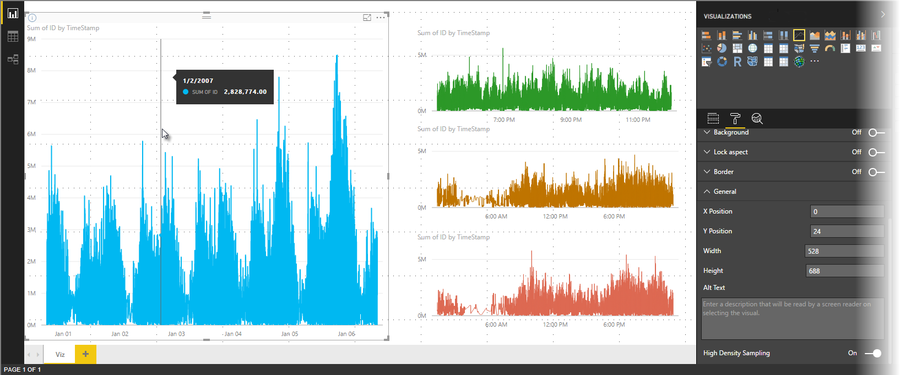
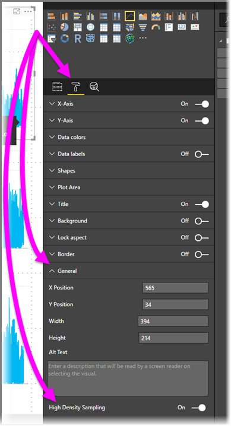

# การสุ่มตัวอย่างเส้นแบบความหนาแน่นสูงใน Power BI
เริ่มต้นด้วย **Power BI Desktop** เวอร์ชั่นที่ออกเดือนมิถุนายน 2017 และการอัปเดตใน**บริการ Power BI**  อัลกอริทึมการสุ่มตัวอย่างใหม่นั้นใช้งานได้ ซึ่งช่วยปรับปรุงภาพที่สุ่มตัวอย่างข้อมูลที่มีความหนาแน่นสูง ตัวอย่างเช่น คุณอาจสร้างแผนภูมิเส้นจากผลลัพธ์ยอดขายของร้านค้าปลีกของคุณ แต่ละร้านค้ามีมากกว่าหนึ่งหมื่นใบเสร็จการขายสินค้าต่อปี แผนภูมิเส้นของข้อมูลการขายดังกล่าวจะทำตัวอย่างข้อมูล (เลือกการแสดงที่สื่อความหมายของข้อมูลได้ดีเพื่อแสดงความแตกต่างของยอดขายเมื่อเวลาผ่านไป) จากข้อมูลสำหรับแต่ละร้านค้า และสร้างแผนภูมิเส้นแบบหลายชุดข้อมูลที่จะเป็นตัวแทนข้อมูลเบื้องต้น วิธีนี้เป็นหลักปฏิบัติทั่วไปในการแสดงภาพข้อมูลที่มีความหนาแน่นสูง และ Power BI Desktop ได้ปรับปรุงการสุ่มตัวอย่างของข้อมูลที่ความหนาแน่นสูง โดยที่มีการอธิิบายรายละเอียดในบทความนี้ด้วย

> [!NOTE]
> อัลกอริทึมการ**สุ่มที่มีหนาแน่นของความสูง**ที่อธิบายไว้ในบทความนี้ นั้นนำไปใช้ได้และพร้อมใช้งานในกับทั้งใน**Power BI Desktop**และ**Power BI service**
> 
> 

## วิธีการทำงานของการสุ่มตัวอย่างเส้นความหนาแน่นสูง
ก่อนหน้านี้**Power BI**เลือกคอลเลกชันของจุดข้อมูลตัวอย่างในช่วงทั้งหมดของข้อมูลเบื้องต้นตามแบบจำลองที่กำหนดขึ้น ตัวอย่างเช่น สำหรับข้อมูลความหนาแน่นสูงบนภาพหนึ่งที่เป็นช่วงเวลาหนึ่งปีปฏิทิน อาจมีจุดข้อมูลตัวอย่าง 350 จุดที่แสดงในภาพ ซึ่งถูกเลือกเพื่อให้ได้ช่วงข้อมูลเต็ม (ชุดข้อมูลโดยรวมของข้อมูลเบื้องต้น) จะแสดงในภาพ เพื่อช่วยให้คุณเข้าใจว่าขั้นตอนนี้้เกิดขึ้นได้อย่างไร สมมติว่า เรามีการลงจุดราคาหุ้นในช่วงเวลาหนึ่งปี และเลือกจุดข้อมูล 365 จุดเพื่อสร้างภาพแผนภูมิเส้น (หนึ่งจุดข้อมูลสำหรับหนึ่งวัน)

ในสถานการณ์นั้น มีค่าหลายค่าสำหรับราคาหุ้นภายในแต่ละวัน แน่นอนว่ามีค่าสูงสุดและต่ำสุดประจำวัน แตค่าเหล่านัั้นสามารถเกิดขึ้นได้ตลอดเวลาระหว่างวันตั้งแต่การเปิดตลาดหุ้น สำหรับการสุ่มตัวอย่างของเส้นความหนาแน่นสูง ถ้ามีการสุ่มตัวอย่างข้อมูลเบื้องต้นที่เวลา 10:30 น. ถึง 12:00 น. ในแต่ละวัน คุณจะได้สแนปช็อตของข้อมูลเบื้องต้น (ราคาที่ 10:30 น.ถึง 12:00 น.) แต่จุดข้อมูลที่เป็นตัวแทนกดังกล่าวอาจไม่ใช่ราคาหุ้นสูงสุดและต่ำสุดที่เกิดขึ้นจริง (ของวันนั้น) ในสถานการณ์นั้นและสถานการณ์อื่น ๆ การสุ่มตัวอย่างจะแสดงถึงข้อมูลเบื้องต้น แต่จะไม่เป็นการจับจุดข้อมูลที่สำคัญเสมอไป ซึ่งในกรณีนี้เป็นการจับข้อมูลสูงสุดและต่ำสุดของราคาหุ้นรายวัน

จากคำนิยาม ข้อมูลที่มีความหนาแน่นของความสูงได้รับการสุ่มตัวอย่างเพื่อเปิดใช้งานการแสดงภาพ ที่สามารถสร้างได้อย่างรวดเร็ว ตอบสนองต่อการโต้ตอบ (หากมีจุดข้อมูลมากเกินไปบนภาพอาจทำให้มันจมลงได้ และอาจทำให้เห็นแนวโน้มได้ไม่ชัด) วิธีที่ใช้สุ่มข้อมูลเพื่อสร้างประสบการณ์การใช้งานการแสดงภาพที่ดีที่สุด คือสิ่งที่ขับเคลื่อนการสร้างอัลกอริทึมสำหรับการสุ่มตัวอย่าง ใน Power BI Desktop อัลกอริทึมได้รับการปรับปรุงเพื่อนำเสนอการผสมผสานที่ดีที่สุดของการตอบสนอง การเป็นตัวแทน และล้างการรักษาจุดสำคัญในแต่ละครั้งที่มีการแบ่งส่วนข้อมูล

## วิธีการทำงานของอัลกอริธึมการสุ่มตัวอย่างของแผนภูมิเส้น
อัลกอริทึมใหม่สำหรับการสุ่มตัวอย่างเส้นความหนาแน่นสูงพร้อมใช้งานสำหรับภาพแผนภูมิเส้นและแผนภูมิพื้นที่ที่มีแกน X แบบต่อเนื่อง

สำหรับภาพความหนาแน่นสูง **Power BI** ทำการแบ่งส่วนข้อมูลของคุณเป็นกลุ่มข้อมูลความละเอียดสูงอย่างชาญฉลาด จากนั้นเลือกจุดข้อมูลที่สำคัญเพื่อเป็นตัวแทนสำหรับแต่ละกลุ่ม กระบวนการแบ่งส่วนข้อมูลความละเอียดสูงดำเนินการเพื่อให้แน่ใจว่าผลลัพธ์แผนภูมิที่ได้สามารถแยกความแตกต่างได้ด้วยตาจากจุดข้อมูลเบื้องต้นทั้งหมดที่มีให้ แต่จะเร็วกว่ามากและมีการโต้ตอบได้ดีกว่า

### ค่าต่ำสุดและสูงสุดสำหรับภาพความหนาแน่นสูงเชิงเส้น
สำหรับการแสดงภาพใด ๆ จะเป็นไปตามข้อจำกัดด้านการมองเห็นต่อไปนี้:

* **3,500**คือจุดข้อมูลตัวเลขสูงสุด*ที่แสดง*บนภาพ โดยไม่คำนึงถึงจำนวนของจุดข้อมูลเบื้องต้นหรือชุดข้อมูล ในกรณีดังกล่าว ถ้าคุณมี 10 ชุดข้อมูลที่แต่ละชุดข้อมูลมี 350 จุดข้อมูล ภาพดังกล่าวได้ถึงขีดจำกัดสูงสุดของจุดข้อมูลโดยรวมแล้ว ถ้าคุณมีหนึ่งชุดข้อมูล ชุดข้อมูลดังกล่าวอาจมีจุดข้อมูลสูงสุด 3,500 จุดได้หากอัลกอริทึมใหม่เข้าข่ายการสุ่มตัวอย่างที่ดีที่สุดสำหรับข้อมูลเบื้องต้น
* จำนวนชุดข้อมูลสูงสุดสำหรับภาพหนึ่ง ๆ คือ **60 ชุดข้อมูล** ถ้าคุณมีชุดข้อมูลมากกว่า 60 ชุด ให้แบ่งชุดข้อมูลและสร้างภาพหลายภาพด้วยชุดข้อมูลจำนวน 60 ชุดหรือน้อยกว่านั้นในแต่ละภาพ ขั้นตอนนี้เป็นหลักปฏิบัติที่ดีในการใช้**ตัวแบ่งส่วนข้อมูล**เพื่อแสดงเฉพาะบางเซกเมนต์ของข้อมูล (เฉพาะบางชุดข้อมูล) ตัวอย่างเช่น ถ้าคุณกำลังแสดงประเภทย่อยทั้งหมดในคำอธิบายแผนภูมิ คุณสามารถใช้ตัวแบ่งส่วนข้อมูลเพื่อกรองตามประเภททั้งหมดบนหน้ารายงานเดียวกันได้

พารามิเตอร์เหล่านี้มีไว้เพื่อให้แน่ใจว่าภาพใน Power BI Desktop แสดงได้อย่างรวดเร็ว และตอบสนองการโต้ตอบกับผู้ใช้งานได้เป็นอย่างดี รวมถึงไม่ทำให้มีค่าใช้จ่ายที่เกินควรในการคำนวณบนคอมพิวเตอร์สำหรับภาพดังกล่าว

### การประเมินจุดข้อมูลที่เป็นตัวแทนสำหรับภาพเชิงเส้นความหนาแน่นสูง
เมื่อมีจำนวนจุดข้อมูลเบื้องต้นเกินกว่าจุดข้อมูลที่สามารถแสดงได้ในภาพ (เกิน 3,500) กระบวนการที่เรียกว่า*จัดช่อง*จะเริ่มต้นขึ้น ซึ่งจะรวมกลุ่มข้อมูลเบื้องต้นเป็นกลุ่ม ๆ ที่เรียกว่า *ช่อง* และจะจัดระเบียบช่องเหล่านั้นซ้ำ ๆ

อัลกอริทึมสร้างช่องเก็บมากที่สุดเท่าที่จะทำได้เพื่อสร้างส่วนประกอบที่ดีที่สุดสำหรับภาพ ภายในแต่ละช่องเก็บ อัลกอริทึมค้นหาค่าข้อมูลต่ำสุดและสูงสุด เพื่อให้แน่ใจว่าค่าที่สำคัญและค่าที่มีนัยสำคัญ (ตัวอย่างเช่น ค่าผิดปกติ) จะรวบรวมไว้ และแสดงในภาพนี้ ตามผลลัพธ์ของการจัดช่องเก็บและการประเมินที่ตามมาสำหรับข้อมูลโดย Power BI ความละเอียดต่ำสุดสำหรับแกน x ของภาพจะถูกกำหนดขึ้น เพื่อให้แน่ใจว่าได้ส่วนประกอบสูงสุดของภาพ

ดังที่กล่าวไปแล้วก่อนหน้านี้ ส่วนประกอบขั้นต่ำสำหรับแต่ละชุดข้อมูลคือ 350 และสูงสุดคือ 3,500

แต่ละช่องเก็บจะแสดง 2 จุดข้อมูล ซึ่งจะกลายเป็นจุดข้อมูลที่เป็นตัวแทนของช่องเก็บข้อมูลในภาพ จุดข้อมูลเป็นเพียงแค่ค่าสูงสุดและต่ำสุดสำหรับช่องเก็บดังกล่าว และโดยการเลือกค่าสูงสุดและต่ำสุด กระบวนการจัดช่องจะช่วยทำให้แน่ใจว่ามีการจับและแสดงค่าสูงสุดที่สำคัญหรือค่าต่ำสุดที่มีนัยสำคัญบนภาพ

ถ้านี่ฟังดูเหมือนว่ามีการวิเคราะห์จำนวนมากเพื่อให้แน่ใจว่ามีการจับค่าที่ผิดปกติและแสดงอย่างถูกต้องในภาพ คุณเข้าใจถูกแล้ว และนั่นคือเหตุผลที่แท้จริงที่อยู่เบื้องหลังกระบวนการอัลกอริทึมและการจัดช่องเก็บใหม่

## เคล็ดลับเครื่องมือและการสุ่มตัวอย่างเส้นความหนาแน่นสูง
สิ่งสำคัญคือต้องทราบว่ากระบวนการการจัดช่องนั้นทำให้มีการจับค่าต่ำสุดและสูงสุดในช่องเก็บที่ระบุและแสดงในภาพ ซึ่งอาจส่งผลต่อวิธีการที่เคล็ดลับเครื่องมือแสดงข้อมูลเมื่อคุณเลื่อนไปเหนือจุดข้อมูล ในการอธิบายวิธีการและเหตุผลว่าทำไมถึงเกิดขึ้นเช่นนี้ เรากลับไปดูตัวอย่างเกี่ยวกับราคาหุ้นจากส่วนก่อนหน้าในบทความนี้

สมมติว่า คุณกำลังสร้างภาพขึ้นโดยยึดตามราคาหุ้น และคุณกำลังเปรียบเทียบหุ้นสองตัว ซึ่งทั้งสองใช้**การสุ่มตัวอย่างความหนาแน่นสูง**เหมือนกัน ข้อมูลเบื้องต้นสำหรับแต่ละชุดข้อมูลมีจุดข้อมูลมากมาย (บางทีคุณอาจจับราคาหุ้นในแต่ละวินาทีของวัน) อัลกอริทึมการสุ่มตัวอย่างเส้นความหนาแน่นสูงด้วยการจัดช่องเก็บสำหรับแต่ละชุดนั้นเป็นอิสระต่อกัน

ตอนนี้สมมติว่า ราคาหุ้นตัวแรกกระโดดขึ้นไปที่ 12:02 จากนั้นอีก 10 วินาทีต่อมาราคาก็ร่วงลง นั่นคือจุดข้อมูลที่สำคัญ เมื่อทำการจัดช่องเก็บสำหรับหุ้นดังกล่าว ค่าสูงสุดที่ 12:02 จะเป็นจุดข้อมูลที่เป็นตัวแทนสำหรับช่องเก็บนั้น

แต่สำหรับหุ้นตัวที่สอง 12:02 ไม่ใช่ค่าสูงสุดหรือต่ำสุดในช่องเก็บที่รวมในเวลานั้น บางทีค่าสูงสุดหรือต่ำสุดสำหรับช่องเก็บดังกล่าวที่รวม 12:02 ไว้ด้วยนั้นอาจเกิดขึ้น 3 นาทีให้หลังก็เป็นได้ ในการสถานการณ์นั้น เมื่อมีการสร้างแผนภูมิเส้นและคุณเลื่อนไปเหนือ 12:02 คุณจะเห็นค่าหนึ่งในเคล็ดลับเครื่องมือสำหรับหุ้นตัวแรก (เพราะค่ากระโดดไปที่ 12:02 และค่าดังกล่าวถูกเลือกเป็นจุดข้อมูลสูงสุดของช่องเก็บ) แต่คุณจะ*ไม่*เห็นค่าใด ๆ ในเคล็ดลับเครื่องมือที่ 12:02 สำหรับหุ้นตัวที่สอง นั่นเนื่องจากว่าหุ้นตัวที่สองไม่มีทั้งค่าต่ำสุดหรือสูงสุดสำหรับช่องเก็บที่รวม 12:02 ดังนั้นจึงไม่มีข้อมูลที่จะแสดงสำหรับหุ้นตัวที่สองที่ 12:02 ทำให้ไม่มีข้อมูลเคล็ดลับเครื่องมือที่จะแสดง

สถานการณ์นี้จะเกิดขึ้นบ่อยครั้งกับเคล็ดลับเครื่องมือ ค่าสูงสุดและต่ำสุดสำหรับช่องเก็บที่ระบุอาจไม่ตรงกับจุดค่าแกน x ที่ปรับมาตราส่วนเท่า ๆ กันอย่างสมบูรณ์แบบ และหากเป็นเช่นนั้นเคล็ดลับเครื่องมือจะไม่แสดงค่า  

## วิธีการเปิดใช้งานการสุ่มตัวอย่างเส้นความหนาแน่นสูง
ตามค่าเริ่มต้น อัลกอริทึมใหม่จะ**เปิด**ใช้งาน ในการเปลี่ยนการตั้งค่านี้ ไปที่ช่อง**จัดรูปแบบ**ในการ์ดแบบ**ทั่วไป** และตามแนวด้านล่างคุณจะเห็นตัวเลื่อนสลับที่เรียกว่า**การสุ่มตัวอย่างความหนาแน่นสูง** ในการปิดใช้งาน เลื่อนไปที่**ปิด**

## ข้อควรพิจารณาและข้อจำกัด
อัลกอริทึมใหม่สำหรับการสุ่มตัวอย่างเส้นความหนาแน่นสูงคือการพัฒนาที่สำคัญสำหรับ Power BI แต่ยังมีข้อควรพิจารณาที่เกี่ยวเนื่องบางอย่างที่คุณจำเป็นต้องทราบเมื่อทำงานกับค่าและข้อมูลที่มีความหนาแน่นสูง

* เนื่องด้วยส่วนประกอบและกระบวนการจัดช่องเก็บที่เพิ่มขึ้น **เคล็ดลับเครื่องมือ**อาจแสดงค่าเฉพาะถ้าข้อมูลที่เป็นตัวแทนได้รับการจัดแนวด้วยเคอร์เซอร์ของคุณ สำหรับข้อมูลเพิ่มเติม ดูส่วนก่อนหน้าในบทความนี้ใน**เคล็ดลับเครื่องมือ
* เมื่อขนาดของแหล่งข้อมูลที่มีทั้งหมดมีขนาดใหญ่เกินไป อัลกอริทึมใหม่จะกำจัดชุดข้อมูล (องค์ประกอบของคำอธิบายแผนภูมิ) เพื่อให้สอดคล้องกับข้อจำกัดสูงสุดของการนำเข้าข้อมูล
  
  * ในสถานการณ์นี้ อัลกอริทึมใหม่จะจัดเรียงชุดข้อมูลคำอธิบายแผนภูมิตามลำดับตัวอักษร และเริ่มลงในรายละเอียดของรายการองค์ประกอบคำอธิบายแผนภูมิตามลำดับตัวอักษรจน กว่าจะถึงขีดจำกัดสูงสุดในการนำเข้าข้อมูล และจะไม่นำเข้าชุดข้อมูลเพิ่มเติม
* เมื่อชุดข้อมูลเบื้องต้นมีชุดข้อมูลมากกว่า 60 ชุด (จำนวนสูงสุดของชุดข้อมูลตามที่อธิบายไว้ก่อนหน้านี้) อัลกอริทึมใหม่จะจัดเรียงชุดข้อมูลตามลำดับตัวอักษร และกำจัดชุดข้อมูลที่เกิดกว่า 60 ชุดตามลำดับตัวอักษร
* ถ้าค่าในข้อมูลไม่ใช่ชนิด*ตัวเลข*หรือ*วันที่/เวลา* Power BI จะใช้อัลกอริทึมใหม่ และจะแปลงกลับเป็นอัลกอริทึมก่อนหน้านี้ (ไม่ใช่การสุ่มตัวอย่างความหนาแน่นสูง)
* การตั้งค่า**แสดงรายการที่ไม่มีข้อมูล**ไม่สนับสนุนในอัลกอริทึมใหม่นี้
* ไม่สนับสนุนอัลกอริทึมใหม่เมื่อใช้การเชื่อมต่อสดไปยังแบบจำลองที่โฮสต์ใน SQL Server Analysis Services (เวอร์ชัน 2016 หรือเวอร์ชันก่อนหน้า) แต่จะสนับสนุนในแบบจำลองที่โฮสต์ใน**Power BI**หรือ Azure Analysis Services

## ขั้นตอนถัดไป
สำหรับข้อมูลเพิ่มเติมเกี่ยวกับสุ่มตัวอย่างความหนาแน่นสูงในแผนภูมิกระจายอื่น ๆ ให้ดูบทความต่อไปนี้

* [การสุ่มตัวอย่างความหนาแน่นสูงในแผนภูมิกระจาย Power BI](desktop-high-density-scatter-charts.md)

