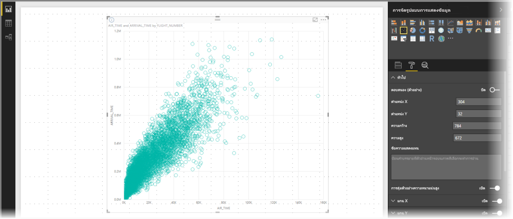
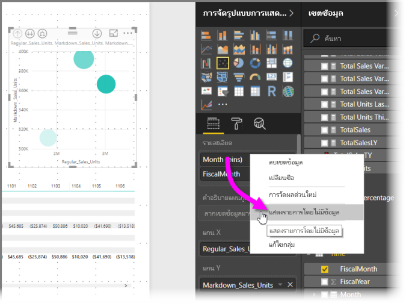
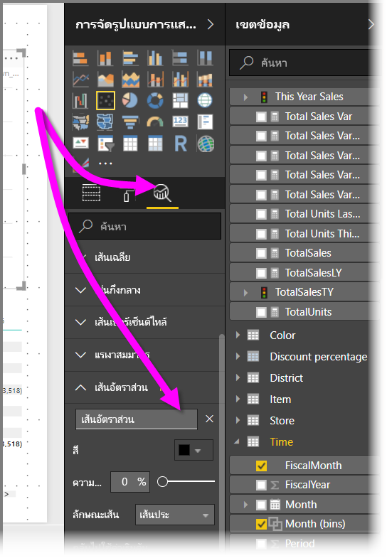
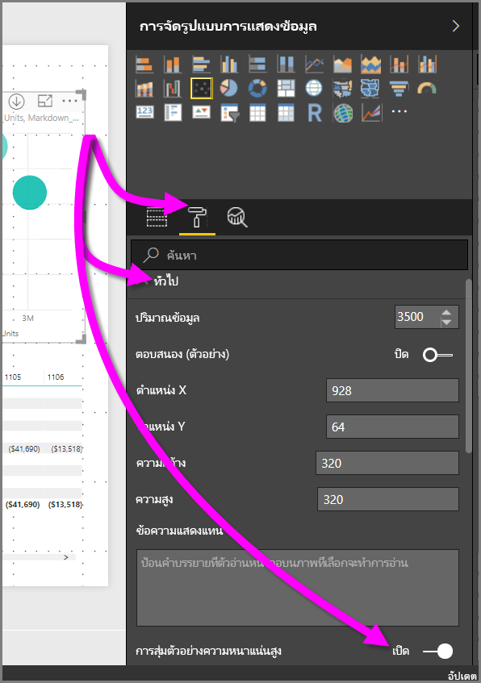

# การสุ่มตัวอย่างความหนาแน่นสูงในแผนภูมิกราฟจุด Power BI
เริ่มต้น **Power BI Desktop**รุ่นที่ออกเดือนกันยายน 2017 และการอัปเดตใน**Power BI service** อัลกอริทึมการสุ่มตัวอย่างใหม่นั้นใช้ได้ ซึ่งช่วยปรับปรุงวิธีที่แผนภูมิกระจายแสดงข้อมูลที่มีความหนาแน่นสูง

ตัวอย่างเช่น คุณอาจสร้างแผนภูมิกราฟจุดจากกิจกรรมการขายขององค์กรของคุณ ร้านค้าแต่ละรายการจะมีหลายหมื่นรายจุดข้อมูลในแต่ละปี แผนภูมกราฟจุดของข้อมูลดังกล่าวสามารถสุ่มตัวอย่าง(เลือกการแสดงความหมายของข้อมูลที่สำคัญ เพื่อแสดงให้เห็นถึงว่าการขายนอกเวลาเกิดขึ้นอย่าไร) ข้อมูลจากข้อมูลพร้อมใช้งาน และสร้างแผนภูมิกราฟจุดที่แสดงข้อมูลเบื้องต้น ซึ่งเป็นหลักปฏิบัติทั่วไปในแผนภูมกราฟจุดที่มีหนาแน่นของความสูง และ Power BI ได้ปรับปรุงการสุ่มตัวอย่างของข้อมูลที่หนาแน่นสูง รายละเอียดนั้นอธิบายไว้ในบทความนี้

> [!NOTE]
> อัลกอริทึมการ**สุ่มที่มีหนาแน่นของความสูง**ที่อธิบายไว้ในบทความนี้ นั้นนำไปใช้ได้และพร้อมใช้งานในกับแผนภูมิกราฟจุดทั้งใน**Power BI Desktop**และ**Power BI service**
> 
> 

## การทำงานของแผนภูมิกราฟจุดที่มีความหนาแน่นสูง
ก่อนหน้านี้**Power BI**เลือกคอลเลกชันของจุดของข้อมูลตัวอย่างในช่วงทั้งหมดของข้อมูลเบื้องต้น ตามแบบจำลองที่กำหนดขึ้นเพื่อสร้างแผนภูมิกราฟจุด โดยเฉพาะ Power BI จะเลือกแถวแรกและแถวสุดท้ายของข้อมูลในชุดข้อมูลแผนภูมกราฟจุด จากนั้นจะแบ่งแถวที่เหลือเท่าๆ กันเพื่อให้จุดข้อมูลทั้งหมด 3,500 จุดสามารถจดลงบนแผนภูมิกราฟจุดได้ ตัวอย่างเช่น ถ้าตัวอย่างที่มีแถว 35,000 แถว จากนั้นแถวแรกและแถวสุดท้ายจะถูกเลือกสำหรับการลงจุด จากนั้นทุกสิบแถวจะลงจุดได้ด้วย (35,000 / 10 =ทุกแถวสิบ = 3,500 จุดข้อมูล) และก่อนหน้านี้ ค่า null หรือจุดที่อาจไม่สามารถลงจุดได้(เช่นค่าข้อความ) ในชุดข้อมูลไม่ถูกแสดง และดังนั้นจึงถูกพิจารณาเมื่อตอนสร้างภาพ และด้วยการสุ่มตัวอย่างนั้น ความหนาแน่นที่มองเห็นของแผนภูมิกราฟนั้นยังยึดตามจุดข้อมูลที่เป็นตัวแทนที่เช่นกัน และดังนั้นความหนาแน่ของรูปภาพโดยนัยเป็นตามสถานการณ์ของจุดที่เลือกมาเป็นตัวอย่าง และไม่ใช่คอลเลกชันทั้งหมดของข้อมูลเบื้องต้น

เมื่อคุณเปิดใช้งาน**การสุ่มแบบความหนาแน่นสูง** Power BI ประมวลผลอัลกอริทึมที่ลบจุดที่ซ้อนกัน และตรวจสอบว่าจุดบนภาพสามารถเข้าถึงได้เมื่อมีการโต้ตอบรูปภาพ ซึ่งทำให้แน่ใจอีกว่า จุดทั้งหมดในชุดข้อมูลถูกแสดงในภาพ โดยให้บริบทที่เป็นความหมายของจุดที่เลือก แทนที่จะเป็นเพียงแค่การลงจุดตัวอย่างที่เป็นตัวแทน

จากคำนิยาม ข้อมูลที่มีความหนาแน่นของความสูง ถูกสุ่มตัวอย่างเพื่อเปิดใช้งานการแสดงภาพ ที่สามารถสร้างได้อย่างรวดเร็วค่อน และตอบสนองการโต้ตอบ (จุดข้อมูลมากเกินไปบนรูปภาพ สามารถทำให้มันจมลง และอาจดึงความสนใจจากแนวโน้มได้) วิธีที่ใช้สุ่มข้อมูลนัั้น ก็เพื่อสร้างประสบการณ์การใช้งานการแสดงภาพที่ดีที่สุด และตรวจสอบว่าข้อมูลทั้งหมดถูกแสดง ซึ่งเป็นที่สร้างอัลกอริทึมสำหรับการสุ่มตัวอย่าง ใน Power BI อัลกอริทึมได้รับการปรับปรุงเพื่อนำเสนอการผสมผสานที่ดีที่สุดของการตอบสนอง การเป็นตัวแทน และล้างการรักษาจุดสำคัญในชุดข้อมูลโดยรวม

> [!NOTE]
> แผนภูมิกราฟใช้อัลกอริทึมของการ**สุ่มที่มีความหนาแน่นสูง** นั้นลงจุดบนภาพสี่เหลี่ยมจตุรัส เช่นเดียวกันกับแผนภูมิกราฟจุดทั้งหมด
> 
> 

## วิธีการทำงานของอัลกอริธึมการสุ่มตัวอย่างของแผนภูมิกราฟจุด
อัลกอริทึมใหม่สำหรับ**การสุ่มแบบความหนาแน่นสูง** สำหรับแผนภูมิกราฟจุดใช้วิธีการเก็บและแสดงข้อมูลเบื้องต้นได้อย่างมีประสิทธิภาพและกำจัดจุดที่ซ้อนกัน ทำโดยเริ่มต้นด้วยรัศมีขนาดเล็กสำหรับแต่ละจุดข้อมูล (ขนาดภาพวงกลมสำหรับจุดุบนการแสดงภาพ) แล้วเพิ่มรัศมีของจุดข้อมูลทั้งหมด เมื่อมีการทับซ้อนของจุดข้อมูลสองจุด(หรือมากกว่า) วงกลมเดียว (ของขนาดรัศมีที่เพิ่มขึ้น) แสดงจุดข้อมูลที่ซ้อนเหล่านั้น อัลกอริทึมยังเพิ่มรัศมีของจุดข้อมูลเรื่อยๆ จนกว่าค่ารัศมีมีจำนวนจุดข้อมูลอย่างสมเหตุสมผล 3,500 โดยแสดงในแผนภูมิกราฟจุด

วิธีการในอัลกอริทึมนี้ทำให้แน่ใจว่าค่าผิดปกติจะถูกแสดงในภาพผลลัพธ์ อัลกอริทึมเคารพมาตราส่วนเมื่อกำหนดการซ้อน เช่นเดียวกับระดับโพเนนเชียลที่ถูกแสดงภาพ ด้วยความเที่ยงตรงเหมือนกับจุดต้นแบบ

อัลกอริทึมยังรักษารูปร่างโดยรวมของแผนภูมิกราฟจุด

> [!NOTE]
> เมื่อใช้อัลกอริทึม**การสุ่มที่มีความหนาแน่นสูง**สำหรับแผนภูมิกราฟจุด *การแจกจ่ายที่แม่นยำ*ของข้อมูลเป็นเป้าหมาย และความหนาแน่นของภาพโดยนัย*ไม่*ใช่เป้าหมาย ตัวอย่างเช่น คุณอาจเห็นแผนภูมิกระจาย มีมากมายวงกลมที่ซ้อนกัน (ความหนาแน่น) ในบางพื้นที่ และลองนึกถึงจุดข้อมูลจำนวนมากต้องคลัสเตอร์มี เนื่องจากการ**สุ่มหนาแน่นของความสูง**อัลกอริทึมสามารถใช้วงกลมหนึ่งเพื่อแสดงจุดข้อมูลจำนวนมาก ดังกล่าวโดยนัยความหนาแน่นที่ภาพ (หรือ "ทำคลัสเตอร์") จะไม่แสดงขึ้น เมื่อต้องรับรายละเอียดเพิ่มเติมในพื้นที่ที่กำหนด คุณสามารถใช้ตัวแบ่งส่วนข้อมูลเพื่อขยายได้
> 
> 

ยิ่งกว่านี้ จุดข้อมูลที่ไม่สามารถลงจุดได้(เช่นค่า null หรือค่าข้อความ)จะถูกละเว้น ดังนั้นค่าอื่นที่สามารถลงจุดนั้นถูกเลือก การตรวจรูปร่างจริงของแผนภูมิครั้งต่อไปนั้นถูกจัดการ

### เมื่อใช้อัลกอริทึมมาตรฐานแผนภูมิกราฟจุด
อาจมีกรณี้ซึ่ง**การสุ่มแบบความหนาแน่นความสูง**ไม่สามารถนำไปใช้ได้กับแผนภูมิกราฟจุดและอัลกอริทึมต้นฉบับ สถานการณ์เหล่านั้นมีดังนี้

* ถ้าคุณคลิกขวาบน**รายละเอียด** แล้วเลือก**แสดงรายการที่ไม่มีข้อมูล**จากเมนูที่ปรากฏ แผนภูมิกราฟจุดจะแปลงกลับเป็นอัลกอริทึมต้นฉบับ
  
  
* ค่าใด ๆ ในแกน**Play** จะทำใหแผนภูมิกราฟจุดแปลงกลับเป็นอัลกอริทึมต้นฉบับ
* ถ้าทั้งแกน X และ Y หายไปจากแผนภูมิกราฟจุด แผนภูมิแปลงกลับไปเป็นอัลกอริทึมต้นฉบับ
* การใช้**เส้นอัตรา**ในบานหน้าต่าง**การวิเคราะห์**มีผลให้แผนภูมิแปลงกลับเป็นอัลกอริทึมต้นฉบับ
  
  

## วิธีการเปิดใช้งานการสุ่มตัวอย่างแบบความหนาแน่นสูงสำหรับแผนกราฟจุด
เมื่อต้องการเปิดใช้งาน**การสุ่มความหนาแน่นสูง** ให้เลือกแผนภูมกราฟจุด แล้วไปยังบานหน้าต่าง**การจัดรูปแบบ** และขยายบัตร**ทั่วไป** ใกล้กับด้านล่างของบัตร แถบเลื่อนสลับที่ชื่อว่า**การสุ่มความหนาแน่นสูง**นั้นใช้งานได้ เมื่อต้องเปิดใช้งาน เลื่อนไป**เปิด**

> [!NOTE]
> เมื่อแถบเลื่อนที่เปิดอยู่ Power BI จะพยายามใช้อัลกอริทึม**การสุ่มความหนาแน่นสูง**เมื่อใดก็ตามที่เป็นได้ เมื่อไม่สามารถใช้อัลกอริทึม (ตัวอย่างเช่น คุณใส่ค่าในการ*เล่น*แกน), แถบเลื่อนยังคงอยู่ในการ**บน**จัดตำแหน่งแม้ว่าแผนภูมิมีแปลงกลับเป็นอัลกอริทึมมาตรฐานได้ ถ้าคุณลบค่าจากแกน *Play*(หรือเปลี่ยนแปลงเงื่อนไขเพื่อให้สามารถใช้อัลกอริทึมการสุ่มตัวอย่างความหนาแน่นสูง) เนื่องจากแถบเลื่อนอยู่บนแผนภูมการสุ่มตัวอย่างความหนาแน่นสูงิจะใช้โดยอัตโนมัติสำหรับแผนภูมินั้น
> 
> [!NOTE]
> จุดข้อมูลจะถูกจัดกลุ่ม และ/หรือเลือกโดยดัชนี การมีคำอธิบายแผนภูมิไม่มีผลต่อการสุ่มตัวอย่างสำหรับอัลกอริทึม ซึ่งจะส่งผลต่อลำดับของภาพ
> 
> 

## ข้อควรพิจารณาและข้อจำกัด
อัลกอริทึมการสุ่มตัวอย่างแบบความหนาแน่นสูงคือการพัฒนาที่สำคัญสำหรับ Power BI แต่ยังมีข้อควรพิจารณาที่เกี่ยวกับบางอย่างที่คุณจำเป็นต้องทราบเมื่อทำงานกับแผนภูมิกราฟจุดและค่าความหนาแน่นที่สูงขึ้น

* อัลกอริทึมการ**สุ่มความหนาแน่นของสูง** ทำงานกับการเชื่อมต่อสดไปยังแบบจำลอง Power BI แบบจำลองที่นำเข้าหรือ DirectQuery

## ขั้นตอนถัดไป
สำหรับข้อมูลเพิ่มเติมเกี่ยวกับสุ่มตัวอย่างที่มีความหนาแน่นสูงในแผนภูมิอื่นๆ ให้ดูบทความต่อไปนี้

* [การสุ่มตัวอย่างเส้นแบบความหนาแน่นสูงใน Power BI](desktop-high-density-sampling.md)

