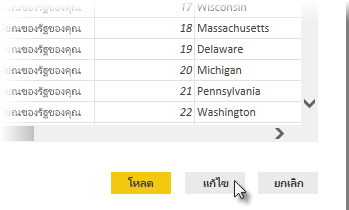

**Power BI Desktop** สามารถเชื่อมต่อกับแหล่งข้อมูลได้อย่างกว้างขวาง รวมถึง ฐานข้อมูลภายในองค์กร เวิร์กบุ๊ก Excel และบริการบนระบบคลาวด์ ขณะนี้ บริการบนระบบคลาวด์มากกว่า 59 บริการ เช่น GitHub และ Marketo มีตัวเชื่อมต่อเฉพาะแล้ว และคุณสามารถเชื่อมต่อกับแหล่งข้อมูลทั่วไปผ่านทาง XML, CSV, ข้อความ และ ODBC ได้ Power BI ยังสามารถดึงข้อมูลตารางจาก URL ของเว็บไซต์ได้โดยตรงอีกด้วย! แต่เราจะเริ่มจากจุดเริ่มต้น ด้วยการเปิด Power BI Desktop และเชื่อมต่อกับข้อมูล

เมื่อคุณเริ่มต้น **Power BI Desktop** และเลื่อนผ่าน หน้าจอเริ่มต้น คุณสามารถเลือก รับข้อมูล จาก Ribbon บนแท็บ **หน้าแรก**

ยังมีการอัปเดตรายเดือนของ Power BI Desktop และในการอัปเดตแต่ละครั้ง หน้า**มีอะไรใหม่ใน Power BI Desktop** จะมีข้อมูลใหม่ๆ เกี่ยวกับการอัปเดต ลิงก์ไปยังบล็อก และลิงก์ดาวน์โหลด

ใน Power BI Desktop จะมีแหล่งข้อมูลต่างๆ ทุกประเภทที่พร้อมใช้งาน เลือกแหล่งข้อมูลเพื่อสร้างการเชื่อมต่อ คุณจะถูกขอให้ค้นหาแหล่งข้อมูลบนคอมพิวเตอร์หรือเครือข่ายของคุณ หรือได้รับพร้อมท์ให้เข้าสู่ระบบบริการเพื่ออนุญาตคำขอของคุณ โดยขึ้นอยู่กับการเลือกของคุณ

หลังจากการเชื่อมต่อ หน้าต่างแรกที่คุณจะเห็นคือ **ตัวนำทาง** ตัวนำทางจะแสดงตารางหรือรายการของแหล่งข้อมูล และการคลิกรายการจะแสดงตัวอย่างของเนื้อหา จากนั้น คุณจะสามารถนำเข้าตารางหรือรายการที่เลือกได้ทันที หรือเลือก **แก้ไข** เพื่อแปลงและล้างข้อมูลของคุณก่อนที่จะนำเข้า

เมื่อคุณเลือกตารางที่คุณต้องการนำเข้าสู่ Power BI Desktop แล้ว คุณสามารถเลือกโหลดลงใน Power BI Desktop ได้โดยการเลือกปุ่ม **โหลด** ที่มุมขวาล่างของ **ตัวนำทาง** อย่างไรก็ตาม มีหลายครั้งที่คุณอาจต้องการเปลี่ยนแปลงตารางเหล่านั้นก่อนที่จะโหลดลงใน Power BI Desktop คุณอาจต้องการเพียงชุดย่อยของลูกค้า หรือกรองข้อมูลนั้นให้มีเฉพาะยอดขายที่เกิดขึ้นในประเทศที่ระบุ ในกรณีเหล่านั้น คุณสามารถเลือกปุ่ม แก้ไข และกรองหรือแปลงข้อมูลนั้นก่อนที่จะนำเข้าสู่ Power BI Desktop

เราจะทำงานต่อและแก้ไขข้อมูลของเราในส่วนถัดไป

