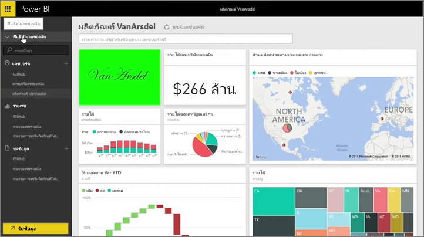
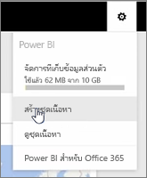
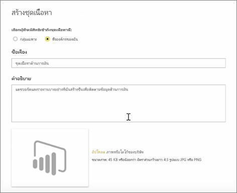

ในบทเรียนนี้ เราสร้าง*ชุดเนื้อหา*ด้วยอาร์ทิแฟกต์ที่มีอยู่แล้วใน Power BI จากนั้นแชร์ชุดเนื้อหากับเพื่อนร่วมงาน 

ใน **พื้นที่ทำงานของฉัน** ฉันมีแดชบอร์ด รายงานด้านล่าง และชุดข้อมูล ฉันต้องการแชร์สิ่งเหล่านั้นเป็นแพคเกจกับผู้คนในองค์กรของฉัน เพื่อให้พวกเขานำไปใช้ใหม่อีกครั้ง

เมื่อฉันเลือกไอคอน **การตั้งค่า** (รูปเกียร์ที่ด้านบนขวาของบริการ) ฉันจะเห็นว่าฉันใช้ที่เก็บข้อมูลไปเท่าใด และฉันสามารถสร้างชุดเนื้อหาได้

ในกล่องโต้ตอบที่ปรากฏขึ้น ฉันสามารถเลือกว่าจะแจกจ่ายให้บุคคลหรือกลุ่มที่ระบุ และสามารถตั้งชื่อได้เช่นกัน การใส่คำอธิบายอย่างละเอียดในกล่อง **คำอธิบาย** เป็นความคิดที่ดี เพื่อให้คนที่เรียกดูชุดเนื้อหาเข้าใจว่าชุดเนื้อหาดังกล่าวมีอะไรหรือทำอะไรได้

ที่ด้านล่างของกล่องโต้ตอบ ฉันสามารถอัปโหลดรูปสำหรับชุดเนื้อหาได้ จากนั้นฉันเลือกแดชบอร์ดที่ต้องการรวมชุดเนื้อหาลงใน ซึ่งนี่เป็นขั้นตอนที่สำคัญที่สุด หลังจากที่ทำเช่นนั้น Power BI จะเลือกรายงานและชุดข้อมูลที่ใช้ในแดชบอร์ดโดยอัตโนมัติ ฉันไม่สามารถยกเลิกการเลือกรายงานหรือชุดข้อมูลได้ เนื่องจากแดชบอร์ดที่ฉันต้องการรวมชุดเนื้อหาลงไปต้องการรายงานหรือชุดข้อมูลนั้น

ฉันสามารถเลือกแดชบอร์ด รายงาน และชุดข้อมูลอื่นได้ แต่ฉันยังไม่ทำเช่นนั้นในตอนนี้

เมื่อฉันเผยแพร่ ชุดเนื้อหาถูกเพิ่มลงในแกลเลอรีเนื้อหาขององค์กร

ไปต่อสู่บทเรียนถัดไป!

