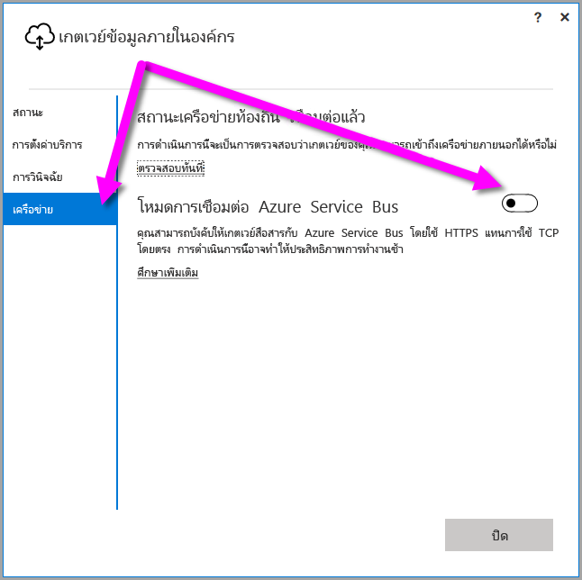
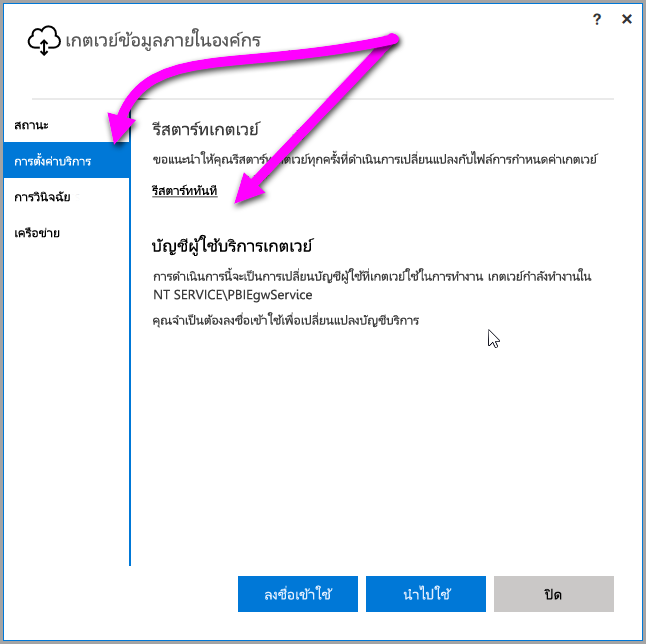

## <a name="sign-in-account"></a>ลงชื่อเข้าใช้บัญชี
ผู้ใช้สามารถลงชื่อเข้าใช้ด้วยบัญชีทำงานหรือบัญชีโรงเรียน นี่คือบัญชีองค์กรของคุณ หากคุณลงชื่อสมัครใช้ข้อเสนอของ Office 365 และไม่ได้ใส่อีเมล์ที่ใช้ทำงานจริงของคุณ อาจส่งผลให้มีลักษณะคล้ายnancy@contoso.onmicrosoft.comได้ บัญชีของคุณได้รับจัดเก็บภายในบัญชีผู้เช่าใน Azure Active Directory (AAD) ในบริการคลาวด์ ในกรณีส่วนใหญ่ UPN ของบัญชี AAD จะตรงกับที่อยู่อีเมล

## <a name="windows-service-account"></a>บัญชีบริการ Windows
เกตเวย์ข้อมูลแบบติดตั้งภายในองค์กรได้รับการกำหนดค่าให้ใช้*NT SERVICE\PBIEgwService*สำหรับข้อมูลประจำตัวการเข้าสู่ระบบบริการ Windows โดยค่าเริ่มต้นจะมีสิทธิ์ในการเข้าสู่ระบบเป็นบริการ ซึ่งอยู่ในบริบทของเครื่องที่คุณกำลังติดตั้งเกตเวย

> [!NOTE]
> หากคุณเลือกโหมดส่วนบุคคล ให้คุณกำหนดค่าบัญชีบริการ Windows แยกต่างหาก
> 
> 

นี่ไม่ใช่บัญชีที่ใช้ในการเชื่อมต่อกับแหล่งข้อมูลแบบติดตั้งภายในองค์กร  และนี่ไม่ใช่บัญชีทำงานหรือบัญชีโรงเรียนของคุณที่คุณลงชื่อเข้าใช้บริการคลาวด์

หากคุณประสบปัญหาเกี่ยวกับพร็อกซีเซิร์ฟเวอร์เนื่องจากการรับรองความถูกต้อง คุณอาจจะต้องเปลี่ยนบัญชีบริการ Windows เป็นผู้ใช้โดเมนหรือบัญชีบริการที่ได้รับการจัดการ คุณสามารถเรียนรู้วิธีเปลี่ยนบัญชีใน[การกำหนดค่าพร็อกซี](../service-gateway-proxy.md#changing-the-gateway-service-account-to-a-domain-user)

## <a name="ports"></a>พอร์ต
เกตเวย์สร้างการเชื่อมต่อขาออกไปยัง Azure Service Bus ซึ่งจะสื่อสารบนพอร์ตขาออก: TCP 443 (ค่าเริ่มต้น), 5671, 5672, 9350-9354  เกตเวย์ไม่จำเป็นต้องมีพอร์ตขาเข้า [เรียนรู้เพิ่มเติม](https://azure.microsoft.com/documentation/articles/service-bus-fundamentals-hybrid-solutions/)

เราแนะนำให้คุณอนุญาตที่อยู่ IP สำหรับเขตข้อมูลของคุณไว้ในไฟร์วอลล์ของคุณ คุณสามารถดาวน์โหลด[รายการ Microsoft Azure Datacenter IP](https://www.microsoft.com/download/details.aspx?id=41653) รายการนี้ได้รับการอัปเดตทุกสัปดาห์ เกตเวย์จะสื่อสารกับ Azure Service Bus โดยใช้ที่อยู่ IP พร้อมกับชื่อโดเมนแบบที่มีคุณสมบัติครบถ้วน (FQDN) ถ้าคุณกำลังบังคับให้เกตเวย์สื่อสารโดยใช้ HTTPS เกตเวย์จะใช้ FQDN เท่านั้นและจะไม่มีการสื่อสารโดยใช้ที่อยู่ IP เกิดขึ้น

> [!NOTE]
> ที่อยู่ IP ที่ระบุในรายการ Azure Datacenter IP อยู่ในรูปแบบสัญลักษณ์ CIDR ตัวอย่างเช่น 10.0.0.0/24 ไม่ได้หมายความว่า 10.0.0.0 ถึง 10.0.0.24 เรียนรู้เพิ่มเติมเกี่ยวกับ [รูปแบบสัญลักษณ์ CIDR ](http://whatismyipaddress.com/cidr)
> 
> 

นี่คือรายชื่อของชื่อโดเมนที่มีคุณสมบัติครบถ้วนที่ใช้โดยเกตเวย์

| ชื่อโดเมน | พอร์ตขาออก | คำอธิบาย |
| --- | --- | --- |
| *.download.microsoft.com |80 |HTTP ที่ใช้ในการดาวน์โหลดตัวติดตั้ง |
| *.powerbi.com |443 |HTTPS |
| * analysis.windows.net |443 |HTTPS |
| *.login.windows.net |443 |HTTPS |
| * servicebus.windows.net |5671-5672 |Advanced Message Queuing Protocol (AMQP) |
| * servicebus.windows.net |443, 9350-9354 |Listeners บน Service Bus Relay เหนือ TCP (ต้องใช้ 443 สำหรับการควบรวมโทเค็น Access Control) |
| *.frontend.clouddatahub.net |443 |HTTPS |
| *.core.windows.net |443 |HTTPS |
| login.microsoftonline.com |443 |HTTPS |
| *.msftncsi.com |443 |ใช้เพื่อทดสอบการเชื่อมต่ออินเทอร์เน็ตหากไม่สามารถเข้าถึงเกตเวย์โดย Power BI service |
| *.microsoftonline-p.com |443 |ใช้สำหรับการรับรองความถูกต้องโดยขึ้นอยู่กับการกำหนดค่า |

> [!NOTE]
> การรับส่งข้อมูลไปยัง visualstudio.com หรือ visualstudioonline.com มีไว้สำหรับข้อมูลเชิงลึกของแอป และไม่จำเป็นสำหรับการทำงานของเกตเวย์
> 
> 

## <a name="forcing-https-communication-with-azure-service-bus"></a>บังคับให้ HTTPS สื่อสารกับ Azure Service Bus
คุณสามารถบังคับให้เกตเวย์สื่อสารกับ Azure Service Bus โดยใช้ HTTPS แทนการใช้ TCP โดยตรง ซึ่งอาจมีผลกระทบต่อประสิทธิภาพการทำงาน เมื่อต้องการทำเช่นนั้น แก้ไขไฟล์*Microsoft.PowerBI.DataMovement.Pipeline.GatewayCore.dll.config*โดยการเปลี่ยนค่าจาก`AutoDetect`เป็น`Https`ตามที่แสดงในข้อมูลรหัสโดยตรงตามย่อหน้านี้ ไฟล์อยู่ที่ (ตามค่าเริ่มต้น) ที่*C:\Program Files\เกตเวย์ข้อมูลที่ติดตั้งภายในองค์กร*

```
<setting name="ServiceBusSystemConnectivityModeString" serializeAs="String">
    <value>Https</value>
</setting>
```

ค่าสำหรับพารามิเตอร์ *ServiceBusSystemConnectivityModeString* จะต้องระบุ ค่าที่ถูกต้องคือ *AutoDetect* และ *Https* 

อีกวิธีหนึ่งคือ คุณสามารถบังคับให้เกตเวย์ปรับใช้ลักษณะการทำงานนี้โดยใช้หน้าจอผู้ใช้เกตเวย์ โดยเริ่มต้นด้วยรุ่น[ของเดือนมีนาคม พ.ศ. 2017](https://powerbi.microsoft.com/blog/power-bi-gateways-march-update/) ในหน้าจอผู้ใช้เกตเวย์ เลือก**เครือข่าย**แล้วสลับโหมดการเชื่อมต่อ **Azure Service Bus**เป็น**เปิดใช้งาน**



เมื่อเปลี่ยนแล้ว หากคุณเลือก**นำไปใช้** (ปุ่มที่จะปรากฏเฉพาะเมื่อคุณทำการเปลี่ยนแปลง) *gateway Windows service*จะเริ่มต้นใหม่โดยอัตโนมัติ ดังนั้นการเปลี่ยนแปลงจึงจะมีผล

สำหรับการอ้างอิงในอนาคต คุณสามารถรีสตาร์ท*gateway Windows service*จากกล่องโต้ตอบส่วหน้าจอผู้ใช้โดยเลือก**การตั้งค่า Serive**แล้วเลือก*รีสตาร์ททันที*



## <a name="support-for-tls-1112"></a>สนับสนุน TLS 1.1/1.2
การปรับปรุงเดือนสิงหาคม 2017 เป็นต้นมา เกตเวย์ข้อมูลแบบติดตั้งภายในองค์กร จะใช้ Transport Layer Security (TLS) 1.1 หรือ 1.2 ในการสื่อสารกับ**Power BI service**เป็นค่าเริ่มต้น เกตเวย์ข้อมูลแบบติดตั้งภายในองค์กรรุ่นก่อนหน้านี้ใช้ TLS 1.0 เป็นค่าเริ่มต้น ในวันที่ 15 มีนาคม พ.ศ. 2018 การสนับสนุน TLS 1.0 จะสิ้นสุดลง รวมถึงความสามารถของเกตเวย์ในการโต้ตอบกับ**Power BI service**โดยใช้ TLS 1.0 ดังนั้นคุณต้องอัปเกรดการติดตั้งเกตเวย์ข้อมูลแบบติดตั้งภายในองค์กรให้เป็นรุ่นประจำเดือน 2017 สิงหาคมหรือรุ่นใหม่กว่าเพื่อให้แน่ใจว่าเกตเวย์ของคุณสามารถดำเนินการใช้งานต่อได้

สิ่งสำคัญคือต้องทราบว่า TLS 1.0 ยังคงได้รับการสนับสนุนโดยเกตเวย์ข้อมูลแบบติดตั้งภายในองค์กรก่อนวันที่ 1 พฤศจิกายน และ มีการใช้โดยเกตเวย์เป็นกลไกการย้อนกลับ เพื่อให้แน่ใจว่าการรับส่งข้อมูลทั้งหมดของเกตเวย์ใช้ TLS 1.1 หรือ 1.2 (และเพื่อป้องกันไม่ให้ใช้ TLS 1.0 บนเกตเวย์ของคุณ) คุณต้องเพิ่มหรือแก้ไขรีจิสทรีคีย์ต่อไปนี้บนเครื่องที่ใช้งาน service ของเกตเวย์:

        [HKEY_LOCAL_MACHINE\SOFTWARE\Microsoft\.NETFramework\v4.0.30319]"SchUseStrongCrypto"=dword:00000001
        [HKEY_LOCAL_MACHINE\SOFTWARE\Wow6432Node\Microsoft\.NETFramework\v4.0.30319]"SchUseStrongCrypto"=dword:00000001

> [!NOTE]
> การเพิ่มหรือแก้ไขรีจิสทรีคีย์เหล่านี้จะนำการเปลี่ยนแปลงไปใช้กับแอปพลิเคชัน .NET ทั้งหมด สำหรับข้อมูลเกี่ยวกับการเปลี่ยนแปลงรีจิสทรีที่มีผลต่อ TLS สำหรับแอปพลิเคชันอื่นๆ ดูที่[การตั้งค่ารีจิสทรี Transport Layer Security (TLS)](https://docs.microsoft.com/windows-server/security/tls/tls-registry-settings)
> 
> 

## <a name="how-to-restart-the-gateway"></a>วิธีการรีสตาร์ทเกตเวย์
เกตเวย์ทำงานเป็น windows service คุณสามารถเริ่มและหยุดได้เหมือนกับ windows service อื่นๆ ซึ่งมีหลายวิธีในการทำ นี่คือวิธีคุณสามารถทำได้จากพรอมต์คำสั่ง

1. เรียกใช้พรอมต์คำสั่งการจัดการบนเครื่องที่เกตเวย์ทำงานอยู่
2. ใช้คำสั่งต่อไปนี้เพื่อหยุด service
   
   net stop PBIEgwService
3. ใช้คำสั่งต่อไปนี้เพื่อเริ่ม service
   
   net start PBIEgwService

