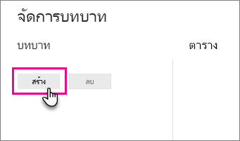

## กำหนดบทบาทและกฎภายใน Power BI Desktop
คุณสามารถกำหนดบทบาทและกฎภายใน Power BI Desktop เมื่อคุณเผยแพร่ไปยัง Power BI จะเผยแพร่ไปยังคำจำกัดความบทบาทด้วยเช่นกัน

เมื่อต้องกำหนดบทบาทความปลอดภัย คุณสามารถทำดังต่อไปนี้

1. นำเข้าข้อมูลลงในรายงาน Power BI Desktop ของคุณหรือกำหนดค่าการเชื่อมต่อ DirectQuery
   
   > [!NOTE]
   > คุณไม่สามารถกำหนดบทบาทภายใน Power BI Desktop สำหรับข้อมูล Analysis Services แบบ live connection คุณจะต้องดำเนินการดังกล่าวภายในแบบจำลอง Analysis Services
   > 
   > 
2. เลือกแถบ**แบบจำลอง**
3. เลือก**จัดการบทบาท**
   
   
4. เลือก**สร้าง**
   
   
5. ระบุชื่อสำหรับบทบาท 
6. เลือกตารางที่คุณต้องการปรับใช้กฎ DAX
7. ป้อนนิพจน์ DAX นิพจน์นี้จะส่งกลับว่าค่าเป็นจริงหรือเท็จ ตัวอย่างเช่น: [เอนทิตี ID] = "Value"
   
   > [!NOTE]
   > คุณสามารถใช้*username()* ภายในนิพจน์นี้ได้ โปรดทราบว่า*username()* จะมีรูปแบบของ*DOMAIN\username*ภายใน Power BI Desktop ซึ่งจะอยู่ในรูปแบบของ UPN ของผู้ใช้ภายในบริการ Power BI อีกวิธีหนึ่งคือ คุณสามารถใช้ *userprincipalname()* ซึ่งจะส่งผู้ใช้กลับในรูปแบบของชื่อหลักเสมอ
   > 
   > 
   
   
8. หลังจากที่คุณได้สร้างนิพจน์ DAX แล้วคุณสามารถเลือกทำเครื่องหมายบนกล่องนิพจน์เพื่อตรวจสอบนิพจน์
   
   
9. เลือก**บันทึก**

คุณไม่สามารถกำหนดผู้ใช้ให้กับบทบาทภายใน Power BI Desktop เนื่องจากการกระทำดังกล่าวเสร็จสิ้นแล้วภายในบริการ Power BI คุณสามารถเปิดใช้งานความปลอดภัยแบบไดนามิกภายใน Power BI Desktop ด้วยการใช้ฟังก์ชัน DAX*username()* หรือ*userprincipalname()* และกำหนดค่าความสัมพันธ์ที่เหมาะสม

