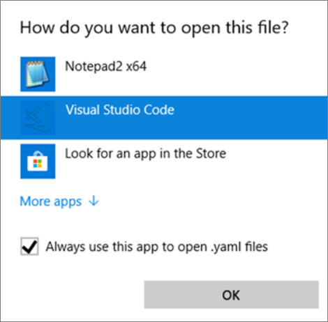
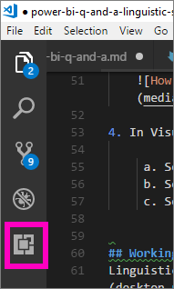
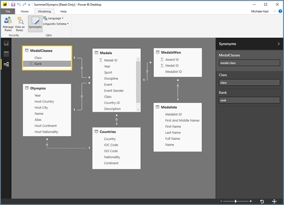
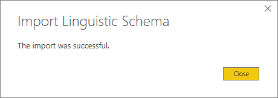

# <a name="language-modeling-and-the-linguistic-schema"></a>การวางรูปแบบภาษาและรูปแบบภาษา 
การใช้วลีทั่วไปและภาษาที่เป็นธรรมชาติในการถามคำถามเกี่ยวกับข้อมูลของคุณเป็นการดำเนินการที่มีประสิทธิภาพ และจะยิ่งมีประสิทธิภาพมากยิ่งขึ้นเมื่อได้รับคำตอบเกี่ยวกับข้อมูล ซึ่งเป็นสิ่งที่ส่วนถามตอบใน Power BI ช่วยให้คุณทำได้ เมื่อคุณถามคำถามในส่วนถามตอบของ Power BI ส่วนถามตอบจะพยายามอย่างมากที่สุดเพื่อตอบคำถามให้ถูกต้อง 

แต่เพื่อให้โต้ตอบกับส่วนถามตอบได้ดียิ่งขึ้น คุณมีหลายวิธีในการปรับปรุงคำตอบ วิธีหนึ่งคือการแก้ไขรูปแบบภาษา 

ทั้งหมดเริ่มต้นจากข้อมูลองค์กรของคุณ  หากมีแบบจำลองข้อมูลที่ดี ผู้ใช้ก็จะสามารถรับคำตอบที่มีคุณภาพได้ง่ายขึ้น วิธีหนึ่งในการปรับปรุงแบบจำลองเพื่อการเพิ่มรูปแบบภาษาที่กำหนดและแบ่งหมวดหมู่คำศัพท์และความสัมพันธ์ระหว่างตารางและชื่อคอลัมน์ในชุดข้อมูลของคุณ Power BI Desktop เป็นที่ที่คุณสามารถจัดการรูปแบบภาษาของคุณได้ 

## <a name="what-is-a-linguistic-schema"></a>รูปแบบภาษาคืออะไร
รูปแบบภาษาจะอธิบายคำและวลีที่ส่วนถามตอบใช้ทำความเข้าใจวัตถุภายในชุดข้อมูล รวมถึง ชนิดของคำ คำพ้องความหมาย และการใช้ถ้อยคำที่เชื่อมโยงกับชุดข้อมูลนั้น เมื่อคุณนำเข้าหรือเชื่อมต่อกับชุดข้อมูล Power BI จะสร้างรูปแบบภาษาตามโครงสร้างของชุดข้อมูล เมื่อคุณถามคำถามในส่วนถามตอบ ส่วนถามตอบจะค้นหาคำที่ตรงกันและความสัมพันธ์ในข้อมูลเพื่อระบุวัตถุประสงต์ของคำถามของคุณ ตัวอย่างเช่น จะค้นหาคำนาม คำกริยา คำคุณศัพท์ การใช้ถ้อยคำ และองค์ประกอบอื่นๆ และจะค้นหาความสัมพันธ์ เช่น คอลัมน์ที่เป็นกรรมของคำกริยา 

คุณอาจคุ้นเคยกับชนิดของคำ (หากไม่ ให้ดูด้านล่าง) แต่การใช้ถ้อยคำอาจเป็นคำใหม่สำหรับคุณ  การใช้ถ้อยคำคือวิธีที่คุณพูดคุย (หรือ “เลือกใช้ถ้อยคำ”) เกี่ยวกับความสัมพันธ์ระหว่างสิ่งต่างๆ ตัวอย่างเช่น เมื่อต้องการอธิบายความสัมพันธ์ระหว่างลูกค้าและผลิตภัณฑ์ คุณอาจพูดว่า “ลูกค้าซื้อผลิตภัณฑ์” หรือ เมื่อต้องการอธิบายความสัมพันธ์ระหว่างลูกค้าและอายุ คุณอาจพูดว่า “อายุเป็นตัวบ่งชี้ว่าลูกค้าแก่แค่ไหน” หรือ เมื่อต้องการอธิบายความสัมพันธ์ระหว่างลูกค้าและหมายเลขโทรศัพท์ คุณอาจพูดว่า “ลูกค้ามีหมายเลขโทรศัพท์”

การใช้ถ้อยคำเหล่านี้มีหลากหลายรูปแบบ การใช้ถ้อยคำบางอย่างจะสอดคล้องกับความสัมพันธ์ในแบบจำลองข้อมูลโดยตรง การใช้ถ้อยคำบางอย่างจะเชื่อมโยงคอลัมน์กับตารางของคอลัมน์นั้น การใช้ถ้อยคำอื่นๆ จะเชื่อมโยงตารางและคอลัมน์หลายรายการเข้าด้วยกันในความสัมพันธ์ที่ซับซ้อน ในทุกกรณี การใช้ถ้อยคำจะอธิบายความสัมพันธ์ของสิ่งต่างๆ โดยใช้คำในชีวิตประจำวัน

รูปแบบภาษาจะถูกบันทึกเป็นรูปแบบ YAML รูปแบบนี้จะคล้ายกับรูปแบบ JSON ที่ได้รับความนิยม แต่มีไวยากรณ์ที่ยืดหยุ่นและอ่านได้ง่ายกว่า สามารถแก้ไข ส่งออก และนำเข้ารูปแบบภาษาไปยัง Power BI Desktop ได้

## <a name="prerequisites"></a>ข้อกำหนดเบื้องต้น
- ถ้าคุณยังไม่ได้อ่านบทความเกี่ยวกับ[การปรับปรุงแบบจำลองข้อมูลสำหรับส่วนถามตอบ](desktop-qna-in-reports.md) คุณอาจต้องการอ่านบทความนั้นก่อน บทความดังกล่าวมีเคล็ดลับมากมายสำหรับการออกแบบและการปรับปรุงแบบจำลองข้อมูลของคุณและส่วนสำคัญของการเพิ่มคำพ้องความหมาย  

- ส่วนถามตอบมีอยู่สองด้าน  ด้านแรกคือการเตรียมการ หรือ “การวางรูปแบบ”  ด้านที่สองคือการถามคำถามและการสำรวจข้อมูล หรือ “การบริโภค” ในบางบริษัท พนักงานที่มีหน้าที่เป็นผู้วางรูปแบบข้อมูลหรือผู้ดูแลระบบ IT อาจเป็นผู้รวบรวมชุดข้อมูล วางรูปแบบข้อมูล และเผยแพร่ชุดข้อมูลไปยัง Power BI  ขณะที่พนักงานชุดที่สองอาจเป็นผู้ “บริโภค” ข้อมูลออนไลน์  ในบริษัทอื่น บทบาทเหล่านี้อาจรวมอยู่ด้วยกัน 

    หัวข้อนี้มีไว้สำหรับผู้วางรูปแบบข้อมูล บุคคลที่รวบรวมชุดข้อมูลและปรับปรุงให้เหมาะสมที่สุดเพื่อให้ได้รับผลลัพธ์ที่ดีที่สุดจากส่วนถามตอบ 

- [ตัวอย่างไฟล์.yaml และ.pbix](https://go.microsoft.com/fwlink/?linkid=871858)    
- เราขอแนะนำตัวแก้ไขไฟล์ YAML [Visual Studio Code](https://code.visualstudio.com/)


### <a name="set-up-an-editor-for-yaml-files"></a>ตั้งค่าตัวแก้ไขสำหรับไฟล์ YAML
เราขอแนะนำให้ใช้ Visual Studio Code ในการแก้ไขไฟล์ YAML ของรูปแบบภาษา Visual Studio Code มีการสนับสนุนรูปแบบใหม่สำหรับไฟล์ YAML และสามารถขยายการทำงานเพื่อตรวจสอบรูปแบบภาษาของ Power BI โดยเฉพาะ
1. ติดตั้ง [Visual Studio Code](https://code.visualstudio.com/)    

2. เลือกรูปแบบภาษาตัวอย่างที่คุณบันทึกไว้ก่อนหน้านี้: [ไฟล์ YAML](https://go.microsoft.com/fwlink/?linkid=871858) (SummerOlympics.lsdl.yaml)    
4. เลือก **Visual Studio Code** และ **ใช้แอปนี้ในการเปิดไฟล์ .yaml เสมอ**

    

4. ใน Visual Studio Code ให้ติดตั้งส่วนขาย YAML Support by Red Hat    
    a. เลือกแท็บ **ส่วนขยาย** (แท็บซ้ายสุด) หรือกด CTRL+SHIFT+X    
        
    b. ค้นหา “yaml” และเลือก **YAML Support by Red Hat** ในรายการ    
    c. เลือก **ติดตั้ง > โหลดใหม่**


## <a name="working-with-linguistic-schemas"></a>การทำงานกับรูปแบบภาษา
สามารถแก้ไข ส่งออก และนำเข้ารูปแบบภาษาใน[มุมมองความสัมพันธ์](desktop-relationship-view.md)ใน Power BI Desktop ได้ วิธีหนึ่งในการแก้ไขรูปแบบภาษาคือการ[เพิ่มคำพ้องความหมายไปยังบานหน้าต่าง **คำพ้องความหมาย**](desktop-qna-in-reports.md) ซึ่งไม่เกี่ยวข้องกับการเปิดไฟล์ YAML




 วิธีอื่นในการแก้ไขรูปแบบภาษาคือการส่งออกและแก้ไขไฟล์ YAML โดยตรง  เมื่อคุณแก้ไขรูปแบบภาษาของไฟล์ YAML คุณต้องแท็กคอลัมน์ในตารางเป็นองค์ประกอบไวยากรณ์ต่างๆ และกำหนดคำที่เพื่อนร่วมงานอาจใช้ในการเลือกใช้คำถาม ตัวอย่างเช่น คุณระบุคอลัมน์ที่เป็นประธานและกรรมของคำกริยาและคุณเพิ่มคำอื่นๆ ที่เพื่อนร่วมงานสามารถใช้ในการอ้างอิงตาราง คอลัมน์ และหน่วยวัดในแบบจำลองของคุณ 


ก่อนที่คุณจะแก้ไขรูปแบบ คุณต้องเปิด (ส่งออก) จากเดสก์ท็อป เมื่อคุณบันทึกไฟล์ YAML กลับไปยังตำแหน่งที่ตั้งเดิม จะถือว่าเป็นการนำเข้า  แต่คุณยังสามารถนำเข้าไฟล์ YAML อื่นแทนได้  ตัวอย่างเช่น ถ้าคุณมีชุดข้อมูลที่คล้ายกันและคุณเพิ่มชนิดของคำไปจำนวนมากแล้ว ให้ระบุความสัมพันธ์ การสร้างการใช้ถ้อยคำ และการสร้างคำพ้องความหมาย 

ส่วนถามตอบจะใช้ข้อมูลทั้งหมดร่วมกับการปรับปรุงต่างๆ ที่คุณทำเพื่อให้คำตอบ การทำงานให้เสร็จโดยอัตโนมัติ และการสรุปคำถามที่ที่ดียิ่งขึ้น


## <a name="edit-a-linguistic-schema"></a>แก้ไขรูปแบบภาษา
เมื่อคุณส่งออกรูปแบบภาษาของคุณจากเดสก์ท็อป เนื้อหาส่วนใหญ่ในไฟล์จะถูกสร้างขึ้นโดยโปรแกรมของส่วนถามตอบ เอนทิตี คำ (คำพ้องความหมาย) ความสัมพันธ์ และการใช้ถ้อยคำที่ถูกสร้างขึ้นเหล่านี้จะถูกกำหนดไว้กับแท็ก **State: Generated** และจะรวมอยู่ในไฟล์เพื่อวัตถุประสงค์ด้านการให้ข้อมูล แต่สามารถใช้เป็นจุดเริ่มต้นสำหรับการเปลี่ยนแปลงของคุณเองได้ 

> [!NOTE]
> ตัวอย่างไฟล์ YAML ที่รวมอยู่ในบทช่วยสอนนี้ไม่มีแท็ก **State:Generated** หรือ **State:Deleted** เนื่องจากได้รับการจัดเตรียมมาสำหรับบทช่วยสอนนี้เท่านั้น เมื่อต้องการดูแท็กเหล่านี้ ให้เปิดไฟล์ .pbix ที่ยังไม่ได้แก้ไขในมุมมองความสัมพันธ์และส่งออกรูปแบบภาษา


เมื่อคุณนำเข้าไฟล์รูปแบบภาษาของคุณกลับเข้าไปใน Power BI Desktop สิ่งใดก็ตามที่ถูกทำเครื่องหมาย **State: Generated** จะถูกละเว้น (และสร้างใหม่ในภายหลัง) ดังนั้น ถ้าคุณต้องการเปลี่ยนเนื้อหาที่สร้างแล้วบางส่วน ให้ตรวจสอบให้แน่ใจว่าได้ลบแท็ก **State: Generated** ที่สอดคล้องแล้ว ในทางเดียวกัน ถ้าคุณต้องการลบเนื้อหาที่สร้างแล้วบางส่วน คุณจะต้องเปลี่ยนแท็ก **State: Generated** เป็น **State: Deleted** เพื่อให้ไม่ถูกสร้างขึ้นใหม่เมื่อคุณนำเข้าไฟล์รูปแบบภาษาของคุณ

1. เปิดชุดข้อมูลใน*มุมมองความสัมพันธ์*ของ Power BI Desktop 
2. เลือกแท็บ **การวางรูปแบบ** และเลือก **ส่งออกรูปแบบภาษา**
3. เลือก Visual Code (หรือตัวแก้ไขอื่น)
4. แก้ไขและบันทึกไฟล์ YAML
5. จากเดสก์ท็อป ให้เลือก **มุมมองความสัมพันธ์ > แท็บการวางรูปแบบ > รูปแบบภาษา > นำเข้ารูปแบบภาษา**
6. นำทางไปยังตำแหน่งที่ตั้งที่คุณบันทึกไฟล์ YAML ที่แก้ไขแล้ว และเลือก ข้อความแสดงความสำเร็จจะแจ้งให้คุณทราบว่านำเข้าไฟล์ YAML ของรูปแบบภาษาเรียบร้อยแล้ว

    

### <a name="add-phrasings-to-the-linguistic-schema"></a>เพิ่มการใช้ถ้อยคำไปยังรูปแบบภาษา
การใช้ถ้อยคำคือวิธีที่คุณพูดคุย (หรือ “เลือกใช้ถ้อยคำ”) เกี่ยวกับความสัมพันธ์ระหว่างสิ่งต่างๆ ตัวอย่างเช่น เมื่อต้องการอธิบายความสัมพันธ์ระหว่างลูกค้าและผลิตภัณฑ์ คุณอาจพูดว่า “ลูกค้าซื้อผลิตภัณฑ์” หรือ เมื่อต้องการอธิบายความสัมพันธ์ระหว่างลูกค้าและอายุ คุณอาจพูดว่า “อายุเป็นตัวบ่งชี้ว่าลูกค้าแก่แค่ไหน” หรือ เมื่อต้องการอธิบายความสัมพันธ์ระหว่างนักกีฬาและเหรียญรางวัล คุณอาจพูดว่า “นักกีฬาชนะเหรียญรางวัล”

การใช้ถ้อยคำเหล่านี้มีหลากหลายรูปแบบ การใช้ถ้อยคำบางอย่างจะสอดคล้องกับความสัมพันธ์ในแบบจำลองความหมายโดยตรง การใช้ถ้อยคำบางอย่างจะเชื่อมโยงคอลัมน์กับตารางของคอลัมน์นั้น การใช้ถ้อยคำอื่นๆ จะเชื่อมโยงตารางและคอลัมน์หลายรายการเข้าด้วยกันในความสัมพันธ์ที่ซับซ้อน ในทุกกรณี การใช้ถ้อยคำจะอธิบายความสัมพันธ์ของสิ่งต่างๆ โดยใช้คำในชีวิตประจำวัน

## <a name="where-do-phrasings-come-from"></a>การใช้ถ้อยคำมาจากไหน
การใช้ถ้อยคำง่ายๆ จำนวนมากจะถูกเพิ่มไปยังรูปแบบภาษาโดยอัตโนมัติ ตามโครงสร้างของแบบจำลองและการคาดเดาบางส่วนตามชื่อคอลัมน์ ตัวอย่างเช่น:
- คอลัมน์ส่วนใหญ่จะถูกเชื่อมโยงกับตารางด้วยการใช้ถ้อยคำง่ายๆ เช่น “ผลิตภัณฑ์มีคำอธิบาย”
- ความสัมพันธ์แบบจำลองจะทำให้เกิดการใช้ถ้อยคำเริ่มต้นสำหรับความสัมพันธ์ทั้งสองทิศทาง เช่น “คำสั่งซื้อมีผลิตภัณฑ์” และ “ผลิตภัณฑ์มีคำสั่งซื้อ”
- ความสัมพันธ์แบบจำลองบางอย่างสามารถรับการใช้ถ้อยคำเริ่มต้นที่มีความซับซ้อนมากขึ้นตามชื่อคอลัมน์ เช่น “คำสั่งซื้อได้รับการจัดส่งไปยังเมือง”

อย่างไรก็ตาม ยังมีวิธีอีกมากมายที่ผู้ใช้ของคุณสามารถพูดคุยเกี่ยวกับสิ่งต่างๆ ที่ส่วนถามตอบไม่สามารถคาดเดาได้ สำหรับวิธีเหล่านั้น คุณอาจต้องการเพิ่มการใช้ถ้อยคำของคุณด้วยตนเอง


## <a name="why-should-i-add-phrasings"></a>ทำไมฉันถึงควรเพิ่มการใช้ถ้อยคำ
เหตุผลข้อแรกของการเพิ่มการใช้ถ้อยคำคือเพื่อกำหนดคำศัพท์ใหม่ ตัวอย่างเช่น ถ้าคุณต้องการถามว่า “แสดงรายการลูกค้าที่แก่ที่สุด” คุณก็ต้องสอนส่วนถามตอบให้รู้จักความหมายของคำว่า “แก่” เสียก่อน คุณอาจทำเช่นนั้นได้โดยการเพิ่มการใช้ถ้อยคำ เช่น “อายุเป็นตัวบ่งชี้ว่าลูกค้าแก่มากแค่ไหน”

เหตุผลข้อสองของการเพิ่มการใช้ถ้อยคำคือเพื่อแก้ไขข้อความกำกวม การค้นหาคำพื้นฐานอาจแสดงผลลัพธ์มากมายเมื่อคำมีความหมายมากกว่าหนึ่งความหมาย ตัวอย่างเช่น “เที่ยวบินไปชิคาโก” มีความหมายที่แตกต่างจาก “เที่ยวบินจากชิคาโก” แต่ส่วนถามตอบจะไม่ทราบว่าคุณหมายถึงอะไร เว้นแต่ว่าคุณจะเพิ่มการใช้ถ้อยคำ “เที่ยวบินจากเมืองที่ออกเดินทาง” และ “เที่ยวบินไปยังเมืองปลายทาง” ในทางเดียวกัน ส่วนถามตอบจะสามารถเข้าใจความแตกต่างระหว่าง “รถที่ John ขายให้ Mary” และ “รถที่ John ซื้อจาก Mary” ได้เมื่อคุณเพิ่มการใช้ถ้อยคำ “ลูกค้าซื้อรถจากพนักงาน” และ “พนักงานขายรถให้ลูกค้า”

เหตุผลข้อสุดท้ายของการเพิ่มการใช้ถ้อยคำคือเพื่อปรับปรุงการกล่าวซ้ำ แทนที่ส่วนถามตอบจะตอบกลับคุณว่า “แสดงลูกค้าและผลิตภัณฑ์ของพวกเขา” อาจจะชัดเจนกว่าถ้าตอบกลับว่า “แสดงลูกค้าและผลิตภัณฑ์ที่พวกเขาซื้อ” หรือ “แสดงลูกค้าและผลิตภัณฑ์ที่พวกเขาให้คำวิจารณ์” โดยขึ้นอยู่กับว่าส่วนถามตอบเข้าใจคำถามอย่างไร การเพิ่มการใช้ถ้อยคำแบบกำหนดเองจะทำให้การกล่าวซ้ำมีความขัดเจนมากขึ้นและไม่กำกวม


## <a name="what-kinds-of-phrasings-are-there"></a>การใช้ถ้อยคำมีประเภทใดบ้าง
เมื่อต้องการทำความเข้าใจการใช้ถ้อยคำชนิดต่างๆ ก่อนอื่น คุณต้องจำคู่คำศัพท์ไวยากรณ์ขั้นพื้นฐานให้ได้:
- *คำนาม* คือบุคคล สถานที่ หรือสิ่งของ 
    - ตัวอย่าง: รถ, วัยรุ่น, Marty, flux capacitor
- *คำกริยา* คือการกระทำหรือสภาวะความเป็นอยู่ 
    - ตัวอย่าง: ฟัก, ปะทุ, กลืนกิน, ดีดตัว
- *คำคุณศัพท์* คือคำอธิบายลักษณะของคำถาม 
    - ตัวอย่าง: ทรงพลัง, มหัศจรรย์, สีทองคำ, ถูกขโมย
- *คำบุพบท* คือคำที่ใช้นำหน้าคำนามเพื่อเชื่อมโยงกับคำนาม คำกริยา หรือคำคุณศัพท์ก่อนหน้า 
    - ตัวอย่าง: ของ, สำหรับ, ใกล้, จาก
-  *คุณลักษณะ* คือคุณภาพหรือคุณสมบัติของบางอย่าง
-  *ชื่อ* คือคำหรือกลุ่มคำที่หมายถึงบุคคล สัตว์ สถานที่ หรือสิ่งของ   


## <a name="attribute-phrasings"></a>การเลือกใช้คุณลักษณะ
การเลือกใช้คุณลักษณะคือคนงานของส่วนถามตอบ ที่จะทำงานเมื่อมีสิ่งหนึ่งทำหน้าที่เป็นคุณลักษณะของอีกสิ่งหนึ่ง การใช้ถ้อยคำชนิดนี้ใช้งานได้ง่าย ไม่ซับซ้อน และทำงานที่ยุ่งยากส่วนใหญ่เมื่อการใช้ถ้อยคำที่ชัดเจนกว่า มีรายละเอียดมากกว่าไม่ได้ระบุไว้ การเลือกใช้คุณลักษณะจะถูกอธิบายโดยใช้คำกริยาพื้นฐาน “มี” (“ผลิตภัณฑ์มีหมวดหมู่” และ “ประเทศเจ้าภาพมีเมืองเจ้าภาพ”) และยังอนุญาตให้ใช้คำบุพบท “ของ” และ “สำหรับ” (“หมวดหมู่ของผลิตภัณฑ์” “คำสั่งซื้อสำหรับผลิตภัณฑ์”) เป็นการแสดงความเป็นเจ้าของ (“คำสั่งซื้อของ John”) โดยอัตโนมัติ การเลือกใช้คุณลักษณะจะใช้ในคำถาม เช่น คำถามนี้:
- ลูกค้าคนใดมีคำสั่งซื้อ
- แสดงรายชื่อเมืองเจ้าภาพตามประเทศตามลำดับตัวอักษร
- แสดงคำสั่งซื้อที่มีชาอินเดีย
- แสดงรายชื่อลูกค้าที่มีคำสั่งซื้อ
- ผลิตภัณฑ์แต่ละอย่างอยู่ในหมวดหมู่ใด
- นับจำนวนคำสั่งซื้อของ Robert King    

การเลือกใช้คุณลักษณะส่วนใหญ่ที่จำเป็นในแบบจำลองของคุณจะถูกสร้างขึ้นโดยอัตโนมัติ ตามตาราง/คอลัมน์และความสัมพันธ์ของแบบจำลอง ดังนั้น โดยปกติแล้ว คุณไม่ต้องสร้างด้วยตนเอง
นี่คือตัวอย่างของลักษณะของการเลือกใช้คุณลักษณะภายในรูปแบบภาษา:

```json
product_has_category:
  Binding: {Table: Products}
  Phrasings:
  - Attribute: {Subject: product, Object: product.category}
```
 
## <a name="name-phrasings"></a>การเลือกใช้ชื่อ
การเลือกใช้ชื่อจะมีประโยชน์ ถ้าแบบจำลองข้อมูลของคุณมีตารางที่มีวัตถุที่มีชื่อ เช่น ชื่อนักกีฬาและชื่อลูกค้า ตัวอย่างเช่น การเขียน “ชื่อผลิตภัณฑ์คือชื่อของผลิตภัณฑ์” มีความสำคัญเพื่อให้สามารถใช้ชื่อผลิตภัณฑ์ในคำถามได้ การเลือกใช้ชื่อยังทำให้สามารถใช้ “มีชื่อว่า” เป็นคำกริยาได้ (เช่น “แสดงลูกค้าที่มีชื่อว่า John Smith” เป็นสิ่งสำคัญที่สุดเมื่อใช้ร่วมกับการใช้ถ้อยคำอื่นๆ เพื่อให้สามารถใช้ค่าชื่อในการอ้างอิงแถวตาราง ตัวอย่างเช่น ใน “ลูกค้าที่ซื้อชาอินเดีย” ส่วนถามตอบจะสามารถบอกได้ว่าค่า “ชาอินเดีย” หมายถึงแถวของตารางผลิตภัณฑ์ แทนที่จะเป็นเพียงค่าในคอลัมน์ชื่อผลิตภัณฑ์ การเลือกใช้ชื่อจะใช้ในคำถาม เช่น คำถามนี้:    
- พนักงานคนใดที่มีชื่อว่า Robert King
- ใครมีชื่อว่า Ernst Handel
- กีฬาของ Fernand De Montigny
- จำนวนนักกีฬาที่มีชื่อว่า Mary
- Robert King ซื้ออะไรบ้าง

สมมติว่าคุณใช้การตั้งชื่อที่สื่อความหมายสำหรับคอลัมน์ชื่อในแบบจำลองของคุณ (เช่น “ชื่อ” หรือ “ชื่อผลิตภัณฑ์” แทนที่จะเป็น “ชผภ”) การเลือกใช้ชื่อส่วนใหญ่ที่จำเป็นในแบบจำลองจะถูกสร้างขึ้นโดยอัตโนมัติ ดังนั้น คุณจึงไม่ต้องสร้างด้วยตนเอง

นี่คือตัวอย่างของลักษณะของการเลือกใช้ชื่อภายในรูปแบบภาษา:

```json
employee_has_name:
  Binding: {Table: Employees}
  Phrasings:
  - Name:
      Subject: employee
      Name: employee.name
```

 
## <a name="adjective-phrasings"></a>การเลือกใช้คำคุณศัพท์
การเลือกใช้คำคุณศัพท์ระบุคำคุณศัพท์ใหม่ที่ใช้อธิบายสิ่งต่างๆ ในแบบจำลองของคุณ ตัวอย่างเช่น จำเป็นต้องใช้การเขียน “ลูกค้าที่มีความสุขคือลูกค้าที่ให้คะแนนมากกว่า > 6” ในการถามคำถาม เช่น “แสดงรายชื่อลูกค้าที่มีความสุขใน Des Moines” มีการเลือกใช้คำคุณศัพท์หลายรูปแบบ สำหรับใช้ในสถานการณ์ต่างๆ

*การเลือกใช้คำคุณศัพท์อย่างง่าย* จะกำหนดคำคุณศัพท์ใหม่ตามเงื่อนไข เช่น “ผลิตภัณฑ์ที่หยุดจำหน่ายคือผลิตภัณฑ์ที่มีสถานะ = D” การเลือกใช้คำคุณศัพท์อย่างง่ายจะใช้ในคำถาม เช่น คำถามนี้:
- ผลิตภัณฑ์ใดบ้างที่หยุดจำหน่าย
- แสดงรายชื่อผลิตภัณฑ์ที่หยุดจำหน่าย
- แสดงรายการเหรียญทอง
- ผลิตภัณฑ์ที่ยังไม่มีสินค้าพร้อมส่ง

นี่คือตัวอย่างของลักษณะการเลือกใช้คำคุณศัพท์อย่างง่ายภายในรูปแบบภาษา: ผลิตภัณฑ์หยุดจำหน่าย:

```json
Binding: {Table: Products}
  Conditions:
  - Target: product.discontinued
    Operator: Equals
    Value: true
  Phrasings:
  - Adjective:
      Subject: product
      Adjectives: [discontinued]
```

*การเลือกใช้คำคุณศัพท์หน่วยวัด* จะกำหนดคำคุณศัพท์ใหม่ตามค่าตัวเลขที่ระบุการขยายของคำคุณศัพท์ที่นำไปใช้ เช่น “ความยาวเป็นตัวระบุความยาวของแม่น้ำ” และ “ประเทศภูมิภาคขนาดเล็กมีพื้นที่เล็ก” การเลือกใช้คำคุณศัพท์หน่วยวัดจะใช้ในคำถาม เช่น คำถามนี้:
- แสดงรายชื่อแม่น้ำที่ยาว
- แม่น้ำสายใดยาวที่สุด
- แสดงรายชื่อประเทศภูมิภาคขนาดเล็กที่สุดที่ชนะเหรียญทองในกีฬาบาสเก็ตบอล
- Rio Grande มีความยาวเท่าใด

นี่คือตัวอย่างของลักษณะการเลือกใช้คำคุณศัพท์หน่วยวัดภายในรูปแบบภาษา: แม่น้ำมีความยาว:

 ```json
Binding: {Table: Rivers}
  Phrasings:
  - Adjective:
      Subject: river
      Adjectives: [long]
      Antonyms: [short]
      Measurement: river.length
```

*การเลือกใช้คำคุณศัพท์แบบไดนามิก* จะกำหนดกลุ่มคำคุณศัพท์ใหม่ตามค่าในคอลัมน์ในแบบจำลอง เช่น "สีอธิบายผลิตภัณฑ์" และ "กิจกรรมมีเพศของกิจกรรม" การเลือกใช้คำคุณศัพท์แบบไดนามิกจะใช้ในคำถาม เช่น คำถามนี้:
- แสดงรายชื่อผลิตภัณฑ์สีแดง
- ผลิตภัณฑ์ใดบ้างมีสีเขียว
- แสดงกิจกรรมการเล่นสกีสำหรับผู้หญิง
- นับจำนวนปัญหาที่ดำเนินการอยู่

นี่คือตัวอย่างของลักษณะการเลือกใช้คำคุณศัพท์แบบไดนามิกภายในรูปแบบภาษา: ผลิตภัณฑ์มีสี:
```json
Binding: {Table: Products}
  Phrasings:
  - DynamicAdjective:
      Subject: product
      Adjective: product.color
```

 
## <a name="noun-phrasings"></a>การเลือกใช้คำนาม
การเลือกใช้คำนามจะกำหนดคำนามใหม่ที่อธิบายชุดย่อยของสิ่งต่างๆ ในแบบจำลองของคุณ มักจะรวมถึงหน่วยวัดหรือเงื่อนไขเฉพาะของแบบจำลองบางชนิด ตัวอย่างเช่น สำหรับแบบจำลองโอลิมปิก เราอาจต้องการเพิ่มการใช้ถ้อยคำที่แยกแชมเปี้ยนจากผู้ได้รับเหรียญรางวัล กีฬาลูกบอลจากกีฬาทางน้ำ ประเภททีมกับประเภทเดี่ยว ระดับอายุของนักกีฬา (ระดับวัยรุ่น ระดับผู้ใหญ่ ระดับอาวุโส) เป็นต้น สำหรับฐานข้อมูลภาพยนตร์ของคุณ เราอาจต้องการเพิ่มการเลือกใช้คำนาม “ความล้มเหลวคือภาพยนตร์ที่มีกำไรสุทธิ < 0” เพื่อให้เราสามารถถามคำถาม เช่น “จำนวนความล้มเหลวตามปี” มีการเลือกใช้คำนามสองรูปแบบ สำหรับใช้ในสถานการณ์ต่างๆ

*การเลือกใช้คำนามอย่างง่าย* จะกำหนดคำนามใหม่ตามเงื่อนไข เช่น “ผู้รับเหมาคือพนักงานที่ทำงานแบบเต็มเวลา = false” และ “แชมเปี้ยนคือนักกีฬาที่ได้รับเหรียญรางวัลจำนวน > 5” การเลือกใช้คำนามอย่างง่ายจะใช้ในคำถาม เช่น คำถามนี้:

- พนักงานคนใดเป็นผู้รับเหมา
- นับจำนวนผู้ติดต่อใน Portland
- มีแชมเปี้ยนกี่คนในปี 2016

นี่คือตัวอย่างของลักษณะการเลือกใช้คำนามอย่างง่ายภายในรูปแบบภาษา: พนักงานเป็นผู้รับเหมา:

```json
Binding: {Table: Employees}
  Conditions:
  - Target: employee.full_time
    Operator: Equals
    Value: false
  Phrasings:
  - Noun:
      Subject: employee
      Nouns: [contractor]
```

*การเลือกใช้คำนามแบบไดนามิก* จะกำหนดชุดคำนามใหม่ตามค่าในคอลัมน์ในแบบจำลอง เช่น “งานกำหนดชุดย่อยของพนักงาน” การเลือกใช้คำนามแบบไดนามิกจะใช้ในคำถาม เช่น คำถามนี้:

- รายชื่อเจ้าหน้าที่การเงินในชิคาโก
- พนักงานคนใดเป็นพนักงานชงกาแฟ
- รายชื่อกรรมการในปี 1992

นี่คือตัวอย่างของลักษณะการเลือกใช้คำนามแบบไดนามิกภายในรูปแบบภาษา: พนักงานมีงาน:

 ```json
Binding: {Table: Employees}
  Phrasings:
  - DynamicNoun:
      Subject: employee
      Noun: employee.job
```

## <a name="preposition-phrasings"></a>การเลือกใช้คำบุพบท
การเลือกใช้คำบุพบทจะใช้ในการอธิบายความสัมพันธ์ระหว่างสิ่งต่างๆ ในแบบจำลองของคุณกับคำบุพบท ตัวอย่างเช่น การเขียน “เมืองอยู่ในประเทศ” จะปรับปรุงความเข้าใจของคำถาม เช่น “จำนวนเมืองในวอชิงตัน” การเลือกใช้คำบุพบทบางอย่างจะถูกสร้างโดยอัตโนมัติเมื่อคอลัมน์ได้รับการระบุเป็นเอนทิตีภูมิศาสตร์ การเลือกใช้คำบุพบทจะใช้ในคำถาม เช่น คำถามนี้:

- นับจำนวนลูกค้าในนิวยอร์ก
- แสดงรายชื่อหนังสือเกี่ยวกับภาษาศาสตร์
- John Galt อยู่ในเมืองใด
- Stephen Pinker เขียนหนังสือกี่เล่ม
 
นี่คือตัวอย่างของลักษณะการเลือกใช้คำบุพบทแบบไดนามิกภายในรูปแบบภาษา: ลูกค้าอยู่ในเมือง:

 ```json
Binding: {Table: Customers}
  Phrasings:
  - Preposition:
      Subject: customer
      Prepositions: [in]
      Object: customer.city
```

 
## <a name="verb-phrasings"></a>การเลือกใช้คำกริยา
การเลือกใช้คำกริยาจะใช้ในการอธิบายความสัมพันธ์ระหว่างสิ่งต่างๆ ในแบบจำลองของคุณกับคำกริยา ตัวอย่างเช่น การเขียน “ลูกค้าซื้อผลิตภัณฑ์” จะปรับปรุงความเข้าใจของคำถาม เช่น “ใครซื้อชีส” และ “John ซื้ออะไรบ้าง” การเลือกใช้คำกริยามีความยืดหยุ่นมากกว่าการใช้ถ้อยคำชนิดอื่นๆ และมักจะเชื่อมโยงสิ่งต่างๆ มากกว่าสองสิ่งกับสิ่งอื่น เช่น ใน “พนักงานขายผลิตภัณฑ์ให้ลูกค้า” การเลือกใช้คำกริยาจะใช้ในคำถาม เช่น คำถามนี้:

- ใครขายอะไรให้ใคร
- พนักงานคนใดขายชาอินเดียให้ John
- Mary ขายชาอินเดียให้ลูกค้ากี่คน
- แสดงรายชื่อผลิตภัณฑ์ที่ Mary ขายให้ John
- ผลิตภัณฑ์ที่หยุดจำหน่ายใดที่พนักงานในบอสตันขายให้ลูกค้าในชิคาโก

การเลือกใช้คำกริยายังมีวลีคำบุพบท ดังนั้นจึงเพิ่มความยืดหยุ่น เช่น ใน “นักกีฬาชนะเหรียญทองจากการแข่งขัน” หรือ “ลูกค้าได้รับเงินคืนสำหรับผลิตภัณฑ์” ารเขียนวลีคำกริยาที่มีวลีคำบุพบทจะใช้ในคำถาม เช่น คำถามนี้:

- มีแชมเปี้ยนกี่คนได้รับเหรียญทองที่ Visa Championships
- ลูกค้าคนใดได้รับเงินคืนสำหรับชีส
- การแข่งขันใดที่ Danell Leyva ชนะเหรียญทองแดง

การเลือกใช้คำกริยาบางอย่างจะถูกสร้างโดยอัตโนมัติเมื่อคอลัมน์ได้รับการระบุว่ามีทั้งคำกริยาและคำบุพบท

นี่คือตัวอย่างของลักษณะการเลือกใช้คำกริยาแบบไดนามิกภายในรูปแบบภาษา: ลูกค้าซื้อผลิตภัณฑ์จากพนักงานขาย:

```json
Binding: {Table: Orders}
  Phrasings:
  - Verb:
      Subject: customer
      Verbs: [buy, purchase]
      Object: product
      PrepositionalPhrases:
      - Prepositions: [from]
        Object: salesperson
```

## <a name="relationships-with-multiple-phrasings"></a>ความสัมพันธ์กับการใช้ถ้อยคำหลายรายการ
บ่อยครั้ง หนึ่งความสัมพันธ์สามารถอธิบายได้มากกว่าหนึ่งวิธี ในกรณีนี้ หนึ่งความสัมพันธ์สามารถมีการใช้ถ้อยคำมากกว่าหนึ่งรายการ เป็นเรื่องปกติที่ความสัมพันธ์ระหว่างเอนทิตีตารางและเอนทิตีคอลัมน์จะมีทั้งการเลือกใช้คุณสมบัติและการใช้ถ้อยคำชนิดอื่น ตัวอย่างเช่น ในความสัมพันธ์ระหว่างลูกค้าและชื่อลูกค้า คุณจะต้องการทั้งการเลือกใช้คุณลักษณะ (เช่น “ลูกค้ามีชื่อ”) และการเลือกใช้ชื่อ (เช่น “ชื่อลูกค้าคือชื่อของลูกค้า”) ดังนั้น คุณจึงสามารถถามได้ทั้งสองบริษัท

นี่คือตัวอย่างของลักษณะของความสัมพันธ์ระหว่างการใช้ถ้อยคำสองรายการภายในรูปแบบภาษา: ลูกค้ามีชื่อ:

  ```json
Binding: {Table: Customers}
  Phrasings:
    - Attribute: {Subject: customer, Object: customer.name}
    - Name:
        Subject: customer
        Object: customer.name
```

อีกทางเลือกหนึ่งคือการเพิ่มการใช้ถ้อยคำอื่น “พนักงานขายผลิตภัณฑ์ให้ลูกค้า” ไปยังความสัมพันธ์ “ลูกค้าซื้อผลิตภัณฑ์จากพนักงาน” โปรดทราบว่าคุณไม่จำเป็นต้องเพิ่มตัวแปร เช่น “พนักงานขายผลิตภัณฑ์ให้**ลูกค้า**” หรือ “ผลิตภัณฑ์ถูกขายให้ลูกค้าโดย**พนักงาน**” เนื่องจากตัวแปร “โดย” และ “ให้” ของประธานและกรรมรองจะถูกอนุมานโดยส่วนถามตอบโดยอัตโนมัติ

## <a name="considerations-and-troubleshooting"></a>ข้อควรพิจารณาและการแก้ไขปัญหา
ถ้าคุณเปลี่ยนแปลงไฟล์ .lsdl.yaml ที่ไม่สอดคล้องกับรูปแบบภาษา คุณจะเห็นเส้นหยักการตรวจสอบเช่นนี้เพื่อระบุว่ามีปัญหา: 

    


มีคำถามเพิ่มเติมหรือไม่ [ลองไปที่ชุมชน Power BI](http://community.powerbi.com/)
