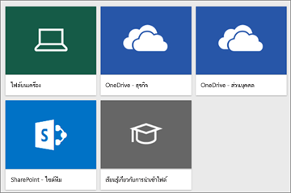
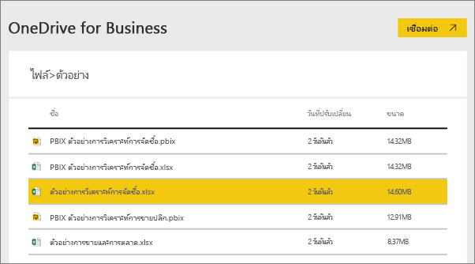
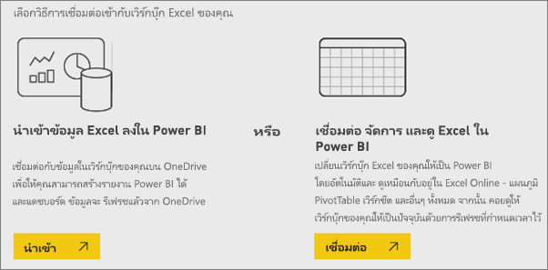
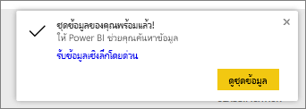
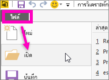

# มีข้อมูลตัวอย่างอะไรบ้างให้ใช้กับ Power BI?
สมมุติว่าคุณยังใหม่กับ Power BI และต้องการทดลองใช้ แต่คุณไม่มีข้อมูลใด ๆ  หรือบางทีคุณอาจมีชุดข้อมูลอยู่แล้ว แต่คุณยังไม่เข้าใจว่า Power BI ทำงานอย่างไร คุณกังวลว่าคุณอาจทำให้ชุดข้อมูลของคุณเสียหาย

ไม่จำเป็นต้องเครียดอีกต่อไป! obviEnce ([www.obvience.com](http://www.obvience.com/)) และ Microsoft ได้สร้างตัวอย่างให้คุณใช้ จนกว่าคุณจะรู้สึกมั่นใจขึ้นกับ Power BI  ข้อมูลถูกลบตัวตนออก และเป็นตัวอย่างจากอุตสาหกรรมที่แตกต่างกัน: การเงิน, HR, การขาย และอีกมากมาย และเมื่อคุณอ่านผ่านตาเอกสารแบบออนไลน์ของเรา คุณจะพบบทช่วยสอนและตัวอย่างอีกหลายตัวก็ยังใช้ตัวอย่างเดียวกันนี้ ซึ่งคุณสามารถทดลองและทำตามได้      

   

แต่ละตัวอย่างเหล่านี้ มีให้ใช้งานในหลายรูปแบบ: เป็นชุดเนื้อหา เป็นเวิร์กบุ๊ก Excel และ เป็นไฟล์ .pbix ถ้าคุณไม่ทราบว่าสิ่งเหล่านี้คืออะไร หรือไปรับมาได้อย่างไร - ไม่ต้องกังวล เราจะอธิบายทั้งหมดนั้นในบทความนี้ต่อไป สำหรับแต่ละตัวอย่าง เราได้สร้างบทความประเภท*การแนะนำ* ที่บอกเรื่องราวที่อยู่เบื้องหลังตัวอย่าง และพาคุณผ่านสถานการณ์ที่หลากหลาย สถานการณ์หนึ่งอาจสามารถตอบคำถามสำหรับผู้จัดการของคุณ แต่อีกสถานการณ์อาจเป็นการมองหาข้อมูลเชิงลึกด้านความสามารถในการแข่งขัน หรือสร้างรายงานและแดชบอร์ดเพื่อแชร์ หรืออธิบายการเปลี่ยนแปลงทางธุรกิจ   

แต่ก่อนที่เราเริ่มต้น โปรดอ่านผ่านคำแนะนำด้านกฎหมายเกี่ยวกับการใช้งานตัวอย่างเหล่านั้น เมื่อคุณอ่านเสร็จแล้ว เราจะแนะนำตัวอย่าง และแสดงให้คุณเห็นว่าจะใช้งานมันได้อย่างไร   

## แนวทางการใช้งานตัวอย่างเวิร์กบุ๊ก Excel สำหรับ Power BI
โปรดอ่านข้อมูลนี้ก่อนที่ใช้ตัวอย่าง Power BI

© 2015 Microsoft Corporation สงวนสิทธิ์ทุกประการ เอกสารและเวิร์กบุ๊กมีไว้ให้ “ตามที่เป็น” ข้อมูลและมุมมองที่แสดงอยู่ในเวิร์กบุ๊ก รวมถึง URL และเว็บไซต์อินเทอร์เน็ตอ้างอิงอื่น ๆ อาจเปลี่ยนแปลงโดยไม่ต้องแจ้งให้ทราบ คุณรับผิดชอบความเสี่ยงเองจากการใช้งาน ตัวอย่างบางส่วนใช้สำหรับประกอบเท่านั้น และเป็นเรื่องสมมุติขึ้น ไม่มีความสัมพันธ์ใด ๆ กับสิ่งที่มีอยู่จริง ไม่ว่าจะตั้งใจหรืออนุมานได้ ไมโครซอฟท์ไม่มีการรับประกันใด ๆ ไม่ว่าจะระบุโดยแจ้ง หรือโดยนัย แก่ข้อมูลที่ให้ไว้ที่นี่

เวิร์กบุ๊กนี้ไม่ให้สิทธิ์ทางกฎหมายใด ๆ ในทรัพย์สินทางปัญญาในผลิตภัณฑ์ของ Microsoft คุณสามารถคัดลอก และใช้เวิร์กบุ๊กนี้สำหรับการอ้างอิงภายในของคุณ

เวิร์กบุ๊กและข้อมูลที่เกี่ยวข้อง จัดหามาให้โดย obviEnce [www.obvience.com](http://www.obvience.com)

ObviEnce คือ ISV และ Incubator ทรัพย์สินทางปัญญา (IP) ที่เน้นบน Microsoft Business Intelligence ObviEnce ทำงานใกล้ชิดกับ Microsoft เพื่อพัฒนาแนวทางปฏิบัติและความเป็นผู้นำทางความคิดที่ดีที่สุด สำหรับการเริ่มต้นและการปรับใช้โซลูชันของ Microsoft Business Intelligence

เวิร์กบุ๊กและข้อมูลที่เป็นทรัพย์สินของ obviEnce, LLC และแชร์ให้ด้วยวัตถุประสงค์เพียงอย่างเดียว คือเพื่อแสดงขีดความสามารถของ Power BI ด้วยข้อมูลตัวอย่างทางอุตสาหกรรม

การใช้งานใด ๆ ของเวิร์กบุ๊ก และ/หรือข้อมูล ต้องมีข้อความระบุแหล่งที่มาที่ปรากฏด้านบน (ซึ่งอยู่บนเวิร์กชีตข้อมูล ที่รวมอยู่ในแต่ละเวิร์กบุ๊กด้วย) เวิร์กบุ๊กและแสดงภาพใด ๆ ต้องจะมาพร้อมกับข้อความลิขสิทธิ์ต่อไปนี้: obviEnce ©

การคลิกที่ลิงก์ใดลิงก์หนึ่งด้านล่างเพื่อดาวน์โหลดไฟล์เวิร์กบุ๊ก Excel หรือไฟล์ .pbix แสดงว่าคุณได้ยอมรับข้อตกลงด้านบน

## ตัวอย่างที่มีให้
มีแปดตัวอย่างที่พร้อมให้คุณได้ใช้  แต่ละตัวอย่างแทนอุตสาหกรรมที่แตกต่างกัน

### ตัวอย่างความสามารถในการทำกำไรลูกค้า  
[ชมการแนะนำของตัวอย่างความสามารถในการทำกำไรลูกค้า](sample-customer-profitability.md)

ตัวอย่างอุตสาหกรรมนี้ วิเคราะห์เมตริกหลัก ๆ ของ CFO สำหรับใช้กับผู้บริหาร ผลิตภัณฑ์ และลูกค้า คุณสามารถตรวจสอบปัจจัยที่ส่งผลกระทบต่อกำไรของบริษัทนี้ได้

### ตัวอย่างทรัพยากรบุคคล  
[ชมการแนะนำของตัวอย่าง HR](sample-human-resources.md)

ตัวอย่างอุตสาหกรรมนี้ มุ่งเน้นกลยุทธ์การจ้างงานสำหรับบริษัท โดยการวิเคราะห์การจ้างงานใหม่ พนักงานที่ทำงานอยู่ และพนักงานที่ได้ออกไปแล้ว  โดยการสำรวจข้อมูล คุณสามารถค้นหาแนวโน้มการออกจากงานโดยความสมัครใจ และความอคติในกลยุทธ์การจ้างงาน

### ตัวอย่างการวิเคราะห์การใช้จ่ายด้าน IT 
[ชมการแนะนำของตัวอย่างการวิเคราะห์การใช้จ่ายด้าน IT](sample-it-spend.md)

ในตัวอย่างอุตสาหกรรมนี้ เราวิเคราะห์แผนต้นทุนที่วางไว้เทียบกับต้นทุนจริงของแผนก IT ของบริษัทแห่งหนึ่ง การเปรียบเทียบนี้ช่วยให้เราเข้าใจว่าบริษัทกำหนดแผนสำหรับปีได้ดีแค่ไหน และตรวจสอบด้านที่มีความแตกต่างจากแผนที่วางไว้มาก บริษัทในตัวอย่างนี้ ผ่านวงจรการวางแผนรายปี จากนั้นก็จะทำการประเมินล่าสุด (Latest Estimate, LE) ใหม่รายไตรมาส เพื่อช่วยวิเคราะห์การเปลี่ยนแปลงการใช้จ่ายด้าน IT ตลอดปีงบประมาณ

### ตัวอย่างการวิเคราะห์โอกาสทางการขาย  
[ชมการแนะนำของตัวอย่างการวิเคราะห์โอกาสทางการขาย](sample-opportunity-analysis.md)

ตัวอย่างอุตสาหกรรมนี้สำรวจช่องทางการขายของบริษัทซอฟต์แวร์ ผู้จัดการฝ่ายขายเฝ้าดูช่องทางการขาย ทั้งทางตรงและของคู่ค้า โดยการติดตามโอกาสทางการขายและรายได้ตามภูมิภาค ขนาดข้อเสนอ และช่องทางการขาย

### ตัวอย่างการวิเคราะห์การจัดซื้อ  
[ชมการแนะนำของตัวอย่างการวิเคราะห์การจัดซื้อ](sample-procurement.md)

ตัวอย่างอุตสาหกรรมนี้ วิเคราะห์เมตริกหลัก ๆ ของ CFO สำหรับใช้กับผู้บริหาร ผลิตภัณฑ์ และลูกค้า คุณสามารถตรวจสอบปัจจัยที่ส่งผลกระทบต่อการทำกำไรของบริษัทนี้ได้

### ตัวอย่างการวิเคราะห์ด้านการขายปลีก  
[ชมการแนะนำของตัวอย่างการวิเคราะห์ด้านการขายปลีก](sample-retail-analysis.md)

ตัวอย่างอุตสาหกรรมนี้ วิเคราะห์ข้อมูลขายปลีกของสินค้าที่ขายในร้านค้าจำนวนมากและในหลายเขต เมตริกเปรียบเทียบประสิทธิภาพในปีนี้เทียบกับปีที่แล้ว ในด้านต่าง ๆ เหล่านี้: ยอดขาย จำนวนหน่วยที่ขาย อัตรากำไรขั้นต้น และความแปรปรวน เช่นเดียวกับการวิเคราะห์สาขาใหม่

### ตัวอย่างยอดขายและการตลาด  
[ชมการแนะนำของตัวอย่างยอดขายและการตลาด](sample-sales-and-marketing.md)

ตัวอย่างอุตสาหกรรมนี้วิเคราะห์บริษัทผลิตที่ชื่อ VanArsdel Ltd. ซึ่งอนุญาตให้ประธานฝ่ายการตลาด เฝ้าดูอุตสาหกรรมและส่วนแบ่งตลาดของ VanArsdel  โดยการค้นคว้าตัวอย่าง คุณสามารถหาส่วนแบ่งตลาดของบริษัท ปริมาณการผลิต ยอดขาย และความคิดเห็นต่อผลิตภัณฑ์

### ตัวอย่างคุณภาพผู้จัดหาสินค้า  
[ชมการแนะนำของตัวอย่างคุณภาพผู้จัดหาสินค้า](sample-supplier-quality.md)

ตัวอย่างอุตสาหกรรมนี้ มุ่งเน้นความท้าทายหนึ่งในห่วงโซ่อุปทานที่พบโดยทั่วไป — การวิเคราะห์คุณภาพของผู้จัดหาสินค้า การวิเคราะห์นี้ใช้เมตริกหลักสองอย่าง: ผลรวมจำนวนที่บกพร่องและผลรวมเวลาที่ไม่ได้ทำงานที่เกิดขึ้นจากข้อบกพร่องเหล่านี้ ตัวอย่างนี้มีสองวัตถุประสงค์หลัก: ทำความเข้าใจว่าใครคือผู้จัดหาสินค้าที่ดีที่สุดและแย่ที่สุด และระบุโรงงานไหนค้นพบและปฏิเสธของที่บกพร่องได้ดีกว่า เพื่อลดระยะเวลาหยุดทำงาน

ตอนนี้คุณทราบแล้วว่ามีอะไรให้ใช้งาน ถึงเวลาแล้ว ที่จะการเรียนรู้วิธีรับตัวอย่างเหล่านี้  

## วิธีรับตัวอย่าง
ตามที่คุณอ่านข้างต้น ตัวอย่างมีให้ในหลายรูปแบบ: ชุดเนื้อหา, เวิร์กบุ๊ก Excel และไฟล์ .pbix เราจะอธิบายวิธีใช้แต่ละรูปแบบนี้ โดยเริ่มจาก ชุดเนื้อหา

## ตัวอย่าง Power BI ในรูปชุดเนื้อหา
ชุดเนื้อหา จะเป็นรูปแบบตัวอย่างมีใน Power BI เลย คุณไม่ต้องออกจาก Power BI เพื่อหามัน ชุดเนื้อหา จริง ๆ แล้ว คือการนำแดชบอร์ด ชุดข้อมูล และรายงาน ที่มีคนสร้างไว้ หนึ่งหรือหลายตัวรวมเข้าด้วยกัน และสามารถใช้กับบริการ Power BI ผู้คนสร้างชุดเนื้อหาขึ้นมาเพื่อแชร์กับเพื่อนร่วมงาน แต่ละชุดเนื้อหาตัวอย่าง Power BI ประกอบด้วยชุดข้อมูล รายงาน และแดชบอร์ด  ชุดเนื้อหา ไม่สามารถใช้กับ Power BI Desktop ได้ ถ้าคุณต้องการเรียนรู้เพิ่มเติมเกี่ยวกับชุดเนื้อหา อ่าน[แนะนำชุดเนื้อหาใน Power BI](service-organizational-content-pack-introduction.md)

### รับ และเปิดชุดเนื้อหาตัวอย่างในบริการ Power BI
1. เปิดบริการ Power BI (app.powerbi.com) และเข้าสู่ระบบ
2. ที่มุมด้านล่างซ้าย เลือก**รับข้อมูล**

    
3. บนหน้า รับข้อมูล ที่ปรากฏขึ้น เลือกไอคอน**ตัวอย่าง**

   
4. เลือกหนึ่งในตัวอย่างเพื่อเปิดดูคำอธิบายของตัวอย่างนั้น จากนั้น เลือก**เชื่อมต่อ**  

   
5. Power BI นำเข้าชุดเนื้อหา และเพิ่มแดชบอร์ด รายงาน และชุดข้อมูลใหม่ไปยังพื้นที่ทำงานปัจจุบันของคุณ เนื้อหาใหม่จะถูกทำเครื่องหมายด้วยเครื่องหมายดอกจันสีเหลือง ใช้ตัวอย่างเหล่านี้ เพื่อนำ Power BI มาการทดสอบการใช้งาน  

   

ตอนนี้คุณมีข้อมูลแล้ว คุณกำลังไปได้ดี  ลองเข้า บทช่วยสอนของเราบางเรื่อง โดยใช้ชุดเนื้อหาตัวอย่าง หรือแค่ลองเปิดบริการ Power BI และสำรวจ

## ตัวอย่าง Power BI ในรูปไฟล์ Excel
แต่ละชุดเนื้อหาตัวอย่าง ยังมีให้ในรูปของเวิร์กบุ๊ก Excel เวิร์กบุ๊ก Excel ถูกออกแบบมาเพื่อใช้ได้กับบริการ Power BI  

1. ดาวน์โหลดไฟล์ทีละไฟล์โดยใช้ลิงก์ด้านล่าง หรือ[ดาวน์โหลดไฟล์ zip ที่มีไฟล์ตัวอย่างทั้งหมด](http://go.microsoft.com/fwlink/?LinkId=535020) ถ้าคุณเป็นผู้ใช้ขั้นสูง คุณอาจต้องการดาวน์โหลดเวิร์กบุ๊ก Excel เพื่อสำรวจ หรือแก้ไขรูปแบบข้อมูล

   * [ตัวอย่างการวิเคราะห์ด้านการขายปลีก](http://go.microsoft.com/fwlink/?LinkId=529778)
   * [ตัวอย่างการวิเคราะห์คุณภาพผู้จัดหาสินค้า](http://go.microsoft.com/fwlink/?LinkId=529779)
   * [ตัวอย่างทรัพยากรบุคคล](http://go.microsoft.com/fwlink/?LinkId=529780)
   * [ตัวอย่างความสามารถในการทำกำไรลูกค้า](http://go.microsoft.com/fwlink/?LinkId=529781)
   * [ตัวอย่างการติดตามโอกาสทางการขาย](http://go.microsoft.com/fwlink/?LinkId=529782)
   * [ตัวอย่างการวิเคราะห์การใช้จ่ายด้าน IT](http://go.microsoft.com/fwlink/?LinkId=529783)
   * [ตัวอย่างการวิเคราะห์การจัดซื้อ](http://go.microsoft.com/fwlink/?LinkId=529784)
   * [ตัวอย่างยอดขายและการตลาด](http://go.microsoft.com/fwlink/?LinkId=529785)
2. บันทึกไฟล์ที่ดาวน์โหลด ตำแหน่งที่คุณบันทึกไฟล์ มีผลแตกต่างกัน

   *   **ภายในเครื่อง** - ถ้าคุณบันทึกไฟล์ของคุณลงในไดรฟ์ภายในเครื่องคอมพิวเตอร์ของคุณ หรือตำแหน่งที่ตั้งอื่นในองค์กรของคุณ จาก Power BI คุณสามารถนำเข้าไฟล์ของคุณไปยัง Power BI ได้ ไฟล์ของคุณจะยังคงอยู่บนไดรฟ์ในเครื่อง ดังนั้นจึงไม่มีการนำเข้าลงใน Power BI จริง ๆ สิ่งที่เกิดขึ้นจริง คือ มีชุดข้อมูลใหม่ถูกสร้างขึ้นในไซต์ Power BI และข้อมูล ของคุณ และในบางกรณีรูปแบบข้อมูล จะถูกโหลดลงในชุดข้อมูลนั้น ถ้าไฟล์ของคุณมีรายงานใด ๆ รายงานเหล่านั้นจะปรากฏในไซต์ Power BI ของคุณภายใต้ รายงาน
   *  **OneDrive - ธุรกิจ**– ถ้าคุณมี OneDrive for Business และคุณลงชื่อเข้าใช้ด้วยบัญชีเดียวกันกับที่ลงชื่อเข้าใช้ Power BI นี่คือวิธีที่มีประสิทธิภาพที่สุด ที่จะทำให้งานของคุณใน Excel, Power BI หรือไฟล์ .CSV มีข้อมูลให้ตรงกันกับ ชุดข้อมูล รายงาน และแดชบอร์ดใน Power BI เนื่องจากทั้ง Power BI และ OneDrive อยู่ในระบบคลาวด์ Power BI จะเชื่อมต่อไปยังไฟล์ของคุณบน OneDrive ประมาณทุกชั่วโมง ถ้าพบการเปลี่ยนแปลงใด ๆ ก็ตาม Power BI จะอัปเดต ชุดข้อมูล รายงาน และแดชบอร์ด ให้โดยอัตโนมัติ
   *  **OneDrive - ส่วนบุคคล** – ถ้าคุณบันทึกไฟล์ของคุณไปยังบัญชี OneDrive ของคุณเอง คุณจะยังได้รับประโยชน์หลายอย่างแบบเดียวกับที่คุณได้จาก OneDrive for Business ความแตกต่างที่สำคัญที่สุด คือเมื่อคุณเชื่อมต่อกับไฟล์ของคุณ (โดยใช้ รับข้อมูล > ไฟล์ > OneDrive – ส่วนบุคคล) คุณจำเป็นต้องลงชื่อเข้าใช้ OneDrive ของคุณด้วยบัญชี Microsoft ของคุณ ซึ่งโดยปกติแล้วจะแตกต่างจากที่คุณใช้ลงชื่อเข้าใช้ Power BI เมื่อลงชื่อเข้าใช้ OneDrive ของคุณด้วยบัญชี Microsoft ให้แน่ใจว่าได้เลือกตัวเลือก คงการลงชื่อเข้าใช้ของฉันไว้เสมอ ด้วยวิธีนี้ Power BI จะสามารถเชื่อมต่อกับไฟล์ของคุณประมาณทุกชั่วโมง และแน่ใจว่า ชุดข้อมูลของคุณใน Power BI มีข้อมูลที่ตรงกัน
   *  **SharePoint - ของไซต์ของทีม** การบันทึกไฟล์ Power BI ของคุณไปยัง SharePoint - ของไซต์ของทีม จะเหมือนกันการบันทึกไปยัง OneDrive for Business มาก ความแตกต่างที่สำคัญที่สุดคือ วิธีที่คุณเชื่อมต่อไปยังไฟล์จาก Power BI คุณสามารถระบุ URL หรือเชื่อมต่อไปยังโฟลเดอร์ราก
3. เปิดบริการ Power BI (app.powerbi.com) และเข้าสู่ระบบ

   > [!TIP]
   > ในตอนนี้ คุณอาจต้องการสร้างแดชบอร์ดใหม่ และตั้งชื่อตามไฟล์ที่คุณจะนำเข้า  มิฉะนั้น เมื่อคุณนำเข้าชุดข้อมูล Excel แล้ว Power BI จะไม่สร้างแดชบอร์ดใหม่ที่มีชื่อเดียวกับตัวอย่าง แต่จะเพิ่มไทล์ไปยังแดชบอร์ดที่คุณกำลังเปิดอยู่แทน การเลือกที่ไทล์นั้น ถึงจะนำคุณไปยังรายงานของชุดข้อมูล นี่ไม่ใช่เรื่องใหญ่โตอะไร เพราะคุณสามารถสร้างแดชบอร์ดใหม่ได้เสมอ แต่การเริ่มต้นด้วยแดชบอร์ดใหม่ช่วยคุณประหยัดหนึ่งหรือสองขั้นตอน
   >
   >
4. ที่มุมด้านล่างซ้าย เลือก**รับข้อมูล**

    
5. บนหน้า รับข้อมูล ที่ปรากฏขึ้น เลือก**ไฟล์ > รับ**

     
6. ไปยังตำแหน่งที่คุณดาวน์โหลด และบันทึกตัวอย่าง

   
7. เลือกแฟ้ม ในกรณีนี้คือ **Procurement Analysis Sample.xlsx** ซึ่งถูกบันทึกบน OneDrive for Business และเลือก**เชื่อมต่อ**

   
8. เลือกว่า จะนำเข้าข้อมูล หรือจะนำเวิร์กบุ๊กไปยัง Power BI และดูว่ามันเหมือนกับที่อยู่ใน Excel online หรือไม่

    
9. ถ้าคุณเลือก**นำเข้า** Power BI จะนำเข้าเวิร์กบุ๊กตัวอย่าง และเพิ่มเป็นชุดข้อมูลใหม่ที่ชื่อว่า**ตัวอย่างการวิเคราะห์การจัดซื้อ**  ถ้าเวิร์กบุ๊กมีแผ่นงาน ตารางหรือช่วง หรือรูปแบบข้อมูลของ Power View ใด ๆ Power BI จะสร้างรายงาน (ที่มีชื่อเดียวกัน) และถ้าคุณไม่มีแดชบอร์ดที่เปิดเอาไว้แล้ว Power BI จะสร้างแดชบอร์ดใหม่ให้ (ถ้าคุณมีแดชบอร์ดเปิดขึ้นอยู่ก่อนเมื่อคุณคลิก**รับข้อมูล** คุณจะเห็นไทล์เปล่าอันใหม่บนแดชบอร์ดนั้น  คลิกที่ไทล์จะนำคุณไปยังรายงานสำหรับชุดข้อมูลคุณเพิ่งเพิ่มเข้ามา) เนื้อหาใหม่จะตั้งชื่อตามตัวอย่าง และถูกทำเครื่องหมาย ด้วยเครื่องหมายดอกจันสีเหลือง
10. เมื่อหน้าจอ**ชุดข้อมูลของคุณพร้อมแล้ว!** ปรากฏขึ้น เลือก**ดูชุดข้อมูล** หรือ**รับข้อมูลเชิงลึกโดยด่วน** หรือเพียงแค่ใช้แถบนำทางด้านซ้ายของ Power BI ค้นหา และเปิดรายงานหรือแดชบอร์ดที่เกี่ยวข้อง  

     

### (ไม่บังคับ) ลองดูตัวอย่าง Excel จากภายใน Excel เอง
ต้องการทำความเข้าใจว่าข้อมูลในเวิร์กบุ๊ก Excel ถูกแปลงเป็นชุดข้อมูลและรายงาน Power BI ได้อย่างไรหรือไม่? เปิดตัวอย่าง Excel ***ใน Excel*** และสำรวจแผ่นงานซึ่งให้คำตอบบางคำตอบ

* เมื่อคุณเริ่มเปิดเวิร์กบุ๊กตัวอย่างใน Excel คุณอาจเห็นข้อความเตือนสองข้อความ ข้อความแรกบอกว่า เวิร์กบุ๊กอยู่ในมุมมองที่ได้รับการป้องกัน เลือก**เปิดใช้งานการแก้ไข** ข้อความที่สองบอกว่า เวิร์กบุ๊กมีการเชื่อมต่อข้อมูลภายนอก เลือก**เปิดใช้งานเนื้อหา**
* แต่ละเวิร์กบุ๊กประกอบด้วยชีทหลายแผ่น เนื่องจากตัวอย่าง Excel เหล่านี้ทั้งหมด มีอย่างน้อยหนึ่งแผ่นงานที่เป็นแผ่นงาน Power View พร้อมด้วยการแสดงภาพ เมื่อคุณนำเข้าไฟล์ Excel ลงใน Power BI คุณจะได้ชุดข้อมูล**และ**รายงาน

   คุณอาจจำเป็นต้อง[เปิดใช้งาน Power View add-in](https://support.office.com/article/Create-a-Power-View-sheet-in-Excel-2013-B23D768D-7586-47FE-97BD-89B80967A405#__toc328591957)
* ดังนั้น ข้อมูลจริง ๆ อยู่ตรงไหน? มันอยู่ในรูปแบบข้อมูล Power Pivot เพื่อดูข้อมูล บนแท็บ**PowerPivot** ให้เลือก**จัดการตัวแบบข้อมูล**

    ไม่เห็นแท็บ PowerPivot? [เปิดใช้งาน Power Pivot add-in](https://support.office.com/article/Start-Power-Pivot-in-Microsoft-Excel-2013-add-in-A891A66D-36E3-43FC-81E8-FC4798F39EA8)
* แท็บข้อมูลมีข้อมูลเกี่ยวกับ obviEnce บริษัทที่สร้างตัวอย่างขึ้นมา

## ตัวอย่าง Power BI ในรูปไฟล์ .pbix
แต่ละชุดเนื้อหาตัวอย่าง มีให้ในรูปของไฟล์ .pbix ของ Power BI ด้วย ไฟล์ .pbix ถูกออกแบบมาเพื่อใช้กับ Power BI Desktop  

1. ดาวน์โหลดไฟล์ทีละไฟล์โดยใช้ลิงก์ด้านล่าง

   * [ตัวอย่างการวิเคราะห์ด้านการขายปลีก](http://download.microsoft.com/download/9/6/D/96DDC2FF-2568-491D-AAFA-AFDD6F763AE3/Retail-Analysis-Sample-PBIX.pbix)
   * [ตัวอย่างการวิเคราะห์คุณภาพผู้จัดหาสินค้า](http://download.microsoft.com/download/8/C/6/8C661638-C102-4C04-992E-9EA56A5D319B/Supplier-Quality-Analysis-Sample-PBIX.pbix)
   * [ตัวอย่างทรัพยากรบุคคล](http://download.microsoft.com/download/6/9/5/69503155-05A5-483E-829A-F7B5F3DD5D27/Human-Resources-Sample-PBIX.pbix)
   * [ตัวอย่างความสามารถในการทำกำไรลูกค้า](http://download.microsoft.com/download/6/A/9/6A93FD6E-CBA5-40BD-B42E-4DCAE8CDD059/Customer-Profitability-Sample-PBIX.pbix)
   * [ตัวอย่างการติดตามโอกาสทางการขาย](http://download.microsoft.com/download/9/1/5/915ABCFA-7125-4D85-A7BD-05645BD95BD8/Opportunity-Analysis-Sample-PBIX.pbix)
   * [ตัวอย่างการวิเคราะห์การใช้จ่ายด้าน IT](http://download.microsoft.com/download/E/9/8/E98CEB6D-CEBB-41CF-BA2B-1A1D61B27D87/IT-Spend-Analysis-Sample-PBIX.pbix)
   * [ตัวอย่างการวิเคราะห์การจัดซื้อ](http://download.microsoft.com/download/D/5/3/D5390069-F723-413B-8D27-5888500516EB/Procurement-Analysis-Sample-PBIX.pbix)
   * [ตัวอย่างยอดขายและการตลาด](http://download.microsoft.com/download/9/7/6/9767913A-29DB-40CF-8944-9AC2BC940C53/Sales-and-Marketing-Sample-PBIX.pbix)
2. บันทึกไฟล์ที่ดาวน์โหลด
3. จากเดสก์ท็อป เลือก**ไฟล์ > เปิด** และไปยังตำแหน่งที่คุณบันทึก .pbix ตัวอย่าง

   
4. เลือกไฟล์ .pbix ที่จะเปิดในเดสก์ท็อป

## ขั้นตอนถัดไป
[แนวคิดพื้นฐานของ power BI](service-basic-concepts.md)

[บทช่วยสอน: เชื่อมต่อกับตัวอย่างของ Power BI](sample-tutorial-connect-to-the-samples.md)

[แหล่งข้อมูลสำหรับ Power BI](service-get-data.md)

คุณมีคำถามเพิ่มเติมหรือไม่ [ลองไปที่ชุมชน Power BI](http://community.powerbi.com/)
