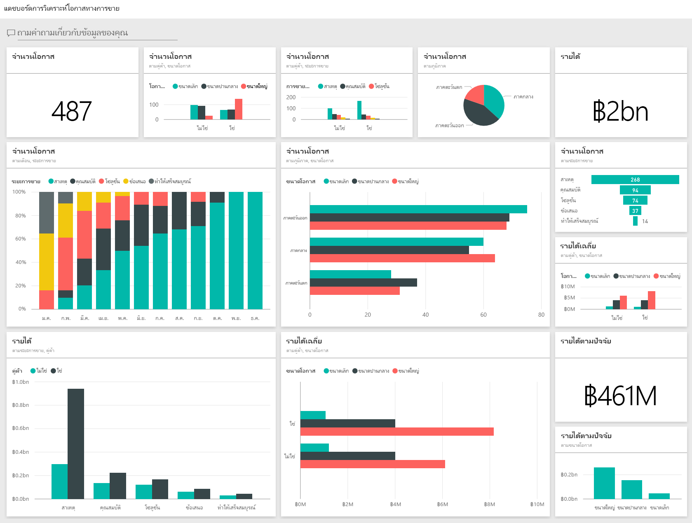

# ตัวอย่างการวิเคราะห์โอกาสทางการขายสำหรับ Power BI: ชมการแนะนำ

## ภาพรวมของตัวอย่างการวิเคราะห์โอกาสทางการขาย
**ตัวอย่างการวิเคราะห์โอกาสทางการขาย**ประกอบไปด้วยแดชบอร์ด (และรายงานที่เกี่ยวข้อง) สำหรับบริษัทซอฟต์แวร์ที่มีช่องทางขาย 2 ช่องทาง: *โดยตรง*และ*ผ่านคู่ค้า* ผู้จัดการฝ่ายขายสร้างแดชบอร์ดนี้เพื่อติดตามโอกาสและรายได้ตามภูมิภาค ขนาดโอกาส และช่องทาง

ผู้จัดการฝ่ายขายอาศัยตัววัดรายได้สองตัว:

* **รายได้** – นี่คือการประมาณของพนักงานขายว่า เขาคิดว่ายอดขายเป็นเท่าไร
* **รายได้ที่แยกแยะแล้ว** – นี่คำนวณจาก รายได้ X % ความน่าจะเป็น และเป็นที่ยอมรับโดยทั่วไปว่า ค่านี้เป็นค่าที่ใช้คาดการณ์ยอดขายจริงได้แม่นยำกว่า ความน่าเป็น กำหนดจาก ***ขั้นตอนการขาย***ปัจจุบันของข้อตกลง
  * ลูกค้าเป้าหมาย – 10%  
  * ตรวจสอบคุณสมบัติ – 20%  
  * โซลูชัน – 40%  
  * ข้อเสนอ – 60%  
  * เสร็จสิ้น – 80%

  

ตัวอย่างนี้เป็นส่วนหนึ่งของชุดตัวอย่าง ที่แสดงให้เห็นวิธีการที่คุณสามารถใช้ Power BI กับข้อมูล รายงาน และแดชบอร์ดที่เกี่ยวข้องกับธุรกิจ นี่เป็นข้อมูลจริงจาก obviEnce ([www.obvience.com)](http://www.obvience.com/) ที่ตัวตนต่าง ๆ ได้ถูกลบออกไป

## ข้อกำหนดเบื้องต้น

 ก่อนที่คุณสามารถใช้ตัวอย่าง คุณต้องดาวน์โหลดในรูปแบบ [ชุดเนื้อหา](https://docs.microsoft.com/en-us/power-bi/sample-opportunity-analysis#get-the-content-pack-for-this-sample), [ไฟล์.pbix](http://download.microsoft.com/download/9/1/5/915ABCFA-7125-4D85-A7BD-05645BD95BD8/Opportunity Analysis Sample PBIX.pbix) หรือ[เวิร์กบุ๊ก Excel](http://go.microsoft.com/fwlink/?LinkId=529782)

### รับชุดเนื้อหาสำหรับตัวอย่างนี้

1. เปิดบริการ Power BI (app.powerbi.com) และเข้าสู่ระบบ
2. ที่มุมด้านล่างซ้าย เลือก**รับข้อมูล**
   
    
3. บนหน้า รับข้อมูล ที่ปรากฏขึ้น เลือกไอคอน**ตัวอย่าง**
   
   
4. เลือก**ตัวอย่างการวิเคราะห์โอกาสทางการขาย** แล้วเลือก**เชื่อมต่อ**  
  
   
   
5. Power BI นำเข้าชุดเนื้อหา และเพิ่มแดชบอร์ด รายงาน และชุดข้อมูลใหม่ไปยังพื้นที่ทำงานปัจจุบันของคุณ เนื้อหาใหม่จะถูกทำเครื่องหมายด้วยเครื่องหมายดอกจันสีเหลือง 
   
   
  
### รับไฟล์ .pbix สำหรับตัวอย่างนี้

อีกทางเลือกหนึ่งคือ คุณสามารถดาวน์โหลดตัวอย่างเป็นไฟล์ .pbix ซึ่งถูกออกแบบมาสำหรับใช้กับ Power BI Desktop 

 * [ตัวอย่างการวิเคราะห์โอกาสทางการขาย](http://download.microsoft.com/download/9/1/5/915ABCFA-7125-4D85-A7BD-05645BD95BD8/Opportunity%20Analysis%20Sample%20PBIX.pbix)

### รับเวิร์กบุ๊ก Excel สำหรับตัวอย่างนี้
คุณยังสามารถ[ดาวน์โหลดเพียงชุดข้อมูล (เวิร์กบุ๊ก Excel)](http://go.microsoft.com/fwlink/?LinkId=529782) สำหรับตัวอย่างนี้ได้ เวิร์กบุ๊กประกอบด้วยแผ่นงาน Power View ที่คุณสามารถดู และปรับเปลี่ยน เมื่อต้องการดูข้อมูลดิบ เลือก **Power Pivot > จัดการ**

## แดชบอร์ดกำลังบอกอะไรแก่เรา
ผู้จัดการฝ่ายขายของเรา ได้สร้างแดชบอร์ดเพื่อติดตามเมตริกที่สำคัญที่สุดของเธอ เมื่อเธอเห็นสิ่งที่น่าสนใจ เธอสามารถเลือกไทล์เพื่อเจาะลึกลงในข้อมูล

1. รายได้ของบริษัทคือ 2 พันล้านเหรียญ และรายได้ที่แยกแยะแล้ว คือ 461 ล้านเหรียญ
2. จำนวนโอกาสทางการขายและรายได้ เป็นไปตามรูปแบบกรวยที่คุ้นเคย โดยค่าผลรวมมีค่าที่ทยอยลดลงเมื่อผ่านไปยังขั้นตอนถัด ๆ ไป
3. โอกาสทางการขายของเรา ส่วนใหญ่อยู่ในภูมิภาคตะวันออก
4. โอกาสที่มีขนาดใหญ่กว่า สร้างรายได้ให้มากกว่า โอกาสขนาดกลางหรือโอกาสขนาดเล็ก
5. ข้อตกลงซื้อขายของคู่ค้า สร้างรายได้ให้มากกว่า: เฉลี่ยแล้วที่ $8M เทียบกับ $6M สำหรับการขายโดยตรง

เนื่องจากความพยายามเพื่อให้ได้ข้อตกลงมีเท่ากัน ไม่ว่าข้อตกลงนั้นจะจัดเป็นขนาดใหญ่ กลาง หรือเล็ก บริษัทของเราควรเจาะลึกลงไปในข้อมูลเพื่อศึกษาเพิ่มเติมเกี่ยวกับโอกาสขนาดใหญ่

เลือกไทล์**จำนวนโอกาสทางการขาย ตามการขับเคลื่อนโดยคู่ค้าและขั้นตอนการขาย** เพื่อเปิดไปยังหน้า 1 ของรายงาน  

## สำรวจหน้าต่าง ๆ ในรายงาน
### หน้า 1 ของรายงานของเรามีชื่อว่า "ภาพรวมจำนวนโอกาสทางการขาย"

* ตะวันออก คือภูมิภาคที่ใหญ่ที่สุดของเราในแง่จำนวนโอกาสทางการขาย  
* บนแผนภูมิวงกลม เลือกทีละภูมิภาค เพื่อกรองหน้า สำหรับแต่ละภูมิภาค คู่ค้าจะพยายามคว้าหาโอกาสขนาดใหญ่มากกว่า   
* แผนภูมิคอลัมน์ จำนวนโอกาส ตามการขับเคลื่อนโดยคู่ค้าและขนาดของโอกาส แสดงให้เห็นอย่างชัดเจนว่า ส่วนใหญ่ของโอกาสขนาดใหญ่ถูกขับเคลื่อนโดยคู่ค้า และอีกมากของโอกาสขนาดเล็กและขนาดกลางไม่ได้ถูกขับเคลื่อนโดยคู่ค้า
* เลือกแต่ละขั้นตอนการขายในแผนภูมิแท่งในด้านล่างซ้าย เพื่อดูความแตกต่างของจำนวนตามภูมิภาค และสังเกตว่า ถึงแม้ภูมิภาคตะวันออกเป็นภูมิภาคที่ใหญ่ที่สุดของเราในแง่การนับจำนวน แต่จำนวนการขายที่อยู่ในขั้นโซลูชัน ข้อเสนอ และขั้นสุดท้าย ของทั้ง 3 ภูมิภาคมีจำนวนไล่ ๆ กัน ซึ่งหมายความว่า เราสามารถปิดการขายในภูมิภาคกลางและตะวันตก ด้วยเปอร์เซ็นต์ที่สูงกว่า

### หน้า 2 ของรายงานของเรามีชื่อว่า "ภาพรวมรายได้"
หน้านี้จะดูที่ข้อมูลคล้ายกัน แต่ใช้มุมมองของรายได้แทนที่จะเป็นการนับจำนวน  

* ภูมิภาคตะวันออก เป็นภูมิภาคที่ใหญ่ที่สุดของเรา ไม่เพียงแค่จำนวนโอกาสแต่ยังรวมถึงรายได้ด้วย  
* การกรอง ตามการขับเคลื่อนโดยคู่ค้า (เลือก**ใช่**ในคำอธิบายแผนภูมิด้านขวาบน) เปิดเผยรายได้ที่ $1.5B และ $294M เปรียบเทียบตัวเลขนี้กับ $644B และ $166M สำหรับรายได้ที่ไม่ได้ขับเคลื่อนโดยคู่ค้า  
* รายได้เฉลี่ยสำหรับบัญชีขนาดใหญ่มีขนาดมากกว่า (8M) ถ้าโอกาสทางการขายมาจากการขับเคลื่อนของคู่ค้า เทียบกับตัวเลข 6M สำหรับธุรกิจที่ไม่ได้มาจากการขับเคลื่อนของคู่ค้า  
* สำหรับธุรกิจที่ขับเคลื่อนโดยคู่ค้า รายได้เฉลี่ยต่อโอกาสทางการขายขนาดใหญ่ เกือบจะเป็นสองเท่าของโอกาสทางการขายขนาดกลาง (4M)  
* รายได้เฉลี่ยสำหรับธุรกิจขนาดเล็กและขนาดกลาง มีค่าใกล้เคียงกันทั้งที่ขับเคลื่อนโดยคู่ค้า และไม่ได้ขับเคลื่อนโดยคู่ค้า   

ชัดเจนแล้วว่า คู่ค้าของเราขายให้กับลูกค้าได้ดีกว่า  จึงสมเหตุสมผลที่จะส่งต่อข้อเสนอไปทางคู่ค้าให้มากขึ้น

### หน้า 3 ของรายงานเรามีชื่อว่า "จำนวนระดับภูมิภาค"
หน้านี้ดูข้อมูลที่คล้ายกัน แต่แยกตามภูมิภาคและขั้นตอน  

* กรองตามภูมิภาคตะวันออก (เลือก**ตะวันออก**ในแผนภูมิวงกลม) แสดงให้เห็นว่า โอกาสทางการขายในตะวันออกแบ่งระหว่าง ขับเคลื่อนและไม่ขับเคลื่อนผ่านคู่ค้า เกือบเท่ากัน
* โอกาสขนาดใหญ่ พบได้มากสุดในภูมิภาคส่วนกลาง โอกาสขนาดเล็กพบมากในภูมิภาคตะวันออก และโอกาสขนาดกลางพบมากสุดในภูมิภาคตะวันตก

### หน้า 4 ของรายงานเรามีชื่อว่า "โอกาสที่กำลังจะมาถึง"
อีกครั้งที่ เรากำลังดูปัจจัยที่คล้ายกัน แต่ครั้งนี้จากมุมมองของ วันที่/เวลา  

CFO ของเราใช้หน้านี้เพื่อจัดสรรปริมาณงาน โดยดูที่โอกาสของรายได้ ตามขั้นตอนการขายและเดือน เธอสามารถวางแผนอย่างเหมาะสม

* รายได้เฉลี่ยสำหรับขั้นตอนสุดท้าย มีค่าสูงสุด การปิดข้อเสนอเหล่านี้ คือสิ่งสำคัญที่สุด
* การกรองตามเดือน (โดยการเลือกชื่อเดือน ในตัวแบ่งส่วนข้อมูลด้านซ้าย) แสดงว่า เดือนมกราคมมีข้อเสนอขนาดใหญ่ในขั้นตอนสุดท้ายเป็นสัดส่วนที่สูง ด้วยรายได้ที่แยกแยะแล้วที่ $75M เดือนกุมภาพันธ์ ทางกลับกัน มีข้อเสนอปานกลางในขั้นตอนโซลูชันและข้อเสนอเป็นส่วนใหญ่
* โดยทั่วไป ตัวเลขรายได้ที่แยกแยะแล้ว ผันผวนตาม ขั้นตอนการขาย จำนวนโอกาส และขนาดของข้อเสนอ เพิ่มตัวกรอง (โดยใช้บานหน้าต่างตัวกรองบนด้านขวา) สำหรับปัจจัยเหล่านี้เพื่อค้นหาข้อมูลเชิงลึกเพิ่มเติม

นี่เป็นสภาพแวดล้อมที่ปลอดภัยที่จะทดลองสิ่งต่าง ๆ คุณสามารถเลือกที่จะไม่บันทึกการเปลี่ยนแปลงของคุณ ถ้าคุณบันทึก คุณสามารถ**รับข้อมูล**สำหรับสำเนาชุดใหม่ของตัวอย่างนี้ได้เสมอ

## ขั้นตอนถัดไป: เชื่อมต่อกับข้อมูลของคุณ
เราหวังว่าการแนะนำนี้ ได้แสดงให้เห็นว่าแดชบอร์ด, Q&A และรายงาน Power BI สามารถให้ข้อมูลเชิงลึกในข้อมูลการติดตามโอกาสในการขาย ตอนนี้ถึงตาคุณแล้ว — ลองเชื่อมต่อกับข้อมูลของคุณเอง ด้วย Power BI คุณสามารถเชื่อมต่อกับแหล่งข้อมูลที่หลากหลาย เรียนรู้เพิ่มเติมเกี่ยวกับ[เริ่มต้นใช้งาน Power BI](service-get-started.md)

[ดาวน์โหลดตัวอย่าง](sample-datasets.md)  
