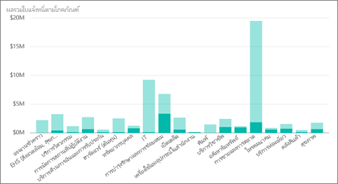
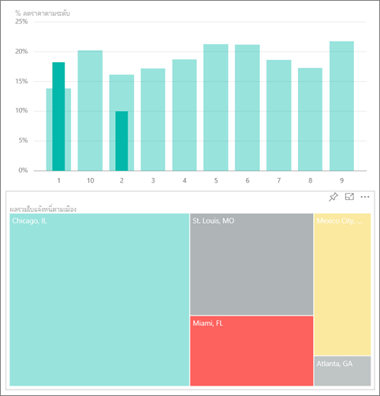
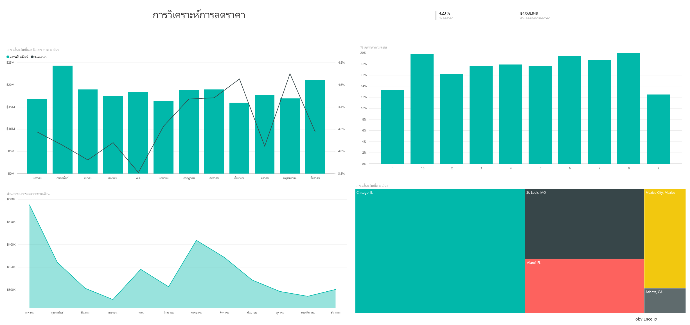
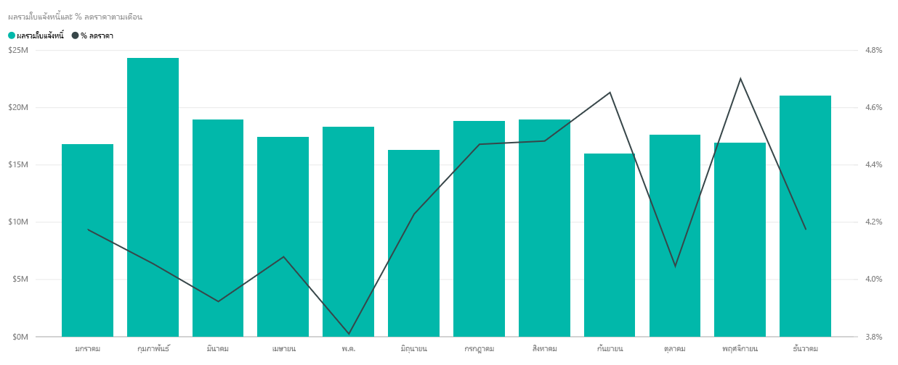
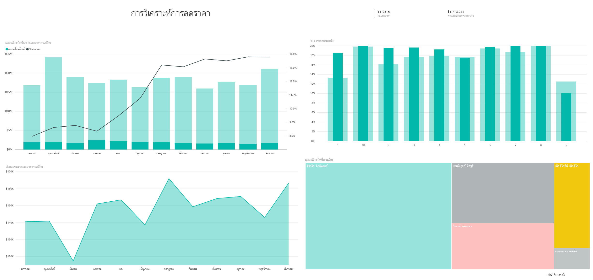

# ตัวอย่างการวิเคราะห์การจัดซื้อสำหรับ Power BI: ชมการแนะนำ

## ภาพรวมของตัวอย่างการวิเคราะห์การจัดซื้อ
ตัวอย่างแดชบอร์ดและรายงานพื้นฐาน ทางอุตสาหกรรมนี้ ใช้วิเคราะห์การใช้จ่ายของบริษัทผลิต ที่จ่ายให้กับผู้จัดจำหน่ายต่าง ๆ แยกตามประเภทและตำแหน่งที่ตั้ง ในตัวอย่าง เราสำรวจด้านต่าง ๆ เหล่านี้:

* ใครคือผู้จัดจำหน่ายที่ติดอันดับสูงสุด
* เรามีการใช้จ่ายประเภทใดมากที่สุด
* ผู้จัดจำหน่ายรายใดที่ให้ส่วนลดแก่เราสูงสุด และเมื่อใด

ตัวอย่างนี้เป็นส่วนหนึ่งของชุดตัวอย่าง ที่แสดงให้เห็นวิธีการที่คุณสามารถใช้ Power BI กับข้อมูล รายงาน และแดชบอร์ดที่เกี่ยวข้องกับธุรกิจ นี่เป็นข้อมูลจริงจาก obviEnce ([www.obvience.com)](http://www.obvience.com/) ที่ตัวตนต่าง ๆ ได้ถูกลบออกไป

## ข้อกำหนดเบื้องต้น

 ก่อนที่คุณสามารถใช้ตัวอย่าง คุณต้องดาวน์โหลดในรูปแบบ [ชุดเนื้อหา](https://docs.microsoft.com/en-us/power-bi/sample-procurement#get-the-content-pack-for-this-sample), [ไฟล์ .pbix](http://download.microsoft.com/download/D/5/3/D5390069-F723-413B-8D27-5888500516EB/Procurement Analysis Sample PBIX.pbix) หรือ[เวิร์กบุ๊ก Excel](http://go.microsoft.com/fwlink/?LinkId=529784)

### รับชุดเนื้อหาสำหรับตัวอย่างนี้

1. เปิดบริการ Power BI (app.powerbi.com) และเข้าสู่ระบบ
2. ตรงมุมด้านล่างซ้าย เลือก**รับข้อมูล**
   
    
3. บนหน้า รับข้อมูล ที่ปรากฏขึ้น เลือกไอคอน**ตัวอย่าง**
   
   
4. เลือก**ตัวอย่างการวิเคราะห์การจัดซื้อ** แล้วเลือก**เชื่อมต่อ**  
  
   
   
5. Power BI จะนำเข้าชุดเนื้อหานี้ และเพิ่มแดชบอร์ด รายงาน และชุดข้อมูลใหม่ ลงบนพื้นที่ทำงานปัจจุบันของคุณ เนื้อหาใหม่จะถูกทำเครื่องหมายด้วยเครื่องหมายดอกจันสีเหลือง 
   
   
  
### รับไฟล์ .pbix สำหรับตัวอย่างนี้

อีกทางเลือกหนึ่งคือ คุณสามารถดาวน์โหลดตัวอย่างเป็นไฟล์ .pbix ซึ่งถูกออกแบบมาสำหรับใช้กับ Power BI Desktop 

 * [ตัวอย่างการวิเคราะห์การจัดซื้อ](http://download.microsoft.com/download/D/5/3/D5390069-F723-413B-8D27-5888500516EB/Procurement%20Analysis%20Sample%20PBIX.pbix)

### รับเวิร์กบุ๊ก Excel สำหรับตัวอย่างนี้
คุณยังสามารถ[ดาวน์โหลดเพียงชุดข้อมูล (เวิร์กบุ๊ก Excel)](http://go.microsoft.com/fwlink/?LinkId=529784) สำหรับตัวอย่างนี้ได้ เวิร์กบุ๊กประกอบด้วยแผ่นงาน Power View ที่คุณสามารถดู และปรับเปลี่ยน เมื่อต้องการดูข้อมูลดิบ เลือก **Power Pivot > จัดการ**

## แนวโน้มค่าใช้จ่าย
ก่อนอื่น มาดูแนวโน้มค่าใช้จ่ายตามประเภทและตำแหน่งที่ตั้ง  

1. จากพื้นที่ทำงานของคุณ เปิดแท็บ**แดชบอร์ด** และเลือกแดชบอร์ดการวิเคราะห์การจัดซื้อ
2. เลือกไทล์แดชบอร์ด**ใบแจ้งหนี้รวม ตามประเทศ/ภูมิภาค** จะเปิดขึ้นไปยังหน้า "ภาพรวมการใช้จ่าย" ของรายงาน "ตัวอย่างการวิเคราะห์การจัดซื้อ"

    

โปรดสังเกตบางอย่างต่อไปนี้:

* ในแผนภูมิเส้น**ใบแจ้งหนี้รวมตามเดือนและประเภท**: ประเภท**โดยตรง**มีการใช้จ่ายที่ค่อนข้างเสมอต้นเสมอปลาย ประเภท**ลอจิสติกส์**มีค่าสูงสุดในเดือนธันวาคม และประเภท**อื่น ๆ** มีการดีดขึ้นในเดือนกุมภาพันธ์
* ในแผนที่**ใบแจ้งหนี้รวมตามประเทศ/ภูมิภาค**: ส่วนใหญ่ของค่าใช้จ่ายของเราอยู่ในสหรัฐอเมริกา
* ในแผนภูมิคอลัมน์**ใบแจ้งหนี้รวมตามประเภทย่อย**: **ฮาร์ดแวร์**และ**สินค้าทางอ้อมและบริการ** เป็นประเภทมีค่าใช้จ่ายสูงที่สุด
* ในแผนภูมิแท่ง ใบแจ้งหนี้รวมตามระดับ: ธุรกิจส่วนใหญ่ของเราทำกับผู้จัดจำหน่ายระดับ 1 (10 อันดับแรก) ความเข้าใจนี้ช่วยในการบริหารความสัมพันธ์กับผู้จัดจำหน่ายได้ดีขึ้น

## ค่าใช้จ่ายในเม็กซิโก
เรามาสำรวจค่าใช้จ่ายในเม็กซิโกกัน

1. ในแผนภูมิวงกลม เลือกฟอง**เม็กซิโก**ในแผนผัง โปรดสังเกตว่า ในแผนภูมิคอลัมน์ "ใบแจ้งหนี้รวมตามประเภทย่อย" ส่วนใหญ่จะอยู่ในประเภทย่อย**สินค้าทางอ้อมและบริการ**

   
2. การดูรายละเอียดลึกลงไปในคอลัมน์**สินค้าทางอ้อมและบริการ**:

   * เลือกลูกศรรายละเอียดแนวลึกในมุมขวาบนของแผนภูมิ
   * เลือกคอลัมน์**สินค้าทางอ้อมและบริการ**

      จากเท่าที่เห็น แผนกที่มีค่าใช้จ่ายประเภทนี้สูงสุดก็คือ แผนกขายและการตลาด
   * เลือก**เม็กซิโก**ในแผนที่อีกครั้ง

      แผนกที่มีค่าใช้จ่ายประเภทนี้สูงสุดในเม็กซิโกคือ แผนกบำรุงรักษาและซ่อมแซม

      
3. เลือกลูกศรขึ้นที่มุมบนซ้ายของแผนภูมิเพื่อกลับขึ้นไปข้างบน
4. เลือกลูกศรอีกครั้งเพื่อปิดการใช้รายละเอียดแนวลึก  
5. เลือก **Power BI** ในแถบนำทางด้านบนเพื่อกลับไปยังพื้นที่ทำงานของคุณ

## ประเมินเมืองต่าง ๆ
เราสามารถใช้การไฮไลต์ เพื่อประเมินค่าเมืองต่าง ๆ กัน

1. เลือกไทล์แดชบอร์ด**ใบแจ้งหนี้รวม %ส่วนลดตามเดือน** รายงานเปิดขึ้นไปยังหน้า "การวิเคราะห์ส่วนลด"
2. เลือกเมืองต่าง ๆ ในแผนที่ต้นไม้**ใบแจ้งหนี้รวมตามเมือง** เพื่อเปรียบเทียบกัน เกือบทั้งหมดของใบแจ้งหนี้ของเมือง ไมอามี มาจากผู้จัดจำหน่ายระดับ 1

   

## ส่วนลดผู้จัดจำหน่าย
เรามาสำรวจส่วนลดจากผู้จัดจำหน่าย และรอบระยะเวลาที่เราได้รับส่วนลดมากที่สุด

เราจะหาคำตอบสำหรับคำถามเหล่านี้:

* ส่วนลดแตกต่างกันโดยรายเดือน หรือส่วนลดเหมือนกันทุกเดือน
* มีเมืองบางที่ได้รับส่วนลดมากกว่าเมืองอื่น ๆ หรือไม่

### ส่วนลด ตามเดือน
ดูที่แผนภูมิผสม**ใบแจ้งหนี้รวมและ%ส่วนลดตามเดือน** เราเห็นว่าเดือน**กุมภาพันธ์**คือเดือนที่ยุ่งที่สุด และเดือน**กันยายน**เป็นเดือนยุ่งน้อยที่สุด ตอนนี้ มาดูที่เปอร์เซ็นต์ส่วนลดในช่วงเดือนเหล่านี้
โปรดสังเกตว่า เมื่อจำนวนใบแจ้งหนี้เพิ่มขึ้น ส่วนลดกลับลดลง และเมื่อจำนวนใบแจ้งหนี้อยู่ในระดับต่ำ ส่วนลดก็กลับเพิ่มขึ้น ยิ่งเราต้องการส่วนลด ข้อเสนอที่เราได้รับกลับยิ่งแย่ลง

### ส่วนลด ตามเมือง
อีกด้านหนึ่งที่จะสำรวจคือส่วนลด ตามเมือง เลือกแต่ละเมืองในแผนที่ต้นไม้ และดูว่าแผนภูมิอื่น ๆ มีการเปลี่ยนแปลงอย่างไร

* เมืองเซนต์หลุยส์ รัฐมิสซูรี มีการดีดขึ้นของจำนวนใบแจ้งหนี้ในเดือนกุมภาพันธ์ และการประหยัดจากส่วนลดได้ตกลงอย่างมากเดือนเมษายน
* เมืองเม็กซิโกซิตี ประเทศเม็กซิโก มี %ส่วนลดสูงสุด (11.05%) และเมืองแอตแลนต้า รัฐจอร์เจีย มีส่วนลดน้อยที่สุด (0.08%)

### แก้ไขรายงาน
เลือก**แก้ไขรายงาน**ในมุมบนซ้าย และสำรวจในมุมมองการแก้ไข

* ดูว่าหน้าสร้างขึ้นได้อย่างไร
* เพิ่มหน้าและแผนภูมิที่มาจากข้อมูลเดียวกัน
* เปลี่ยนชนิดของการแสดงภาพของแผนภูมิ เช่น เปลี่ยนแผนที่ต้นไม้ ไปเป็นแผนภูมิโดนัท
* ปักหมุดเหล่านั้นไปยังแดชบอร์ดของคุณ

นี่เป็นสภาพแวดล้อมที่ปลอดภัยที่จะทดลองสิ่งต่าง ๆ คุณสามารถเลือกที่จะไม่บันทึกการเปลี่ยนแปลงของคุณ ถ้าคุณบันทึก คุณสามารถ**รับข้อมูล**สำหรับสำเนาชุดใหม่ของตัวอย่างนี้ได้เสมอ

## ขั้นตอนถัดไป: เชื่อมต่อกับข้อมูลของคุณ
เราหวังว่าการแนะนำนี้ ได้แสดงให้เห็นว่าแดชบอร์ด, Q&A และรายงาน Power BI สามารถให้ข้อมูลเชิงลึกในข้อมูลการจัดซื้อ ตอนนี้ถึงตาคุณแล้ว &#151 — ลองเชื่อมต่อกับข้อมูลของคุณเอง ด้วย Power BI คุณสามารถเชื่อมต่อกับแหล่งข้อมูลที่หลากหลาย เรียนรู้เพิ่มเติมเกี่ยวกับ[เริ่มต้นใช้งาน Power BI](service-get-started.md)
