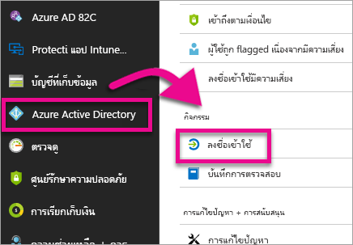
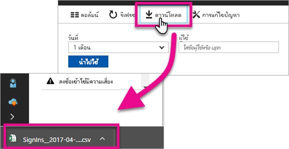

# ค้นหาผู้ใช้ Power BI ที่มีการลงชื่อเข้าใช้
ถ้าคุณเป็นผู้ดูแลผู้เช่า และต้องการดูบุคคลที่มีการลงชื่อเข้าใช้ Power BI คุณสามารถใช้รายงานการเข้าถึงและการใช้งานของ Azure Active Directory เพื่อให้สามารถมองเห็นได้

<iframe width="640" height="360" src="https://www.youtube.com/embed/1AVgh9w9VM8?showinfo=0" frameborder="0" allowfullscreen></iframe>

คุณสามารถเข้าถึงรายงานกิจกรรมภายในพอร์ทัล Azure Active Directory (Azure AD) [ใหม่](https://docs.microsoft.com/azure/active-directory/active-directory-reporting-activity-sign-ins)และ[คลาสสิก](https://docs.microsoft.com/azure/active-directory/active-directory-view-access-usage-reports)ได้ ในขณะที่วิดีโอด้านบนใช้พอร์ทัลแบบคลาสสิกเป็นตัวอย่าง บทความนี้จะเน้นพอร์ทัลใหม่

> [!NOTE]
> รายงานกิจกรรมนี้รวมผู้ใช้ทั้ง Power BI (ฟรี) และผู้ใช้ Pro แต่ไม่ระบุผู้ใช้เหล่านี้ตามสิทธิ์การใช้งานที่ผู้ใช้มี
> 
> 

## ข้อกำหนด
ต่อไปนี้คือข้อกำหนดในการดูรายงานกิจกรรมการลงชื่อเข้าใช้

* ผู้ใช้ในบทบาทผู้ดูแลระบบส่วนกลาง ผู้ ดูแลความปลอดภัย หรือผู้อ่านที่ปลอดภัยสามารถเข้าถึงการเข้าถึงข้อมูลได้
* ผู้ใช้ (ไม่ใช่ผู้ดูแลระบบ) สามารถเข้าถึงการลงชื่อเข้าใช้ของตนเองได้
* ผู้เช่าของคุณต้องมีสิทธิ์การใช้งานของ Azure AD Premium ที่เกี่ยวเนื่องเมื่อต้องการดูรายงานกิจกรรมการลงชื่อเข้าใช้ทั้งหมด

## ใช้พอร์ทัล Azure เพื่อดูการลงชื่อเข้าใช้
คุณสามารถใช้พอร์ทัล Azure AD เพื่อดูกิจกรรมการลงชื่อเข้าใช้

1. ไปยัง**พอร์ทัล Azure**และเลือก**Azure Active Directory**
2. ใต้**กิจกรรม** เลือก**การลงชื่อเข้าใช้**
   
    
3. กรองแอปพลิเคชันตาม**Microsoft Power BI**หรือ**Power BI Gateway**อย่างใดอย่างหนึ่ง แล้วเลือก**นำไปใช้**
   
    **Microsoft Power BI**สำหรับกิจกรรมการลงชื่อเข้าใช้ที่เกี่ยวข้องกับบริการ ขณะที่**Power BI Gateway**เฉพาะเจาะจงสำหรับการลงชื่อเข้าใช้ในเกตเวย์ข้อมูลในองค์กร
   
    

## ส่งออกข้อมูล
คุณมีสองตัวเลือกในการส่งออกข้อมูลการลงชื่อเข้าใช้ ซึ่งสามารถทำได้โดยการดาวน์โหลดไฟล์ csv หรือคุณสามารถใช้ PowerShell ได้

### ดาวน์โหลด CSV
ในหน้าจอกิจกรรม คุณสามารถเลือก**ดาวน์โหลด**ในแถบเครื่องมือได้ ซึ่งจะเริ่มดาวน์โหลดไฟล์ csv สำหรับข้อมูลที่ถูกกรองในขณะนี้

### PowerShell
คุณสามารถใช้ PowerShell เพื่อส่งออกข้อมูลการลงชื่อเข้าใช้ได้ มีหนึ่ง[ตัวอย่าง](https://docs.microsoft.com/azure/active-directory/active-directory-reporting-api-sign-in-activity-samples#powershell-script)ที่สามารถดูได้ภายในเอกสารประกอบของ Azure AD

> [!NOTE]
> เพื่อให้ตัวอย่างของ PowerShell ทำงานได้ โปรดตรวจสอบให้แน่ใจว่าได้ทำตาม[ข้อกำหนดเบื้องต้นในการเข้าถึง Azure AD ที่รายงาน API](https://docs.microsoft.com/azure/active-directory/active-directory-reporting-api-prerequisites)
> 
> 

## การเก็บรักษาข้อมูล
ข้อมูลที่เกี่ยวข้องกับการลงชื่อเข้าใช้สามารถใช้งานได้สูงสุด 30 วัน สำหรับข้อมูลเพิ่มเติม ดู[นโยบายการเก็บรักษาข้อมูลรายงานของ Azure Active Directory](https://docs.microsoft.com/azure/active-directory/active-directory-reporting-retention)

## ขั้นตอนถัดไป
[รายงานกิจกรรมการลงชื่อเข้าใช้ในพอร์ทัล Azure Active Directory (พอร์ทัลใหม่)](https://docs.microsoft.com/azure/active-directory/active-directory-reporting-activity-sign-ins)  
[ดูรายงานการเข้าถึงและการใช้งานของคุณ (พอร์ทัลแบบคลาสสิก)](https://docs.microsoft.com/azure/active-directory/active-directory-view-access-usage-reports#view-or-download-a-report)  
[สคริปต์ PowerShell สำหรับตัวอย่างการลงชื่อเข้าใช้](https://docs.microsoft.com/azure/active-directory/active-directory-reporting-api-sign-in-activity-samples#powershell-script)  
ดู[นโยบายการเก็บรักษาข้อมูลรายงานของ Azure Active Directory](https://docs.microsoft.com/azure/active-directory/active-directory-reporting-retention)  
[ใช้การตรวจสอบภายในองค์กรของคุณ](service-admin-auditing.md)  
[เปิดใช้งานเวอร์ชันทดลองใช้ Extended Pro ](service-extended-pro-trial.md)

มีคำถามเพิ่มเติมหรือไม่? [ลองถามชุมชน Power BI](https://community.powerbi.com/)

