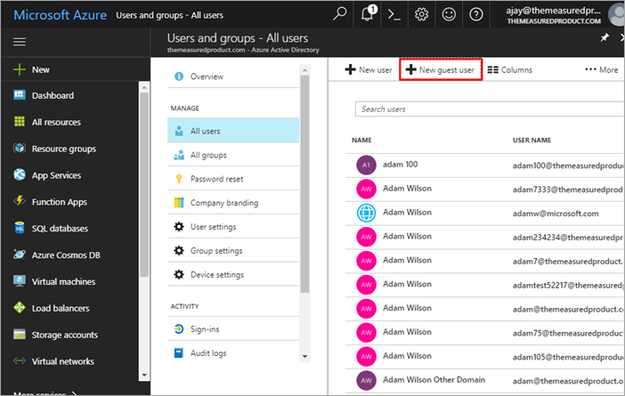
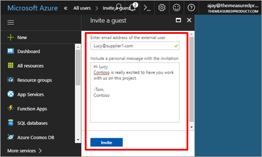
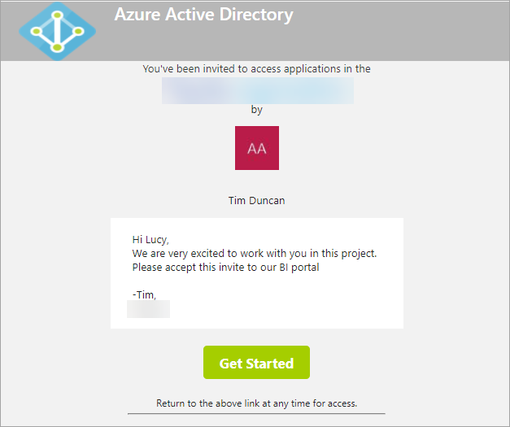
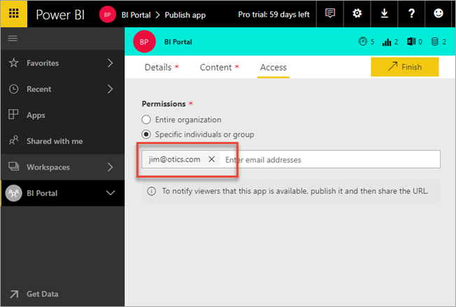
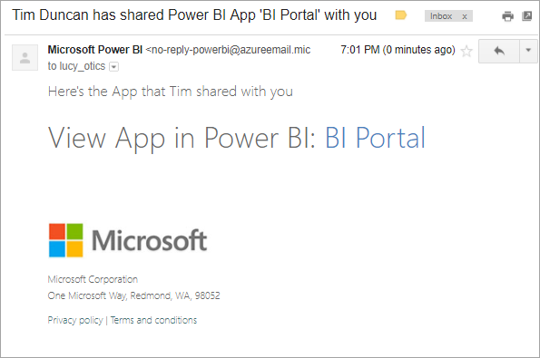

# กระจายเนื้อหา Power BI ไปยังผู้ใช้ที่เป็นผู้เยี่ยมชมจากภายนอกด้วย Azure AD B2B

Power BI รวมเข้ากับ Azure Active Directory เพื่อธุรกิจ (Azure AD B2B) เพื่ออนุญาตให้กระจายเนื้อหา Power BI ไปยังผู้ใช้เป็นผู้เยี่ยมชมภายนอกองค์กร ในขณะที่ยังคงรักษาการควบคุมข้อมูลภายใน

> [!VIDEO https://www.youtube.com/embed/xxQWEQ1NnlY]

> [!NOTE]
> คุณจำเป็นต้อง**เปิดใช้งาน**คุณลักษณะ[การตั้งค่าส่งออกและการแชร์](service-admin-portal.md#export-and-sharing-settings)การตั้งค่าผู้เช่าพอร์ทัลผู้ดูแลระบบ Power BI ก่อนที่เชิญผู้ใช้ที่เป็นผู้เยี่ยมชม

> [!NOTE]
> คุณลักษณะนี้ไม่พร้อมใช้งานด้วยแอปมือถือ Power BI คุณสามารถดูเนื้อหา Power BI ที่แชร์โดยใช้ Azure AD B2B ในเบราว์เซอร์บนอุปกรณ์เคลื่อนที่ 

## คุณสามารถเชิญใครได้บ้าง

คุณสามารถเชิญผู้ใช้ที่เป็นผู้เยี่ยมชมที่ใช้ที่อยู่อีเมลใดก็ได้รวมถึงบัญชีส่วนบุคคลเช่น gmail.com, outlook.com หรือ hotmail.com ใน Azure B2B สิ่งเหล่านี้จะถูกเรียกว่า "Social IDs" โปรดดูที่[Azure B2B](https://docs.microsoft.com/azure/active-directory/active-directory-b2b-what-is-azure-ad-b2b)สำหรับข้อมูลเพิ่มเติม

## เชิญผู้ใช้เป็นผู้เยี่ยมชม

สองวิธีในการเชิญผู้ใช้เป็นผู้เยี่ยมชมไปยังผู้เช่า Power BI ของคุณคือ คำเชิญเข้าร่วมแผนหรือคำเชิญเข้าร่วมกิจ การเชิญจำเป็นต้องมีการเชิญผู้ใช้ภายนอกไปยังองค์กรของคุณในครั้งแรกเท่านั้น

### คำเชิญเข้าร่วมแผน

คำเชิญเข้าร่วมแผนจะดำเนินการในพอร์ทัล Microsoft Azure ใน Azure AD หรือใช้ PowerShell นี่คือตัวเลือกในการใช้ถ้าคุณทราบว่าผู้ใช้รายใดที่ต้องได้รับเชิญ 

**การสร้างผู้ใช้ที่เป็นผู้เยี่ยมชมในพอร์ทัล Azure AD คุณจะต้องเป็นผู้ดูแลระบบผู้เช่า**

1. ไปยัง[พอร์ทัล Azure](https://portal.azure.com)และเลือก**Azure Active Directory**

2. ไปยัง**ผู้ใช้และกลุ่ม** > **ผู้ใช้ทั้งหมด** > **ผู้ใช้ที่เป็นผู้เยี่ยมชมใหม่**

    

3. ใส่**ที่อยู่อีเมล**และ**ข้อความส่วนบุคคล**

    

4. เลือก**เชิญ**

หากต้องหารเชิญผู้ใช้ที่เป็นผู้เยี่ยมชมมากกว่าหนึ่งรายการให้ใช้ PowerShell ดู[โค้ดร่วมกันของ Azure Active Directory B2B และตัวอย่างของ PowerShell](https://docs.microsoft.com/azure/active-directory/b2b/code-samples)สำหรับข้อมูลเพิ่มเติม

ผู้ใช้เป็นผู้เยี่ยมชมจะต้องเลือก**เริ่มต้นใช้งาน**ในคำเชิญอีเมลที่พวกเขาได้รับ จากนั้นจะมีการเพิ่มผู้ใช้ที่เป็นผู้เยี่ยมชมไปยังผู้เช่า

### คำเชิญเข้าร่วมกิจ

หากต้องการดำเนินการคำเชิญตลอดเวลาให้เพิ่มผู้ใช้ภายนอกไปยังแดชบอร์ดหรือรายงานของคุณผ่านแชร์ UI หรือแอปของคุณผ่านทางหน้าการเข้าถึง

นี่คือตัวอย่างของสิ่งที่ต้องทำเมื่อเชิญผู้ใช้ภายนอกเข้ามาใช้แอป

ผู้ใช้ที่เป็นผู้เยี่ยมชมจะได้รับอีเมลที่ระบุว่าได้มีการแชร์แอปกับพวกเขาแล้ว

ผู้ใช้ที่เป็นผู้เยี่ยมชมต้องลงชื่อเข้าใช้ด้วยที่อยู่อีเมลขององค์กรของพวกเขา พวกเขาจะได้รับพร้อมท์ให้ยอมรับคำเชิญหลังจากลงชื่อเข้าใช้ หลังจากลงชื่อเข้าใช้ จะมีการเปลี่ยนเส้นทางผู้ใช้ที่เป็นผู้เยี่ยมชมไปยังเนื้อหาแอป เพื่อกลับไปยังแอป บุ๊กมาร์กลิงก์ หรือบันทึกอีเมล

## สิทธิ์การใช้งาน

ผู้ใช้ที่เป็นผู้เยี่ยมชมจำเป็นต้องมีสิทธิ์การใช้งานที่ถูกต้องในการดูแอปที่ใช้ร่วมกัน คุณมีสามตัวเลือกเพื่อดำเนินการ

### ใช้ Power BI Premium

การกำหนดพื้นที่ทำงานแอปให้กับความสามารถของ Power BI Premium จะอนุญาตให้ผู้ใช้ที่เป็นผู้เยี่ยมชมสามารถเข้าใช้แอปโดยไม่จำเป็นต้องมีสิทธิ์การใช้งาน Power BI Pro Power BI Premium ยังอนุญาตให้แอปใช้ประโยชน์จากความสามารถอื่น ๆ เช่นอัตราการรีเฟรชเพิ่ม กำลังการผลิตเฉพาะ และขนาดของแบบจำลองขนาดใหญ่

### กำหนดสิทธิ์การใช้งาน Power BI Pro ให้ผู้ใช้ที่เป็นผู้เยี่ยมชม

การกำหนดสิทธิ์การใช้งาน Power BI Pro ให้กับผู้ใช้ที่เป็นผู้เยี่ยมชม อนุญาตให้ผู้ใช้ที่เป็นผู้เยี่ยมชมสามารถดูเนื้อหาภายในผู้เช่าของคุณ

> [!NOTE]
> สิทธิ์การใช้งาน Power BI Pro จากผู้เช่าของคุณจะนำไปใช้กับผู้ใช้ที่เป็นผู้เยี่ยมชมเมื่อพวกเขาเข้าถึงเนื้อหาภายในผู้เช่าของคุณเท่านั้น

### ผู้ใช้ที่เป็นผู้เยี่ยมชมนำสิทธิ์การใช้งาน Power BI Pro ของพวกเขามาใช้

ผู้ใช้ที่เป็นผู้เยี่ยมชมมีสิทธิ์การใช้งาน Power BI Pro ที่มอบหมายภายในผู้เช่าของพวกเขาอยู่แล้ว

## ข้อควรพิจารณาและข้อจำกัด

* เมื่อคุณเชิญผู้ใช้ที่เป็นผู้เยี่ยมชมที่กำลังใช้บัญชีผู้ใช้อีเมลส่วนบุคคลเช่น gmail.com, outlook.com หรือ hotmail.com คุณสามารถทำตาม[วิดีโอที่ฝังไว้](https://docs.microsoft.com/azure/active-directory/active-directory-b2b-redemption-experience)เพื่อดูตัวอย่างของวิธีลงทะเบียนของผู้ใช้
* ผู้เยี่ยมชม B2B ภายนอกจะมีการจำกัดปริมาณการใช้เนื้อหา ผู้เยี่ยมชม B2B ภายนอกสามารถดูแอป แดชบอร์ด รายงาน ข้อมูลการส่งออก และสร้างการสมัครใช้งานอีเมลสำหรับแดชบอร์ดและรายงานได้ แต่ไม่สามารถเข้าถึงพื้นที่ทำงาน หรือเผยแพร่เนื้อหาของพวกเขา
* คุณลักษณะนี้ไม่พร้อมใช้งานด้วยแอปมือถือ Power BI คุณสามารถดูเนื้อหา Power BI ที่แชร์โดยใช้ Azure AD B2B ในเบราว์เซอร์บนอุปกรณ์เคลื่อนที่
* คุณลักษณะนี้ยังไม่มีให้ใช้กับ web part รายงาน Power BI SharePoint Online

## ขั้นตอนถัดไป

โปรดดูที่[เอกสารทางเทคนิค](https://aka.ms/powerbi-b2b-whitepaper)เพื่อศึกษาข้อมูลรายละเอียดเพิ่มเติม รวมถึงวิธีการทำงานของการรความปลอดภัยระดับแถว

โปรดดูที่[การทำงานร่วมกันของ Azure AD B2B คืออะไร](https://docs.microsoft.com/azure/active-directory/active-directory-b2b-what-is-azure-ad-b2b)เพื่อศึกษาข้อมูลเกี่ยวกับ Azure Active Directory B2B
