# พอร์ทัลผู้ดูแลระบบของ power BI

พอร์ทัลผู้ดูแลอนุญาตให้มีการบริหารจัดการผู้เช่าของ Power BI ในองค์กรของคุณ ซึ่งประกอบด้วยหน่วยข้อมูลต่างๆ เช่น เมตริกการใช้งาน การเข้าถึงศูนย์ผู้ดูแลระบบของ Office 365 และการตั้งค่า

การบริหารจัดการผู้เช่าของ Power BI สำหรับบริษัทของคุณจะดำเนินการผ่านทางพอร์ทัลผู้ดูแลระบบของ Power BI พอร์ทัลผู้ดูแลระบบจะสามารถเข้าถึงผู้ใช้ทั้งหมดที่เป็นผู้ดูแลระบบส่วนกลางใน Office 365 หรือผู้ใช้ที่ได้รับการกำหนดบทบาทให้เป็นผู้ดูแลระบบบริการ Power BI โปรดดูที่[การทำความเข้าใจเกี่ยวกับบทบาทผู้ดูแลระบบ Power BI](service-admin-role.md)เพื่อศึกษาข้อมูลเพิ่มเติมเกี่ยวกับบทบาทผู้ดูแลระบบบริการ Power BI

ผู้ใช้ทั้งหมดสามารถดู**พอร์ทัลผู้ดูแลระบบ**ภายใต้ไอคอนรูปเฟืองได้ ถ้าพวกเขาจะไม่ใช่ผู้ดูแลระบบ พวกเขาสามารถเห็นเฉพาะส่วน**ตั้งค่า Premium** และพวกเขาสามารถเห็นเฉพาะความจุที่พวกเขามีสิทธิ์จัดการได้

## วิธีการเข้าถึงพอร์ทัลผู้ดูแลระบบ

บัญชีของคุณจำเป็นต้องได้รับการทำเครื่องหมายให้เป็น**ผู้ดูแลระบบส่วนกลาง**ภายใน Office 365 หรือ Azure Active Directory หรือต้องได้รับการกำหนดบทบาทผู้ดูแลระบบบริการ Power BI เพื่อเข้าถึงพอร์ทัลผู้ดูแลระบบ Power BI โปรดดูที่[การทำความเข้าใจเกี่ยวกับบทบาทผู้ดูแลระบบ Power BI](service-admin-role.md)เพื่อศึกษาข้อมูลเพิ่มเติมเกี่ยวกับบทบาทผู้ดูแลระบบบริการ Power BI เมื่อต้องการเข้าถึงพอร์ทัลผู้ดูแลระบบ Power BI โปรดทำตามขั้นตอนต่อไปนี้

1. เลือกรูปเฟืองการตั้งค่าที่อยู่ด้านบนขวาของบริการ Power BI
2. เลือก**พอร์ทัลผู้ดูแลระบบ**

ภายในพอร์ทัลจะมีทั้งหมดหกแท็บ ตามที่อธิบายไว้ด้านล่าง

* [เมตริกการใช้งาน](#usage-metrics)
* [ผู้ใช้](#users)
* [บันทึกการตรวจสอบ](#audit-logs)
* [การตั้งค่าผู้เช่า](#tenant-settings)
* [การตั้งค่า Premium](#premium-settings)
* [โค้ดฝังตัว](#embed-codes)
* [วิชวลขององค์กร](#Organization-visuals)

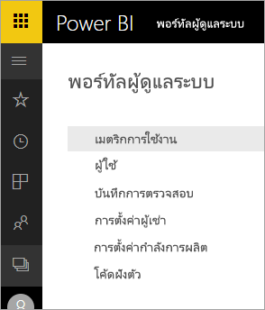

## เมตริกการใช้งาน
แท็บแรกในพอร์ทัลผู้ดูแลระบบคือ**เมตริกการใช้งาน** รายงานเมตริกการใช้จะช่วยให้คุณสามารถตรวจสอบการใช้งานภายใน Power BI สำหรับองค์กรของคุณได้ และยังสามารถดไดู้ว่าผู้ใช้ และกลุ่มใดที่ใช้งานอยู่มากที่สุดใน Power BI สำหรับองค์กรของคุณ

> [!NOTE]
> ในครั้งแรกที่คุณเข้าถึงแดชบอร์ด หรือหลังจากที่คุณเข้าไปที่แดชบอร์ดอีกครั้งหลังจากที่ไม่ได้เข้าไปดูแดชบอรืดเป็นเวลานาน คุณอาจจะเห็นหน้าจอการโหลดขณะที่เราโหลดแดชบอร์ด

เมื่อโหลดแดชบอร์ด คุณสามารถดูสองส่วนของไทล์ ในส่วนแรกประกอบด้วยข้อมูลการใช้งานสำหรับผู้ใช้รายบุคคล และส่วนที่สองจะมีข้อมูลที่คล้ายกันสำหรับกลุ่มในองค์กรของคุณ

นี่คือข้อมูลสรุปของสิ่งที่คุณสามารถดูได้ในแต่ละไทล์:

* นับจำนวนที่แตกต่างกันของแดชบอร์ด รายงาน และชุดข้อมูลทั้งหมดในพื้นที่ทำงานของผู้ใช้
  
    

* แดชบอร์ดที่มีการใช้งานมากที่สุดตามจำนวนผู้ใช้ที่สามารถเข้าถึงได้ ตัวอย่างเช่น ถ้าคุณมีแดชบอร์ดที่คุณแชร์กับผู้ใช้ 3 ราย และคุณยังเพิ่มแดชบอร์ดลงในชุดเนื้อหาที่มีผู้ใช้ที่แตกต่างกันสองรายเชื่อมต่ออยู่ด้วย การนับจะเป็น 6 (1 + 3 + 2)
  
    

* เนื้อหาที่ได้รับความนิยมมากที่สุดที่ผู้ใช้ที่เชื่อมต่อด้วย ซึ่งอาจจะเป็นสิ่งที่ผู้ใช้สามารถเข้าถึงได้ผ่านกระบวนการรับข้อมูล เช่นเดียวกับชุดเนื้อหา SaaS ชุดเนื้อหาขององค์กร ไฟล์ หรือฐานข้อมูล
  
    

* มุมมองของผู้ใช้ระดับสูงของคุณที่ยึดจำนวนตามแดชบอร์ดกี่พวกเขามี ทั้งแดชบอร์ดที่พวกเขาสร้างขึ้นด้วยตนเอง และแดชบอร์ดที่แชร์ให้กับพวกเขา
  
    

* มุมมองของผู้ใช้ระดับสูงของคุณที่ยึดตามจำนวนรายงานที่พวกเขามี
  
    

ส่วนที่สองแสดงชนิดเดียวกันของข้อมูล แต่จะยึดตามกลุ่ม ซึ่งช่วยให้คุณเห็นกลุ่มใดในองค์กรของคุณมีการใช้งานมากที่สุดและข้อมูลชนิดใดที่พวกเขาใช้

จากข้อมูลนี้คุณจะสามารถเข้าถึงข้อมูลเชิงลึกแท้จริงเกี่ยวกับวิธีที่บุคคลใช้ Power BI ทั่วทั้งองค์กรของคุณ และสามารถจดจำผู้ใช้ และกลุ่มที่มีการใช้งานมากในองค์กรของคุณได้

## ผู้ใช้

แท็บที่สองในพอร์ทัลผู้ดูแลระบบคือ**จัดการผู้ใช้** การจัดการผู้ใช้สำหรับ Power BI เสร็จสิ้นแล้วในศูนย์การจัดการ Office 365 ดังนั้นส่วนนี้จะอนุญาตให้คุณเข้าถึงพื้นที่เพื่อจัดการผู้ใช้ ผู้ดูแลระบบ และกลุ่มภายใน Office 365 ได้อย่างรวดเร็ว

เมื่อคุณคลิก**ไปที่ศูนย์ผู้ดูแลระบบ O365**ระบบจะนำคุณไปที่หน้าเริ่มต้นของศูนย์ผู้ดูแลระบบ Office 365 โดยตรงเพื่อจัดการผู้ใช้ของผู้เช่าของคุณ

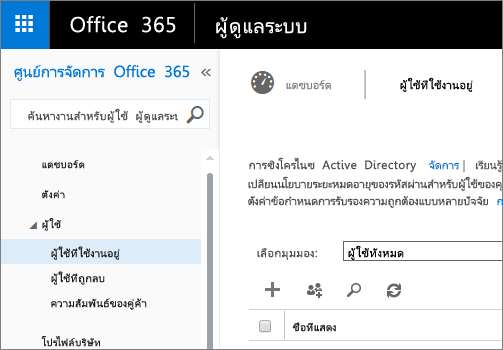

## บันทึกการตรวจสอบ

แท็บที่สามในพอร์ทัลผู้ดูแลระบบคือ**บันทึกการตรวจสอบ** บันทึกการตรวจสอบอยู่ในศูนย์การรักษาความปลอดภัยและการปฏิบัติตาม Office 365 ซึ่งส่วนนี้จะช่วยให้คุณเข้าถึงพื้นที่ดังกล่าวใน Office 365 ได้อย่างรวดเร็ว

โปรดดูที่[การตรวจสอบ Power BI ในองค์กรของคุณ](service-admin-auditing.md)เพื่อศึกษาข้อมูลเพิ่มเติมเกี่ยวกับบันทึกการตรวจสอบ

## การตั้งค่าผู้เช่า

แท็บที่สามในพอร์ทัลผู้ดูแลระบบคือ**การตั้งค่าผู้เช่า** การตั้งค่าผู้เช่าช่วยให้คุณสามารถควบคุมคุณลักษณะที่ทำให้พร้อมใช้งานสำหรับองค์กรของคุณได้มากขึ้น ถ้าคุณมีข้อกังวลเกี่ยวกับข้อมูลที่ละเอียดอ่อน คุณลักษณะบางรายการของเราอาจไม่เหมาะสำหรับองค์กรของคุณ หรือคุณอาจต้องการให้คุณลักษณะที่ระบุพร้อมใช้งานสำหรับเฉพาะกลุ่มเท่านั้น ถ้าเป็นกรณีนี้ คุณสามารถปิดการใช้งานในผู้เช่าของคุณได้

> [!NOTE]
> อาจใช้เวลานานถึง 10 นาทีเพื่อให้การตั้งค่ามีผลบังคับใช้สำหรับทุกคนในผู้เช่าของคุณ

การตั้งค่าสามารถมีได้สามสถานะ:

* **ปิดใช้งานสำหรับทั้งองค์กร**: คุณสามารถปิดใช้งานฟีเจอร์หนึ่งซึ่งจะทำให้ผู้ใช้ไม่สามารถใช้ฟีเจอร์นั้นได้

    

* **เปิดใช้งานสำหรับทั้งองค์กร**: คุณสามารถเปิดใช้งานฟีเจอร์สำหรับทั้งองค์กรซึ่งจะช่วยให้ผู้ใช้ทั้งหมดที่มีสิทธิ์เข้าถึงฟีเจอร์นั้นได้

    

* **เปิดใช้งานให้กับส่วนหนึ่งขององค์กร**: คุณยังสามารถเปิดใช้งานฟีเจอร์หนึ่งสำหรับบางส่วนขององค์กรของคุณได้ ซึ่งสามารถเกิดขึ้นได้ในสองสามวิธีที่แตกต่างกัน คุณสามารถเปิดใช้งานคุณลักษณะสำหรับทั้งองค์กรของคุณ ยกเว้นสำหรับกลุ่มเฉพาะของผู้ใช้

    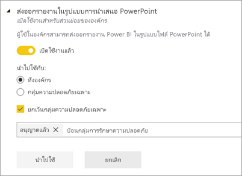

    คุณยังสามารถเปิดใช้งานคุณลักษณะดังกล่าวสำหรับกลุ่มเฉพาะของผู้ใช้ และนอกจากนี้ยังสามารถปิดใช้งานคุณลักษณะสำหรับกลุ่มของผู้ใช้ได้ด้วย สิ่งนี้จะทำให้สามารถมั่นใจได้ว่า ผู้ใช้บางรายไม่มีสิทธิ์การเข้าถึงคุณลักษณะดังกล่าว แม้ว่าจะอยู่ในกลุ่มที่ได้รับอนุญาต

    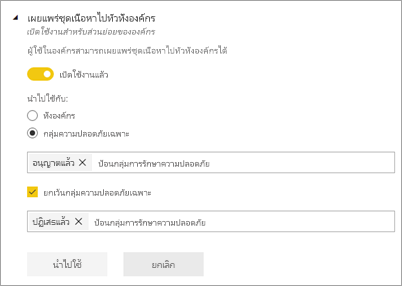

สองสามหัวข้อถัดไปให้ภาพรวมเรื่องชนิดต่าง ๆ ของการตั้งค่าผู้เช่า

## ตั้งค่าพื้นที่ทำงาน

### สร้างพื้นที่ทำงาน (ตัวอย่าง)
ผู้ใช้ในองค์กรสามารถสร้างพื้นที่ทำงานแอปเพื่อทำงานร่วมกันบนแดชบอร์ด รายงาน และเนื้อหาอื่น ๆ

สำหรับข้อมูลเพิ่มเติม ดู[สร้างพื้นที่ทำงานใหม่](service-create-the-new-workspaces.md)

## การตั้งค่าการส่งออกและการแชร์

### แชร์เนื้อหาไปยังผู้ใช้ภายนอก

ผู้ใช้ในองค์กรสามารถแชร์แดชบอร์ดกับผู้ใช้ภายนอกองค์กรได้

นี่คือข้อความที่ปรากฏขึ้นเมื่อคุณแชร์กับผู้ใช้ภายนอก

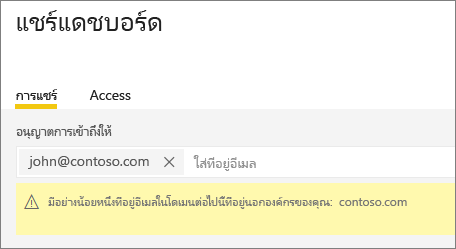

### เผยแพร่ไปยังเว็บ

ผู้ใช้ในองค์กรสามารถเผยแพร่รายงานไปยังเว็บได้ [เรียนรู้เพิ่มเติม](service-publish-to-web.md)

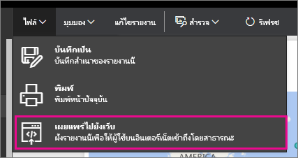

ผู้ใช้สามารถดูตัวเลือกต่าง ๆ ใน UI โดยยึดตามสิ่งที่ถูกเผยแพร่ไปยังการตั้งค่าเว็บ

|ฟีเจอร์ |เปิดใช้งานทั้งองค์กร |เปิดใช้งานสำหรับทั้งองค์กร |กลุ่มความปลอดภัยเฉพาะ   |
|---------|---------|---------|---------|
|**เผยแพร่ไปยังเว็บ**ภายใต้เมนู**ไฟล์**ของรายงาน|เปิดใช้งานสำหรับทั้งหมด|ไม่สามารถมองเห็นได้สำหรับทั้งหมด|มองเห็นได้เฉพาะผู้ใช้หรือกลุ่มที่ได้รับอนุญาตเท่านั้น|
|**จัดการโค้ดฝังตัว**ภายใต้**การตั้งค่า**|เปิดใช้งานสำหรับทั้งหมด|เปิดใช้งานสำหรับทั้งหมด|เปิดใช้งานสำหรับทั้งหมด  * **ลบ**ตัวเลือกสำหรับผู้ใช้หรือกลุ่มที่ได้รับอนุญาตเท่านั้น * **รับรหัส**เปิดใช้งานสำหรับทั้งหมด|
|**โค้ดฝังตัว**ในพอร์ทัลของผู้ดูแลระบบ|สถานะแสดงหนึ่งในต่อไปนี้: * ใช้งานอยู่ * ไม่ได้รับการสนับสนุน * ถูกบล็อก|สถานะแสดง**ถูกปิดใช้งาน**|สถานะแสดงหนึ่งในต่อไปนี้: * ใช้งานอยู่ * ไม่ได้รับการสนับสนุน * ถูกบล็อก  ถ้าผู้ใช้ไม่ได้รับอนุญาตโดยยึดตามการตั้งค่าผู้เช่า สถานะจะแสดงเป็น**ถูกละเมิด**|
|รายงานที่เผยแพร่แล้วที่มีอยู่|เปิดใช้งานทั้งหมด|ปิดใช้งานทั้งหมด|รายงานยังคงแสดงสำหรับทั้งหมด|

### ส่งออกข้อมูล

ผู้ใช้ในองค์กรสามารถส่งออกข้อมูลจากไทล์หรือการแสดงวิชวล [เรียนรู้เพิ่มเติม](power-bi-visualization-export-data.md)

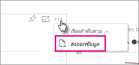

> [!NOTE]
> ปิดใช้งาน**ส่งออกข้อมูล**ยัง ช่วยป้องกันผู้ใช้จากการใช้ฟีเจอร์การ**วิเคราะห์ใน Excel**ตลอดจนการใช้เชื่อมต่อสดของบริการ Power BI ฃ

### ส่งออกรายงานในรูปแบบการนำเสนอ PowerPoint

ผู้ใช้ในองค์กรสามารถส่งออกรายงาน Power BI ในรูปแบบไฟล์ PowerPoint ได้ [เรียนรู้เพิ่มเติม](service-publish-to-powerpoint.md)

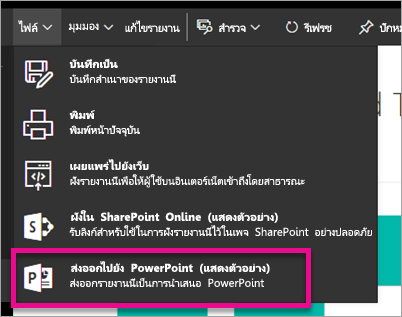

### พิมพ์แดชบอร์ดและรายงาน

ผู้ใช้ในองค์กรสามารถพิมพ์แดชบอร์ดและรายงานได้ [เรียนรู้เพิ่มเติม](service-print.md)

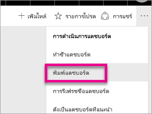

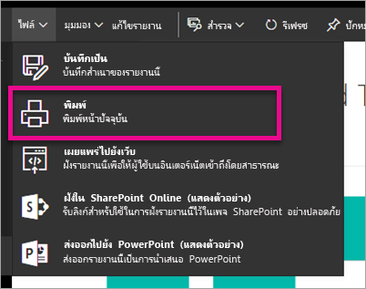

## การตั้งค่าชุดเนื้อหา

### เผยแพร่ชุดเนื้อหาไปทั่วทั้งองค์กร

ผู้ใช้ในองค์กรสามารถเผยแพร่ชุดเนื้อหาไปทั่วทั้งองค์กรได้

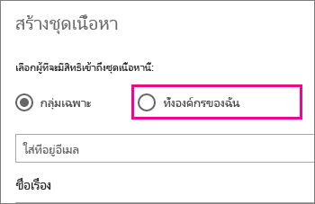

### สร้างชุดเนื้อหาระดับองค์กรเทมเพลต

ผู้ใช้ในองค์กรสามารถสร้างชุดเนื้อหาเทมเพลตที่ใช้ชุดข้อมูลซึ่งสร้างขึ้นด้วยแหล่งข้อมูลหนึ่งแหล่งใน Power BI Desktop ได้

### ส่งแอปให้กับผู้ใช้ปลายทาง

ผู้ดูแลระบบผู้เช่าของคุณสามารถส่งแอปให้กับ**การตั้งค่าผู้เช่า**ได้

   

คุณสามารถเปลี่ยนการตั้งค่าเป็น**เปิดใช้งาน**ได้ จากนั้นระบุผู้ที่จะได้รับความสามารถนี้ (ทั้งองค์กรหรือกลุ่มความปลอดภัยเฉพาะ)

> [!NOTE]
> โปรดอย่าลืมว่าการเปลี่ยนแปลงการตั้งค่าผู้เช่าจะใช้เวลาสักครู่ในการดำเนินการ

ไปที่นี่เพื่อเรียนรู้เพิ่มเติมเกี่ยวกับ[แอปส่งข้อมูล](service-create-distribute-apps.md#how-to-install-an-app-automatically-for-end-users)

## การตั้งค่าการรวม

### ถามคำถามเกี่ยวกับข้อมูลโดยใช้ Cortana

ผู้ใช้ในองค์กรสามารถถามคำถามเกี่ยวกับข้อมูลของตนเองได้โดยใช้ Cortana

> [!NOTE]
> การตั้งค่านี้จะนำไปใช้กับทั้งองค์กร และไม่สามารถจำกัดให้กับเฉพาะกลุ่มได้

### ใช้การวิเคราะห์ใน Excel กับชุดข้อมูลภายในองค์กร

ผู้ใช้ในองค์กรสามารถใช้ Excel เพื่อดู และโต้ตอบกับชุดข้อมูล Power BI ภายในองค์กร [เรียนรู้เพิ่มเติม](service-analyze-in-excel.md)

> [!NOTE]
> ปิดใช้งาน**ส่งออกข้อมูล**ยัง ช่วยป้องกันผู้ใช้จากการใช้งานฟีเจอร์**วิเคราะห์ใน Excel**

### ใช้ ArcGIS Maps for Power BI

ผู้ใช้ในองค์กรสามารถใช้การแสดงภาพ ArcGIS Maps for Power BI ที่ให้บริการโดย Esri ได้ [เรียนรู้เพิ่มเติม](power-bi-visualization-arcgis.md)

### ใช้การค้นหาทั้งหมดสำหรับ Power BI (ตัวอย่าง)

ผู้ใช้ในองค์กรสามารถใช้คุณลักษณะการค้นหาภายนอกที่อาศัยการค้นหา Azure ตัวอย่างเช่น ผู้ใช้สามารถใช้ Cortana เพื่อเรียกข้อมูลสำคัญได้โดยตรงจากแดชบอร์ดและรายงาน Power BI [เรียนรู้เพิ่มเติม](service-cortana-intro.md)

## การตั้งค่าวิชวลแบบกำหนดเอง

### เปิดใช้งานวิชวลแบบกำหนดเองสำหรับทั้งองค์กร

ผู้ใช้ในองค์กรสามารถโต้ตอบ และแชร์วิชวลแบบกำหนดเองได้ [เรียนรู้เพิ่มเติม](power-bi-custom-visuals.md)

> [!NOTE]
> การตั้งค่านี้จะนำไปใช้กับทั้งองค์กร และไม่สามารถจำกัดให้กับเฉพาะกลุ่มได้

## การตั้งค่าวิชวล R

### โต้ตอบและแชร์การแสดงผลด้วยภาพ R

ผู้ใช้ในองค์กรสามารถโต้ตอบ และแชร์วิชวลที่สร้างขึ้นด้วย R สคริปต์ได้ [เรียนรู้เพิ่มเติม](service-r-visuals.md)

> [!NOTE]
> การตั้งค่านี้จะนำไปใช้กับทั้งองค์กร และไม่สามารถจำกัดให้กับเฉพาะกลุ่มได้

## การตั้งค่าการตรวจสอบและการใช้งาน

### สร้างบันทึกการตรวจสอบสำหรับการตรวจสอบกิจกรรมภายในและการปฏิบัติตามกฎระเบียบ

ผู้ใช้ในองค์กรสามารถใช้การตรวจสอบเพื่อตรวจสอบการดำเนินการใน Power BI โดยผู้ใช้อื่นในองค์กร [เรียนรู้เพิ่มเติม](service-admin-auditing.md)

การตั้งค่านี้จำเป็นต้องเปิดใช้งานเพื่อบันทึกรายการบันทึกการตรวจสอบ สามารถมีการหน่วงเวลาสูงสุด 48 ชั่วโมง ตั้งแต่การเปิดใช้งานการตรวจสอบ จนสามารถดูข้อมูลการตรวจสอบได้ ถ้าคุณยังไม่เห็นข้อมูลในทันที ดูบันทึกการตรวจสอบในภายหลัง อาจมีความล่าช้าแบบเดียวกันระหว่าง เวลาที่ได้รับสิทธิ์ในการดูบันทึกการตรวจสอบ จนถึงเวลาที่สามารถเข้าถึงแฟ้มบันทึก

> [!NOTE]
> การตั้งค่านี้จะนำไปใช้กับทั้งองค์กร และไม่สามารถจำกัดให้กับเฉพาะกลุ่มได้

### เมตริกการใช้งานสำหรับผู้สร้างเนื้อหา
ผู้ใช้ในองค์กรจะมองเห็นเมตริกการใช้งานของแดชบอร์ดและรายงานที่พวกเขาสร้างขึ้น [เรียนรู้เพิ่มเติม](service-usage-metrics.md)

คุณสามารถสลับการตั้งค่าเป็น**เปิดใช้งาน**แล้วระบุว่าใครสามารถดูการวัดการใช้งาน (ทั้งองค์กรหรือกลุ่มความปลอดภัยเฉพาะ)

> [!NOTE]
> โปรดอย่าลืมว่าการเปลี่ยนแปลงการตั้งค่าผู้เช่าจะใช้เวลาสักครู่ในการดำเนินการ

### ข้อมูลต่อผู้ใช้ในการวัดการใช้งานเพื่อผู้สร้างเนื้อหา
การวัดการใช้งานเพื่อผู้สร้างเนื้อหาจะแสดงชื่อที่ใช้และที่อยู่อีเมลของผู้ใช้ที่กำลังเข้าถึงเนื้อหา [เรียนรู้เพิ่มเติม](service-usage-metrics.md)

คุณสามารถสลับการตั้งค่าเป็น**เปิดใช้งาน**แล้ว ระบุบุคคลที่สามารถดูชื่อที่ใช้และที่อยู่อีเมลในการวัดการใช้งาน (ทั้งองค์กรหรือกลุ่มความปลอดภัยเฉพาะ) ได้

ข้อมูลต่อผู้ใช้จะเปิดใช้งานให้กับการวัดการใช้งานด้วยค่าเริ่มต้น และข้อมูลบัญชีผู้สร้างเนื้อหาจะถูกรวมอยู่ในรายงานการวัดการใช้งาน ถ้าคุณไม่ต้องการรวมข้อมูลนี้สำหรับผู้ใช้บางคนหรือทั้งหมด ปิดใช้งานคุณลักษณะสำหรับกลุ่มความปลอดภัยที่ระบุ หรือ คุณลักษณะสำหรับทั้งองค์กร ข้อมูลบัญชีจะแสดงในรายงานว่า*ไม่มีชื่อ*

> [!NOTE]
> โปรดอย่าลืมว่าการเปลี่ยนแปลงการตั้งค่าผู้เช่าจะใช้เวลาสักครู่ในการดำเนินการ

## การตั้งค่าแดชบอร์ด

### การจัดประเภทข้อมูลสำหรับแดชบอร์ด

ผู้ใช้ในองค์กรสามารถแท็กแดชบอร์ดกับการจัดประเภทข้อมูลที่ระบุระดับการรักษาความปลอดภัยของแดชบอร์ดได้ [เรียนรู้เพิ่มเติม](service-data-classification.md)

> [!NOTE]
> การตั้งค่านี้จะนำไปใช้กับทั้งองค์กร และไม่สามารถจำกัดให้กับเฉพาะกลุ่มได้

## การตั้งค่าผู้พัฒนา

### ฝังเนื้อหาในแอป

ผู้ใช้ในองค์กรสามารถฝังแดชบอร์ดและรายงาน Power BI ในแอปพลิเคชัน Software as a Service (SaaS) ได้ ปิดใช้งานการตั้งค่านี้ป้องกันไม่ให้ผู้ใช้ใช้ REST Api ฝังเนื้อหา Power BI ภายในแอปพลิเคชันของพวกเขา

## ตั้งค่าความจุ

### การตั้งค่า Premium

แท็บการตั้งค่า Premium ช่วยให้คุณสามารถจัดการความจุ Power BI Premium (Em หรือ P SKU) ใดๆ ที่ซื้อให้องค์กรของคุณ ผู้ใช้ทั้งหมดภายในองค์กรของคุณสามารถดูแท็บการตั้งค่า Premium แต่จะเห็นเฉพาะเนื้อหาภายในความจุนั้น ถ้าพวกเขาถูกกำหนดให้เป็น**ผู้ดูแลความจุ**หรือผู้ใช้ที่ได้รับสิทธิ์ให้กำหนดความจุ ถ้าผู้ใช้มีสิทธิ์ใดๆ ข้อความต่อไปนี้ปรากฏขึ้น

สำหรับข้อมูลเพิ่มเติมเกี่ยวกับวิธีจัดการการตั้งค่า Premium ดู[จัดการ Power BI Premium](service-admin-premium-manage.md)

### ตั้งค่า Power BI Embedded

แท็บการตั้งค่า Power BI Embedded ช่วยให้คุณสามารถดูความจุ Power BI Embedded (A SKU) ของคุณที่คุณซื้อสำหรับลูกค้าของคุณ เนื่องจากคุณซื้อ A Sku จาก Azure คุณสามารถ[จัดการความจุแบบฝังตัวใน Azure](developer/azure-pbie-create-capacity.md)จาก**พอร์ทัล Azure**ได้

สำหรับข้อมูลเพิ่มเติมเกี่ยวกับวิธีจัดการการตั้งค่า Power BI Embedded (A SKU) ดู[อะไร คือ Power BI Embedded](developer/azure-pbie-what-is-power-bi-embedded.md)

## โค้ดฝังตัว

ในฐานะผู้ดูแลระบบ คุณสามารถดูโค้ดฝังตัวที่สร้างขึ้นสำหรับผู้เช่าของคุณ คุณสามารถดูรายงาน และการลบโค้ดฝังตัวเพื่อยกเลิกรายงานได้

## วิชวลองค์กร

แท็บวิชวลองค์กรช่วยให้คุณสามารถปรับใช้ และจัดการกับวิชวลแบบกำหนดเองภายในองค์กรของคุณ ดังนั้นคุณจะสามารถปรับใช้วิชวลแบบกำหนดเองที่เป็นกรรมสิทธิ์ในองค์กรเพื่อให้ผู้เขียนรายงานสามารถค้นหา และนำเข้าวิชวลเหล่านั้นจาก Power BI Desktop ไปยังรายงานของพวกเขาได้โดยตรง

หน้านี้จะแสดงวิชวลแบบกำหนดเองทั้งหมดที่มีการปรับใช้งานในที่เก็บข้อมูลขององค์กรในขณะนี้

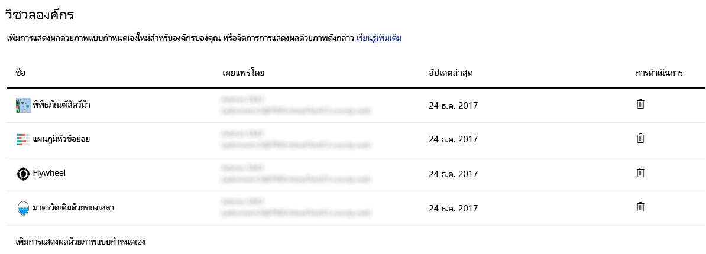

### เพิ่มวิชวลแบบกำหนดเองที่สร้างขึ้นใหม่

เมื่อต้องการเพิ่มวิชวลแบบกำหนดเองที่สร้างขึ้นใหม่ไปยังรายการให้เลือก**เพิ่มวิชวลแบบกำหนดเอง**

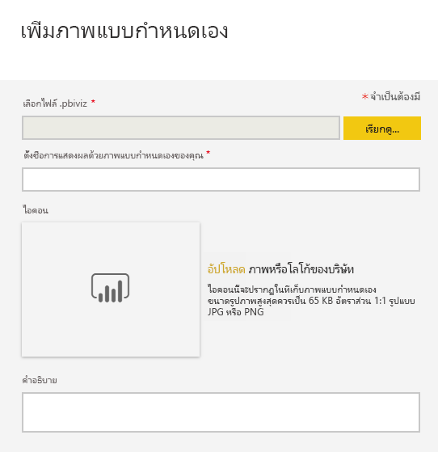

> [!WARNING]
> วิชวลแบบกำหนดเองอาจประกอบด้วยรหัสที่มีความเสี่ยงเรื่องความปลอดภัยหรือความเป็นส่วนตัว ดังนั้นผู้เขียนและแหล่งที่มาของวิชวลแบบกำหนดเองจะต้องมีความน่าเชื่อถือ ก่อนที่จะปรับใช้กับที่เก็บข้อมูลขององค์กร

กรอกรายละเอียดในฟิล์ดต่อไปนี้

* เลือกไฟล์ .pbiviz (จำเป็น) โดยเลือกไฟล์วิชวลแบบกำหนดเองที่ต้องการอัปโหลด เฉพาะวิชวลแบบกำหนดเองเวอร์ชัน API ที่ได้รับการสนับสนุน (อ่านที่นี่เพื่อทำความเข้าใจ)

ก่อนที่คุณจะอัปโหลดวิชวลแบบกำหนดเอง คุณควรตรวจสอบให้แน่ใจว่า วิชวลสำหรับการรักษาความปลอดภัยและความเป็นส่วนตัวเหมาะสำหรับมาตรฐานขององค์กรของคุณ อ่านเพิ่มเติมเกี่ยวกับความปลอดภัยของวิชวลแบบกำหนดเอง

* ตั้งชื่อให้วิชวลแบบกำหนดเองของคุณ (จำเป็น) โดยตั้งชื่อเรื่องสั้นๆ เพื่อภาพเพื่อช่วยให้ผู้ใช้ Power BI Desktop สามารถทำความเข้าใจได้อย่างง่ายดาย

* ไอคอน (จำเป็น): ไฟล์ไอคอนที่แสดงใน UI ของ Power BI Desktop

* คำอธิบาย: คำอธิบายสั้นๆ ของวิชวลเพื่อให้ผู้ใช้สามารถเข้าบริบทและการศึกษาเพิ่มเติม

เลือก "ใช้" เพื่อเริ่มคำขอการอัปโหลด ถ้าสำเร็จ คุณสามารถดูข้อมูลใหม่ในรายการ ถ้าล้มเหลว คุณจะได้รับข้อความผิดพลาดที่เหมาะสม

### ลบวิชวลแบบกำหนดเองจากรายการ

เลือกไอคอนถังขยะเพื่อลบวิชวลจากที่เก็บข้อมูลอย่างถาวร
สิ่งสำคัญ: การลบไม่สามารถแก้ไขย้อนกลับได้ เมื่อถูกลบ ภาพจะหยุดแสดงผลในรายงานที่มีอยู่ทันที แม้ว่าคุณอัปโหลดภาพเดิมอีกครั้ง ภาพใหม่จะไม่แทนที่ภาพก่อนหน้านี้ที่ถูกลบ ผู้ใช้สามารถนำเข้าภาพใหม่อีกครั้ง และแทนที่อินสแตนซ์ที่มีในรายงานของพวกเขา

### ปิดใช้งานภาพแบบกำหนดเองในรายการ

เมื่อต้องการปิดใช้งานภาพจากร้านขององค์กร เลือกไอคอนรูปเฟือง ในส่วน**เข้าถึง** ปิดใช้งานภาพแบบกำหนดเอง

หลังจากที่คุณปิดใช้งานภาพ ภาพจะไม่แสดงในรายงานที่มีอยู่ และจะแสดงข้อผิดพลาดด้านล่าง

*ภาพแบบกำหนดเองนี้จะไม่พร้อมใช้งานอีกต่อไป โปรดติดต่อผู้ดูแลระบบของคุณสำหรับรายละเอียด*

อย่างไรก็ตาม ภาพที่ถูกคั่นหน้าจะยังคงใช้งานได้

หลังจากอับเดตหรือเปลี่ยนแปลงโดยผู้ดูแลระบบ ผู้ใช้ Power BI Desktop ควรรีสตาร์ตแอปพลิเคชัน หรือรีเฟรชเบราว์เซอร์ในบริการ Power BI เพื่อดูการอัปเดต

### วิธีการอัปเดตวิชวล

ถ้าคุณต้องการอัปเดตวิชวลในที่เก็บข้อมูลเนื่องจากมีเวอร์ชันใหม่ของวิชวล (ตัวอย่างเช่น การแก้ไขข้อบกพร่อง ฟังก์ชันการทำงานใหม่ และอื่น ๆ) ให้เลือกไอคอน**อัปเดต** และการอัปโหลดไฟล์ใหม่ ตรวจสอบให้แน่ใจว่า ID ของวิชวลไม่มีการเปลี่ยนแปลง ไฟล์ใหม่จะแทนไฟล์ก่อนหน้าสำหรับรายงานทั้งหมดทั่วทั้งองค์กร อย่างไรก็ตาม เวอร์ชันใหม่ของวิชวลอาจทำลายการใช้งานหรือโครงสร้างข้อมูลของเวอร์ชันก่อนหน้าของวิชวล ดังนั้นจึงไม่ควรแทนที่เวอร์ชันก่อนหน้า แต่ควรสร้างรายการใหม่สำหรับเวอร์ชันใหม่ของวิชวล ตัวอย่างเช่น เพิ่มหมายเลขเวอร์ชันใหม่ (เวอร์ชัน X.X) ไปยังชื่อของวิชวลรายการใหม่ ด้วยวิธีนี้ จะเห็นได้ชัดว่าวิชวลเดิมจะยังคงอยู่ในหมายเลยเวอร์ชันที่อัปเดตแล้ว ดังนั้นรายงานที่มีอยู่จะไม่ทำลายฟังก์ชันการทำงานดังกล่าว และตรวจสอบให้แน่ใจว่า ID ของวิชวลไม่มีการเปลี่ยนแปลง จากนั้น ในครั้งถัดไปที่ผู้ใช้ใช้งานที่เก็บข้อมูลขององค์กรจาก Power BI Desktop พวกเขาสามารถนำเข้าเวอร์ชันใหม่ ซึ่งจะพร้อมท์ให้ผู้ใช้เปลี่ยนเวอร์ชันปัจจุบันที่พวกเขามีในรายงาน

## ขั้นตอนถัดไป

[ทำความเข้าใจเกี่ยวกับบทบาทผู้ดูแลระบบ Power BI](service-admin-role.md)  
[ตรวจสอบ Power BI ในองค์กรของคุณ](service-admin-auditing.md)  
[จัดการ Power BI Premium](service-admin-premium-manage.md)  
[จัดการดูแล Power BI ในองค์กรของคุณ](service-admin-administering-power-bi-in-your-organization.md)  

มีคำถามเพิ่มเติมหรือไม่ [ลองถามชุมชน Power BI](http://community.powerbi.com/)
