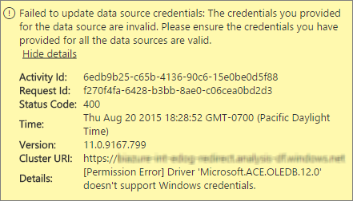
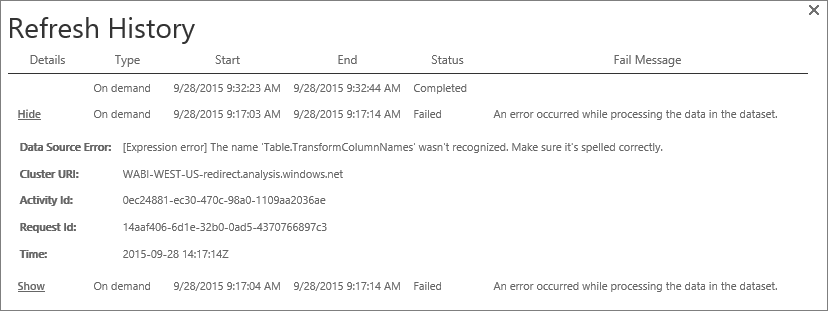

# แก้ไขปัญหาเกตเวย์ Power BI - ส่วนบุคคล
ส่วนต่อไปนี้จะผ่านปัญหาทั่วไปบางอย่างที่คุณอาจพบเมื่อใช้เกตเวย์ Power BI - ส่วนบุคคล

> [!NOTE]
> เวอร์ชันปัจจุบันของเกตเวย์สำหรับใช้งานส่วนบุคคลคือ **เกตเวย์ข้อมูลภายในองค์กร (ส่วนบุคคล)** โปรดอัปเดตการติดตั้งเมื่อต้องใช้เวอร์ชันนั้น
> 
> 

## อัปเดตเป็นเวอร์ชันล่าสุด
หากรุ่นของเกตเวย์ไม่ทันสมัยอาจทำให้เกิดปัญหาจำนวนมาก  ดังนั้นหลักปฏิบัติทั่วไปที่ดีคือต้องแน่ใจว่ารุ่นของคุณเป็นรุ่นล่าสุด  ถ้าคุณไม่ได้อัปเดตเกตเวย์นานเป็นเดือนหรือนานกว่านั้น คุณอาจจะต้องพิจารณาการติดตั้งเกตเวย์รุ่นล่าสุดและดูว่าจะเกิดปัญหาซ้ำหรือไม่

## การติดตั้ง
**เกตเวย์ส่วนบุคคลคือ 64 บิต** ถ้าเครื่องของคุณเป็นแบบ 32 บิต คุณจะไม่สามารถติดตั้งเกตเวย์ส่วนบุคคลได้ ระบบปฏิบัติการของคุณต้องเป็น 64 บิต คุณจะต้องติดตั้ง Windows เวอร์ชัน 64 บิต หรือติดตั้งเกตเวย์ส่วนบุคคลบนเครื่อง 64 บิต

**การติดตั้งเกตเวย์ส่วนบุคคลล้มเหลวในการติดตั้งเป็นบริการแม้ว่าคุณเป็นผู้ดูแลระบบภายในสำหรับคอมพิวเตอร์** การติดตั้งอาจล้มเหลวได้ถ้าผู้ใช้อยู่ในกลุ่มผู้ดูแลระบบท้องถิ่นของคอมพิวเตอร์ แต่ไม่มีนโยบายกลุ่มที่อนุญาตให้ชื่อผู้ใช้นั้นเข้าสู่ระบบในฐานะเป็น บริการ  ในขณะนี้ ตรวจสอบให้แน่ใจว่านโยบายกลุ่มอนุญาตให้ผู้ใช้สามารถเข้าสู่ระบบในฐานะบริการได้ เรากำลังแก้ปัญหานี้ [เรียนรู้เพิ่มเติม](https://technet.microsoft.com/library/cc739424.aspx)

**การดำเนินหมดเวลา** การเกิดเช่นนี้สามารถเกิดได้ทั่วไปถ้าคอมพิวเตอร์ (เครื่องจริงหรือ VM) ที่คุณกำลังติดตั้งเกตเวย์ส่วนบุคคลมีตัวประมวลผลหลักเดียวกัน ปิดทุกแอปพลิเคชันและปิดการประมวลผลใด ๆ ที่ไม่จำเป็น และลองติดตั้งอีกครั้ง

**ไม่สามารถติดตั้งเกตเวย์การจัดการข้อมูล (Data Management Gateway) หรือตัวเชื่อมต่อ Analysis Services บนคอมพิวเตอร์เครื่องเดียวกันเป็นเกตเวย์ส่วนบุคคลได้** ถ้าคุณมีการติดตั้งตัวเชื่อมต่อ Analysis Services หรือติดตั้งเกตเวย์การจัดการข้อมูลแล้ว คุณต้องถอนการติดตั้งตัวเชื่อมต่อหรือเกตเวย์ แล้วลองติดตั้งเกตเวย์ส่วนบุคคล

> [!NOTE]
> ถ้าคุณพบปัญหาระหว่างการติดตั้ง บันทึกการตั้งค่าสามารถให้ข้อมูลเพื่อช่วยให้คุณสามารถแก้ไขปัญหาได้ สำหรับข้อมูลเพิ่มเติม ดู[บันทึกการตั้งค่า](#SetupLogs)
> 
> 

 **กำหนดค่าพร็อกซี**คุณอาจพบปัญหาเกี่ยวกับการกำหนดค่าเกตเวย์ส่วนบุคคลถ้าสภาพแวดล้อมของคุณจำเป็นต้องใช้พร็อกซี เมื่อต้องการเรียนรู้เพิ่มเติมเกี่ยวกับวิธีการกำหนดค่าพร็อกซีข้อมูล ดู[กำหนดค่าพร็อกซีสำหรับเกตเวย์ Power BI ](service-gateway-proxy.md)

## กำหนดตารางเวลาการรีเฟรช
**ข้อผิดพลาด: ข้อมูลประจำตัวที่จัดเก็บไว้ในระบบคลาวด์สูญหาย**

คุณอาจได้รับข้อความข้อผิดพลาดนี้ในการตั้งค่าสำหรับ\<ชุดข้อมูล\>ถ้าคุณมีการรีเฟรชตามกำหนดการ จากนั้นมีการถอนการติดตั้งและการติดตั้งเกตเวย์ส่วนบุคคลอีกครั้ง เมื่อคุณถอนการติดตั้งการเกตเวย์ส่วนบุคคล ข้อมูลประจำตัวของแหล่งข้อมูลสำหรับชุดข้อมูลที่ได้รับการกำหนดค่าสำหรับรีเฟรชจะถูกลบออกจากบริการ Power BI ด้วย

**วิธีแก้ไข:** ใน Power BI ไปที่การตั้งค่าการรีเฟรชสำหรับชุดข้อมูล ในการจัดการแหล่งข้อมูล สำหรับแหล่งข้อมูลใด ๆ ที่มีข้อผิดพลาด คลิกแก้ไขข้อมูลประจำตัวและลงชื่อเข้าใช้ไปยังแหล่งข้อมูลอีกครั้ง

**ข้อผิดพลาด: ข้อมูลประจำตัวที่ระบุไว้สำหรับชุดข้อมูลไม่ถูกต้อง โปรดอัปเดตข้อมูลประจำตัวผ่านการรีเฟรชหรือในกล่องโต้ตอบการตั้งค่าแหล่งข้อมูลเพื่อดำเนินการต่อ**

**โซลูชัน**: ถ้าคุณได้รับข้อความข้อมูลประจำตัว อาจหมายถึง:

* ตรวจสอบให้แน่ใจว่าชื่อผู้ใช้และรหัสผ่านที่ใช้ในการลงชื่อเข้าใช้แหล่งข้อมูลเป็นข้อมูลล่าสุด ใน Power BI ไปที่การตั้งค่ารีเฟรชสำหรับชุดข้อมูลนั้น ในการจัดการแหล่งข้อมูล คลิกแก้ไขข้อมูลประจำตัวเพื่ออัปเดตข้อมูลประจำตัวสำหรับแหล่งข้อมูล
* Mashups ระหว่างแหล่งข้อมูลบนระบบคลาวด์และแหล่งภายในองค์กรในแบบสอบถามเดียว จะรีเฟรชในเกตเวย์ส่วนบุคคลไม่สำเร็จถ้าหนึ่งในแหล่งข้อมูลใช้ OAuth สำหรับการรับรองความถูกต้อง ตัวอย่างนี้คือ Mashup ระหว่าง CRM Online และใน SQL Server ภายในเครื่อง ซึ่งจะล้มเหลวเนื่องจาก CRM Online ต้องมี OAuth
  
  นี่คือปัญหาที่ทราบแล้วและกำลังมีการเข้าตรวจสอบ ในการเข้าแก้ไขปัญหา ต้องมีแบบสอบถามสำหรับแหล่งข้อมูลบนระบบคลาวด์และแหล่งข้อมูลภายในองค์กรที่แยกกัน และใช้การผสานหรือผนวกแบบสอบถามเมื่อต้องการรวมเข้าด้วยกัน

**ข้อผิดพลาด: แหล่งข้อมูลที่ไม่สนับสนุน**

**โซลูชัน:** ถ้าคุณได้รับข้อความแหล่งข้อมูลที่ไม่สนับสนุนในการตั้งค่าการกำหนดเวลารีเฟรช อาจหมายถึง: 

* ในขณะนี้แหล่งข้อมูลไม่สนับสนุนสำหรับการรีเฟรชใน Power BI 
* สมุดงาน Excel ไม่มีแบบจำลองข้อมูล มีเฉพาะข้อมูลในแผ่นงานเท่านั้น Power BI ในขณะนี้สนับสนุนเฉพาะการรีเฟรชถ้าสมุดงาน Excel ที่อัปโหลดประกอบด้วยแบบจำลองข้อมูล เมื่อคุณนำเข้าข้อมูลโดยใช้ Power Query ใน Excel ตรวจสอบให้แน่ใจว่าได้เลือกตัวเลือกที่จะโหลดข้อมูลไปยังโมเดลข้อมูล ซึ่งช่วยให้แน่ใจว่ามีการนำเข้าข้อมูลในแบบจำลองข้อมูล 

**ข้อผิดพลาด: [ไม่สามารถรวมข้อมูล] &lt;ส่วนแบบสอบถาม&gt;/&lt;... &gt; / &lt;... &gt;กำลังเข้าถึงแหล่งข้อมูลที่มีระดับความเป็นส่วนตัวที่ไม่สามารถใช้ร่วมกันได้ โปรดสร้างชุดรวมข้อมูลนี้อีกครั้ง**

**โซลูชัน**: ข้อผิดพลาดนี้เกิดเนื่องจากข้อจำกัดด้านระดับความเป็นส่วนตัวและชนิดของแหล่งข้อมูลที่คุณกำลังใช้

**ข้อผิดพลาด: ข้อผิดพลาดแหล่งข้อมูล: เราไม่สามารถแปลงค่า "\[ตาราง\]" เป็นพิมพ์ตารางได้**

**โซลูชัน**: ข้อผิดพลาดนี้เกิดเนื่องจากข้อจำกัดด้านระดับความเป็นส่วนตัวและชนิดของแหล่งข้อมูลที่คุณกำลังใช้

**ข้อผิดพลาด: มีเนื้อที่ไม่เพียงพอสำหรับแถวนี้**

ข้อผิดพลาดนี้จะเกิดขึ้นถ้าคุณมีแถวที่มีขนาดเกิน 4 เมกะไบต์ คุณจะต้องตรวจหาว่าแถวไหนมาจากแหล่งข้อมูลของคุณ และพยายามทำการกรองออกหรือลดขนาดของแถวนั้นลง

## แหล่งข้อมูล
**ตัวให้บริการข้อมูลที่ขาดหายไป**– เกตเวย์ส่วนบุคคลเป็น 64 บิตเท่านั้น ต้องใช้ตัวให้บริการข้อมูลเวอร์ชัน 64 บิตในการติดตั้งบนคอมพิวเตอร์เครื่องเดียวกันกับที่ติดตั้งเกตเวย์ส่วนบุคคล ตัวอย่างเช่น ถ้าแหล่งข้อมูลในชุดข้อมูลเป็น Microsoft Access คุณต้องติดตั้งตัวให้บริการ 64 บิต ACE บนคอมพิวเตอร์เครื่องเดียวกันกับที่คุณติดตั้งเกตเวย์ส่วนบุคคล  

>[!NOTE]
>ถ้าคุณมี Excel 32 บิต คุณไม่สามารถติดตั้งผู้ให้บริการ 64 บิต ACE บนคอมพิวเตอร์เครื่องเดียวกันได้

**ไม่สนับสนุนการรับรองความถูกต้องของ Windows สำหรับฐานข้อมูล Access** ในขณะนี้ Power BI สนับสนุนเฉพาะแบบไม่ระบุชื่อสำหรับฐานข้อมูล Access เรากำลังดำเนินการเปิดใช้งานการรับรองความถูกต้องของ Windows สำหรับฐานข้อมูล Access

**มีข้อผิดพลาดการลงชื่อเข้าใช้เมื่อใส่ข้อมูลประจำตัวสำหรับแหล่งข้อมูล** ถ้าคุณได้รับข้อความข้อผิดพลาดที่คล้ายคลึงนี้เมื่อใส่ข้อมูลประจำตัวของ Windows สำหรับแหล่งข้อมูล คุณอาจยังคงอยู่บนเกตเวย์ส่วนบุคคลเวอร์ชันที่เก่ากว่า [ติดตั้งเวอร์ชันล่าสุดของเกตเวย์ Power BI - ส่วนบุคคล](https://powerbi.microsoft.com/gateway/)

  

**ข้อผิดพลาด: ข้อผิดพลาดการลงชื่อเข้าใช้เมื่อเลือกการรับรองความถูกต้องของ Windows สำหรับแหล่งข้อมูลโดยใช้ ACE OLEDB** ถ้าคุณได้รับข้อความข้อผิดพลาดต่อไปนี้เมื่อใส่ข้อมูลประจำตัวของแหล่งข้อมูลสำหรับแหล่งข้อมูลโดยใช้ผู้ให้บริการ ACE OLEDB:

ในขณะนี้ Power BI ไม่สนับสนุนการรับรองความถูกต้องของ Windows สำหรับแหล่งข้อมูลโดยใช้ผู้ให้บริการ ACE OLEDB

**โซลูชัน:** การแก้ไขข้อผิดพลาดนี้ คุณสามารถเลือกการรับรองความถูกต้องแบบไม่ระบุชื่อได้ สำหรับผู้ให้บริการ ACE OLEDB แบบดั้งเดิม ข้อมูลประจำตัวแบบไม่ระบุชื่อเทียบเท่ากับข้อมูลประจำตัวของ Windows

## รีเฟรชไทล์
ถ้าคุณได้รับข้อความข้อผิดพลาดกับไทล์แดชบอร์ด โปรดดูบทความต่อไปนี้

[แก้ไขปัญหาข้อผิดพลาดไทล์](refresh-troubleshooting-tile-errors.md)

## เครื่องมือสำหรับการแก้ไขปัญหา
### ประวัติการรีเฟรช
**ประวัติการรีเฟรช**จะช่วยให้คุณเห็นข้อผิดพลาดที่เกิดขึ้น รวมไปถึงข้อมูลที่เป็นประโยชน์ถ้าคุณต้องส่ง คำขอการสนับสนุน คุณสามารถดูได้ทั้งรีเฟรชตามตารางเวลาและรีเฟรชตามต้องการ นี่คือวิธีการที่คุณไปที่ **ประวัติการรีเฟรช**

1. ในพื้นที่นำทางของ Power BI ใน**ชุดข้อมูล** เลือกชุดข้อมูล &gt;เปิดเมนู&gt; **กำหนดตารางเวลาการรีเฟรช**
   
2. ใน**ตั้งค่าสำหรับ...** &gt; **กำหนดตารางเวลาการรีเฟรช**เลือก**ประวัติการรีเฟรช**  
   
   
   

### ไฟล์บันทึกเหตุการณ์
บันทึกเหตุการณ์ต่าง ๆ ที่สามารถแสดงข้อมูลได้ สองส่วนแรก นั่นคือ **Data Management Gateway**และ**PowerBIGateway**จะปรากฏอยู่ถ้าคุณเป็นผู้ดูแลระบบบนเครื่อง  ถ้าคุณไม่ใช่ผู้ดูแลระบบและคุณกำลังใช้เกตเวย์ส่วนบุคคล คุณจะเห็นรายการบันทึกภายในบันทึก**แอปพลิเคชัน**

บันทึก**Data Management Gateway**และ**PowerBIGateway**อยู่ใต้**บันทึกแอปพลิเคชันและบริการ**

### ติดตาม Fiddler
[Fiddler](http://www.telerik.com/fiddler) เป็นเครื่องมือฟรีจาก Telerik ที่ใช้ตรวจดูการรับส่งข้อมูลใน HTTP  คุณสามารถดูกลับไปกลับมาได้ด้วยบริการ Power BI จากเครื่องลูกค้า ซึ่งอาจจะแสดงข้อผิดพลาดและข้อมูลอื่น ๆ ที่เกี่ยวข้อง

### บันทึกการตั้งค่า
ถ้า**เกตเวย์ส่วนบุคคล**ล้มเหลวในการติดตั้ง คุณจะเห็นลิงก์ที่แสดงบันทึกการตั้งค่า ซึ่งจะสามารถแสดงรายละเอียดเกี่ยวกับความล้มเหลวดังกล่าวได้ เหล่านี้เป็นบันทึกการติดตั้ง Windows และรู้จักว่าเป็นบันทึก MSI บันทึกเหล่านี้อาจค่อนข้างซับซ้อนและยากต่อการอ่าน โดยทั่วไปแล้วข้อผิดพลาดที่เป็นผลลัพธ์จะอยู่ที่ด้านล่าง แต่ในการระบุสาเหตุของข้อผิดพลาดไม่ใช่เรื่องไม่สำคัญ ไม่สามารถเป็นผลของข้อผิดพลาดในบันทึกอื่น หรือเป็นผลของข้อผิดพลาดที่สูงขึ้นในบันทึกดังกล่าว

อีกวิธีหนึ่งคือ คุณสามารถไปที่**โฟลเดอร์ Temp** (%temp%) ของคุณและค้นหาไฟล์ที่ขึ้นต้นด้วย**Power\_BI\_** ได้

> [!NOTE]
> การไปที่ %temp% อาจนำคุณไปยังโฟลเดอร์ย่อยของโฟลเดอร์ชั่วคราว  ไฟล์**Power\_BI\_** จะอยู่ในรากฐานของไดเรกทอรีชั่วคราว  คุณอาจจำเป็นต้องไปยังหนึ่งระดับหรือสองระดับ
> 
> 

## ขั้นตอนถัดไป
[การกำหนดค่าพร็อกซีสำหรับเกตเวย์ Power BI](service-gateway-proxy.md)  
[รีเฟรชข้อมูล](refresh-data.md)  
[เกตเวย์ Power BI - ส่วนบุคคล](personal-gateway.md)  
[แก้ไขปัญหาข้อผิดพลาดไทล์](refresh-troubleshooting-tile-errors.md)  
[การแก้ไขปัญหาเกตเวย์ข้อมูลในองค์กร](service-gateway-onprem-tshoot.md)  
มีคำถามเพิ่มเติมหรือไม่? [ลองไปที่ชุมชน Power BI](http://community.powerbi.com/)

