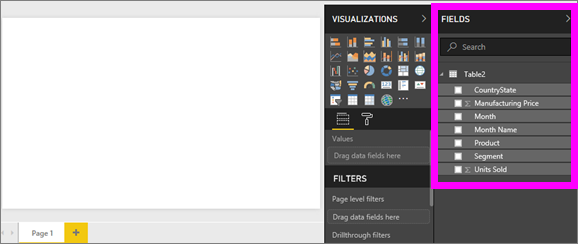
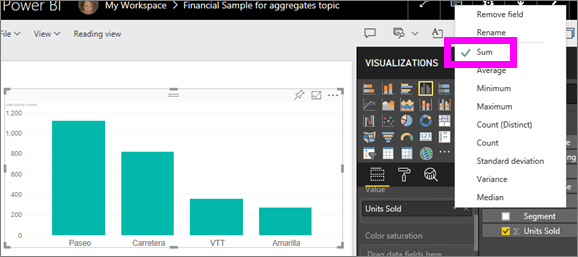
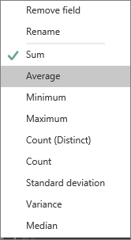
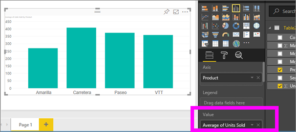
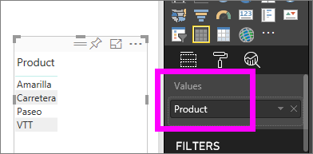
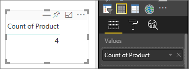
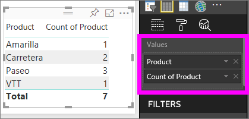

# การรวมในการแสดงภาพของ Power BI
## การรวมคืออะไร?
ในบางครั้งคุณต้องการรวมค่าต่าง ๆ ทางคณิตศาสตร์ในข้อมูลของคุณ การดำเนินการทางคณิตศาสตร์อาจเป็น การบวก, การเฉลี่ย, หาค่าสูงสุด, การนับจำนวน เป็นต้น เมื่อคุณรวมค่าในข้อมูลของคุณ นั่นเรียกว่า*การรวม หรือ การรวบรวม* ส่วนผลลัพธ์ของการดำเนินการทางคณิตศาสตร์คือ *การรวม หรือ ค่ารวม* 

เมื่อบริการของ Power BI และ Power BI Desktop สร้างการแสดงผล อาจมีการรวมข้อมูลของคุณ การรวมมักจะเป็นสิ่งที่คุณต้องการ แต่บางครั้งคุณอาจต้องการรวมค่าในวิธีอื่น  ตัวอย่างเช่น การบวก กับ การหาค่าเฉลี่ย มีหลายวิธีที่จะจัดการ และเปลี่ยนการรวมที่ใช้ในการแสดงภาพ

ก่อนอื่น มาดูที่*ชนิด*ของข้อมูล เนื่องจากชนิดของข้อมูลกำหนดวิธีการรวม ถ้าสามารถรวมได้

## ชนิดของข้อมูล
ชุดข้อมูลส่วนใหญ่มีชนิดของข้อมูลมากกว่าหนึ่งชนิด ระดับพื้นฐานสุด ข้อมูลเป็นชนิดตัวเลขหรือไม่เป็น ข้อมูลตัวเลข สามารถรวมโดยใช้ การบวก, การหาค่าเฉลี่ย, การนับจำนวน, ค่าต่ำสุด, ค่าความแปรปรวน และอีกมาก แม้แต่ข้อมูลที่เป็นข้อความ ที่มักเรียกว่าข้อมูล*ตามประเภท* ก็สามารถรวมข้อมูลได้ ถ้าคุณพยายามที่จะรวมเขตข้อมูลประเภท (โดยการวางลงบักเก็ตที่เป็นตัวเลขเท่านั้น เช่น**ค่า**หรือ**คำแนะนำเครื่องมือ**) Power BI จะนับจำนวนครั้งของแต่ละประเภท หรือนับจำนวนครั้งที่ไม่ซ้ำกันสำหรับแต่ละประเภท และข้อมูลชนิดพิเศษ เช่น วันที่ ก็มีตัวเลือกการรวมของตัวเอง เช่น: ก่อนสุด, หลังสุด, แรกสุด และสุดท้าย 

ในตัวอย่างด้านล่าง:
- **หน่วยที่ขาย**และ**ราคาผลิต** เป็นคอลัมน์ที่ประกอบด้วยข้อมูลตัวเลข
-  **เซกเมนต์**, **ประเทศ**, **ผลิตภัณฑ์**, **เดือน** และ**ชื่อเดือน** เป็นข้อมูลตามประเภท

   

เมื่อสร้างการแสดงภาพใน Power BI เขตข้อมูลตัวเลขจะถูกรวม (ค่าเริ่มต้นคือ*การบวก*) ตามเขตข้อมูลประเภทบางตัว  ตัวอย่างเช่น "หน่วยที่ขาย***ตามผลิตภัณฑ์***", “หน่วยที่ขาย***ตามเดือน***”, และ "ราคาผลิต***ตามเซ็กเมนต์***" เขตข้อมูลตัวเลขบางเขตข้อมูล เรียกว่า**หน่วยวัด** เป็นเรื่องง่ายในการระบุหน่วยวัดในตัวแก้ไขรายงาน Power BI -- หน่วยวัดจะแสดงด้วยสัญลักษณ์ ∑ ในรายการเขตข้อมูล สำหรับข้อมูลเพิ่มเติม ดู[ตัวแก้ไขรายงาน...ลองสำรวจดู](service-the-report-editor-take-a-tour.md)

## ทำไมการรวมไม่ทำอย่างที่ฉันต้องการ?
การทำงานกับการรวมในบริการของ Power BI อาจสับสนได้ บางทีคุณมีเขตข้อมูลตัวเลข แต่ Power BI ไม่อนุญาตให้คุณเปลี่ยนการรวม หรือบางทีคุณมีเขตข้อมูล เช่น ปี และคุณไม่ต้องการรวม คุณเพียงแค่ต้องการนับจำนวนครั้งที่ปรากฏ

บ่อยครั้งสุด ปัญหาเกิดจากวิธีที่เขตข้อมูลกำหนดไว้ในชุดข้อมูล บางทีเขตข้อมูลถูกกำหนดเป็นข้อความ และนั่นอธิบายได้ว่า ทำไมไม่สามารถหาผลรวม หรือ ค่าเฉลี่ยได้ ขออภัยที่ [เฉพาะเจ้าของชุดข้อมูลเท่านั้น ที่สามารถเปลี่ยนการจัดประเภทของเขตข้อมูลได้](desktop-measures.md) ดังนั้น ถ้าคุณมีสิทธิ์ระดับเจ้าของชุดข้อมูล ในเดสก์ท็อปหรือโปรแกรมที่ใช้สร้างชุดข้อมูล (เช่น Excel) คุณสามารถแก้ไขปัญหานี้ มิฉะนั้น คุณจะต้องติดต่อเจ้าของชุดข้อมูลเพื่อขอความช่วยเหลือ  

เพื่อช่วยให้คุณผ่านความสับสนนี้ เรามีส่วนพิเศษที่ท้ายของบทความนี้ ที่เรียกว่า**ข้อควรพิจารณาและการแก้ไขปัญหา**  ถ้าคุณไม่พบคำตอบของคุณที่นั่น โพสต์คำถามของคุณบน[ฟอรั่มชุมชน Power BI](http://community.powerbi.com) สำหรับคำตอบอย่างรวดเร็วจากทีมงาน Power BI โดยตรง

## เปลี่ยนวิธีการรวมเขตข้อมูลตัวเลข
สมมุติว่าคุณมีแผนภูมิที่หาผลรวม จำนวนหน่วยที่ขายได้สำหรับผลิตภัณฑ์ต่าง ๆ แต่คุณอยากได้ค่าเฉลี่ยแทน 

1. สร้างแผนภูมิที่ใช้ประเภทและหน่วยวัด ในตัวอย่างนี้ เราจะใช้ หน่วยที่ขายตามผลิตภัณฑ์  ตามค่าเริ่มต้น Power BI สร้างแผนภูมิที่หา ผลรวมหน่วยที่ขายได้ (หน่วยวัดที่อยู่ใน ค่า) สำหรับแต่ละผลิตภัณฑ์ (ประเภทที่อยู่ใน แกน)

   

2. ในบานหน้าต่าง การจัดรูปแบบการแสดงข้อมูล คลิกขวาที่หน่วยวัด แล้วเลือกชนิดการรวมที่คุณต้องการ ในกรณีนี้ เรากำลังเลือกค่าเฉลี่ย ถ้าคุณไม่เห็นการรวมที่คุณต้องการ ดู "การข้อควรพิจารณาและการแก้ไขปัญหา" ด้านล่าง  
   
   
   
   > [!NOTE]
   > ตัวเลือกที่มีในรายการดรอปดาวน์ จะแตกต่างกันขึ้นอยู่กับ 1) เขตข้อมูลที่เลือก และ 2) การจัดประเภทของเขตข้อมูล โดยเจ้าของชุดข้อมูล
   > 
3. การแสดงภาพของคุณ ตอนนี้รวมโดยการเฉลี่ย

   

##    วิธีการรวมข้อมูลของคุณ

บางตัวเลือกที่อาจมีให้สำหรับการรวมเขตข้อมูล:

* **ไม่ต้องทำการสรุป** เมื่อเลือกตัวเลือกนี้ แต่ละค่าในเขตข้อมูลดังกล่าวจะถือว่าแยกต่างหาก และไม่ถูกสรุปรวม ซึ่งมักจะใช้ถ้าคุณมีคอลัมน์ตัวเลข ID ที่ไม่ควรนำมารวมผล
* **ผลรวม** บวกค่าทั้งหมดในเขตข้อมูลนั้น
* **ค่าเฉลี่ย** คำนวนค่าเฉลี่ยเลขคณิตของค่าทั้งหมด
* **ต่ำสุด** แสดงค่าที่น้อยที่สุด
* **สูงสุด** แสดงค่าที่มากที่สุด
* **นับจำนวน (ไม่เว้นว่าง)** นับจำนวนของค่าในเขตข้อมูลนั้นที่ไม่ว่างเปล่า
* **นับจำนวน (ค่าที่แตกต่างกัน)** นับจำนวนค่าที่แตกต่างกันในเขตข้อมูลนั้น
* **ค่าเบี่ยงเบนมาตรฐาน**
* **ผลต่าง**
* **ค่ากลาง**  แสดงค่ามัธยฐาน (ค่าตรงกลาง) นี่คือค่าที่มี จำนวนที่มากกว่า เท่ากับจำนวนที่น้อยกว่า  ถ้ามีค่า 2 กลางสองค่า Power BI จะหาค่าเฉลี่ย

ตัวอย่างเช่น ข้อมูลนี้:

| ประเทศ | ยอดเงิน |
|:--- |:--- |
| สหรัฐอเมริกา |100 |
| สหราชอาณาจักร |150 |
| แคนาดา |100 |
| เยอรมนี |125 |
| ฝรั่งเศส | |
| ญี่ปุ่น |125 |
| ออสเตรเลีย |150 |

จะให้ผลลัพธ์ดังต่อไปนี้:

* **ไม่ต้องทำการสรุป**: จะแสดงค่าแต่ละรายการแยกต่างหาก
* **ผลรวม**: 750
* **ค่าเฉลี่ย**: 125
* **สูงสุด**: 150
* **ต่ำสุด**: 100
* **นับจำนวน (ไม่เว้นว่าง):** 6
* **นับจำนวน (ค่าที่แตกต่างกัน):** 4
* **ค่าเบี่ยงเบนมาตรฐาน:** 20.4124145...
* **ผลต่าง:** 416.666...
* **ค่ากลาง:** 125

## สร้างการรวมโดยใช้เขตข้อมูลประเภท (ข้อความ)
คุณยังสามารถรวมเขตข้อมูลที่ไม่ใช่ตัวเลข ตัวอย่างเช่น ถ้าคุณมีเขตข้อมูลชื่อผลิตภัณฑ์ คุณสามารถเพิ่มเป็นค่า และตั้งค่าเป็น**นับจำนวน**, **นับจำนวนที่แตกต่างกัน**, **แรก**หรือ**สุดท้าย**ได้ 

1. ในตัวอย่างนี้ เราได้ลากเขตข้อมูล**ผลิตภัณฑ์**ลงใน ค่า ค่ามักใช้กับเขตข้อมูลตัวเลข Power BI รู้ว่านี่คือเขตข้อมูลข้อความ ตั้งค่าการรวมเป็น**ไม่ต้องทำการสรุป** และแสดงตารางที่มีหนึ่งคอลัมน์ให้เรา
   
   
2. ถ้าเราเปลี่ยนการรวมจากค่าเริ่มต้น**ไม่ต้องทำการสรุป** ไปเป็น**นับจำนวน (ค่าที่แตกต่างกัน)** Power BI จะนับจำนวนของผลิตภัณฑ์ต่าง ๆ ที่ไม่ซ้ำกัน ในกรณีนี้ เป็น 4
   
   
3. และ ถ้าเราเปลี่ยนการรวมเป็น**นับจำนวน** Power BI จะนับจำนวนทั้งหมด ในกรณีนี้ มีรายการ 7 สำหรับ**ผลิตภัณฑ์** 
   
   

4. โดยการลากเขตข้อมูลเดียวกัน (ในกรณีนี้คือ**ผลิตภัณฑ์**) ลงใน ค่า และปล่อยให้การรวมใช้ค่าเริ่มต้น**ไม่ต้องทำการสรุป** Power BI แบ่งการนับจำนวนตามผลิตภัณฑ์

   

## ข้อควรพิจารณาและการแก้ไขปัญหา
Q: เหตุใดฉันจึงไม่มีตัวเลือก**ไม่ต้องทำการสรุป**?

A: เขตข้อมูลที่คุณเลือกน่าจะเป็น หน่วยวัดจากการคำนวณหรือหน่วยวัดขั้นสูงที่สร้างขึ้นใน Excel หรือ [Power BI Desktop](desktop-measures.md) แต่ละหน่วยวัดจากการคำนวณ มีสูตรคำนวนที่ตายตัว คุณไม่สามารถเปลี่ยนการรวมที่ใช้  ตัวอย่างเช่น ถ้าใช้ผลรวม จะต้องเป็นผลรวมเท่านั้น ในรายการเขตข้อมูล*หน่วยวัดจากการคำนวณ* จะแสดงด้วยสัญลักษณ์เครื่องคิดเลข

Q: เขตข้อมูลฉัน**เป็น**ตัวเลข ทำไมฉันมีตัวเลือกแค่**นับจำนวน**และ**นับจำนวนที่แตกต่างกัน**?

A1: เหตุผลที่เป็นไปได้คือ เจ้าชุดข้อมูล*ไม่*จัดประเภทเขตข้อมูลเป็นตัวเลข ซึ่งอาจไม่ได้ตั้งใจ หรือจงใจ ตัวอย่างเช่น ถ้ามีชุดข้อมูลที่มีเขตข้อมูล**ปี** เจ้าของชุดข้อมูลอาจจัดประเภทเป็นข้อความได้ เนื่องจากเขตข้อมูล**ปี** มักใช้การนับ (เช่น จำนวนของบุคคลที่เกิดในปี 1974) และไม่ได้ให้หาผลรวม หรือค่าเฉลี่ย ถ้าคุณเป็นเจ้าของ คุณสามารถเปิดชุดข้อมูลใน Power BI Desktop และใช้แท็บ**การวางรูปแบบ** เพื่อเปลี่ยนชนิดข้อมูลได้  

A2: ถ้าเขตข้อมูลมีไอคอนรูปเครื่องคิดเลข ซึ่งหมายความว่า เป็น*หน่วยวัดจากการคำนวณ* และแต่ละหน่วยวัดจากการคำนวณ มีสูตรตายตัวที่เฉพาะเจ้าของชุดข้อมูลเท่านั้นที่จะเปลี่ยนได้ การคำนวณที่กำลังใช้อยู่ อาจเป็นแค่การรวมอย่างง่าย เช่นค่าเฉลี่ยหรือผลรวม แต่ยังอาจเป็นการคำนวนที่ซับซ้อนขึ้น เช่น "เปอร์เซ็นต์ของผลกระทบต่อประเภทหลัก" หรือ "ผลรวมสะสมตั้งแต่ต้นปี" Power BI ไม่จะหาผลรวม หรือค่าเฉลี่ยผลลัพธ์ แต่จะคำนวณใหม่ (โดยใช้สูตรตายตัว) สำหรับแต่ละจุดข้อมูล

A3: อีกความเป็นไปได้คือ คุณได้ปล่อยเขตข้อมูลลงใน*บักเก็ต* ที่อนุญาตให้ใส่ค่าที่เป็นประเภทเท่านั้น  ในกรณีนั้น ตัวเลือกของคุณจะมีแค่ นับจำนวนและนับจำนวนที่แตกต่างกันเท่านั้น

A4: และอีกความเป็นไปได้หนึ่งคือ คุณกำลังใช้เขตข้อมูลสำหรับแกน ตัวอย่างเช่น บนแกนแผนภูมิแท่ง Power BI แสดงหนึ่งแท่งสำหรับแต่ละค่าที่ไม่ซ้ำกัน จะไม่มีรวมค่าของเขตข้อมูลเลย 

>[!NOTE]
>ข้อยกเว้นของกฎนี้คือ แผนภูมิกระจาย ซึ่ง*จำเป็นต้องมี*การรวมค่าสำหรับแกน X และ Y

Q: ฉันมีแผนภูมิกระจาย และฉันต้องการให้เขตข้อมูลของฉัน*ไม่*รวม  ฉันต้องทำอย่างไร?

A: เพิ่มเขตข้อมูลไปยังบักเก็ต**รายละเอียด** และไม่ใส่ในบักเก็ตแกน X หรือ Y

Q: เมื่อฉันเพิ่มเขตข้อมูลตัวเลขลงในการแสดงภาพ ส่วนใหญ่ค่าเริ่มต้นคือผลรวม แต่บางทีค่าเริ่มต้นเป็นค่าเฉลี่ย บางทีเป็นการนับจำนวน หรือการรวมอื่น ๆ  เหตุใดค่าเริ่มต้นจึงไม่ได้เหมือนกันตลอด?

A: เจ้าของชุดข้อมูล มีตัวเลือกค่าเริ่มต้นการสรุป สำหรับแต่ละเขตข้อมูล ถ้าคุณเป็นเจ้าของชุดข้อมูล เปลี่ยนค่าเริ่มต้นการสรุปในแท็บ**การวางรูปแบบ**ของ Power BI Desktop

Q: ฉันเป็นเจ้าของชุดข้อมูล และฉันต้องการให้แน่ใจว่า เขตข้อมูลหนึ่งจะไม่มีการรวมเลย

A: ใน Power BI Desktop ในแท็บ**การวางรูปแบบ** ตั้งค่า**ชนิดข้อมูล**ให้เป็น**ข้อความ**

Q: ฉันไม่เห็น**ไม่ต้องทำการสรุป** เป็นตัวเลือกในรายการดรอปดาวน์ของฉัน

A: ลองเอาเขตข้อมูลออก และเพิ่มกลับเข้าไปอีกครั้ง

มีคำถามเพิ่มเติมหรือไม่? [ลองไปที่ชุมชน Power BI](http://community.powerbi.com/)

