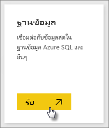
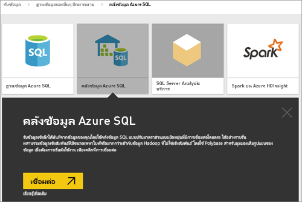
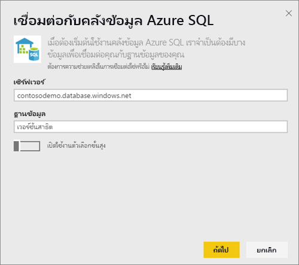
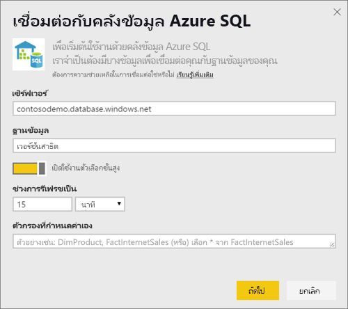
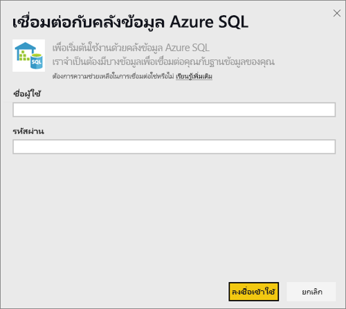
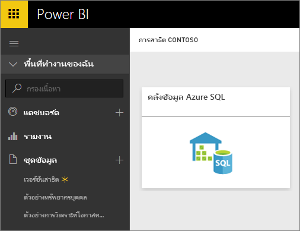
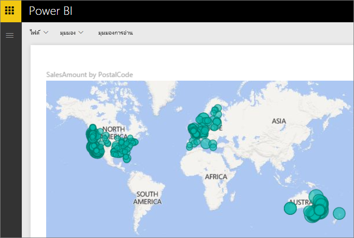
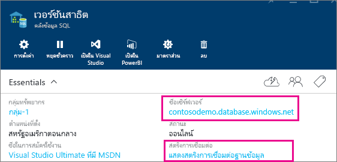

# Azure SQL Data Warehouse พร้อม DirectQuery
Azure SQL Data Warehouse พร้อม DirectQuery ช่วยให้คุณสามารถสร้างรายงานแบบไดนามิกที่ยึดตามข้อมูลและเมทริกซ์ที่คุณมีอยู่แล้วใน Azure SQL Data Warehouse ด้วย DirectQuery แบบสอบถามจะถูกส่งกลับไปยัง Azure SQL Data Warehouse ของคุณในแบบเรียลไทม์ ตามที่คุณสำรวจข้อมูล ซึ่งส่วนนี้รวมกับมาตราส่วนของ SQL Data Warehouse ทำให้ผู้ใช้สามารถสร้างรายงานแบบไดนามิกในไม่กี่นาทีต่อเทราไบต์ของข้อมูล นอกจากนี้ คำนำของปุ่ม**เปิดใน Power BI**อนุญาตให้ผู้ใช้เชื่อมต่อ Power BI กับ SQL Data Warehouse ได้โดยตรงโดยไม่ต้องระบุข้อมูลดัวกล่าวด้วยตนเอง

เมื่อใช้ตัวเชื่อมต่อ SQL Data Warehouse:

* ระบุชื่อเซิร์ฟเวอร์ที่มีคุณสมบัติครบถ้วนเมื่อเชื่อมต่อ (ดูด้านล่างสำหรับรายละเอียด)
* ตรวจสอบให้แน่ใจว่ามีการกำหนดค่ากฎไฟร์วอลล์สำหรับเซิร์ฟเวอร์เพื่อ "อนุญาตการเข้าถึงบริการ Azure"
* ทุกการดำเนินการ เช่น การเลือกคอลัมน์ หรือเพิ่มตัวกรองจะสอบถามคลังข้อมูลโดยตรง
* ไทล์จะถูกตั้งค่าการรีเฟรชทุก 15 นาทีโดยประมาณ และรีเฟรชไม่จำเป็นต้องมีการทำกำหนดการ  โดยสามารถปรับปรุงได้ในการตั้งค่าขั้นสูงเมื่อคุณเชื่อมต่อ
* การถามตอบไม่พร้อมใช้งานสำหรับชุดข้อมูล DirectQuery
* การเปลี่ยนแปลงเค้าร่างจะไม่ถูกเลือกโดยอัตโนมัติ

ข้อจำกัดและบันทึกย่อเหล่านี้อาจเปลี่ยนแปลงขณะที่เราปรับปรุงประสบการณ์การใช้งาน ขั้นตอนในการเชื่อมต่อจะมีรายละเอียดดังด้านล่าง

## ใช้ปุ่ม 'เปิดใน Power BI'
วิธีง่ายที่สุดในการย้ายไปมาระหว่าง SQL Data Warehouse และ Power BI ของคุณคือ ด้วยปุ่ม**เปิดใน Power BI**ภายในพอร์ทัลการแสดงตัวอย่าง Azure ปุ่มนี้ช่วยให้คุณสามารถเริ่มสร้างแดชบอร์ดใหม่ใน Power BI ได้อย่างราบรื่น

1. การเริ่มใช้งาน ให้ไปยังตัวอย่าง SQL Data Warehouse ของคุณในพอร์ทัลการแสดงตัวอย่างของ Azure โปรดสังเกตว่าเฉพาะ SQL Data Warehouse เท่านั้นที่ปรากฏในพอร์ทัลการแสดงตัวอย่าง Azure ในขณะนี้
2. คลิกที่ปุ่ม**เปิดใน Power BI**
   
    
3. ถ้าเราไม่สามารถลงชื่อเข้าใช้สำหรับคุณได้โดยตรง หรือถ้าคุณไม่มีบัญชี Power BI คุณจะต้องลงชื่อเข้าใช้
4. จะมีการนำทางคุณไปยังหน้าเชื่อมต่อ SQL Data Warehouse ที่มีข้อมูลจากคลังข้อมูล SQL ของคุณที่ปรากฏข้อมูลไว้ล่วงหน้า ใส่ข้อมูลประจำตัวของคุณและกดที่การเชื่อมต่อเพื่อสร้างการเชื่อมต่อ

## เชื่อมต่อผ่านทาง Power BI
นอกจากนี้ SQL Data Warehouse ยังอยู่ในรายการบนหน้า Power BI Get Data ด้วย 

1. เลือก**รับข้อมูล**ที่ด้านล่างของพื้นที่นำทางด้านซ้ายมือ  
   
    
2. ภายใน**ฐานข้อมูล** เลือก**รับ**
   
    
3. เลือก**SQL Data Warehouse** \> **เชื่อมต่อ**
   
    
4. ใส่ข้อมูลที่จำเป็นเพื่อเชื่อมต่อ ส่วน**ค้นหาพารามิเตอร์**ที่ด้านล่างแสดงให้เห็นว่าข้อมูลนี้ที่อยู่ในพอร์ทัล Azure ของคุณอยู่ที่ตำแหน่งใด
   
    
   
    
   
    
   
   > [!NOTE]
   > ชื่อผู้ใช้จะเป็นผู้ใช้ที่กำหนดไว้ในตัวอย่าง Azure SQL Data Warehouse ของคุณ
   > 
   > 
5. เจาะลึกลงในชุดข้อมูลโดยการเลือกไทล์ใหม่หรือชุดข้อมูลที่สร้างขึ้นใหม่ที่บ่งชี้ ด้วยเครื่องหมายดอกจัน ชุดข้อมูลนี้จะมีชื่อเดียวกับฐานข้อมูลของคุณ
   
    
6. คุณสามารถสำรวจตารางและคอลัมน์ทั้งหมดได้ การเลือกคอลัมน์จะเป็นการส่งแบบสอบถามกลับไปยังแหล่งข้อมูล และสร้างภาพของคุณแบบไดนามิก นอกจากนี้จะมีการแปลตัวกรองเป็นแบบสอบถามกลับไปยังคลังข้อมูลของคุณด้วย ภาพเหล่านี้สามารถถูกบันทึกไว้ในรายงานใหม่และปักหมุดกลับไปยังแดชบอร์ดของคุณได้
   
    

## ค้นหาค่าพารามิเตอร์
สามารถค้นหาชื่อเซิร์ฟเวอร์แบบเต็มและชื่อฐานข้อมูลของคุณได้ในพอร์ทัลการแสดงตัวอย่างของ Azure โปรดสังเกตว่าเฉพาะ SQL Data Warehouse เท่านั้นที่ปรากฏในพอร์ทัลการแสดงตัวอย่าง Azure ในขณะนี้

> [!NOTE]
> ถ้าผู้เช่า Power BI ของคุณอยู่ในภูมิภาคเดียวกันกับ Azure SQL Data Warehouse จะไม่มีค่าธรรมเนียมขาออก คุณสามารถค้นหาตำแหน่งที่ผู้เช่า Power BI ของคุณอยู่โดยใช้[คำแนะนำเหล่านี้](https://docs.microsoft.com/en-us/power-bi/service-admin-where-is-my-tenant-located)ได้
>

## ขั้นตอนถัดไป
[เริ่มต้นใช้งาน Power BI](service-get-started.md)  
[รับข้อมูลสำหรับ Power BI](service-get-data.md)  
[คลังข้อมูล Azure SQL](https://azure.microsoft.com/en-us/documentation/services/sql-data-warehouse/)  

มีคำถามเพิ่มเติมหรือไม่? [ลองไปที่ชุมชน Power BI](http://community.powerbi.com/)