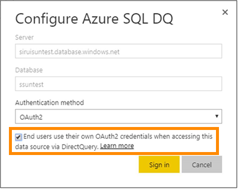

# Azure SQL Database พร้อม DirectQuery
เรียนรู้วิธีการเชื่อมต่อโดยตรงไปยังฐานข้อมูล SQL Azure และสร้างรายงานที่ใช้ข้อมูลสด คุณสามารถเก็บข้อมูลของคุณที่แหล่งข้อมูลได้ แต่ไม่ใช่ใน Power BI

ด้วย DirectQuery แบบสอบถามจะถูกส่งกลับไปยังฐานข้อมูล SQL Azure ของคุณตามที่คุณสำรวจข้อมูลในมุมมองรายงาน ประสบการณ์การใช้งานนี้แนะนำสำหรับผู้ใช้ที่คุ้นเคยกับฐานข้อมูลและเอนทิตีที่ผู้ใช้งานดังกล่าวเชื่อมต่อด้วย

**หมายเหตุ:**

* ระบุชื่อเซิร์ฟเวอร์ที่มีคุณสมบัติครบถ้วนเมื่อเชื่อมต่อ (ดูด้านล่างสำหรับรายละเอียดเพิ่มเติม)
* ตรวจสอบให้แน่ใจว่ามีการกำหนดค่ากฎไฟร์วอลล์สำหรับฐานข้อมูลเพื่อ "[อนุญาตการเข้าถึงบริการ Azure](https://msdn.microsoft.com/library/azure/ee621782.aspx)"
* ทุกการดำเนินการ เช่น การเลือกคอลัมน์หรือการเพิ่มตัวกรอง จะส่งการสอบถามย้อนกลับไปยังฐานข้อมูล
* ไทล์จะรีเฟรชทุกชั่วโมง (รีเฟรชไม่จำเป็นต้องมีการจัดกำหนดการ) โดยสามารถปรับปรุงได้ในการตั้งค่าขั้นสูงเมื่อคุณเชื่อมต่อ
* การถามตอบไม่พร้อมใช้งานสำหรับชุดข้อมูล DirectQuery
* การเปลี่ยนแปลง schema จะยังไม่มีผลโดยอัตโนมัติ

ข้อจำกัดและบันทึกย่อเหล่านี้อาจเปลี่ยนแปลงขณะที่เราปรับปรุงประสบการณ์การใช้งานขึ้นเรื่อย ๆ ขั้นตอนในการเชื่อมต่อจะมีรายละเอียดดังด้านล่าง 

## ใช้ DirectQuery ใน Power BI Desktop
เมื่อต้องการเชื่อมต่อกับฐานข้อมูล SQL Azure ที่ใช้ DirectQuery คุณจะต้องใช้ Power BI Desktop แนวทางนี้เพิ่มความยืดหยุ่นและขีดความสามารถให้มากขึ้น รายงานที่สร้างขึ้นโดยใช้ Power BI Desktop จะสามารถเผยแพร่ไปยังบริการ Power BI ได้ คุณสามารถเรียนรู้เพิ่มเติมเกี่ยวกับวิธีการเชื่อมต่อ[ฐานข้อมูล SQL Azure ที่ใช้ DirectQuery](desktop-use-directquery.md)ภายใน Power BI Desktop ได้ 

## ลงชื่อเข้าระบบครั้งเดียว

หลังจากที่คุณเผยแพร่ยังชุดข้อมูล Azure SQL DirectQuery ไปยังบริการแล้ว คุณสามารถอนุญาตให้ผู้ใช้งานของคุณลงชื่อเข้าระบบครั้งเดียว (SSO) ได้ผ่าน OAuth2 ของ Azure Active Directory (Azure AD) 

เมื่อต้องการเปิดใช้งาน SSO ไปที่การตั้งค่าสำหรับชุดข้อมูล เปิดแท็บ**แหล่งข้อมูล** แล้วเลือกกล่อง SSO

เมื่อเปิดใช้งานตัวเลือก SSO และผู้ใช้ของคุณเข้าถึงรายงานที่สร้างขึ้นบนยอดของแหล่งข้อมูล Power BI จะส่งข้อมูลประจำตัวที่รับรองความถูกต้อง Azure AD ของผู้ใช้ในการสอบถามไปยังฐานข้อมูล Azure SQL ซึ่งจะช่วยให้ Power BI เป็นไปตามการตั้งค่าความปลอดภัยที่มีการกำหนดค่าในระดับแหล่งข้อมูล

ตัวเลือก SSO จะมีผลต่อชุดข้อมูลทั้งหมดที่ใช้แหล่งข้อมูลนี้ แต่จะไม่มีผลต่อวิธีการรับรองความถูกต้องที่ใช้สำหรับสถานการณ์สมมติการนำเข้า

## ค้นหาค่าพารามิเตอร์
สามารถค้นหาชื่อเซิร์ฟเวอร์และชื่อฐานข้อมูลแบบเต็มของคุณได้ในพอร์ทัล Azure

## ขั้นตอนถัดไป
[ใช้ DirectQuery ใน Power BI Desktop](desktop-use-directquery.md)  
[เริ่มต้นใช้งาน Power BI](service-get-started.md)  
[รับข้อมูลสำหรับ Power BI](service-get-data.md)  
มีคำถามเพิ่มเติมหรือไม่? [ลองไปที่ชุมชน Power BI](http://community.powerbi.com/)
