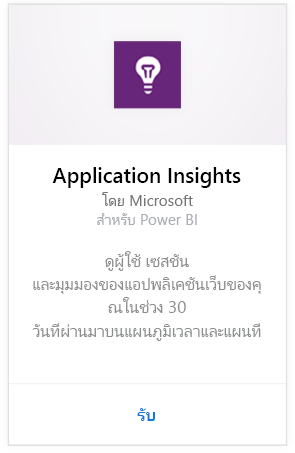
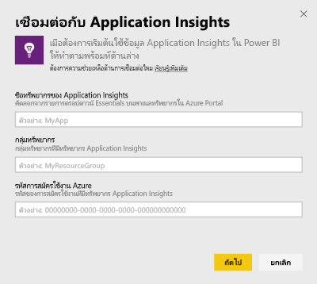
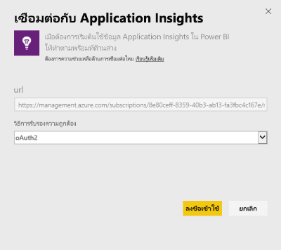
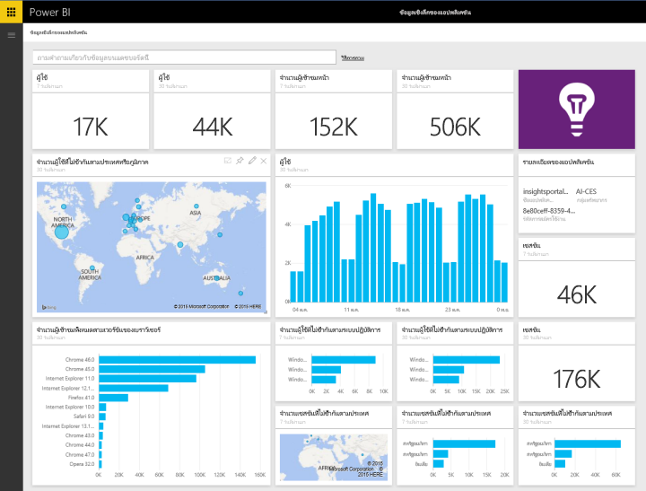
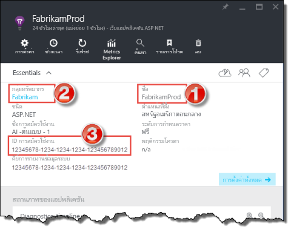
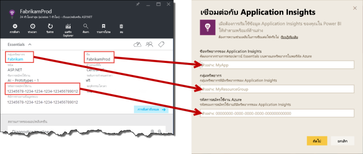

# เชื่อมต่อกับ Application Insights ด้วย Power BI
ใช้ Power BI เพื่อสร้างแดชบอร์ดแบบกำหนดเองที่มีประสิทธิภาพจากการวัดและส่งข้อมูลทางไกล[Application Insights](https://azure.microsoft.com/documentation/articles/app-insights-overview/) นึกภาพการวัดและส่งข้อมูลทางไกลของแอปของคุณในรูปแบบใหม่ รวมเมตริกจากแอปหรือบริการส่วนต่างๆลงบนแดชบอร์ดเดียวกัน การวางจำหน่ายครั้งแรกของชุดเนื้อหา Power BI สำหรับข้อมูลเชิงลึกของแอปพลิเคชันนี้ มีวิดเจ็ตสำหรับการวัดที่เกี่ยวข้องกับการใช้งานทั่วไป เช่นผู้ใช้ที่ใช้งานอยู่ มุมมองหน้า เซสชัน เบราว์เซอร์ และเวอร์ชันระบบปฏิบัติการ และการเผยแพร่ทางภูมิศาสตร์ของผู้ใช้ในแผนที่

เชื่อมต่อไปยัง[เนื้อหาข้อมูลเชิงลึกของแอปพลิเคชันสำหรับ Power BI](https://app.powerbi.com/getdata/services/application-insights)

>[!NOTE]
>เข้าถึงภาพรวมของ Application Insights สำหรับแอปพลิเคชันของ Azure Preview Portal ซึ่งต้องมีการเชื่อมต่อ รายละเอียดเพิ่มเติมเกี่ยวกับข้อกำหนดด้านล่าง

## วิธีการเชื่อมต่อ
1. เลือกปุ่ม**รับข้อมูล**ที่ด้านล่างของพื้นที่นำทางด้านซ้ายมือ
   
    
2. ในกล่อง**บริการ** เลือก**รับ**
   
    
3. เลือก**Application Insights** > **รับ**
   
    
4. ระบุรายละเอียดของแอปพลิเคชันที่คุณต้องการเชื่อมต่อ รวมถึง**ชื่อทรัพยากรข้อมูลเชิงลึกของแอปพลิเคชัน** **กลุ่มทรัพยากร**และ**ID การสมัครใช้งาน** ดู[ค้นหาพารามิเตอร์ของข้อมูลเชิงลึกของแอปพลิเคชัน](#FindingAppInsightsParams)ด้านล่างสำหรับรายละเอียดเพิ่มเติม
   
        
5. เลือก**ลงชื่อเข้าใช้**และทำตามหน้าจอเพื่อเชื่อมต่อ
   
    
6. กระบวนการนำเข้าเริ่มต้นโดยอัตโนมัติ เมื่อเสร็จสมบูรณ์ การแจ้งเตือนจะแสดงขึ้นและแดชบอร์ด รายงาน และชุดข้อมูลใหม่จะปรากฏในบานหน้าต่างนำทางที่ทำเครื่องหมายด้วยเครื่องหมายดอกจัน  เลือกแดชบอร์ดเพื่อดูข้อมูลที่นำเข้าของคุณ
   
    

**ฉันต้องทำอะไรตอนนี้**

* ลอง[ถามคำถามในกล่อง Q&A](power-bi-q-and-a.md)ที่ด้านบนของแดชบอร์ด
* [เปลี่ยนไทล์](service-dashboard-edit-tile.md)ในแดชบอร์ด
* [เลือกไทล์](service-dashboard-tiles.md)เพื่อเปิดรายงานด้านใน
* ถึงแม้ว่าชุดข้อมูลของคุณถูกกำหนดให้รีเฟรซรายวัน คุณสามารถเปลี่ยนแปลงกำหนดเวลารีเฟรช หรือลองรีเฟรชตามความต้องการ โดยใช้**รีเฟรชทันที**

## มีอะไรรวมอยู่บ้าง
ชุดเนื้อหาข้อมูลเชิงลึกของแอปพลิเคชันประกอบด้วยตารางและเมทริกซ์ต่อไปนี้  

    ´´´
    - ApplicationDetails  
    - UniqueUsersLast7Days   
    - UniqueUsersLast30Days   
    - UniqueUsersDailyLast30Days  
    - UniqueUsersByCountryLast7Days  
    - UniqueUsersByCountryLast30Days   
    - PageViewsDailyLast30Days   
    - SessionsLast7Days   
    - SessionsLast30Days  
    - PageViewsByBrowserVersionDailyLast30Days   
    - UniqueUsersByOperatingSystemLast7Days   
    - UniqueUsersByOperatingSystemLast30Days    
    - SessionsDailyLast30Days   
    - SessionsByCountryLast7Days   
    - SessionsByCountryLast30Days   
    - PageViewsByCountryDailyLast30Days  
    ´´´ 

## การค้นหาพารามิเตอร์
ชื่อทรัพยากร กลุ่มทรัพยากรและ ID การสมัครใช้งานของคุณ สามารถจะพบทั้งหมดในพอร์ทัล Azure โดยเลือกชื่อจะเปิดมุมมองรายละเอียด และคุณสามารถใช้รายการดรอปดาวน์เพื่อค้นหาค่าทั้งหมดที่คุณต้องการ

คัดลอก และวางลงในเขตข้อมูลเหล่านี้ลงใน Power BI

## ขั้นตอนถัดไป
[เริ่มต้นใช้งานใน Power BI](service-get-started.md)

[รับข้อมูลใน Power BI](service-get-data.md)

