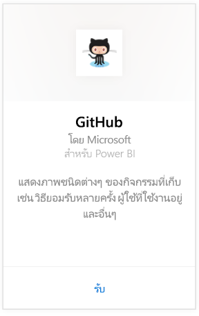
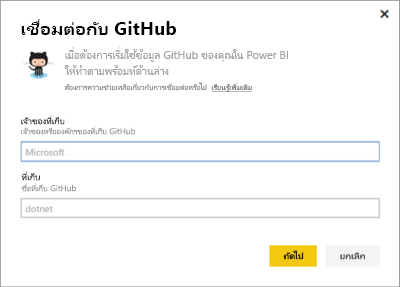

# เชื่อมต่อกับ GitHub ด้วย Power BI
ชุดเนื้อหา GitHub สำหรับ Power BI ช่วยให้คุณสามารถรับข้อมูลเชิงลึกลงในจัดเก็บใน GitHub (หรือที่เรียกว่า repo) กับข้อมูล การจัดสรร ปัญหา คำขอการดึง และผู้ใช้ที่ใช้งานอยู่

เชื่อมต่อไปยัง[ชุดเนื้อหา GitHub ](https://app.powerbi.com/getdata/services/github)หรืออ่านเพิ่มเติมเกี่ยวกับการ[รวม GitHub ](https://powerbi.microsoft.com/integrations/github)กับ Power BI

>[!NOTE]
>ชุดเนื้อหานี้จำเป็นต้องมีบัญชีผู้ใช้ GitHub ที่สามารถเข้าถึง repo ได้ รายละเอียดเพิ่มเติมเกี่ยวกับข้อกำหนดด้านล่าง

## วิธีการเชื่อมต่อ
1. เลือกปุ่ม**รับข้อมูล**ที่ด้านล่างของพื้นที่นำทางด้านซ้ายมือ
   
    
2. ในกล่อง**บริการ** เลือก**รับ**
   
    
3. เลือก**GitHub** \> **รับ**
   
   
4. ป้อนชื่อที่เก็บและเจ้าของที่เก็บ Repo ดูรายละเอียดที่ [การค้นหาพารามิเตอร์เหล่านี้](#FindingParams) ด้านล่าง
   
   
5. ใส่ข้อมูลประจำตัว GitHub ของคุณ (คุณอาจข้ามขั้นตอนนี้ ถ้าคุณได้ลงชื่อเข้าใช้ด้วยเบราว์เซอร์ของคุณอยู่แล้ว) 
6. สำหรับ **วิธีการรับรองความถูกต้อง** ให้เลือก **oAuth2** \> **ลงชื่อเข้าใช้** 
7. ทำตามหน้าจอการรับรองความถูกต้องของ GitHub ให้สิทธิ์ GitHub เพื่อขออนุญาตจากชุดเนื้อหา Power BI ไปยังข้อมูล GitHub
   
   
   
   ซึ่งเชื่อมต่อ Power BI กับ GitHub และอนุญาตให้ Power BI เพื่อเชื่อมต่อกับข้อมูล  ข้อมูลจะถูกรีเฟรชวันละหนึ่งครั้ง
8. หลังจากที่คุณเชื่อมต่อกับ repo ของคุณ Power BI จะนำเข้าข้อมูล คุณเห็น[แดชบอร์ด GitHub](https://powerbi.microsoft.com/integrations/github)ใหม่ รายงานและชุดข้อมูลในบานหน้าต่างนำทางด้านซ้าย รายการใหม่จะถูกทำเครื่องหมายด้วยเครื่องหมายดอกจันสีเหลือง\*
   
   

**ฉันต้องทำอะไรตอนนี้**

* ลอง[ถามคำถามในกล่อง Q&A](power-bi-q-and-a.md)ที่ด้านบนของแดชบอร์ด
* [เปลี่ยนไทล์](service-dashboard-edit-tile.md)ในแดชบอร์ด
* [เลือกไทล์](service-dashboard-tiles.md)เพื่อเปิดรายงานด้านใน
* ถึงแม้ว่าชุดข้อมูลของคุณถูกกำหนดให้รีเฟรซรายวัน คุณสามารถเปลี่ยนแปลงกำหนดเวลารีเฟรช หรือลองรีเฟรชตามความต้องการ โดยใช้**รีเฟรชทันที**

## มีอะไรรวมอยู่บ้าง
ข้อมูลต่อไปนี้จะพร้อมใช้งานจาก GitHub ใน Power BI     

| ชื่อตาราง | คำอธิบาย |
| --- | --- |
| การสนับสนุน |ตารางจัดสรรให้ ผลรวม การเพิ่มเติม การลบและการกระทำที่อนุญาตโดยผู้ให้การสนับสนุนที่เพิ่มแต่ละสัปดาห์ ผู้สนับสนุน 100 อันดับแรกถูกรวมไว้ |
| ปัญหา |รายการปัญหาทั้งหมดสำหรับ repo ที่เลือก และประกอบด้วยการคำนวณเช่นเวลาเฉลี่ยและเวลารวมเพื่อปิดข้อปัญหา รวมปัญหาที่เปิด รวมปัญหาที่ปิด ตารางนี้จะว่างเปล่าเมื่อไม่มีปัญหาใน repo |
| คำขอดึงข้อมูล |ตารางนี้ประกอบด้วย Pull Requests ทั้งหมดดึงของ repo และบุคคลที่ขอดึง ซึ่งยังประกอบด้วยคำนวณ จำนวน Pull Requests เปิด ปิด และจำนวนรวม ระยะเวลาของ Pull Requests และระยะเวลาค่าเฉลี่ยของ Pull Requests ตารางนี้จะว่างเปล่าเมื่อไม่มีปัญหาใน repo |
| ผู้ใช้ |ตารางนี้แสดงรายการของผู้ใช้ GitHub หรือผู้ให้การสนับสนุนที่ได้ทำการจัดสรร ที่เก็บข้อมูลปัญหา หรือได้รับการแก้ไข Pull Requests ของ repo ที่เลือก |
| หลักเป้าหมาย |มีเหตุการณ์สำคัญทั้งหมดสำหรับ repo ที่เลือก |
| DateTable |ตารางนี้ประกอบด้วยวันที่จากวันนี้ และปีในอดีตที่ช่วยให้คุณสามารถวิเคราะห์ข้อมูล GitHub ของคุณตามวัน |
| ContributionPunchCard |ตารางนี้สามารถใช้เป็นการ์ดความสามารถจัดสรรสำหรับ repo ที่เลือก ซึ่งแสดงยอมรับ โดยวันของสัปดาห์และชั่วโมงของวัน ตารางนี้ไม่ได้รับการเชื่อมต่อกับตารางอื่นในแบบจำลอง |
| RepoDetails |ตารางนี้มีรายละเอียดสำหรับ repo ที่เลือก |

## ความต้องการของระบบ
* บัญชีผู้ใช้ GitHub ที่มีสิทธิ์เข้าถึง repo  
* สิทธิ์ที่มอบให้กับ Power BI สำหรับแอป GitHub ในระหว่างการเข้าสู่ระบบครั้งแรก ดูรายละเอียดด้านล่างในการยกเลิกการเข้าถึง  
* มีการเรียกใช้ API เพียงพอที่สามารถดึงและรีเฟรชข้อมูล  

### ยกเลิกอนุญาต Power BI
เมื่อต้องการยกเลิกอนุญาต Power BI เนื่องจากได้เชื่อมต่อกับ GitHub repo ของคุณ คุณสามารถยกเลิกการเข้าถึงใน GitHub สำหรับรายละเอียดเพิ่มเติมให้ดูที่นี่ หัวข้อ[ความช่วยเหลือ GitHub](https://help.github.com/articles/keeping-your-ssh-keys-and-application-access-tokens-safe/#reviewing-your-authorized-applications-oauth)

## การค้นหาพารามิเตอร์
คุณสามารถกำหนดเจ้าของและที่เก็บ โดยด repo ใน GitHub เอง

ส่วนแรกของ "Azure" คือเจ้าของ และส่วนสอง "azure-sdk-for-php" เป็นส่วนเก็บข้อมูล  คุณเห็นสิ่งเหล่านี้เหมือนกันสองรายการใน URL repo

    <https://github.com/Azure/azure-sdk-for-php> .

## การแก้ไขปัญหา
ถ้าจำเป็น คุณสามารถตรวจสอบข้อมูลประจำตัว GitHub ของคุณ  

1. ในหน้าต่างเบราว์เซอร์อื่น ไปที่เว็บไซต์ GitHub และเข้าสู่ระบบ GitHub คุณสามารถเห็นว่าคุณกำลังเข้าสู่ระบบ ที่มุมขวาบนของไซต์ GitHub    
2. ใน GitHub นำทางไปยัง URL ของ repo ที่คุณวางแผนที่จะเข้าถึงใน Power BI ตัวอย่างเช่น: https://github.com/dotnet/corefx  
3. กลับไปที่ Power BI ลองเชื่อมต่อกับ GitHub ในกล่องโต้ตอบการกำหนดค่า GitHub ให้ใช้ชื่อของ repo และเจ้าของ repo สำหรับ repo ที่เดียวกัน  

## ขั้นตอนถัดไป
* [เริ่มต้นใช้งาน Power BI](service-get-started.md)
* [รับข้อมูล](service-get-data.md)
