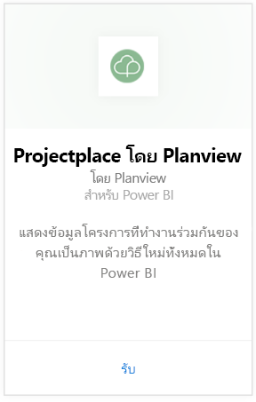
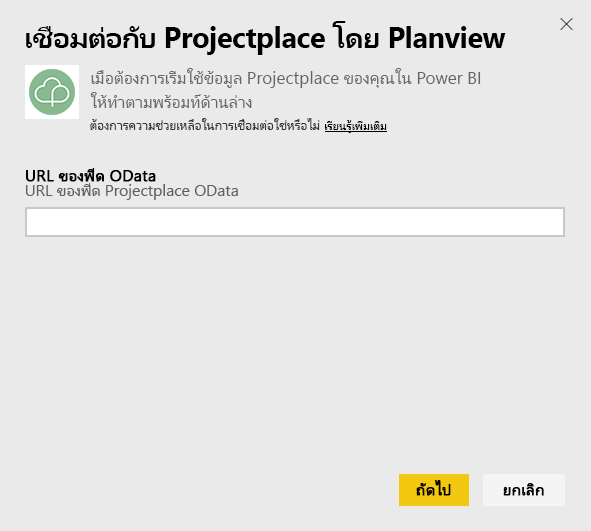
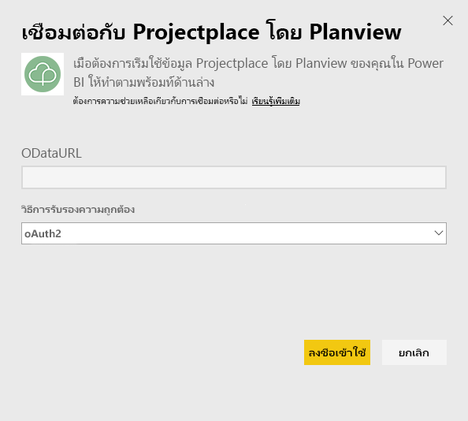
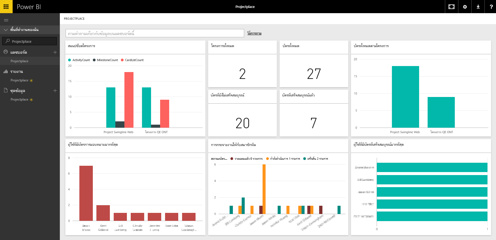

# เชื่อมต่อกับ Projectplace โดย Planview ด้วย Power BI
ด้วยชุดเนื้อหา Projectplace โดย Planview คุณสามารถมองเห็นภาพข้อมูลโครงการที่ทำงานร่วมกันในวิธีการใหม่ทั้งกระบวนการได้โดยตรงใน Power BI ใช้ข้อมูลประจำตัวการลงชื่อเข้าใช้ Projectplace ของคุณเพื่อดูสถิติโครงการที่สำคัญแบบโต้ตอบ ค้นหาผู้ใช้ที่ใช้งานมากที่สุดและสมาชิกในทีมที่ทำงานมีประสิทธิภาพมากที่สุด และระบุการ์ดและกิจกรรมที่มีความเสี่ยงในทั้งโครงการในบัญชี Projectplace ของคุณ นอกจากนี้ คุณยังสามารถขยายแดชบอร์ดและรายงานแบบใช้งานทันทีเพื่อรับข้อมูลเชิงลึกที่มีความสำคัญมากที่สุดสำหรับคุณ

[เชื่อมต่อกับชุดเนื้อหา Projectplace ใน Power BI](https://app.powerbi.com/getdata/services/projectplace)

>[!NOTE]
>เมื่อต้องการนำเข้าข้อมูล Projectplace ของคุณไปยัง Power BI คุณต้องเป็นผู้ใช้ Projectplace ดูข้อกำหนดเพิ่มเติมที่ด้านล่าง

## วิธีการเชื่อมต่อ
1. เลือกปุ่ม**รับข้อมูล**ที่ด้านล่างของพื้นที่นำทางด้านซ้ายมือ
   
    
2. ในกล่อง**บริการ** เลือก**รับ**
   
    
3. ในหน้า Power BI เลือก**Projectplace โดย Planview** แล้วเลือก**รับ**:  
   
    
4. ในกล่องข้อความ URL ของตัวดึงข้อมูล OData ใส่ URL สำหรับตัวดึงข้อมูล Projectplace OData ที่คุณต้องการใช้ ดังที่แสดงในรูปต่อไปนี้:
   
    
5. ในรายการวิธีการรับรองความถูกต้อง เลือก**OAuth**ถ้ายังไม่ได้เลือกไว้ คลิก**ลงชื่อเข้าใช้**และทำตามขั้นตอนการเข้าสู่ระบบ  
   
   
6. ในแผงด้านซ้าย เลือก**Projectplace**จากรายการแดชบอร์ด Power BI นำเข้าข้อมูล Projectplace ลงในแดชบอร์ด โปรดทราบว่าอาจใช้เวลาสักครู่ในการโหลดข้อมูล  
   
    แดชบอร์ดที่ประกอบด้วยไทล์ที่แสดงข้อมูลจากฐานข้อมูล Projectplace ของคุณ รูปต่อไปนี้แสดงตัวอย่างของแดชบอร์ด Projectplace ค่าเริ่มต้นใน Power BI
   
    

**ฉันต้องทำอะไรต่อ?**

* ลอง[ถามคำถามในกล่อง Q&A](power-bi-q-and-a.md)ที่ด้านบนของแดชบอร์ด
* [เปลี่ยนไทล์](service-dashboard-edit-tile.md)ในแดชบอร์ด
* [เลือกไทล์](service-dashboard-tiles.md)เพื่อเปิดรายงานด้านใน
* ถึงแม้ว่าชุดข้อมูลของคุณถูกกำหนดให้รีเฟรซรายวัน คุณสามารถเปลี่ยนแปลงกำหนดเวลารีเฟรช หรือลองรีเฟรชตามความต้องการ โดยใช้**รีเฟรชทันที**

## ข้อกำหนดของระบบ
เมื่อต้องการนำเข้าข้อมูล Projectplace ของคุณไปยัง Power BI คุณต้องเป็นผู้ใช้ Projectplace ขั้นตอนนี้ถือว่าคุณลงชื่อเข้าใช้โฮมเพจ Microsoft Power BI ด้วยบัญชี Power BI แล้ว ถ้าคุณไม่มีบัญชี Power BI ไปที่ [powerbi.com](https://powerbi.microsoft.com/get-started/) และด้านล่าง **Power BI - การทำงานร่วมกันและการแชร์บนระบบคลาวด์** เลือก **ทดลองใช้ฟรี** แล้ว คลิก**รับข้อมูล**

## ขั้นตอนถัดไป
[Power BI คืออะไร](power-bi-overview.md)

[Power BI แนวคิดพื้นฐาน](service-basic-concepts.md)

