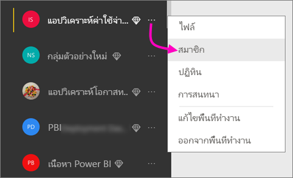
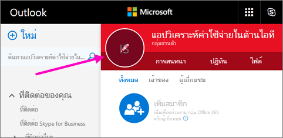
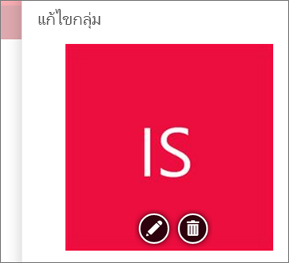
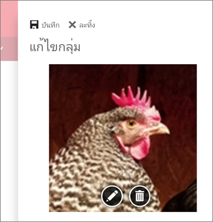
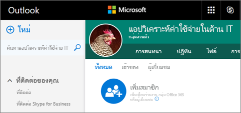
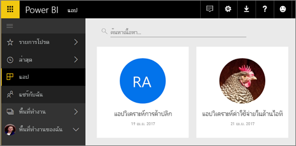

# สร้างและเผยแพร่แอปฯด้วยแดชบอร์ดและรายงานใน Power BI

ใน Power BI คุณสามารถสร้าง*แอปฯ*เพื่อรวมแดชบอร์ดและรายงานที่เกี่ยวข้องเข้าด้วยกันทั้งหมดในที่เดียว จากนั้นเผยแพร่ไปยังกลุ่มบุคคลขนาดใหญ่ในองค์กรของคุณได้ นอกจากนี้ คุณยังสามารถเชื่อมต่อกับ[แอปฯ Power BI สำหรับบริการภายนอก](service-connect-to-services.md)ได้ เช่น Google Analytics และ Microsoft Dynamics CRM

ผู้ใช้ทางธุรกิจของคุณจำเป็นต้องมีหลายแดชบอร์ดและรายงาน Power BI เพื่อการบริหารธุรกิจของตน แอปรวมองค์ประกอบต่าง ๆ เข้าด้วยกันเพื่อให้ผู้ใช้ไม่จำเป็นต้องจำชื่อและตำแหน่งที่ตั้งของแดชบอร์ดเหล่านี้ทั้งหมด ด้วยแอป Power BI คุณสามารถสร้างคอลเลกชันของแดชบอร์ดและรายงาน และเผยแพร่แอปเหล่านี้ไปยังองค์กรของคุณ หรือไปยังบุคคลหรือกลุ่มที่เฉพาะเจาะจงได้ สำหรับคุณในฐานะผู้สร้างรายงานหรือผู้ดูแลระบบ แอปฯทำให้ง่ายต่อการจัดการสิทธิ์บนคอลเลกชันของแดชบอร์ด

ผู้ใช้ทางธุรกิจได้รับแอปฯของคุณในสองสามวิธีที่แตกต่างกัน ถ้าผู้ดูแลระบบ Power BI ให้สิทธิ์คุณ คุณสามารถติดตั้งสิทธิ์เหล่านี้ได้โดยอัตโนมัติในบัญชีผู้ใช้ Power BI ของเพื่อนร่วมงานของคุณ หรือเพื่อนร่วมงานของคุณสามารถติดตั้งแอปฯของคุณจาก Microsoft AppSource หรือคุณสามารถส่งลิงก์ได้โดยตรง พวกเขาสามารถค้นหาและกลับไปยังเนื้อหาของคุณได้อย่างง่ายดายเนื่องจากทั้งหมดอยู่ในที่เดียว พวกเขาจะได้รับอัปเดตโดยอัตโนมัติ และคุณสามารถควบคุมความถี่ในการรีเฟรชข้อมูลได้ อ่านเพิ่มเติมเกี่ยวกับการ[ประสบการณ์การใช้งานแอปฯสำหรับผู้ใช้ทางธุรกิจ](service-install-use-apps.md)

### สิทธิ์การใช้งานสำหรับแอปฯ
ในฐานะเป็นผู้สร้างแอปฯ คุณจำเป็นต้องมีสิทธิ์การใช้งาน Power BI Pro ผู้ใช้แอปของคุณสามารถดูแอปของคุณได้ด้วยสองทางเลือก

* ตัวเลือกที่ 1: ผู้ใช้แอปได้ถูกกำหนดให้มีสิทธิ์การใช้งาน**Power BI Pro** 
* ตัวเลือกที่ 2: ผู้ใช้แอปไม่ได้ถูกกำหนดให้มีสิทธิ์การใช้งาน**Power BI Pro** แต่แอปอยู่ในความจุของ Power BI Premium อ่าน[Power BI Premium คืออะไร](service-premium.md)สำหรับรายละเอียด

### แอปฯและชุดเนื้อหาองค์กร
แอปฯเป็นวิวัฒนาการของชุดเนื้อหาองค์กร ถ้าคุณมีชุดเนื้อหาองค์กรอยู่แล้ว ชุดเนื้อหาเหล่านี้จะยังสามารถใช้งานร่วมกันไปกับแอปฯได้

หลังจากที่คุณมีภาพรวมของแอปฯแล้ว เรามาพูดคุยเกี่ยวกับ*พื้นที่ทำงานแอปฯ*กัน ซึ่งเป็นพื้นที่ที่่คุณสร้างแอปฯต่าง ๆ ขึ้น 

## วิดีโอ: แอปฯและพื้นที่ทำงานของแอปฯ
<iframe width="640" height="360" src="https://www.youtube.com/embed/Ey5pyrr7Lk8?showinfo=0" frameborder="0" allowfullscreen></iframe>

## พื้นที่ทำงานของแอปฯ
*พื้นที่ทำงานแอปฯ*เป็นสถานที่ที่คุณสร้างแอปฯต่าง ๆ ขึ้น ดังนั้น คุณจำเป็นต้องสร้างพื้นที่ทำงานแอปฯขึ้นก่อน ก่อนที่จะสร้างแอปฯที่ต้องการ ถ้าคุณเคยทำงานในพื้นที่ทำงานกลุ่มใน Power BI คุณจะคุ้นเคยมากขึ้นกับพื้นที่ทำงานแอปฯ พื้นที่ทำงานแอปฯพัฒนามาจากพื้นที่ทำงานกลุ่ม นั่นคือ พื้นที่จัดเตรียมและคอนเทนเนอร์สำหรับเนื้อหาในแอปฯ 

คุณสามารถเพิ่มผู้ร่วมงานไปยังพื้นที่ทำงานเหล่านี้ได้ในฐานะเป็นสมาชิกหรือเป็นผู้ดูแลระบบ สมาชิกพื้นที่ทำงานแอปฯและผู้ดูแลระบบทั้งหมดจำเป็นต้องมีสิทธิ์การใช้งาน Power BI Pro ในพื้นที่ทำงานนี้ คุณสามารถทำงานร่วมกันบนแดชบอร์ด รายงาน และบทความอื่น ๆ ทั้งหมดที่คุณวางแผนที่จะเผยแพร่ ไปยังผู้ชมจำนวนมากหรือทั้งองค์กรของคุณ 

เมื่อเนื้อหาพร้อมแล้ว คุณเลือกว่าแดชบอร์ดและรายงานใดที่คุณต้องการเผยแพร่ จากนั้นเผยแพร่แอปฯ คุณสามารถส่งลิงก์โดยตรงไปยังผู้ชมที่มากกว่านั้นได้ หรือผู้ชมสามารถค้นหาแอปฯของคุณจากแท็บ Apps โดยไปที่**ดาวน์โหลด และสำรวจแอปฯเพิ่มเติมจาก AppSource** บุคคลเหล่านั้นไม่สามารถปรับเปลี่ยนเนื้อหาของแอปฯได้ แต่พวกเขาสามารถโต้ตอบกับข้อมูลในบริการ Power BI หรือหนึ่งในแอปฯมือถือได้ สามารถกรอง ทำไฮไลท์ และเรียงลำดับข้อมูลด้วยตนเองได้ 

## สร้างพื้นที่ทำงานสำหรับแอปฯ
[!INCLUDE [powerbi-service-create-app-workspace](./includes/powerbi-service-create-app-workspace.md)]

พื้นที่ทำงานแอปฯว่างเปล่า ให้คุณเพิ่มเนื้อหาลงในนั้น โปรดสังเกตว่า เมื่อคุณเริ่มสร้างพื้นที่ทำงานแอปฯขึ้น คุณอาจจำเป็นต้องรอเป็นเวลาหนึ่งชั่วโมงหรือมากกว่านั้น เพื่อให้พื้นที่ทำงานเผยแพร่ไปยัง Office 365 

การเพิ่มเนื้อหาจะเหมือนกับการเพิ่มเนื้อหาไปยัง My Workspace ของคุณ ยกเว้นว่าบุคคลอื่นในพื้นที่ทำงานสามารถดูและทำงานในเนื้อหานั้นได้เช่นกัน ความแตกต่างอย่างมากเมื่อคุณทำเสร็จแล้วคือ คุณสามารถเผยแพร่เนื้อหาในฐานะเป็นแอปฯ ขณะที่ในพื้นที่ทำงานแอปฯ คุณสามารถอัปโหลดหรือเชื่อมต่อกับไฟล์ต่าง ๆ หรือเชื่อมต่อกับบริการของบุคคลภายนอกได้ เหมือนกับที่คุณทำใน My Workspace ของคุณเอง ตัวอย่างเช่น:

* [เชื่อมต่อกับบริการ](service-connect-to-services.md)เช่น Microsoft Dynamics CRM, Salesforce หรือ Google Analytics
* [รับข้อมูลจากไฟล์](service-get-data-from-files.md)เช่น ไฟล์ Excel, CSV หรือ Power BI Desktop (PBIX)

เมื่อคุณดูเนื้อหาในพื้นที่ทำงานแอปฯ ระบบจะแสดงเจ้าของแอปฯเป็นชื่อของพื้นที่ทำงานแอปฯ

## เพิ่มรูปภาพลงในแอปฯของคุณ (เป็นทางเลือก)
ตามค่าเริ่มต้น Power BI สร้างวงกลมสีขนาดเล็กสำหรับแอปฯของคุณด้วยชื่อย่อของแอปฯ แต่คุณอาจต้องการกำหนดด้วยตนเองด้วยรูปภาพหนึ่ง ในการเพิ่มรูปภาพ คุณจำเป็นต้องมีสิทธิ์การใช้งาน Exchange Online

1. เลือก**พื้นที่ทำงาน** เลือกจุดไข่ปลา (...) ที่อยู่ถัดจากชื่อของพื้นที่ทำงาน จากนั้นเลือก**สมาชิก** 
   
     
   
    บัญชี Office 365 Outlook สำหรับพื้นที่ทำงานเปิดขึ้นในหน้าต่างเบราว์เซอร์ใหม่
2. เมื่อคุณเลื่อนไปเหนือวงกลมสีที่ด้านบนซ้าย วงกลมนั้นจะเปลี่ยนเป็นไอคอนรูปดินสอ เลือกไอคอนนั้น
   
     
3. เลือกไอคอนรูปดินสออีกครั้งและค้นหารูปภาพที่คุณต้องการใช้
   
     
4. เลือก**บันทึก**
   
     
   
    รูปภาพแทนที่วงกลมสีในหน้าต่าง Office 365 Outlook 
   
     
   
    ในไม่กี่นาที ภาพจะปรากฏในแอปฯใน Power BI ด้วยเหมือนกัน
   
     

## เผยแพร่แอปฯของคุณ
เมื่อแดชบอร์ดและรายงานในพื้นที่ทำงานของแอปฯพร้อมแล้ว คุณเผยแพร่เป็นแอปฯได้ โปรดทราบว่า คุณไม่จำเป็นต้องเผยแพร่รายงานและแดชบอร์ดทั้งหมดในพื้นที่ทำงานของคุณ คุณสามารถเผยแพร่เฉพาะส่วนที่พร้อมได้

1. ในมุมมองรายการพื้นที่ทำงาน ตัดสินใจเลือกแดชบอร์ดและรายงานที่คุณต้องการให้รวมอยู่ในแอปฯ

     

     ถ้าคุณเลือกที่จะไม่เผยแพร่รายงาน คุณจะเห็นคำเตือนถัดจากรายงานและแดชบอร์ดที่เกี่ยวข้องกับรายงาน คุณยังสามารถเผยแพร่แอปฯนั้นได้ แต่ไทล์ของแดชบอร์ดที่เกี่ยวข้องจะหายไปจากรายงานนั้น

     

2. เลือกปุ่ม**เผยแพร่แอปฯ**ที่มุมบนขวาเพื่อเริ่มกระบวนการของการแชร์เนื้อหาทั้งหมดในพื้นที่ทำงานนั้น
   
     

3. บน**รายละเอียด** กรอกข้อมูลในคำอธิบายเพื่อช่วยให้ผู้คนพบแอปฯ คุณสามารถตั้งค่าสีพื้นหลังเพื่อปรับแต่ง
   
     

4. บน**เนื้อหา** คุณสามารถดูเนื้อหาที่จะเผยแพร่เป็นส่วนหนึ่งของแอปฯได้ ซึ่งเป็นทุกสิ่งที่คุณเลือกไว้ในพื้นที่ทำงานนั้น นอกจากนี้ คุณยังสามารถตั้งค่าหน้าเริ่มต้นแอปฯได้ ซึ่งเป็นหน้าที่ผู้ใช้จะเห็นแดชบอร์ดหรือรายงานเป็นอันดับแรก เมื่อไปยังแอปฯของคุณ คุณสามารถเลือก**ไม่มี (None)** ได้ จากนั้น ผู้ใช้จะไปยังรายการของเนื้อหาทั้งหมดในแอปฯ 
   
     

5. ที่**การเข้าถึง** ตัดสินใจว่าใครที่สามารถเข้าถึงแอปฯได้: ไม่ว่าจะเป็นทุกคนในองค์กรของคุณ หรือบุคคลที่เฉพาะเจาะจง หรือกลุ่มความปลอดภัย Active Directory ถ้าคุณมีสิทธิ์ต่าง ๆ คุณสามารถตัดสินใจที่จะติดตั้งแอปฯโดยอัตโนมัติสำหรับผู้รับได้ คุณสามารถเปิดใช้งานการตั้งค่านี้ได้ใน[พอร์ทัลผู้ดูแลระบบของ Power BI](#how-to-enable-pushing-apps) คุณสามารถเรียนรู้เพิ่มเติมในข้อควรพิจารณาสำหรับ[ส่งแอปฯ](#how-to-enable-pushing-apps)ได้

    

6. เมื่อคุณเลือก**เสร็จสิ้น** คุณจะเห็นข้อความยืนยันว่าแอปฯพร้อมสำหรับการเผยแพร่ ในกล่องโต้ตอบความสำเร็จ คุณสามารถคัดลอก URL ซึ่งเป็นลิงก์โดยตรงไปยังแอปฯของคุณ และส่งลิงก์นี้ไปยังบุคคลที่คุณแชร์ด้วยได้
   
     

ผู้ใช้ทางธุรกิจที่คุณได้เผยแพร่แอปฯไปนั้น สามารถค้นหาแอปฯของคุณได้ด้วยสองสามวิธี ถ้าคุณสามารถติดตั้งแอปฯโดยอัตโนมัติได้ แอปฯจะปรากฏขึ้นใต้ Apps ในบัญชี Power BI ของพวกเขา คุณสามารถส่งลิงก์โดยตรงของแอปฯ หรือผู้ใช้สามารถค้นหาได้ใน Microsoft AppSource ซึ่งพวกเขาจะเห็นแอปฯทั้งหมดที่พวกเขาสามารถเข้าถึงได้ ไม่ว่าผู้ใช้จะดาวน์โหลดแอปฯด้วยวิธีใดก็ตาม หลังจากนั้นเมื่อผู้ใช้ไปยัง Apps ผู้ใช้เหล่านี้จะเห็นแอปฯนี้ในรายการของตน

อ่านเพิ่มเติมเกี่ยวกับการ[ประสบการณ์การใช้งานแอปฯสำหรับผู้ใช้ทางธุรกิจ](service-install-use-apps.md)

## เปลี่ยนแอปฯที่คุณเผยแพร่
หลังจากที่คุณเผยแพร่แอปฯ คุณอาจต้องการเปลี่ยนแปลงหรือปรับปรุงแอปฯนั้น การอัปเดตเป็นเรื่องง่ายถ้าคุณเป็นผู้ดูแลระบบหรือเป็นสมาชิกของพื้นที่ทำงานแอปฯ 

1. เปิดพื้นที่ทำงานแอปฯที่สอดคล้องกับแอปฯดังกล่าว 
   
     
2. เปิดแดชบอร์ดหรือรายงาน คุณจะเห็นว่าคุณสามารถทำการเปลี่ยนแปลงที่คุณต้องการได้
   
     พื้นที่ทำงานแอปฯเป็นพื้นที่ที่คุณจัดเตรียม ดังนั้น การเปลี่ยนแปลงของคุณจะยังไม่ถูกส่งไปยังแอปฯจนกว่าคุณจะเผยแพร่อีกครั้ง ซึ่งนี่ช่วยให้คุณทำการเปลี่ยนแปลงได้โดยไม่กระทบต่อแอปฯที่เผยแพร่แล้ว  
 
3. ย้อนกลับไปยังรายการพื้นที่ทำงานแอปฯของเนื้อหาและเลือก**อัปเดตแอปฯ**
   
     

4. อัปเดต**รายละเอียด**, **เนื้อหา**และ**การเข้าถึง** ถ้าคุณจำเป็นต้องอัปเดต ให้เลือก**อัปเดตแอปฯ**
   
     

บุคคลที่คุณได้เผยแพร่แอปฯด้วยนั้นจะเห็นแอปฯเวอร์ชั่นที่อัปเดตโดยอัตโนมัติ 

# ติดตั้งแอปฯโดยอัตโนมัติสำหรับผู้ใช้ปลายทาง
คุณสามารถติดตั้งแอปฯโดยอัตโนมัติสำหรับผู้ใช้ปลายทางได้ ทำให้ง่ายต่อการกระจายแอปฯไปยังผู้ใช้งานหรือกลุ่มต่าง ๆ ที่ถูกต้องได้

แอปฯจะส่งข้อมูลที่ผู้ใช้จำเป็นต้องใช้ในการทำงานของตน ในตอนนี้คุณสามารถติดตั้งแอปฯเหล่านี้โดยอัตโนมัติในเนื้อหารายการ Apps แทนการต้องค้นหาจาก Microsoft AppSource หรือการตามลิงก์สำหรับการติดตั้ง ซึ่งนี่ทำให้ง่ายต่อการเผยแพร่เนื้อหา Power BI มาตรฐานไปยังผู้ใช้ของคุณ

## วิธีการติดตั้งแอปฯโดยอัตโนมัติสำหรับผู้ใช้ปลายทาง
เมื่อผู้ดูแลระบบได้เปิดใช้งานคุณลักษณะ ผู้เผยแพร่แอปฯจะมีตัวเลือกใหม่ที่พร้อมใช้งานในการ**ติดตั้งแอปฯโดยอัตโนมัติ** เมื่อ***เลือก***กล่องข้อความนั้นแล้ว และผู้เผยแพร่แอปพลิเคชันเลือก**เสร็จสิ้น** (หรือ**อัปเดตแอปฯ**สำหรับแอปฯที่มีอยู่) แอปฯจะถูกส่งไปยังผู้ใช้หรือกลุ่มทั้งหมดที่กำหนดไว้ในส่วน**สิทธิ์การใช้งาน**ของแอปฯบนแท็บ**การเข้าถึง**

## วิธีที่ผู้ใช้รับแอปฯซึ่งส่งไปให้พวกเขา
หลังจากที่คุณส่งแอปฯไปแล้ว แอปฯดังกล่าวจะแสดงอยู่ในรายการ Apps โดยอัตโนมัติ คุณสามารถจัดการแอปฯที่ผู้ใช้งานหรือบทบาทงานในองค์กรของคุณจำเป็นต้องมี ได้ด้วยเพียงปลายนิ้วของพวกเขา

### ข้อควรพิจารณาสำหรับการติดตั้งแอปฯโดยอัตโนมัติ
นี่คือบางสิ่งที่ควรทราบเมื่อส่งแอปฯไปยังผู้ใช้ปลายทาง:

* การติดตั้งแอปฯโดยอัตโนมัติสำหรับผู้ใช้อาจต้องใช้เวลา แอปฯส่วนใหญ่จะติดตั้งทันทีสำหรับผู้ใช้ แต่การส่งแอปฯอาจใช้เวลา  ซึ่งขึ้นอยู่กับจำนวนของรายการในแอปฯและจำนวนของบุคคลที่สามารถเข้าถึงได้ เราขอแนะนำให้ส่งแอปฯในช่วงนอกเวลาใช้งานและส่งแอปฯให้มีระยะเวลาห่างก่อนใช้งานมากพอสมควร ตรวจสอบกับผู้ใช้หลายรายก่อนที่จะสื่อสารเกี่ยวกับความพร้อมใช้งานแอปฯไปยังผู้ใช้จำนวนมาก

* รีเฟรชเบราว์เซอร์ของคุณ ก่อนที่จะเห็นแอปฯที่ส่งไปในรายการ Apps ผู้ใช้อาจจำเป็นต้องรีเฟรช หรือปิดและเปิดเบราว์เซอร์ของตนอีกครั้ง

* ถ้าผู้ใช้ไม่เห็นแอปฯในรายการ Apps โดยทันที ผู้ใช้ควรรีเฟรช หรือปิดและเปิดเบราว์เซอร์ของตนอีกครั้ง

* พยายามอย่าส่งแอปฯมากเกินไป ระมัดระวังไม่ให้มีการส่งแอปฯมากเกินไป เพื่อให้ผู้ใช้ของคุณรู้สึกว่าแอปฯที่ติดตั้งไว้ล่วงหน้าจะมีประโยชน์กับพวกเขา เป็นเรื่องดีที่คุณควรควบคุมว่าใครสามารถส่งแอปฯให้กับผู้ใช้ปลายทางได้ เพื่อให้เหมาะสมกับกำหนดเวลา คุณสามารถกำหนดผู้ติดต่อสำหรับการรับแอปฯในองค์กรของคุณที่ส่งไปยังผู้ใช้ปลายทางได้

* ผู้ใช้ภายนอกที่ไม่ได้ยอมรับคำเชิญจะไม่ได้รับการติดตั้งแอปฯโดยอัตโนมัติ  

## ยกเลิกการเผยแพร่แอปฯ
สมาชิกของพื้นที่ทำงานแอปฯสามารถยกเลิกการเผยแพร่แอปฯได้

* ในพื้นที่ทำงานแอปฯ เลือกจุดไข่ปลา (**...** ) ที่มุมขวาบน > **ยกเลิกการเผยแพร่แอปฯ**
  
     

การดำเนินการนี้จะถอนการติดตั้งแอปฯสำหรับทุกคนที่คุณได้เผยแพร่ไป และบุคคลเหล่านี้จะไม่สามารถเข้าถึงแอปฯได้อีกต่อไป ขั้นตอนนี้จะไม่ลบพื้นที่ทำงานแอปฯหรือเนื้อหา

## แอปฯ Power BI ถามที่ถามบ่อย
### พื้นที่ทำงานแอปฯแตกต่างจากพื้นที่ทำงานกลุ่มอย่างไร?
ด้วยการเผยแพร่นี้ เราได้เปลี่ยนชื่อพื้นที่ทำงานกลุ่มทั้งหมดเป็นพื้นที่ทำงานแอปฯ คุณสามารถเผยแพร่แอปฯจากส่วนใด ๆ ของพื้นที่ทำงานเหล่านี้ได้ ฟังก์ชันการทำงานส่วนใหญ่ยังคงเหมือนกันกับพื้นที่ทำงานของกลุ่ม ในอีกสองสามเดือนข้างหน้าเราวางแผนที่ปรับปรุงพื้นที่ทำงานของแอปฯดังต่อไปนี้: 

* การสร้างพื้นที่ทำงานของแอปฯจะไม่สร้างเอนทิตีที่สอดคล้องกันใน Office 365 เหมือนกับพื้นที่ทำงานของกลุ่มสร้าง ดังนั้น คุณสามารถสร้างแอปฯจำนวนใดก็ได้โดยไม่ต้องกังวลเกี่ยวกับกลุ่ม Office 365 ที่แตกต่างกันที่สร้างอยู่เบื้องหลัง (คุณยังคงสามารถใช้ OneDrive for Business ของกลุ่ม Office 365 เพื่อจัดเก็บไฟล์ของคุณได้) 
* ปัจจุบันคุณสามารถเพิ่มเฉพาะบุคคลไปยังรายการสมาชิกและผู้ดูแลระบบได้เท่านั้น อีกไม่นานคุณจะสามารถเพิ่มกลุ่มความปลอดภัย AD หรือกลุ่มสมัยใหม่หลายกลุ่มไปยังรายการเหล่านี้ได้ เพื่อให้สามารถจัดการได้ง่ายขึ้น  

### แอปฯต่าง ๆ แตกต่างจากชุดเนื้อหาองค์กรอย่างไร?
แอปฯเป็นการพัฒนาและการทำให้ชุดเนื้อหามีความซับซ้อนน้อยลง โดยมีความแตกต่างที่สำคัญสองสามรายการ 

* หลังจากที่ผู้ใช้ธุรกิจติดตั้งชุดเนื้อหาแล้ว ชุดเนื้อหานั้นจะสูญเสียข้อมูลประจำตัวที่จัดกลุ่ม ซึ่งเป็นเพียงรายการของแดชบอร์ดและรายงานที่ค่อย ๆ มาพร้อมกับแดชบอร์ดและรายงานอื่น ๆ อีกนัยหนึ่ง แอปฯยังคงรักษาการจัดกลุ่มและข้อมูลประจำตัวของตนไว้ได้หลังจากติดตั้ง ซึ่งทำให้ง่ายสำหรับผู้ใช้ทางธุรกิจในการนำทางไปยังแอปฯอย่างต่อเนื่องเมื่อเวลาผ่านไป
* คุณสามารถสร้างหลายชุดเนื้อหาจากพื้นที่ทำงานใด ๆ ได้ แต่จะเป็นแอปฯที่มีความสัมพันธ์ 1:1 กับพื้นที่ทำงานของแอปฯ เราเชื่อว่านี่ทำให้แอปฯง่ายต่อการทำความเข้าใจและการรักษาให้ใช้งานได้เช่นเดิมเมื่อใช้เป็นเวลานาน ดูส่วนแผนการทำงานของบล็อก Power BI สำหรับข้อมูลเพิ่มเติมเกี่ยวกับวิธีที่เราวางแผนการปรับปรุงในส่วนนี้ 
* เมื่อเวลาผ่านไป เราวางแผนที่จะยกเลิกการสนับสนุนชุดเนื้อหาองค์กร จากนี้ไป เราขอแนะนำให้คุณสร้างแอปฯขึ้น  

### แล้วสมาชิกแบบอ่านอย่างในกลุ่มต่าง ๆ ล่ะ?
ในกลุ่มต่าง ๆ คุณสามารถเพิ่มสมาชิกแบบอ่านอย่างเดียวที่ไม่สามารถดูเนื้อหาได้ ปัญหาหลักสำหรับวิธีนี้คือ คุณไม่สามารถเพิ่มกลุ่มความปลอดภัยในฐานะเป็นสมาชิกได้ 

ด้วยแอปฯ คุณสามารถเผยแพร่พื้นที่ทำงานของแอปฯในเวอร์ชันแบบอ่านอย่างเดียวไปยังผู้ชมกลุ่มใหญ่ได้ รวมถึงกลุ่มความปลอดภัยด้วย คุณสามารถกำหนดระยะการเปลี่ยนแปลงของคุณไปยังแดชบอร์ดและรายงานในแอปฯได้โดยไม่กระทบต่อผู้ใช้ปลายทาง เราขอแนะนำให้ใช้แอปฯด้วยวิธีนี้ในอนาคต ในแผนระยะยาว เราวางแผนที่จะยกเลิกสนับสนุนสมาชิกแบบอ่านอย่างเดียวของพื้นที่ทำงานด้วยเช่นกัน  

## ขั้นตอนถัดไป
* [ติดตั้งและใช้แอปฯใน Power BI](service-install-use-apps.md)
* [แอปฯ Power BI สำหรับบริการภายนอก](service-connect-to-services.md)
* [พอร์ทัลผู้ดูแล Power BI](https://docs.microsoft.com/en-us/power-bi/service-admin-portal)
* มีคำถามหรือไม่? [ลองถามชุมชน Power BI](http://community.powerbi.com/)
