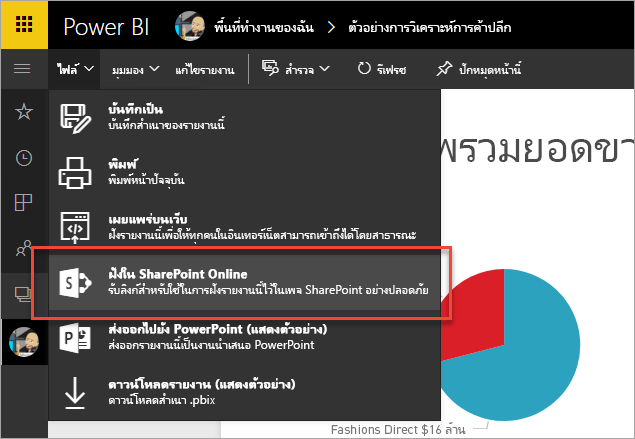
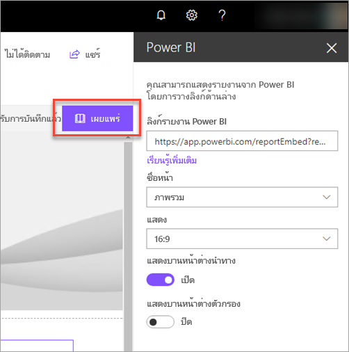

# ฝังด้วยส่วนเว็บรายงานใน SharePoint Online

ด้วยส่วยรายงานเว็บ Power BI ใหม่ สำหรับ SharePoint Online คุณสามารถฝังรายงาน Power BI แบบโต้ตอบได้อย่างง่ายดายในหน้า SharePoint Online

เมื่อใช้ตัวเลือกใหม่**ฝังใน SharePoint Online** รายงานที่ฝังตัวนั้นมีความปลอดภัยโดยทั้งหมด ดังนั้นคุณจะสามารถสร้างพอร์ทัลความปลอดภัยภายใน

## ข้อกำหนด

มีความต้องการบางตัวสำหรับรายงานที่**ฝังใน SharePoint Online**เพื่อทำงาน

* Power BI web part สำหรับ SharePoint Online จำเป็นต้องใช้[หน้าที่ทันสมัย](https://support.office.com/article/Allow-or-prevent-creation-of-modern-site-pages-by-end-users-c41d9cc8-c5c0-46b4-8b87-ea66abc6e63b)

## ฝังรายงานของคุณ

เมื่อต้องฝังรายงานของคุณลงใน SharePoint Online ก่อนอื่นคุณต้องรับ URL สำหรับรายงาน และจากนั้นใช้ URL กับ web part ใหม่ของ Power BI ภายใน SharePoint Online

### รับ URL ลงในรายงานของคุณ

1. ภายใน Power BI service

2. เลือกเมนู**แฟ้ม**

3. เลือก**ฝังใน SharePoint Online**
   
    

4. คัดลอก URL จากกล่องโต้ตอบ

    

   > [!NOTE]
   > คุณยังสามารถใช้ URL ที่จะแสดงในแถบที่อยู่ของเว็บเบราว์เซอร์ของคุณเมื่อดูรายงาน URL จะประกอบด้วยหน้ารายงานที่คุณกำลังดู คุณจะจำเป็นต้องลบส่วนรายงาน จาก URL ถ้าคุณต้องการใช้หน้าอื่น

### เพิ่มรายงาน Power BI ลงในหน้า SharePoint Online

1. เปิดหน้าที่ต้องการใน SharePoint Online และเลือก**แก้ไข**

    

    หรือ สร้างไซต์ที่ทันสมัยใหม่ โดยการเลือก **+ ใหม่**ภายใน SharePoint Online

    

2. เลือก**+** และเลือก**Power BI** web part

    

3. เลือก**เพิ่มรายงาน**

    

4. ส่ง URL ของรายงานไปยังบานหน้าต่างคุณสมบัติ นี่คือ URL ที่คุณคัดลอกจากขั้นตอนด้านบน รายงานจะโหลดโดยอัตโนมัติ

    

5. เลือก**เผยแพร่**เพื่อทำการเปลี่ยนแปลงการมองเห็นให้ผู้ใช้ SharePoint Online ของคุณ

    

## กำลังอนุญาตการเข้าถึงรายงาน

ฝังรายงานใน SharePoint Online ไม่ให้ผู้ใช้สิทธิ์ในการดูรายงานโดยอัตโนมัติ สิทธิ์ในการดูรายงานถูกตั้งค่าใน Power BI service

> [!IMPORTANT]
> ให้ตรวจสอบให้แน่ใจว่าว่าใครสามารถดูรายงานภายใน Power BI service และอนุญาตให้เข้าถึงสิ่งที่ไม่ได้อยู่ในรายการ

มีสองวิธีที่จะเข้าถึงรายงานภายใน Power BI service ถ้าคุณกำลังใช้กลุ่ม Office 365 เพื่อสร้างไซต์ทีม SharePoint Online ของคุณ คุณได้สร้างรายการผู้ใช้ในฐานะสมาชิกของ **พื้นที่ทำงานแอปภายในบริการ Power BI** และ **หน้า SharePoint** สิ่งนี้จะทำให้แน่ใจว่าผู้ใช้สามารถดูเนื้อหาของกลุ่มนั้นได้ สำหรับข้อมูลเพิ่มเติม ให้ดู[สร้างและกระจายแอปใน Power BI](service-create-distribute-apps.md)

อีกวิธีหนึ่งคือ คุณสามารถให้ผู้ใช้เข้าถึงรายงานของคุณ โดยทำต่อไปนี้

1. เพิ่มไทล์จากรายงานไปยังแดชบอร์ด

2. แชร์แดชบอร์ดกับผู้ใช้ที่ต้องการเข้าถึงรายงาน สำหรับข้อมูล ให้ดู[แชร์แดชบอร์ดกับเพื่อนร่วมงานและผู้อื่น](service-share-dashboards.md)

## ตั้งค่า web part

ด้านล่างเป็นคำอธิบายของการตั้งค่าที่สามารถปรับปรุงของ Power BI web part สำหรับ SharePoint Online

| คุณสมบัติ | คำอธิบาย |
| --- | --- |
| ชื่อหน้า |ตั้งค่าหน้าเริ่มต้นที่แสดง โดย web part เลือกค่าจากดร๊อปดาวน์ ถ้าไม่มีการแสดงหน้า รายงานของคุณมีหน้าหนึ่ง หรือ URL ที่คุณวางมีชื่อหน้า ลบส่วนของรายงานจาก URL เมื่อต้องเลือกหน้าใดหน้าหนึ่ง |
| แสดง |ตัวเลือกวิธีปรับปรุงรายงานให้พอดีกับหน้า SharePoint Online |
| แสดงบานหน้าต่างนำทาง |แสดงหรือซ่อนบานหน้าหน้าต่างนำทาง |
| แสดงบานหน้าต่างตัวกรอง |แสดงหรือซ่อนบานหน้าต่างตัวกรอง |

## การรับรองตัวตนแบบหลายปัจจัย

ถ้าสภาพแวดล้อม Power BI ของคุณคุณจะบังคับให้ลงชื่อเข้าใช้โดยใช้การรับรองตัวตนแบบหลายปัจจัย คุณอาจถูกขอให้ลงชื่อเข้าใช้ ด้วยอุปกรณ์ความปลอดภัยเพื่อตรวจสอบความเป็นตัวตนของคุณ สิ่งนี้จะเกิดขึ้นถ้าคุณไม่ได้ไม่ลงชื่อเข้าใช้ไปยัง SharePoint Online โดยใช้การรับรองตัวตนแบบหลายปัจจัย แต่สภาพแวดล้อม Power BI ของคุณ จำเป็นต้องมีบัญชีผู้ใช้โดยอุปกรณ์ความปลอดภัย

> [!NOTE]
> การรับรองความถูกต้องโดยใช้หลายปัจจัยยังไม่รองรับ Azure Active Directory 2.0 ผู้ใช้จะได้รับข้อความที่กล่าวว่า*ข้อผิดพลาด* ถ้าผู้ใช้ลงชื่อเข้าใช้ไปยัง SharePoint Online อีกครั้ง โดยใช้อุปกรณ์ความปลอดภัยของพวกเขา พวกเขาอาจสามารถดูรายงาน

## รายงานที่โหลดไม่ได้

รายงานของคุณอาจไม่โหลดภายใน web part ของ Power BI และอาจแสดงข้อความต่อไปนี้

*เนื้อหานี้ไม่พร้อมใช้งาน*

มีเหตุผลโดยทั่วไปสำหรับข้อความนี้สองตัว

1. คุณไม่สามารถเข้าถึงรายงาน
2. รายงานถูกลบ

คุณควรติดต่อกับเจ้าของหน้า SharePoint Online เพื่อช่วยให้คุณสามารถแก้ไขปัญหาได้

## ปัญหาและขีดจำกัดที่ทราบแล้ว

* ข้อผิดพลาด: "เกิดข้อผิดพลาด โปรดลองออกจากระบบ และย้อนกลับมา แล้วเข้ามาเยี่ยมชมหน้านี้อีกครั้ง รหัสความสัมพันธ์: ไม่ได้ถูกกำหนด, สถานะการตอบสนอง http: 400, ข้อผิดพลาดเซิร์ฟเวอร์รหัส 10001, ข้อความ: โทเค็นรีเฟรชหายไป"
  
  ถ้าคุณได้รับข้อผิดพลาดนี้ โปรดหนึ่งในสิ่งต่อไปนี้
  
  1. ลงชื่อออก SharePoint และลงชื่อเข้าใช้อีกครั้งใน ตรวจสอบให้แน่ใจว่าปิดหน้าต่างเบราว์เซอร์ทั้งหมดก่อนที่ลงชื่อกลับเข้าใช้

  2. ถ้าบัญชีผู้ใช้ของคุณจำเป็นต้องรับรองตัวตนแบบหลายปัจจัย (MFA) ให่ตรวจสอบให้แน่ใจว่า คุณลงชื่อเข้าใช้ไปยัง SharePoint โดยใช้อุปกรณ์รับรองตัวตนแบบหลายปัจจัยของคุณ (แอปมือถือ สมาร์ทการ์ด และอื่น ๆ)
  
  3. บัญชีผู้ใช้ Azure B2B Guest ไม่ได้รับการสนับสนุน ผู้ใช้จะเห็นโลโก้ Power BI ที่แสดงว่าส่วนนี้กำลังโหลด แต่จะไม่แสดงรายงาน

* Power BI ไม่รองรับภาษาเดียวกับที่ SharePoint Online รองรับ ผลที่ได้คือคุณอาจไม่เห็นการแปลที่เหมาะสมภายในรายงานแบบฝังตัว

* คุณอาจพบปัญหาถ้าใช้ Internet Explorer 10 คุณสามารถค้นหาที่[เบราว์เซอร์ที่รองรับ Power BI](service-browser-support.md)และสำหรับ[Office 365](https://products.office.com/office-system-requirements#Browsers-section)ได้

* Web part Power BI จะไม่พร้อมใช้งานใน [sovereign cloud](https://powerbi.microsoft.com/en-us/clouds/)

* SharePoint Server แบบคลาสสิกไม่ได้รับการสนับสนุนด้วย web part นี้

## ขั้นตอนถัดไป

[อนุญาตหรือป้องกันไม่ให้สร้างไซต์แบบสมัยใหม่โดยผู้ใช้ปลายทาง](https://support.office.com/article/Allow-or-prevent-creation-of-modern-site-pages-by-end-users-c41d9cc8-c5c0-46b4-8b87-ea66abc6e63b)  
[สร้างและกระจายแอปฯใน Power BI](service-create-distribute-apps.md)  
[แชร์แดชบอร์ดกับเพื่อนร่วมงานและคนอื่นๆ](service-share-dashboards.md)  
[Power BI Premium คืออะไร](service-premium.md)  

มีคำถามเพิ่มเติมหรือไม่ [ลองถามชุมชน Power BI](http://community.powerbi.com/)