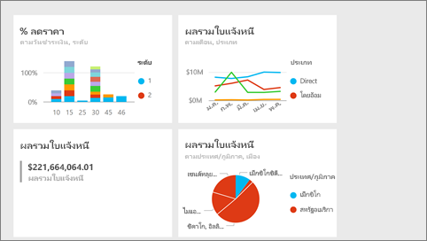
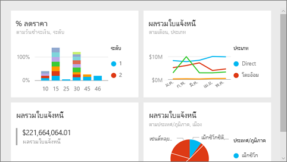
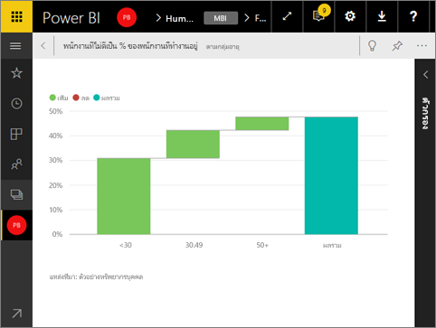

# โหมดเต็มหน้าจอในบริการ Power BI
## โหมดเต็มหน้าจอคืออะไร

แสดงเนื้อหา Power BI ของคุณ (แดชบอร์ด หน้ารายงาน ไทล์ และการแสดงภาพ) โดยปราศจากการรบกวนของเมนูและแถบนำทาง  คุณสามารถดูในมุมมองไม่เปลี่ยนได้แบบเต็มรูปแบบเนื้อหาของคุณได้อย่างรวดเร็ว ตลอดเวลา ซึ่งในบางครั้งจะเรียกว่าโหมดโทรทัศน์ ฟังก์ชันที่พร้อมใช้งานในโหมดเต็มหน้าจอแตกต่างกันไปตามเนื้อหา 

ถ้าคุณกำลังใช้ Power BI บนมือถือ [หน้าจอแบบเต็มพร้อมใช้งานสำหรับแอป Windows 10 สำหรับอุปกรณ์เคลื่อนที่](consumer/mobile/mobile-windows-10-app-presentation-mode.md) Power BI Desktop ไม่มีโหมดเต็มหน้าจอสำหรับรายงานหรือการแสดงภาพ แต่มีพอดีกับหน้าสำหรับ [มุมมองความสัมพันธ์และมุมมองรายงาน](desktop-report-view.md) และ [โหมดโฟกัสสำหรับภาพรายงาน](consumer/end-user-focus.md)

 

การใช้งานบางอย่างในโหมดเต็มหน้าจอเช่น

* นำเสนอแดชบอร์ด ไทล์ รูปภาพ หรือรายงานการประชุมหรือการประชุมของคุณ
* แสดงในที่ทำงานบนหน้าจอขนาดใหญ่แบบเฉพาะหรือใช้เครื่องฉายภาพ
* การดูบนหน้าจอขนาดเล็ก
* การตรวจทานในโหมดล็อก คุณสามารถสัมผัสหน้าจอหรือใช้เมาส์เหนือไทล์โดยไม่ต้องเปิดรายงานหรือแดชบอร์ดพื้นฐาน

> **หมายเหตุ** โหมดเต็มหน้าจอแตกต่างจาก[โหมดโฟกัส (ป๊อปอัพ)](consumer/end-user-focus.md)
> 
> 

ดู Amanda เปิดและนำแดชบอร์ดของเธอไปสู่โหมดเต็มหน้าจอ และใช้พารามิเตอร์ URL บางตัวเพื่อควบคุมการแสดงค่าเริ่มต้น แล้ว ทำตามคำแนะนำทีละขั้นตอนด้านล่างวิดีโอเพื่อลองทำด้วยตนเอง

<iframe width="560" height="315" src="https://www.youtube.com/embed/c31gZkyvC54" frameborder="0" allowfullscreen></iframe>

## แดชบอร์ดและหน้ารายงานในโหมดเต็มหน้าจอ
1. จากแถบเมนูบริการ Power BI ด้านบนแดชบอร์ดหรือรายงานของคุณ ให้เลือก**เต็มหน้าจอ**ไอคอน พื้นที่แดชบอร์ดหรือหน้ารายงานของคุณเป็นแบบเต็มหน้าจอ ตัวอย่างด้านล่างเป็นแดชบอร์ด
   
      
2. ในโหมดเต็มหน้าจอ คุณมีหลายตัวเลือกเมนู  เพื่อแสดงเมนู เพียงย้ายเมาส์หรือเคอร์เซอร์ของคุณ 
   
     เมนูสำหรับแดชบอร์ด    
         
   
     เมนูสำหรับหน้ารายงาน    
        
   
        
    ใช้ปุ่ม**กลับ**เพื่อนำทางไปยังหน้าก่อนหน้าในเบราว์เซอร์ของคุณ ถ้าหน้าก่อนหน้าเป็นหน้า Power BI มันจะแสดงในโหมดเต็มหน้าจอเช่นกัน  โหมดเต็มหน้าจอจะยังคงอยู่จนกว่าคุณออกไป
   
        
    ใช้ปุ่มนี้เพื่อพิมพ์แดชบอร์ดหรือหน้ารายงานของคุณในโหมดแบบเต็มหน้าจอ 
   
        
    ให้ใช้ปุ่ม**จัดให้พอดีกับหน้าจอ** เพื่อแสดงแดชบอร์ดของคุณให้มีขนาดใหญ่ที่สุดที่เป็นไปได้ โดยไม่ต้องปรับแถบเลื่อน     
   
    
   
           
    ในบางครั้งคุณไม่สนใจแถบเลื่อน แต่ต้องการให้แดชบอร์ดเติมความกว้างของช่องว่างที่พร้อมใช้งาน ให้เลือกปุ่ม**ให้พอดีกับความกว้าง**    
   
    
   
           
    ในรายงานแบบเต็มหน้าจอ ให้ใช้ลูกศรเหล่านี้เพื่อย้ายไปมาระหว่างหน้าในรายงาน    
3. เพื่อออกจากโหมดเต็มหน้าจอ ให้เลือกไอคอน**จบการทำงานแบบเต็มหน้าจอ**
   
      

## แสดงภาพและแดชบอร์ดไทล์ในโหมดเต็มหน้าจอ
1. เมื่อต้องการแสดงแดชบอร์ดไทล์และแสดงภาพรายงานในโหมดเต็มหน้าจอ คุณต้องเริ่มต้นด้วยไทล์หรือการแสดงภาพนั้นใน[โหมดโฟกัส](consumer/end-user-focus.md) 
   
    
2. แล้ว เลือกไอคอนเต็มหน้าจอ   สำหรับไทล์หรือรูปภาพ ไทล์หรือรูปภาพจะแสดงเต็มหน้าจอ โดยไม่มีเมนูหรือแถบนำทาง
   
    

## ขั้นตอนถัดไป
[แดชบอร์ดใน Power BI](consumer/end-user-dashboards.md)  
[โหมดโฟกัส](consumer/end-user-focus.md)    

มีคำถามเพิ่มเติมหรือไม่ [ลองไปที่ชุมชน Power BI](http://community.powerbi.com/)

