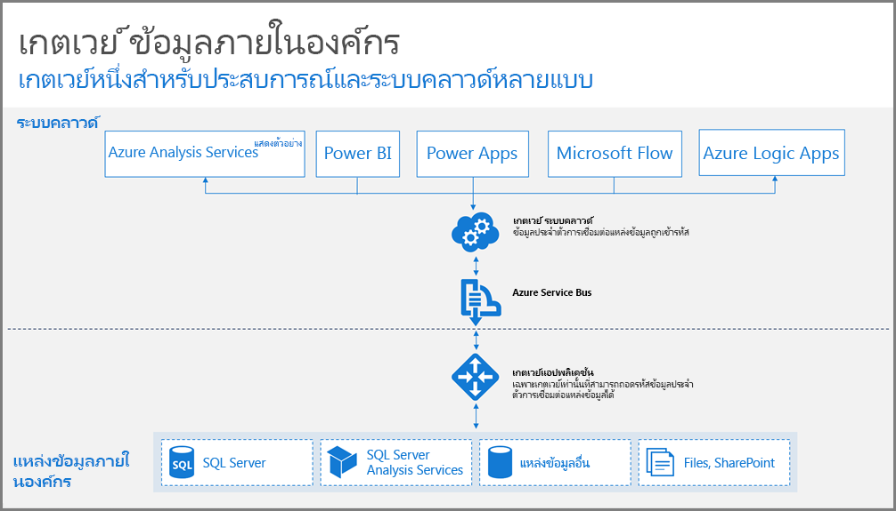
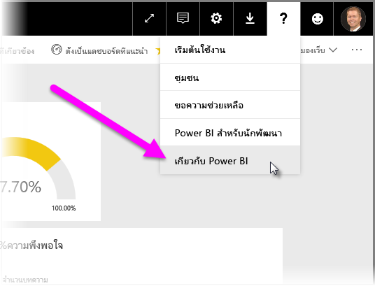
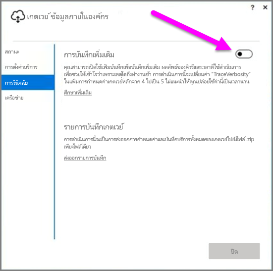
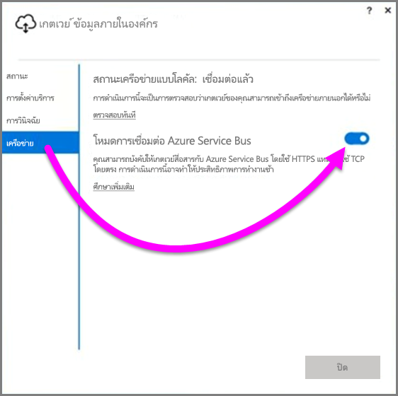
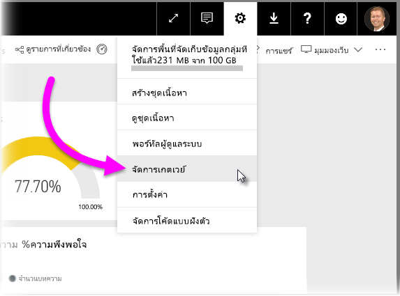

# คำแนะนำสำหรับการปรับใช้เกตเวย์ข้อมูลจาก Power BI

บทความนี้มีคำแนะนำและข้อควรพิจารณาสำหรับการปรับใช้เกตเวย์ข้อมูลในสภาพแวดล้อมเครือข่ายของคุณ **เกตเวย์**เป็นซอฟต์แวร์ที่อำนวยความสะดวกในการเข้าถึงข้อมูลที่อยู่บนเครือข่ายส่วนตัวแบบติดตั้งภายในองค์กร สำหรับการใช้งานอื่นๆ ที่ตามมาในบริการระบบคลาวด์ เช่น Power BI บทความนี้นำคุณไปสู่การปรับใช้และให้คำแนะนำสำหรับ การตั้งค่า**เกตเวย์ข้อมูลแบบติดตั้งภายในองค์กร**

สำหรับข้อมูลเพิ่มเติมเกี่ยวกับ**เกตเวย์ข้อมูลแบบติดตั้งภายในองค์กร**รวมถึงลิงก์เพื่อการติดตั้ง กรุณาดู[โพสต์บนบล็อก](https://powerbi.microsoft.com/blog/power-bi-gateways-march-update/)

## ข้อควรพิจารณาเกี่ยวกับการติดตั้งเกตเวย์ข้อมูลแบบติดตั้งภายในองค์กร
ก่อนเริ่มลงในรายละเอียดของการติดตั้งและการปรับใช้มากเกินไป มีข้อควรพิจารณาที่คุณควรทราบเล็กน้อย ส่วนต่อไปนี้อธิบายถึงสิ่งสำคัญที่ควรทราบ

### จำนวนผู้ใช้
จำนวนผู้ใช้ที่ใช้รายงานที่มีการใช้เกตเวย์เป็นเมตริกสำคัญในการตัดสินใจว่าจะติดตั้งเกตเวย์ที่ใด นี่คือคำถามบางประการที่ควรพิจารณา:

* ผู้ใช้กำลังใช้รายงานเหล่านี้ในเวลาที่แตกต่างของวันหรือไม่
* การเชื่อมต่อชนิดใดบ้างที่พวกเขาใช้ (DirectQuery หรือการนำเข้า)
* ผู้ใช้ทั้งหมดใช้รายงานเดียวกันหรือไม่

ถ้าผู้ใช้ทั้งหมดเข้าถึงรายงานที่มอบให้ในช่วงเวลาเดียวกันของแต่ละวัน คุณจะต้องตรวจสอบให้แน่ใจว่า คุณติดตั้งเกตเวย์บนเครื่องที่มีความสามารถในการจัดการคำขอดังกล่าวทั้งหมด (ดูส่วนต่อไปนี้สำหรับตัวนับประสิทธิภาพการทำงานและข้อกำหนดขั้นต่ำที่สามารถช่วยให้คุณทำการกำหนดได้)

ไม่มีข้อจำกัดใน**Power BI** ที่อนุญาตให้ใช้*หนึ่ง*เกตเวย์ต่อ*หนึ่งรายงาน*เท่านั้น ดังนั้นแม้ว่ารายงานจะยึดตามแหล่งข้อมูลหลายแหล่ง แต่แหล่งข้อมูลดังกล่าวทั้งหมดต้องผ่านเกตเวย์เดียว อย่างไรก็ตาม ถ้าแดชบอร์ด*ยึดตาม*รายงานหลายรายงาน คุณสามารถใช้เกตเวย์เฉพาะสำหรับแต่ละรายงานร่วม และจึงกระจายภาระเกตเวย์จากรายงานทั้งหลายเหล่านั้นที่เกี่ยวข้องกับแดชบอร์ดเดี่ยวดังกล่าว

### ชนิดการเชื่อมต่อ
**Power BI** มีชนิดของการเชื่อมต่อสองชนิด: **DirectQuery** และ**การนำเข้า** ไม่ใช่แหล่งข้อมูลทั้งหมดที่จะสนับสนุนชนิดการเชื่อมต่อทั้งสองชนิด และมีเหตุผลมากมายที่อาจทำให้เกิดการเลือกชนิดหนึ่งมากกว่าอีกชนิด เช่น ข้อกำหนดความปลอดภัย ประสิทธิภาพการทำงาน ขีดจำกัดข้อมูล และขนาดของแบบจำลองข้อมูล คุณสามารถเรียนรู้เพิ่มเติมเกี่ยวกับชนิดการเชื่อมต่อ และแหล่งข้อมูลที่ได้รับการสนับสนุนใน*รายการของส่วนชนิดแหล่งข้อมูลที่พร้อมใช้งาน*ของ[บทความเกตเวย์ข้อมูลแบบติดตั้งภายในองค์กร](service-gateway-onprem.md)

การใช้เกตเวย์สามารถแตกต่างกันขึ้นอยู่กับชนิดของการเชื่อมต่อที่จะใช้ ตัวอย่างเช่น คุณควรลองแยกแหล่งข้อมูล **DirectQuery** จากแหล่งข้อมูล**ที่มีการรีเฟรชตามกำหนดเวลา**เมื่อใดก็ตามที่เป็นไปได้ (สมมติว่า แหล่งข้อมูลอยู่ในรายงานที่แตกต่างกัน และสามารถแยกได้) วิธีการดังกล่าวจะป้องกันไม่ให้เกตเวย์มีคำขอ DirectQuery ที่เข้าคิวรอจำนวนหลายพัน ในเวลาเดียวกันกับการรีเฟรชแบบจำลองข้อมูลขนาดใหญ่ตามกำหนดเวลาในตอนเช้าที่ใช้สำหรับแดชบอร์ดหลักของบริษัท นี่คือสิ่งที่ต้องพิจารณาสำหรับแต่ละ:

* สำหรับ**การรีเฟรชตามกำหนดเวลา**: จะขึ้นอยู่กับขนาดของแบบสอบถามและจำนวนของการรีเฟรชที่เกิดขึ้นในแต่ละวัน คุณสามารถเลือกที่จะใช้ระหว่างข้อกำหนดฮาร์ดแวร์ขั้นต่ำที่แนะนำ หรืออัปเกรดไปยังเครื่องที่มีประสิทธิภาพสูงกว่าได้ ถ้าไม่มีการพับแบบสอบถามที่มอบให้ การแปลงข้อมูลจะเกิดขึ้นบนเครื่องเกตเวย์ และเครื่องเกตเวย์จะได้รับประโยชน์จากการมี RAM ที่พร้อมใช้งานมากกว่า
* สำหรับ **DirectQuery**: แบบสอบถามจะถูกส่งไปยังผู้ใช้ที่เปิดรายงาน หรือดูข้อมูลในแต่ละครั้ง ดังนั้น ถ้าคุณคาดว่าจะมีผู้ใช้มากกว่า 1,000 ราย ที่เข้าถึงข้อมูลพร้อมกัน คุณจะต้องตรวจสอบให้แน่ใจว่า คอมพิวเตอร์ของคุณมีส่วนประกอบฮาร์ดแวร์ที่มีประสิทธิภาพและมีความสามารถ แกนประมวลผล CPU จะส่งผลต่อปริมาณที่สามารถประมวลผลได้ดียิ่งขึ้นสำหรับการเชื่อมต่อ **DirectQuery**

ข้อกำหนดสำหรับเครื่องที่คุณติดตั้ง**เกตเวย์ข้อมูลแบบติดตั้งภายในองค์กร**มีดังต่อไปนี้:

**ขั้นต่ำ:**

* .NET 4.5 framework
* Windows 7 รุ่น 64 บิต / Windows Server 2008 R2 (หรือใหม่กว่า)

**แนะนำ:**

* CPU 8 core
* หน่วยความจำ 8 GB
* Windows 2012 R2 รุ่น 64 บิต (หรือใหม่กว่า)

### ตำแหน่งที่ตั้ง
ตำแหน่งการติดตั้งเกตเวย์สามารถส่งผลกระทบที่สำคัญต่อประสิทธิภาพการทำงานของแบบสอบถาม ดังนั้นลองตรวจสอบให้แน่ใจว่า เกตเวย์ ตำแหน่งที่ตั้งของแหล่งข้อมูล และผู้เช่า Power BI อยู่ใกล้กันมากที่สุดเท่าที่เป็นไปได้เพื่อลดความล่าช้าของเครือข่าย เมื่อต้องกำหนดตำแหน่งของผู้เช่า Power BI ให้เลือกไอคอน **?** ในบริการ Power BI ตรงมุมบนขวา แล้วเลือก **เกี่ยวกับ Power BI**

### ตรวจสอบเกตเวย์
มีเครื่องมือบางอย่างที่คุณสามารถใช้เพื่อตรวจสอบการใช้และประสิทธิภาพของเกตเวย์ที่ติดตั้งไว้

#### ตัวนับประสิทธิภาพ
มีตัวนับประสิทธิภาพมากมายที่สามารถใช้ในการประเมินและเข้าถึงกิจกรรมที่เกิดขึ้นบนเกตเวย์ได้ ตัวนับสามารถช่วยให้คุณเข้าใจว่าคุณมีกิจกรรมเป็นจำนวนมากตามชนิดเฉพาะซึ่งอาจกระตุ้นให้คุณปรับใช้เกตเวย์ใหม่หรือไม่

> [!NOTE]
> ตัวนับเหล่านี้จะไม่สามารถจับข้อมูลช่วงเวลางานเฉพาะได้
> 
> 

*ตัวนับเกตเวย์*นอกเหนือจากตัวนับของเครื่อง จะช่วยให้คุณมีแนวคิดเกี่ยวกับปริมาณภาระที่เครื่องของคุณกำลังจัดการอยู่ และสามารถระบุได้ว่าความจุทรัพยากรเซิร์ฟเวอร์กำลังขยายออกหรือเกินขนาดหรือไม่

สามารถเข้าถึงตัวนับเหล่านี้ได้จาก**ตัวตรวจสอบประสิทธิภาพการทำงาน Windows** และสามารถใช้ได้โดยเครื่องมือการรายงานใดๆ ที่คุณใช้เพื่อวัตถุประสงค์นี้ สำหรับรายละเอียดเพิ่มเติมเกี่ยวกับวิธีใช้ตัวตรวจสอบประสิทธิภาพการทำงานเกตเวย์ที่มี Power BI โปรดดูที่โพสต์บนบล็อกที่สร้างโดยชุมชนต่อไปนี้

* [เกตเวย์ข้อมูลแบบติดตั้งภายในองค์กร](https://insightsquest.com/2016/08/08/monitor-on-premises-data-gateways/)

#### ไฟล์บันทึก
ไฟล์บันทึกการกำหนดค่าและการบริการจะให้มิติใหม่เกี่ยวกับสิ่งที่เกิดขึ้นกับเกตเวย์ของคุณ โปรดตรวจสอบไฟล์บันทึกเกตเวย์ของคุณทุกครั้งเมื่อการเชื่อมต่อของคุณไม่ทำงานอย่างที่คาดไว้ เนื่องจากข้อความแสดงข้อผิดพลาดทั้งหมดไม่ปรากฏบนบริการ Power BI

วิธีการอย่างง่ายในการดูไฟล์บันทึกทั้งหมดบนเครื่องที่ติดตั้งในองค์การของคุณคือ การใช้ปุ่ม *ส่งออกไฟล์บันทึก* บน**เกตเวย์ข้อมูลแบบติดตั้งภายในองค์กร**เมื่อคุณเปิดเกตเวย์อีกครั้งหลังจากการติดตั้งขั้นแรกเสร็จสมบูรณ์ จากนั้นเลือก **การวินิจฉัย > ส่งออกไฟล์บันทึก**

#### การบันทึกเพิ่มเติม
โดยค่าเริ่มต้น เกตเวย์จะทำการบันทึกแบบพื้นฐาน หากคุณกำลังตรวจสอบปัญหาเกตเวย์และต้องการข้อมูลเพิ่มเติมเกี่ยวกับรายละเอียดการเชื่อมต่อแบบสอบถาม คุณสามารถเปิดใช้งาน *การบันทึกข้อมูลแบบ verbose* ชั่วคราวเพื่อรวบรวมข้อมูลบันทึกเพิ่มเติม เมื่อต้องการดำเนินการเช่นนี้ ให้เลือก **การวินิจฉัย > การบันทึกเพิ่มเติม** ในเกตเวย์ที่ติดตั้ง

การเปิดใช้งานการตั้งค่านี้น่าจะช่วยเพิ่มขนาดของไฟล์บันทึกอย่างมาก ซึ่งขึ้นอยู่กับการใช้เกตเวย์ ขอแนะนำให้คุณปิดการใช้งาน **การบันทึกข้อมูลเพิ่มเติม** เมื่อตรวจสอบไฟล์บันทึกเสร็จแล้ว คุณไม่ควรเปิดใช้งานการตั้งค่านี้ทิ้งไว้ระหว่างการใช้งานเกตเวย์ปกติ

#### การกำหนดค่าเครือข่าย
เกตเวย์สร้างการเชื่อมต่อขาออกไปยัง **Azure Service Bus** เกตเวย์สื่อสารกับพอร์ตขาออกต่อไปนี้:

* TCP 443 (ค่าเริ่มต้น)
* 5671
* 5672
* 9350 ถึง 9354

เกตเวย์*ไม่*จำเป็นต้องใช้พอร์ตขาเข้า พอร์ตที่จำเป็นทั้งหมดจะแสดงอยู่ในรายการด้านบน

แนะนำให้คุณกำหนดที่อยู่ IP สำหรับเขตข้อมูลของคุณไว้ในรายการไวท์ลิสต์ในไฟร์วอลล์ของคุณ คุณสามารถดาวน์โหลดรายการที่อยู่ IP ซึ่งพบได้ใน [ รายการ Microsoft Azure Datacenter IP ](https://www.microsoft.com/download/details.aspx?id=41653) รายการดังกล่าวได้รับการอัปเดตทุกสัปดาห์ เกตเวย์จะสื่อสารกับ **Azure Service Bus** โดยใช้ที่อยู่ IP ที่ระบุพร้อมกับชื่อโดเมนที่มีคุณสมบัติครบถ้วน (FQDN) ถ้าคุณกำลังบังคับให้เกตเวย์สื่อสารโดยใช้ HTTPS เกตเวย์จะใช้ FQDN อย่างเคร่งครัดเท่านั้นและจะไม่มีการสื่อสารโดยใช้ที่อยู่ IP เกิดขึ้น

#### บังคับให้สื่อสารกับ Azure Service Bus โดยใช้ HTTPS
คุณสามารถบังคับให้เกตเวย์สื่อสารกับ **Azure Service Bus** โดยใช้ HTTPS แทนการใช้ TCP โดยตรง แต่การทำเช่นนี้จะลดประสิทธิภาพการทำงานเล็กน้อย นอกจากนี้คุณยังสามารถบังคับให้เกตเวย์สื่อสารกับ **Azure Service Bus** โดยใช้ HTTPS ผ่านการใช้งานอินเทอร์เฟซผู้ใช้ของเกตเวย์ (เริ่มจากรุ่นเกตเวย์ที่มีการเปิดตัวในเดือนมีนาคมปี พ.ศ. 2017)

สำหรับการดำเนินการเช่นนี้ ให้เลือก **เครือข่าย** จากนั้น **เปิด** **โหมดการเชื่อมต่อ Azure Service Bus**  ในการเลือกเกตเวย์

### คำแนะนำเพิ่มเติม
ส่วนนี้จะให้คำแนะนำเพิ่มเติมสำหรับการปรับใช้และการจัดการเกตเวย์

* หลีกเลี่ยงการมีจุดบกพร่องเพียงจุดเดียว ถ้าเป็นไปได้ให้กระจายแหล่งข้อมูลในองค์กรของคุณผ่านเกตเวย์หลายช่องทาง ในกรณีนี้ หากเครื่องหนึ่งไม่พร้อมใช้งานคุณจะยังคงสามารถรีเฟรชข้อมูลบางส่วนได้ และไม่สูญเสียฟังก์ชันการทำงานดังกล่าวไปโดยสมบูรณ์
* ไม่สามารถติดตั้งเกตเวย์บนตัวควบคุมโดเมน ดังนั้นอย่าวางแผนหรือพยายามที่จะทำเช่นนั้น
* อย่าติดตั้งเกตเวย์บนคอมพิวเตอร์ที่อาจปิดใช้งาน อยู่ในโหมดพัก หรือไม่ได้เชื่อมต่อกับอินเทอร์เน็ต (เช่น คอมพิวเตอร์แล็ปท็อป) เนื่องจากเกตเวย์ไม่สามารถทำงานได้ภายใต้สถานการณ์เหล่านั้น
* หลีกเลี่ยงการติดตั้งเกตเวย์บนเครือข่ายไร้สายเนื่องจากอาจประสบปัญหาเกี่ยวกับประสิทธิภาพของเครือข่ายไร้สาย

#### การกู้คืนเกตเวย์
คุณสามารถกู้คืนเกตเวย์ที่มีอยู่ของคุณหรือย้ายไปยังเครื่องใหม่โดยใช้ **คีย์การกู้คืน** คีย์การกู้คืนมีให้กับผู้ใช้ที่ติดตั้งเกตเวย์และ*ไม่สามารถ*เปลี่ยนได้ในภายหลัง คีย์การกู้คืนใช้สำหรับการเข้ารหัสข้อมูลและการกู้คืนเกตเวย์

เมื่อต้องการกู้คืนเกตเวย์ของคุณ โปรดตรวจสอบว่าคุณเป็นผู้ดูแลระบบบนเกตเวย์ ต้องแน่ใจว่าคุณรู้จักชื่อเกตเวย์ แน่ใจว่าคุณมีคีย์การกู้คืนที่ถูกต้อง และคุณมีเครื่องใหม่ที่พร้อมใช้งานและมีคุณสมบัติด้านประสิทธิภาพการทำงานที่คล้ายคลึงกัน

หลังจากที่คุณลงชื่อเข้าใช้ ให้เลือกตัวเลือก **ย้ายเกตเวย์ที่มีอยู่แล้ว** ในขั้นตอนถัดไป คุณต้องเลือกเกตเวย์ที่คุณต้องการกู้คืนหรือย้าย และสุดท้ายให้ป้อนคีย์การกู้คืนและคลิกกำหนดค่า เมื่อทำตามขั้นตอนดังกล่าวเสร็จสิ้น เกตเวย์เดิมจะถูกแทนที่ด้วยเกตเวย์ใหม่ และเกตเวย์ใหม่จะสืบทอดชื่อและแหล่งข้อมูลทั้งหมดที่กำหนดไว้ก่อนหน้านี้ ตอนนี้ แหล่งข้อมูลทั้งหมดจะเข้าสู่เครื่องใหม่โดยไม่จำเป็นต้องเผยแพร่เนื้อหาใหม่อีกครั้ง ระบบยังไม่สนับสนุนการย้ายระบบให้ไปใช้งานที่อื่นเมื่อระบบหลักล่ม (failover) แบบอัตโนมัติ แต่เป็นคุณลักษณะที่ทีมงานเกตเวย์กำลังพิจารณาอยู่อย่างกระตือรือร้น

#### ผู้ดูแลระบบ
คุณสามารถค้นหารายชื่อผู้ดูแลระบบเกตเวย์ใน **บริการ Power BI** เมื่อลงชื่อเข้าใช้บริการ **Power BI** ให้เลือก **การตั้งค่า** (ไอคอนรูปเฟือง) **> จัดการเกตเวย์ > UI ของเกตเวย์**   

จากตรงนั้นคุณสามารถเลือกเกตเวย์และดูรายชื่อผู้ดูแลระบบเกตเวย์ได้ ผู้ดูแลระบบที่มีชื่อระบุอยู่สามารถเข้าถึง กู้คืน และลบเกตเวย์ได้ นอกจากนี้ผู้ดูแลระบบดังกล่าวยังสามารถเพิ่มและลบแหล่งข้อมูลในเกตเวย์อีกด้วย เพื่อให้แน่ใจว่าผู้ดูแลระบบทุกคนในองค์กรสามารถเข้าถึงเกตเวย์ทั้งหมดในกลุ่มของตนได้ ขอแนะนำให้ดำเนินการดังนี้:

* สร้างกลุ่มรักษาความปลอดภัย **AAD** และเพิ่มผู้ใช้คนอื่นๆ จากนั้นเพิ่มกลุ่มรักษาความปลอดภัยนี้ลงในรายชื่อผู้ดูแลระบบเกตเวย์ที่เกี่ยวข้อง วิธีนี้ช่วยให้มั่นใจว่าบุคคลมากกว่าหนึ่งคนสามารถเข้าถึงเกตเวย์ได้ในกรณีที่เกิดความล้มเหลว หรือเมื่อคุณต้องการกู้คืนหรือโยกย้ายเกตเวย์ นอกจากนี้ยังช่วยให้ผู้ดูแลระบบคนอื่นสามารถดูว่าเกตเวย์ใช้อยู่ในกลุ่มของพวกเขาหรือไม่และมีแหล่งข้อมูล

## ขั้นตอนถัดไป
[กำหนดการตั้งค่าพร็อกซี](service-gateway-proxy.md)  
[การแก้ไขปัญหา เกตเวย์ข้อมูลในองค์กร](service-gateway-onprem-tshoot.md)  
[คำถามที่ถามบ่อยเกี่ยวกับเกตเวย์ข้อมูลแบบติดตั้งภายในองค์กร](service-gateway-onprem-faq.md)  

คุณมีคำถามเพิ่มเติมหรือไม่ [ลองไปที่ชุมชน Power BI](http://community.powerbi.com/)

