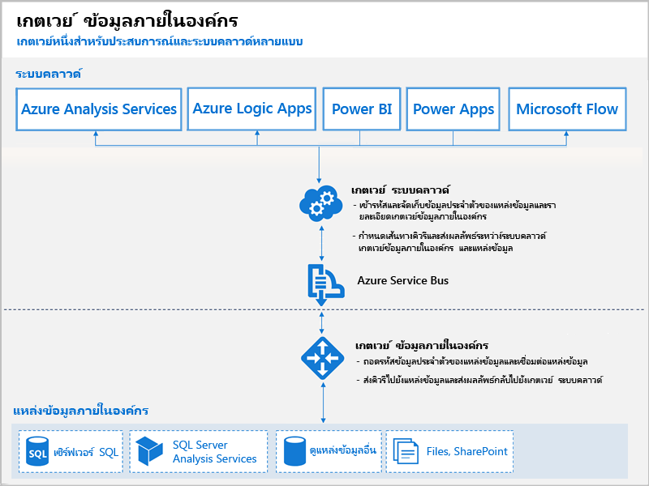

# เกตเวย์ Power BI คืออะไร?

เกตเวย์ Power BI เป็นซอฟต์แวร์ที่คุณติดตั้งภายในกับเครือข่ายภายในองค์กร ซึ่งอำนวยความสะดวกในการเข้าถึงข้อมูลในเครือข่ายดังกล่าว เป็นเหมือนยามเฝ้าประตู ที่คอยฟังคำขอเชื่อมต่อ และอนุญาตเมื่อคำขอของผู้ใช้เข้าเงื่อนไขบางอย่าง ซึ่งช่วยให้องค์กรเก็บฐานข้อมูลและแหล่งข้อมูลอื่น ๆ บนเครือข่ายภายในองค์กรของตนได้ และยังใช้ข้อมูลภายในองค์กรในรายงานและแดชบอร์ด Power BI นั้นได้อย่างปลอดภัย

สามารถใช้เกตเวย์สำหรับแหล่งข้อมูลเดียวหรือหลายแหล่งข้อมูลได้ ไดอะแกรมต่อไปนี้แสดงมุมมองพื้นฐาน โดยที่เกตเวย์จัดการคำขอจากระบบคลาวด์สำหรับคอมพิวเตอร์ภายในองค์กรสามเครื่อง เราจะขยายส่วนนี้เพิ่มเติมในภายหลังในบทความนี้

## ชนิดของเกตเวย์

Power BI มีสองเกตเวย์ แต่ละเกตเวย์สำหรับแต่ละสถานการณ์สมมติ:

* **เกตเวย์ข้อมูลในองค์กร (โหมดส่วนบุคคล)** – อนุญาตให้ผู้ใช้หนึ่งรายเชื่อมต่อกับแหล่งข้อมูล และไม่สามารถแชร์ให้กับผู้อื่นได้ สามารถใช้ได้กับ Power BI เท่านั้น เกตเวย์นี้เหมาะที่สุดกับสถานการณ์ที่คุณเป็นเพียงบุคคลเดียวที่สร้างรายงาน และคุณไม่จำเป็นต้องใช้แหล่งข้อมูลร่วมกันกับผู้อื่น

* **เกตเวย์ข้อมูลภายในองค์กร**– อนุญาตให้ผู้ใช้หลายคนเชื่อมต่อกับหลายแหล่งข้อมูลภายในองค์กรได้ สามารถใช้ได้โดยแอป Power BI, PowerApps, โฟลว์, Azure Analysis Services และ Azure Logic ทั้งหมดที่มีการติดตั้งเกตเวย์เดียวกัน เกตเวย์นี้เหมาะสมสำหรับสถานการณ์สมมติที่ซับซ้อนมากกว่าสำหรับบุคคลหลายคนที่เข้าถึงแหล่งข้อมูลหลายแหล่ง 

## ใช้เกตเวย์

มีสี่ขั้นตอนหลักสำหรับการใช้เกตเวย์:

1. **ติดตั้งเกตเวย์**บนคอมพิวเตอร์ ใช้โหมดที่เหมาะสม
2. **เพิ่มผู้ใช้ไปยังเกตเวย์** เพื่อให้พวกเขาสามารถเข้าถึงแหล่งข้อมูลภายในองค์กรได้
3. **เชื่อมต่อกับแหล่งข้อมูล** เพื่อให้พวกเขาสามารถใช้ในรายงานและแดชบอร์ดได้
4. **รีเฟรชข้อมูลในองค์กร** เพื่อให้รายงาน Power BI มีข้อมูลล่าสุด

คุณสามารถติดตั้งเกตเวย์แบบสแตนด์อโลน หรือเพิ่มเกตเวย์ไปยัง*คลัสเตอร์*ที่แนะนำสำหรับความพร้อมใช้งานสูงได้

## วิธีการทำงานของเกตเวย์

เกตเวย์ที่คุณติดตั้งทำงานเป็นบริการ Windows, **เกตเวย์ข้อมูลภายในองค์กร** บริการภายในเครื่องนี้ได้ลงทะเบียนด้วยบริการคลาวด์เกตเวย์ (Gateway Cloud Service) ผ่าน Azure Service Bus ไดอะแกรมต่อไปนี้แสดงโฟลว์ระหว่างข้อมูลในองค์กรและบริการระบบคลาวด์ที่ใช้เกตเวย์ดังกล่าว

คิวรีและโฟลว์ข้อมูล:

1. คิวรีถูกสร้างขึ้นโดยบริการระบบคลาวด์ที่มีข้อมูลประจำตัวเข้ารหัสลับสำหรับแหล่งข้อมูลภายในองค์กร จากนั้นจะถูกส่งไปยังคิวสำหรับเกตเวย์เพื่อดำเนินการต่อ
2. บริการระบบคลาวด์ของเกตเวย์จะวิเคราะห์คิวรีและส่งคำขอไปยัง Azure Service Bus
3. เกตเวย์ข้อมูลภายในองค์กรจะทำการสำรวจ Azure Service Bus สำหรับคำขอที่ค้างอยู่
4. เกตเวย์รับแบบสอบถาม ถอดรหัสข้อมูลประจำตัว และเชื่อมต่อกับแหล่งข้อมูลต่าง ๆ ด้วยข้อมูลประจำตัวเหล่านั้น
5. เกตเวย์ส่งแบบสอบถามไปยังแหล่งข้อมูลเพื่อดำเนินการ
6. ผลลัพธ์จะส่งจากแหล่งข้อมูล กลับไปยังเกตเวย์ และไปยังบริการระบบคลาวด์และเซิร์ฟเวอร์ของคุณ

## ขั้นตอนถัดไป
[ติดตั้งเกตเวย์ข้อมูลภายในองค์กร](service-gateway-install.md)

มีคำถามเพิ่มเติมหรือไม่ [ลองไปที่ชุมชน Power BI](http://community.powerbi.com/)

