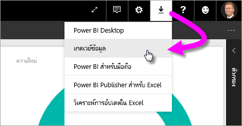
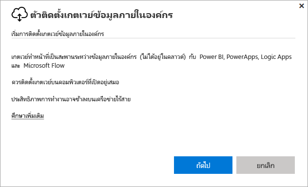
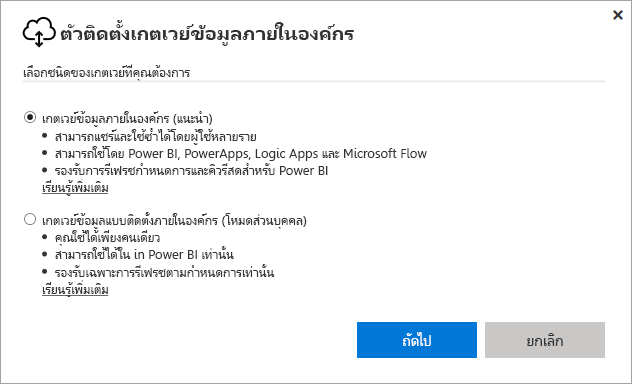
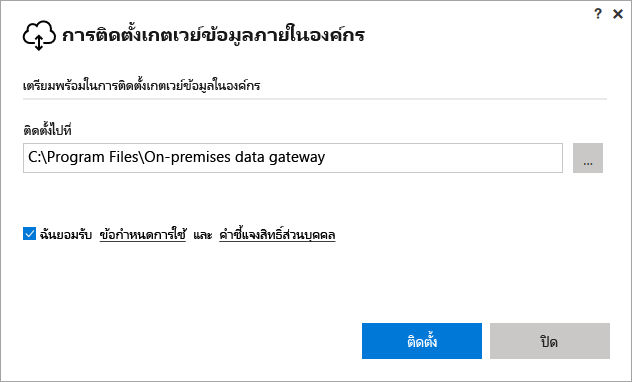
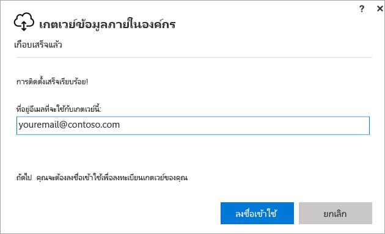
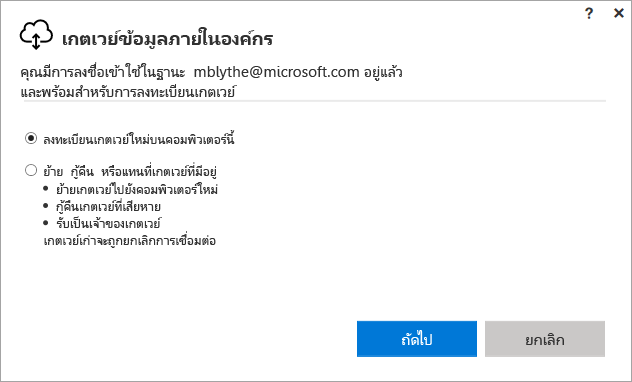
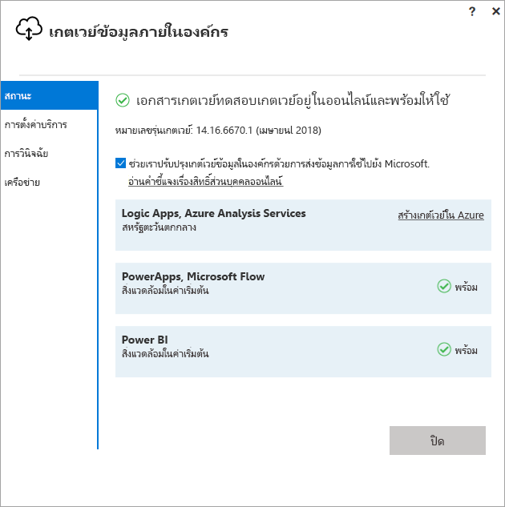

# ติดตั้งเกตเวย์สำหรับ Power BI

เกตเวย์ Power BI เป็นซอฟต์แวร์ที่คุณติดตั้งภายในกับเครือข่ายภายในองค์กร ซึ่งอำนวยความสะดวกในการเข้าถึงข้อมูลในเครือข่ายดังกล่าว ตามที่อธิบายไว้ใน[ภาพรวม](service-gateway-getting-started.md) คุณสามารถติดตั้งเกตเวย์ในโหมดส่วนตัวหรือโหมดมาตรฐาน (แนะนำ) ได้ ในโหมดมาตรฐาน คุณสามารถติดตั้งเกตเวย์แบบสแตนด์อโลน หรือเพิ่มเกตเวย์ไปยัง*คลัสเตอร์*ที่แนะนำสำหรับความพร้อมใช้งานสูงได้ ในบทความนี้ เราแสดงวิธีการติดตั้งเกตเวย์มาตรฐาน จากนั้นเพิ่มเกตเวย์อื่นเมื่อต้องสร้างคลัสเตอร์

ถ้าคุณไม่ได้ลงทะเบียน Power BI ให้[ลงทะเบียนรุ่นทดลองใช้ฟรี](https://app.powerbi.com/signupredirect?pbi_source=web)ก่อนที่คุณจะเริ่มต้นใช้งาน

## ดาวน์โหลดและติดตั้งเกตเวย์

เกตเวย์ทำงานบนคอมพิวเตอร์เครื่องที่คุณติดตั้ง ดังนั้น ตรวจสอบให้แน่ใจว่าคุณติดตั้งบนคอมพิวเตอร์ที่ทำงานตลอดเวลา เพื่อให้ได้ประสิทธิภาพการทำงานและความน่าเชื่อถือที่ดียิ่งขึ้น เราขอแนะนำว่าควรเชื่อมต่อคอมพิวเตอร์ด้วยเครือข่ายแบบมีสาย แทนที่จะเป็นแบบไร้สาย

1. ในบริการ Power BI ที่มุมบนขวา เลือก**ไอคอนดาวน์โหลด**  > **เกตเวย์ข้อมูล**

    

2. บนหน้าการดาวน์โหลด เลือกปุ่ม**เกตเวย์ดาวน์โหลด**

3. เลือก**ถัดไป**     

    

4. เลือก**เกตเวย์ข้อมูลภายในองค์กร (แนะนำ)** > **ถัดไป**

    

5. ใช้เส้นทางการติดตั้งค่าเริ่มต้น และยอมรับเงื่อนไข > **ติดตั้ง**

    

6. ใส่บัญชีที่คุณใช้ลงชื่อเข้าใช้ Power BI > **ลงชื่อเข้าใช้**

    

    เกตเวย์เชื่อมโยงกับบัญชีของคุณ Power BI และคุณสามารถจัดการเกตเวย์จากภายในบริการ Power BI ได้ ตอนนี้คุณได้ลงชื่อเข้าในบัญชีของคุณ

7. เลือก**ลงทะเบียนเกตเวย์ใหม่บนคอมพิวเตอร์เครื่องนี้** > **ถัดไป**

    

8. ใส่ชื่อสำหรับเกตเวย์ (ต้องไม่ซ้ำกันผู้เช่า) และคีย์การกู้คืน คุณต้องใช้คีย์นี้หากคุณต้องการกู้คืนหรือย้ายเกตเวย์ของคุณ เลือก**กำหนดค่า**

    

    โปรดสังเกตตัวเลือก**เพิ่มลงในคลัสเตอร์เกตเวย์ที่มีอยู่** เราจะใช้ตัวเลือกนี้ในส่วนถัดไปของบทความ

9. ตรวจทานรายละเอียดในหน้าต่างขั้นสุดท้าย โปรดสังเกตว่าเกตเวย์จะพร้อมใช้งานสำหรับ Power BI และพร้อมใช้งานสำหรับ PowerApps และ Flow ด้วย เนื่องจากฉันใช้บัญชีเดียวกันสำหรับทั้งสามรายการ เลือก**ปิด**

    

ในตอนนี้คุณได้ติดตั้งเกตเวย์เรียบร้อยแล้ว คุณสามารถเพิ่มเกตเวย์อื่นเพื่อสร้างคลัสเตอร์ได้

## เพิ่มเกตเวย์อื่นเพื่อสร้างคลัสเตอร์

คลัสเตอร์อนุญาตให้ผู้ดูแลเกตเวย์หลีกเลี่ยงความล้มเหลวจุดเดียวสำหรับการเข้าถึงข้อมูลภายในองค์กร หากเกตเวย์หลักไม่พร้อมใช้งาน การร้องขอข้อมูลจะกำหนดเส้นทางไปยังเกตเวย์ที่สองหรือเกตเวย์อื่น ๆ ที่คุณเพิ่มเข้า คุณสามารถติดตั้งเกตเวย์มาตรฐานได้บนคอมพิเตอร์เครื่องเดียวเท่านั้น ดังนั้นคุณต้องติดตั้งเกตเวย์ที่สองสำหรับคลัสเตอร์บนคอมพิวเตอร์เครื่องอื่น ซึ่งเหมาะสมเนื่องจากคุณต้องการให้มีหลายคีย์ในคลัสเตอร์

คลัสเตอร์เกตเวย์พร้อมใช้งานสูงจำเป็นต้องมีการอัปเดตเกตเวย์ข้อมูลภายในองค์กรให้เป็นเวอร์ชันเดือนพฤศจิกายน 2017 หรือใหม่กว่า

1. ดาวน์โหลดเกตเวย์ไปยังคอมพิวเตอร์เครื่องอื่นและติดตั้งเกตเวย์

2. หลังจากที่คุณได้ลงชื่อเข้าใช้บัญชีของคุณ Power BI ให้ลงทะเบียนเกตเวย์ เลือก**เพิ่มลงในคลัสเตอร์ที่มีอยู่** ใต้**คลัสเตอร์เกตเวย์พร้อมใช้งาน** เลือกเกตเวย์แรกที่คุณติดตั้ง (*เกตเวย์หลัก*) และป้อนคีย์การกู้คืนสำหรับเกตเวย์นั้น เลือก**กำหนดค่า**

    

## ขั้นตอนถัดไป

[จัดการเกตเวย์ Power BI](service-gateway-manage.md)

มีคำถามเพิ่มเติมหรือไม่ [ลองไปที่ชุมชน Power BI](http://community.powerbi.com/)