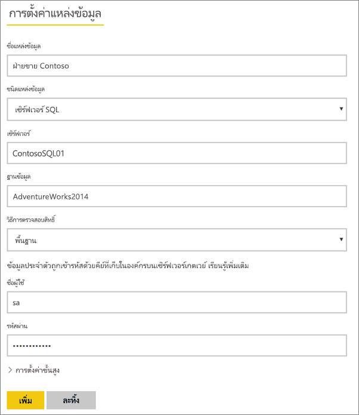
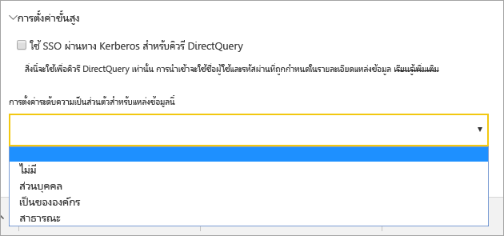
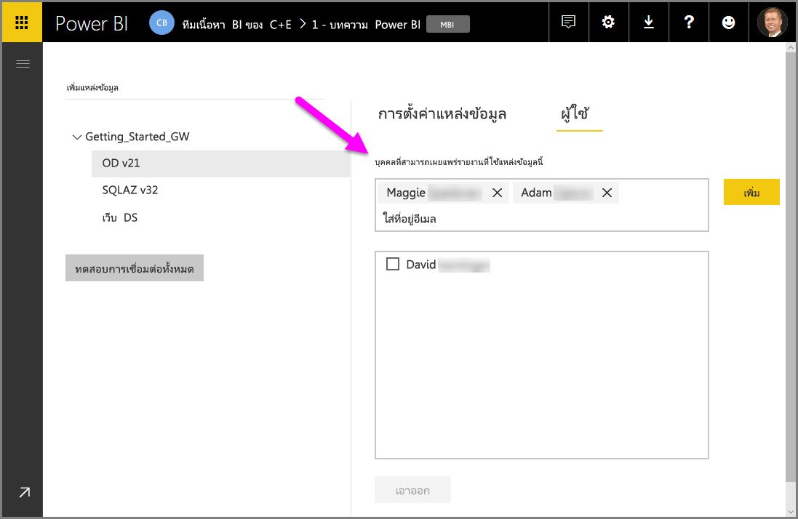
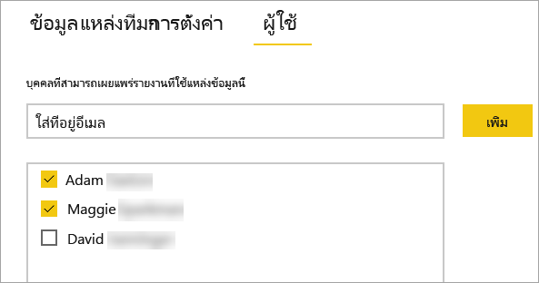
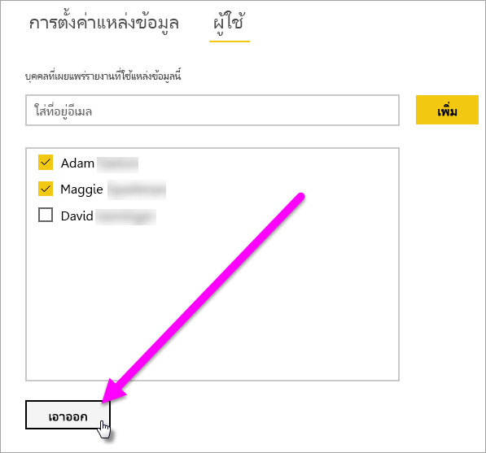
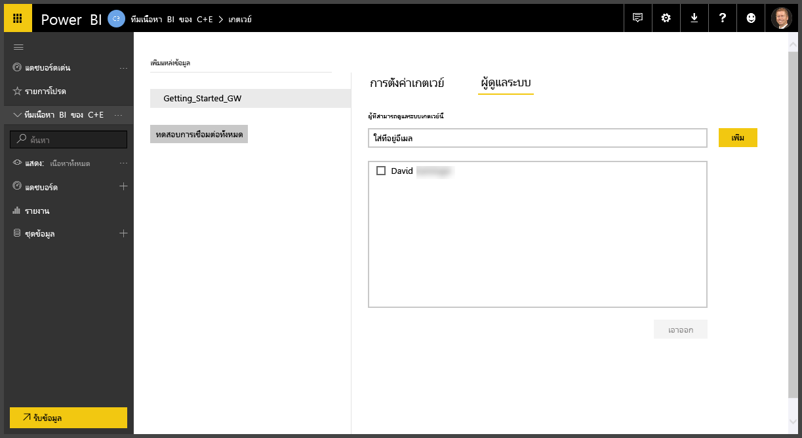
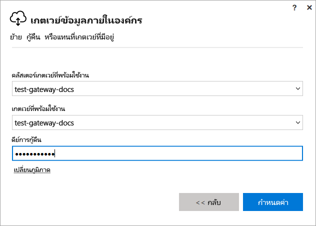
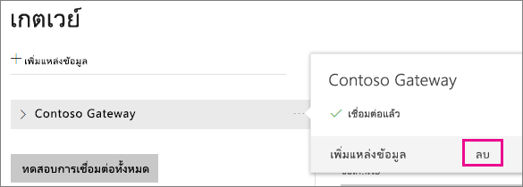

# จัดการเกตเวย์ Power BI

หลังจากที่คุณ[ติดตั้งเกตเวย์ข้อมูล Power BI](service-gateway-install.md) แล้ว คุณสามารถจัดการได้ตามความต้องการของคุณ ในหัวข้อนี้ คุณเรียนรู้วิธีการ: เพิ่ม และเอาแหล่งข้อมูลและผู้ใช้ออก, รีสตาร์ทเกตเวย์, โยกย้าย, คืนค่า, ยึดครอง และเอาเกตเวย์ออก 

คุณสามารถจัดการเกตเวย์ผ่านพื้นที่**จัดการเกตเวย์**ของบริการของ Power BI, ในแอปเกตเวย์บนเครื่องคอมพิวเตอร์ของคุณ และด้วยสคริปต์ PowerShell ได้ บทความนี้มุ่งเน้นไปที่บริการของ Power BI 

ถ้าคุณเพิ่งติดตั้งเกตเวย์ เราขอแนะนำให้คุณ[เพิ่มแหล่งข้อมูล](#add-a-data-source) จากนั้น[เพิ่มผู้ใช้](#add-users-to-a-data-source) เพื่อให้พวกเขาสามารถเข้าถึงแหล่งข้อมูลได้

## จัดการแหล่งข้อมูล

Power BI สนับสนุนแหล่งข้อมูลภายในองค์กรมากมาย ซึ่งแต่ละชนิดข้อกำหนดของตนเอง สามารถใช้เกตเวย์สำหรับแหล่งข้อมูลเดียวหรือหลายแหล่งข้อมูล สำหรับตัวอย่างนี้ เราจะแสดงวิธีการเพิ่ม SQL Server ให้เป็นแหล่งข้อมูล แต่ขั้นตอนคล้ายกันสำหรับแหล่งข้อมูลอื่น ๆ

### เพิ่มแหล่งข้อมูล

1. ที่มุมบนขวาของบริการของ Power BI เลือกไอคอนรูปเฟือง  > **จัดการเกตเวย์**

    

2. เลือกเกตเวย์ > **เพิ่มแหล่งข้อมูล** หรือไปยัง เกตเวย์ > **เพิ่มแหล่งข้อมูล**

    

3. เลือก**ชนิดแหล่งข้อมูล**

    

4. ป้อนข้อมูลสำหรับแหล่งข้อมูล สำหรับตัวอย่างนี้ มี**เซิร์ฟเวอร์**, **ฐานข้อมูล** และข้อมูลอื่น ๆ  

    

5. สำหรับ SQL Server คุณต้องเลือก**วิธีการรับรองความถูกต้อง**ของ **Windows** หรือ**พื้นฐาน** (การรับรองความถูกต้อง SQL)  ถ้าคุณเลือกแบบ**พื้นฐาน** ใส่ข้อมูลประจำตัวสำหรับแหล่งข้อมูลของคุณ

6. (ไม่บังคับ) ภายใต้**ตั้งค่าขั้นสูง** อาจกำหนดค่า[ระดับความเป็นส่วนตัว](https://support.office.com/article/Privacy-levels-Power-Query-CC3EDE4D-359E-4B28-BC72-9BEE7900B540) สำหรับแหล่งข้อมูลของคุณ (ไม่ใช้กับ [DirectQuery](desktop-directquery-about.md))

    

7. เลือก**เพิ่ม** คุณจะเห็นข้อความ*การเชื่อมต่อเป็นที่สำเร็จ* ถ้ากระบวนการสำเร็จ

    

ขณะนี้คุณสามารถใช้แหล่งข้อมูลนี้เพื่อรวมข้อมูลจาก SQL Server ในแดชบอร์ดและรายงาน Power BI ของคุณ

### ลบแหล่งข้อมูล

คุณสามารถลบแหล่งข้อมูลถ้าคุณไม่ใช้อีกต่อไป โปรดทราบว่า การลบแหล่งข้อมูล จะทำให้แดชบอร์ดและรายงานที่ขึ้นกับแหล่งข้อมูลนั้นไม่ทำงาน

เพื่อลบแหล่งข้อมูล ไปยังแหล่งข้อมูลแล้วเลือก**ลบออก**

## จัดการผู้ใช้และผู้ดูแลระบบ

หลังจากที่คุณเพิ่มแหล่งข้อมูลให้กับเกตเวย์แล้ว คุณให้ผู้ใช้และกลุ่มความปลอดภัย เข้าถึงแหล่งข้อมูลที่กำหนด (ไม่ใช่ทั้งเกตเวย์) รายชื่อผู้ใช้ของแหล่งข้อมูล ควบคุมว่าใครสามารถเผยแพร่รายงานที่รวมข้อมูลจากแหล่งข้อมูลนั้น เจ้าของรายงานสามารถสร้างแดชบอร์ด, ชุดเนื้อหา และแอป จากนั้นแชร์ให้กับผู้ใช้อื่นได้

คุณยังสามารถให้ผู้ใช้และกลุ่มความปลอดภัย เข้าถึงเกตเวย์ในระดับผู้ดูแล

### เพิ่มผู้ใช้ไปยังแหล่งข้อมูล

1. ที่มุมบนขวาของบริการของ Power BI เลือกไอคอนรูปเฟือง  > **จัดการเกตเวย์**

2. เลือกแหล่งข้อมูลที่คุณต้องเพิ่มผู้ใช้

3. เลือก**ผู้ใช้** และป้อนผู้ใช้จากองค์กรของคุณ ที่คุณต้องการให้สิทธิ์การเข้าถึงแหล่งข้อมูลที่เลือก ในหน้าจอต่อไปนี้ คุณสามารถดูว่า ฉันกำลังเพิ่ม Maggie และ Adam

    

4. เลือก**เพิ่ม** และสมาชิกที่เพิ่มจะแสดงขึ้นในกล่อง

    

มีแค่นั้นจริงๆ จำไว้ว่า คุณต้องเพิ่มผู้ใช้ไปยังแต่ละแหล่งข้อมูลที่คุณต้องการให้สิทธิ์เข้าใช้ แต่ละแหล่งข้อมูลมีรายชื่อผู้ใช้แยกจากกัน และคุณต้องเพิ่มผู้ใช้ในแต่ละแหล่งข้อมูลแยกต่างหาก

### เอาผู้ใช้ออกจากแหล่งข้อมูล

บนแท็บ**ผู้ใช้**สำหรับแหล่งข้อมูล คุณสามารถเอาผู้ใช้และกลุ่มความปลอดภัยที่ใช้แหล่งข้อมูลนี้ออกได้

### เพิ่มและเอาผู้ดูแลออก

บนแท็บ**ผู้ดูแล**สำหรับเกตเวย์ เพิ่มและลบผู้ใช้ (หรือกลุ่มความปลอดภัย) ที่สามารถดูแลระบบเกตเวย์ได้

## จัดการคลัสเตอร์เกตเวย์

เมื่อคุณสร้างคลัสเตอร์ของสองเกตเวย์หรือมากกว่านั้น การจัดการเกตเวย์ทั้งหมด เช่น การเพิ่มแหล่งข้อมูล หรือมอบสิทธิ์ระดับผู้ดูแลเกตเวย์ มีผลกับเกตเวย์ทั้งหมดที่เป็นส่วนหนึ่งของคลัสเตอร์ 

เมื่อผู้ดูแลใช้รายการเมนู**จัดการเกตเวย์**ที่แสดงอยู่ใต้ไอคอนรูปเในฟือง**บริการ Power BI**ผู้ดูแลจะเห็นรายการของคลัสเตอร์ที่ลงทะเบียนหรือเกตเวย์ส่วนบุคคล แต่จะไม่เห็นแต่ละอินสแตนซ์เกตเวย์ส่วนบุคคลที่เป็นสมาชิกของคลัสเตอร์

คำขอ**กำหนดเวลาการรีเฟรช** และการดำเนินงาน DirectQuery ใหม่จะถูกส่งไปยังอินสแตนซ์หลักของคลัสเตอร์เกตเวย์ที่ระบุโดยอัตโนมัติ ถ้าอินสแตนซ์ของเกตเวย์หลักไม่ออนไลน์ คำขอจะได้รับการส่งไปที่อินสแตนซ์ของเกตเวย์อื่นในคลัสเตอร์

## แชร์เกตเวย์

คุณไม่สามารถ*แชร์*เกตเวย์โดยตรง แต่คุณสามารถเพิ่มผู้ดูแลเกตเวย์ และคุณสามารถเพิ่มผู้ใช้ไปยังแหล่งข้อมูลของเกตเวย์ได้ 

หลังจากที่คุณติดตั้งเกตเวย์ ตามค่าเริ่มต้น คุณจะเป็นผู้ดูแลของเกตเวย์นั้น ตามที่ได้แสดงก่อนหน้า คุณยังสามารถเพิ่มบุคคลอื่นเป็นผู้ดูแลด้วย ผู้ดูแลเหล่านี้สามารถเพิ่มแหล่งข้อมูล, กำหนดค่า และเอาเกตเวย์ออก

คุณยังสามารถกำหนดผู้ใช้ให้กับแหล่งข้อมูลที่คุณสร้าง ภายใต้แต่ละเกตเวย์ของคุณ ผู้ใช้สามารถใช้แหล่งข้อมูลเหล่านั้นเพื่อรีเฟรชรายงาน Power BI แต่พวกเขาไม่สามารถเปลี่ยนแหล่งแหล่งข้อมูลหรือการตั้งค่าเกตเวย์ใด ๆ ได้

## โยกย้าย, คืนค่า หรือยึดครองเกตเวย์

เรียกใช้ตัวติดตั้งเกตเวย์บนคอมพิวเตอร์เครื่องที่คุณต้องการโยกย้าย, คืนค่า หรือยึดครองเกตเวย์

1. ดาวน์โหลดและติดตั้งเกตเวย์

2. หลังจากที่คุณได้ลงชื่อเข้าใช้ไปยังบัญชี Power BI ของคุณ ลงทะเบียนเกตเวย์ เลือก **โยกย้าย คืนค่า หรือยึดครองเกตเวย์ที่มีอยู่** > **ถัดไป**

    

3. เลือกจากคลัสเตอร์และเกตเวย์ที่มี และป้อนคีย์การกู้คืนเกตเวย์ที่เลือก เลือก**กำหนดค่า**

    

## รีสตาร์ทเกตเวย์

เกตเวย์ทำงานเป็นบริการของ Windows เหมือนกับบริการใด ๆ ใน Windows มีหลายวิธีในการเริ่มต้นและหยุดการทำงาน นี่คือวิธีคุณสามารถทำได้จากพรอมต์คำสั่ง

1. บนเครื่องที่เกตเวย์ทำงาน เรียกใช้พร้อมท์คำสั่ง ด้วยสิทธิ์ระดับผู้ดูแลระบบ

2. ใส่ `net stop PBIEgwService` เมื่อต้องหยุดบริการ

3. ใส่ `net start PBIEgwService` เมื่อต้องการเริ่มบริการใหม่

## ลบเกตเวย์

คุณสามารถลบเกตเวย์ถ้าคุณไม่ใช้อีกต่อไป แต่ระวังไว้ว่า การเอาเกตเวย์ออก จะลบแหล่งข้อมูลทั้งหมดที่อยู่ภายใต้เกตเวย์ ซึ่งจะทำให้แดชบอร์ดและรายงานที่ขึ้นกับแหล่งข้อมูลเหล่านั้นไม่ทำงาน

1. ที่มุมบนขวาของบริการของ Power BI เลือกไอคอนรูปเฟือง  > **จัดการเกตเวย์**

2. เลือกเกตเวย์ > **ลบออก**
   
   

## ขั้นตอนถัดไป

[คำแนะนำสำหรับการปรับใช้เกตเวย์ข้อมูล](service-gateway-deployment-guidance.md)

มีคำถามเพิ่มเติมหรือไม่ [ลองไปที่ชุมชน Power BI](http://community.powerbi.com/)
