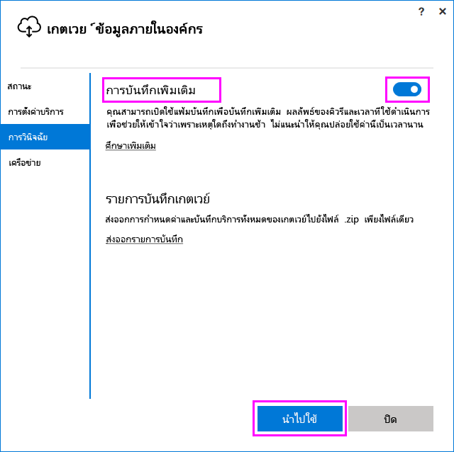

# <a name="troubleshooting-the-on-premises-data-gateway"></a>การแก้ไขปัญหา เกตเวย์ข้อมูลในองค์กร
บทความนี้กล่วงถึงปัญหาที่พบได้บ่อย ที่คุณอาจเจอเมื่อใช้งาน**เกตเวย์ข้อมูลภายในองค์กร**

<!-- Shared Community & support links Include -->
[!INCLUDE [gateway-onprem-tshoot-support-links-include](./includes/gateway-onprem-tshoot-support-links-include.md)]

<!-- Shared Troubleshooting Install Include -->
[!INCLUDE [gateway-onprem-tshoot-install-include](./includes/gateway-onprem-tshoot-install-include.md)]

## <a name="configuration"></a>การกำหนดค่า
### <a name="how-to-restart-the-gateway"></a>รีสตาร์ทเกตเวย์อย่างไร
เกตเวย์ทำงานเป็นบริการใน Windows ดังนั้นคุณสามารถเริ่ม และหยุดมันได้หลายวิธี ตัวอย่างเช่น คุณสามารถเปิด พร้อมท์คำสั่งที่มีสิทธิ์ผู้ดูแล บนเครื่องที่เกตเวย์กำลังทำงานอยู่ และจากนั้น เรียกใช้คำสั่งอย่างใดอย่างหนึ่งเหล่านี้:

* เมื่อต้องการหยุดบริการ เรียกใช้คำสั่งนี้:
  
    '''   net stop PBIEgwService   '''
* เมื่อต้องการเริ่มบริการ เรียกใช้คำสั่งนี้:
  
    '''   net start PBIEgwService   '''

### <a name="error-failed-to-create-gateway-please-try-again"></a>ข้อผิดพลาด: การสร้างเกตเวย์ล้มเหลว โปรดลองใหม่อีกครั้ง
มีการใส่รายละเอียดทั้งหมดแล้ว แต่การเรียกไปยังบริการ Power BI ส่งข้อผิดพลาดกลับมา ข้อผิดพลาด และ รหัสกิจกรรม จะแสดงขึ้นบนจอ อาจเกิดขึ้นจากหลายสาเหตุ คุณสามารถรวบรวมและตรวจสอบ แฟ้มบันทึก ตามที่จะกล่าวถึงด้านล่าง สำหรับรายละเอียดเพิ่มเติม

นี่อาจเกิดจากการกำหนดค่าพร็อกซีก็ได้ ส่วนติดต่อผู้ใช้ในขณะนี้ยังไม่อนุญาตกำหนดค่าพร็อกซี คุณสามารถเรียนรู้เพิ่มเติมเกี่ยวกับ[การแก้ไขการกำหนดค่าพร็อกซี](service-gateway-proxy.md)ได้

### <a name="error-failed-to-update-gateway-details--please-try-again"></a>ข้อผิดพลาด: การอัปเดตรายละเอียดเกตเวย์ล้มเหลว  โปรดลองใหม่อีกครั้ง
ได้รับข้อมูลจากบริการ Power BI ไปที่เกตเวย์ ข้อมูลที่ถูกส่งผ่านไปบริการภายใน Windows แต่ไม่ตอบกลับมา หรือ การสร้างคีย์สมมาตรล้มเหลว ข้อผิดพลาดภายในจะถูกแสดงที่**แสดงรายละเอียด** คุณสามารถรวบรวมและตรวจสอบ แฟ้มบันทึก ตามที่จะกล่าวถึงด้านล่าง สำหรับรายละเอียดเพิ่มเติม

### <a name="error-power-bi-service-reported-local-gateway-as-unreachable-please-restart-the-gateway-and-try-again"></a>ข้อผิดพลาด: บริการ Power BI รายงานว่าไม่สามารถเข้าถึงเกตเวย์ภายในเครื่องได้ กรุณารีสตาร์ทเกตเวย์ แล้วลองอีกครั้ง
ตอนส่วนท้ายของการกำหนดค่า บริการของ Power BI จะถูกเรียกอีกครั้งเพื่อตรวจสอบเกตเวย์ บริการของ Power BI ไม่ได้รายงานสถานะเกตเวย์ว่า *live* รีสตาร์ทบริการ windows อาจช่วยให้สื่อสารสำเร็จ คุณสามารถรวบรวมและตรวจสอบ แฟ้มบันทึก ตามที่จะกล่าวถึงด้านล่าง สำหรับรายละเอียดเพิ่มเติม

### <a name="script-error-during-sign-into-power-bi"></a>ข้อผิดพลาดของสคริปต์ระหว่างการลงชื่อเข้าใช้ใน Power BI
คุณอาจได้รับข้อผิดพลาดสคริปต์เมื่อลงชื่อเข้าใช้ Power BI ระหว่างการกำหนดค่าเกตเวย์ข้อมูลในองค์กร ติดตั้งการปรับปรุงความปลอดภัยต่อไปนี้ น่าจะปัญหาได้ สามารถติดตั้งผ่านทาง Windows Update

[MS16-051: ปรับปรุงความปลอดภัยสำหรับ Internet Explorer: 10 พฤษภาคม 2016 (KB 3154070)](https://support.microsoft.com/kb/3154070)

### <a name="gateway-configuration-failed-with-a-null-reference-exception"></a>กำหนดค่าเกตเวย์ล้มเหลว โดยมีข้อยกเว้นการอ้างอิง null
คุณอาจพบข้อผิดพลาดที่คล้ายกับต่อไปนี้

        Failed to update gateway details.  Please try again.
        Error updating gateway configuration.

ซึ่งจะมี การติดตามสแตก และจะอาจมีข้อความต่อไปนี้

        Microsoft.PowerBI.DataMovement.Pipeline.Diagnostics.CouldNotUpdateGatewayConfigurationException: Error updating gateway configuration. ----> System.ArgumentNullException: Value cannot be null.
        Parameter name: serviceSection

ถ้าคุณกำลังอัปเกรดจากเกตเวย์เวอร์ชันที่เก่ากว่า เราเก็บรักษา แฟ้มกำหนดค่า ของเดิม อาจมีบางส่วนในแฟ้มขาดหายไป เมื่อเกตเวย์พยายามอ่านแฟ้ม จะเกิดข้อยกเว้นการอ้างอิง null

วิธีแก้ไข ให้ทำต่อไปนี้

1. ถอนการติดตั้งเกตเวย์
2. ลบโฟลเดอร์ต่อไปนี้
   
        c:\Program Files\On-premises data gateway
3. ติดตั้งเกตเวย์ใหม่
4. ขั้นตอนนี้ไม่บังคับ คุณอาจใช้คีย์การกู้คืนเมื่อเพื่อคืนค่าเกตเวย์ที่มีอยู่

### <a name="support-for-tls-1112"></a>การสนับสนุน TLS 1.1/1.2
การปรับปรุงเดือนสิงหาคม 2017 เป็นต้นมา เกตเวย์ข้อมูลแบบติดตั้งภายในองค์กร จะใช้ Transport Layer Security (TLS) 1.1 หรือ 1.2 ในการสื่อสารกับ**Power BI service**เป็นค่าเริ่มต้น เกตเวย์ข้อมูลในองค์กร เวอร์ชันก่อนหน้านี้ใช้ TLS 1.0 เป็นค่าเริ่มต้น ตั้งแต่วันที่ 1 พฤศจิกายน 2017 เป็นต้นไป การสนับสนุน TLS 1.0 จะสิ้นสุดลง ดังนั้นคุณต้องปรับรุ่น เกตเวย์ข้อมูลในองค์กร ที่ติดตั้งทั้งหมดเป็นรุ่นเดือน สิงหาคม 2017 หรือใหม่กว่านั้น เพื่อให้แน่ใจว่าเกตเวย์ของคุณยังคงทำงานได้

ต้องทราบว่า เกตเวย์ข้อมูลในองค์กรยังคงการสนับสนุน TLS 1.0 ก่อนวันที่ 1 พฤศจิกายน และใช้เป็นกลไกสำรองหากไม่ม เพื่อให้แน่ใจว่าการรับส่งข้อมูลทั้งหมดของเกตเวย์ใช้ TLS 1.1 หรือ 1.2 (และเพื่อป้องกันไม่ให้ใช้ TLS 1.0 บนเกตเวย์ของคุณ) คุณต้องเพิ่มหรือแก้ไขรีจิสทรีคีย์ต่อไปนี้บนเครื่องที่ใช้งาน service ของเกตเวย์:

        [HKEY_LOCAL_MACHINE\SOFTWARE\Microsoft\.NETFramework\v4.0.30319]"SchUseStrongCrypto"=dword:00000001
        [HKEY_LOCAL_MACHINE\SOFTWARE\Wow6432Node\Microsoft\.NETFramework\v4.0.30319]"SchUseStrongCrypto"=dword:00000001

> [!NOTE]
> การเพิ่มหรือแก้ไขรีจิสทรีคีย์เหล่านี้จะนำการเปลี่ยนแปลงไปใช้กับแอปพลิเคชัน .NET ทั้งหมด สำหรับข้อมูลเกี่ยวกับการเปลี่ยนแปลงรีจิสทรีที่มีผลต่อ TLS สำหรับแอปพลิเคชันอื่น ๆ ดู[การตั้งค่ารีจิสทรี Transport Layer Security (TLS)](https://docs.microsoft.com/windows-server/security/tls/tls-registry-settings)
> 
> 

## <a name="data-sources"></a>แหล่งข้อมูล
### <a name="error-unable-to-connect-details-invalid-connection-credentials"></a>ข้อผิดพลาด: ไม่สามารถเชื่อมต่อได้ รายละเอียด: “ข้อมูลประจำตัวของการเชื่อมต่อไม่ถูกต้อง”
ใน**แสดงรายละเอียด** ควรจะแสดงข้อผิดพลาดที่ได้รับจากแหล่งข้อมูล สำหรับ SQL Server คุณควรเห็นข้อความลักษณะนี้

    Login failed for user 'username'.

ตรวจสอบว่า คุณมีชื่อผู้ใช้และรหัสผ่านที่ถูกต้อง นอกจากนี้ ตรวจสอบว่า ข้อมูลประจำตัวเหล่านั้นสามารถเชื่อมต่อกับแหล่งข้อมูลได้สำเร็จ ตรวจสอบให้แน่ใจว่า บัญชีที่ใช้ตรงกับ **วิธีการรับรองความถูกต้อง**

### <a name="error-unable-to-connect-details-cannot-connect-to-the-database"></a>ข้อผิดพลาด: ไม่สามารถเชื่อมต่อได้ รายละเอียด: “ไม่สามารถเชื่อมต่อกับแหล่งข้อมูลได้”
เราสามารถเชื่อมต่อไปยังเซิร์ฟเวอร์ แต่ไม่สามารถเชื่อมต่อไปยังฐานข้อมูลที่ให้มา ตรวจสอบชื่อของฐานข้อมูล และตรวจสอบว่าข้อมูลประจำตัวของผู้ใช้มีสิทธิ์เข้าถึงฐานข้อมูลนั้น

ใน**แสดงรายละเอียด** ควรจะแสดงข้อผิดพลาดที่ได้รับจากแหล่งข้อมูล สำหรับ SQL Server คุณควรเห็นข้อความลักษณะนี้

    Cannot open database "AdventureWorks" requested by the login. The login failed. Login failed for user 'username'.

### <a name="error-unable-to-connect-details-unknown-error-in-data-gateway"></a>ข้อผิดพลาด: ไม่สามารถเชื่อมต่อได้ รายละเอียด: "เกิดข้อผิดพลาดที่ไม่รู้จักในเกตเวย์ข้อมูล"
ข้อผิดพลาดนี้อาจเกิดขึ้นจากหลายสาเหตุ ตรวจสอบให้แน่ใจว่าการตรวจสอบว่า คุณสามารถเชื่อมต่อกับแหล่งข้อมูลจากเครื่องที่เกตเวย์ทำงาน นี่อาจเป็นผลของการที่เชื่อมต่อกับเซิร์ฟเวอร์ไม่ได้

ใน**แสดงรายละเอียด** คุณจะเห็นรหัสข้อผิดพลาดของ **DM_GWPipeline_UnknownError**

คุณยังสามารถค้นหารายละเอียดเพิ่มเติมได้จาก บันทึกเหตุการณ์ > **บันทึกแอปพลิเคชันและบริการ** > **บริการเกตเวย์ข้อมูลในองค์กร**

### <a name="error-we-encountered-an-error-while-trying-to-connect-to-server-details-we-reached-the-data-gateway-but-the-gateway-cant-access-the-on-premises-data-source"></a>ข้อผิดพลาด: เราพบข้อผิดพลาดขณะพยายามเชื่อมต่อกับ<server> รายละเอียด: "เราเข้าถึงเกตเวย์ข้อมูลได้ แต่เกตเวย์ไม่สามารถเข้าถึงแหล่งข้อมูลในองค์กร"
เราไม่สามารถเชื่อมต่อไปยังแหล่งข้อมูลที่ระบุไว้ ตรวจสอบให้แน่ใจว่าข้อมูลที่ให้ไว้สำหรับแหล่งข้อมูลนั้นถูกต้อง

ใน**แสดงรายละเอียด** คุณจะเห็นรหัสข้อผิดพลาดของ **DM_GWPipeline_Gateway_DataSourceAccessError**

ถ้าข้อผิดพลาดภายในคล้ายกับข้อความต่อไปนี้ แสดงว่า บัญชีผู้ใช้ที่คุณกำลังใช้สำหรับแหล่งข้อมูล ไม่ใช่ผู้ดูแลเซิร์ฟเวอร์สำหรับ Analysis Services อินสแตนซ์นั้น [เรียนรู้เพิ่มเติม](https://docs.microsoft.com/sql/analysis-services/instances/grant-server-admin-rights-to-an-analysis-services-instance)

    The 'CONTOSO\account' value of the 'EffectiveUserName' XML for Analysis property is not valid.

ถ้าข้อผิดพลาดภายในคล้ายกับข้อความต่อไปนี้ แสดงว่า บัญชีบริการสำหรับ Analysis Services อาจจะขาดแอตทริบิวต์ [token-groups-global-and-universal](https://msdn.microsoft.com/library/windows/desktop/ms680300.aspx) (TGGAU) ในไดเรกทอรี

    The user name or password is incorrect.

โดเมนที่เข้ากันได้กับ Windows รุ่นก่อน 2000 จะต้องเปิดใช้งานแอตทริบิวต์ TGGAU อย่างไรก็ตาม โดเมนที่สร้างขึ้นใหม่ส่วนใหญ่ จะไม่เปิดใช้งานแอตทริบิวต์นี้ตามค่าเริ่มต้น คุณสามารถอ่านเพิ่มเติมเกี่ยวกับหัวข้อนี้ได้[ที่นี่](https://support.microsoft.com/kb/331951)

คุณสามารถยืนยัน โดยทำดังต่อไปนี้

1. เชื่อมต่อไปยังเครื่อง Analysis Services ภายใน SQL Server Management Studio ภายใน คุณสมบัติการเชื่อมต่อขั้นสูง ใส่ EffectiveUserName สำหรับผู้ใช้ที่มีปัญหา และดูว่าเกิดข้อผิดพลาดแบบเดียวกันหรือไม่
2. คุณสามารถใช้เครื่องมือ dsacls ของ Active Directory เพื่อตรวจสอบว่ามีแอตทริบิวต์ในรายการหรือไม่ เครื่องมือนี้มักพบในตัวควบคุมโดเมน คุณจะต้องทราบว่าชื่อโดเมนที่ไม่ซ้ำของบัญชีคืออะไร และส่งค่านั้นไปยังเครื่องมือ
   
        dsacls "CN=John Doe,CN=UserAccounts,DC=contoso,DC=com"
   
    คุณต้องการผลลัพธ์ที่คล้ายกับข้อความต่อไปนี้
   
            Allow BUILTIN\Windows Authorization Access Group
                                          SPECIAL ACCESS for tokenGroupsGlobalAndUniversal
                                          READ PROPERTY

การแก้ไขปัญหา คุณจะต้องเปิดใช้งาน TGGAU ในบัญชีที่ใช้สำหรับบริการ Analysis Services บน Windows

**อีกสาเหตุหนึ่งที่อาจเกิดขึ้นได้คือ ชื่อผู้ใช้หรือรหัสผ่านไม่ถูกต้อง**

ข้อผิดพลาดนี้ก็ยังเกิดขึ้นได้ถ้าเซิร์ฟเวอร์ Analysis Services อยู่ในคนละโดเมนกับผู้ใช้ และไม่มีการกำหนด ความน่าเชื่อถือแบบสองทิศทาง เอาไว้ก่อน

คุณจะต้องทำงานกับผู้ดูแลโดเมนของคุณ เพื่อตรวจสอบการกำหนดค่า ความน่าเชื่อถือระหว่างโดเมน

**ไม่สามารถมองเห็นแหล่งข้อมูลของเกตเวย์ข้อมูลใน 'รับข้อมูล' สำหรับ Analysis Services จากบริการของ Power BI**

ตรวจสอบให้แน่ใจว่า บัญชีของคุณอยู่ในรายการในแท็บ**ผู้ใช้** ของแหล่งข้อมูล ในการกำหนดค่าของเกตเวย์ ถ้าคุณไม่สามารถเข้าถึงเกตเวย์ ตรวจสอบกับผู้ดูแลระบบของเกตเวย์ และขอให้เขาตรวจสอบให้ เฉพาะบัญชีผู้ใช้ในรายการ**ผู้ใช้**เท่านั้นที่จะเห็นรายการแหล่งข้อมูลแสดงอยู่ใน Analysis Services

## <a name="datasets"></a>ชุดข้อมูล
### <a name="error-there-is-not-enough-space-for-this-row"></a>ข้อผิดพลาด: มีเนื้อที่ไม่เพียงพอสำหรับแถวนี้
ข้อผิดพลาดนี้จะเกิดขึ้น ถ้าคุณมีแถวที่มีขนาดเกิน 4 เมกะไบต์ คุณจะต้องตรวจหาว่ามาจากแถวไหนจากแหล่งข้อมูลของคุณ และพยายามทำการกรองออก หรือลดขนาดของแถวนั้น

### <a name="error-the-server-name-provided-doesnt-match-the-server-name-on-the-sql-server-ssl-certificate"></a>ข้อผิดพลาด: ชื่อเซิร์ฟเวอร์ที่ระบุไม่ตรงกับชื่อเซิร์ฟเวอร์บนใบรับรอง SSL ของ SQL Server
ข้อผิดพลาดนี้สามารถเกิดขึ้นได้ เมื่อ CN ในใบรับรองใช้ชื่อโดเมนแบบเต็ม (FQDN) แต่คุณได้ใส่แค่ชื่อ netbios ของเซิร์ฟเวอร์เท่านั้นตอนกำหนดค่า ซึ่งจะทำให้ใบรับรองไม่ตรงกัน จะแก้ไขปัญหานี้ คุณต้องทำใช้ชื่อ FQDN ของเซิร์ฟเวอร์ ในชื่อเซิร์ฟเวอร์ตรงแหล่งข้อมูลเกตเวย์ และในแฟ้ม PBIX

### <a name="i-dont-see-the-on-premises-data-gateway-persent-when-configuring-scheduled-refresh"></a>ฉันไม่เห็นเกตเวย์ข้อมูลในองค์กร เมื่อต้องการกำหนดค่าการรีเฟรชตามตารางเวลา
สิ่งนี้เกิดขึ้นจากสองสามสาเหตุ

1. ชื่อเซิร์ฟเวอร์และชื่อฐานข้อมูล ที่ป้อนลงใน Power BI Desktop และที่กำหนดในแหล่งข้อมูลในเกตเวย์ ไม่ตรงกัน ข้อมูลทั้งสองที่ต้องเป็นค่าเดียวกัน โดยไม่ต้องตรงตามตัวพิมพ์ใหญ่-เล็กก็ได้
2. บัญชีของคุณไม่ได้แสดงอยู่ในรายการในแท็บ**ผู้ใช้** ของแหล่งข้อมูลในการกำหนดค่าในเกตเวย์ คุณจะต้องให้ผู้ดูแลเกตเวย์ เพิ่มบัญชีของคุณลงในรายการนั้น
3. ไฟล์ Power BI Desktop ของคุณมีแหล่งข้อมูลหลายแหล่ง แต่บางแหล่งข้อมูลไม่ได้กำหนดค่าไว้ในเกตเวย์ คุณจะต้องกำหนดค่าแหล่งข้อมูลทุกแหล่งในเกตเวย์ เพื่อแสดงขึ้นมาให้เห็นใน รีเฟรชตามตารางเวลา

### <a name="error-the-received-uncompressed-data-on-the-gateway-client-has-exceeded-limit"></a>ข้อผิดพลาด: ข้อมูลที่ไม่บีบอัดที่ได้รับบนไคลเอ็นต์ของเกตเวย์ได้เกินขีดจำกัด
มีการจำกัดขนาดของข้อมูลไม่บีบอัดที่ 10 GB ต่อ ตาราง ถ้าคุณกำลังมีปัญหานี้ มีหลายทางเลือกที่จะอ็อพติไมซ์ และหลีกเลี่ยงปัญหาดังกล่าว ตัวอย่างเช่น ลดการใช้ค่าสตริงที่ยาวและซ้ำ ๆ และแทนที่ด้วยการใช้คีย์ที่นอร์มัลไลซ์แล้ว หรือลบคอลัมน์ที่ไม่ใช้ออกไป

## <a name="reports"></a>รายงาน
### <a name="report-could-not-access-the-data-source-because-you-do-not-have-access-to-our-data-source-via-an-on-premises-data-gateway"></a>รายงานไม่สามารถเข้าถึงแหล่งข้อมูลได้ เพราะคุณไม่สามารถเข้าถึงแหล่งข้อมูลของเราผ่านทางเกตเวย์ข้อมูลในองค์กร
มักมีสาเหตุจากหนึ่งในนี้

1. แหล่งข้อมูลไม่ตรงกับสิ่งที่อยู่ในชุดข้อมูลพื้นฐาน ชื่อเซิร์ฟเวอร์และฐานข้อมูล ที่กำหนดในแหล่งข้อมูลของเกตเวย์ข้อมูลในองค์กร และที่คุณใส่ใน Power BI Desktop ไม่ตรงกัน ถ้าคุณใช้อยู่ที่อยู่ IP ใน Power BI Desktop แล้ว แหล่งข้อมูลในเกตเวย์ข้อมูลในองค์กร ก็ต้องใช้ที่อยู่ IP เช่นกัน
2. ไม่แหล่งข้อมูลใด ในเกตเวย์ใด ๆ ภายในองค์กรของคุณพร้อมใช้งาน คุณสามารถกำหนดค่าแหล่งข้อมูลบนเกตเวย์ข้อมูลใหม่ หรือเกตเวย์ที่มีอยู่เดิม

### <a name="error-data-source-access-error-please-contact-the-gateway-administrator"></a>ข้อผิดพลาด: ข้อผิดพลาดในการเข้าถึงแหล่งข้อมูล โปรดติดต่อผู้ดูแลระบบเกตเวย์
ถ้ารายงานนี้ใช้การเชื่อมต่อสดไปยัง Analysis Services คุณอาจเจอปัญหาถ้าค่าที่ใส่ให้ EffectiveUserName ไม่ถูกต้อง หรือไม่มีสิทธิ์บนเครื่องของ Analysis Services โดยทั่วไปแล้ว ปัญหาในการรับรองความถูกต้องเกิดจากค่า EffectiveUserName ไม่ตรงกับภายในชื่อผู้ใช้หลัก (UPN) ในเครื่อง

เพื่อการยืนยัน คุณสามารถทำสิ่งต่อไปนี้

1. ค้นหาชื่อผู้ใช้ที่มีผลบังคับใช้จากใน[รายการบันทึกของเกตเวย์](#logs)
2. เมื่อคุณมีค่าที่ใช้ส่งผ่าน ตรวจสอบว่าข้อมูลนั้นถูกต้อง ถ้าเป็นผู้ใช้ของคุณ คุณสามารถใช้คำสั่งต่อไปนี้ใน พร้อมท์คำสั่ง เพื่อดูค่า UPN ที่ควรเป็น UPN จะมีลักษณะเหมือนกับอยู่อีเมล
   
        whoami /upn

อีกทางเลือกหนึ่ง คุณดูว่า Power BI ได้รับอะไรจาก Azure Active Directory

1. เรียกดู[ https://graphexplorer.cloudapp.net ](https://graphexplorer.cloudapp.net)
2. เลือก**ลงชื่อเข้าใช้**มุมบนขวา
3. เรียกใช้คิวรีต่อไปนี้ คุณจะเห็นการตอบกลับมาเป็น JSON ขนาดค่อนข้างใหญ่
   
        https://graph.windows.net/me?api-version=1.5
4. ค้นหา**userPrincipalName**

ถ้า Azure Active Directory UPN ของคุณไม่ตรงกับ UPN Active Directory ในเครื่องของคุณ คุณสามารถใช้การ[แมปชื่อผู้ใช้](service-gateway-enterprise-manage-ssas.md#map-user-names)เพื่อแทนที่ด้วยค่าถูกต้องได้ หรือคุณทำงานร่วมกับผู้ดูแลระบบผู้เช่า หรือผู้ดูแลระบบ Active Directory เพื่อเปลี่ยน UPN ของคุณ

<!-- Shared Troubleshooting Firewall/Proxy Include -->
[!INCLUDE [gateway-onprem-tshoot-firewall-include](./includes/gateway-onprem-tshoot-firewall-include.md)]

คุณสามารถค้นหาภูมิภาคของศูนย์ข้อมูลที่คุณอยู่ โดยทำดังต่อไปนี้:

1. เลือก **?** มุมบนขวาของบริการ Power BI
2. เลือก**เกี่ยวกับ Power BI**
3. ภูมิภาคของคุณจะแสดงอยู่ใน**ข้อมูลของคุณถูกเก็บไว้ใน**
   
    

ถ้าคุณจะยังแก้ปัญหาไม่ได้ คุณลอง ติดตามเครือข่าย โดยใช้เครื่องมือเช่น [fiddler](#fiddler) หรือ netsh แม้ว่าวิธีรวบรวมข้อมูลเหล่านี้เป็นวิธีการขั้นสูง และอาจต้องขอความช่วยเหลือในการวิเคราะห์ข้อมูลที่รวบรวมได้ คุณสามารถติดต่อ[ฝ่ายสนับสนุน](https://support.microsoft.com)สำหรับความช่วยเหลือได้

## <a name="performance"></a>ประสิทธิภาพการทำงาน
<iframe width="560" height="315" src="https://www.youtube.com/embed/IJ_DJ30VNk4?showinfo=0" frameborder="0" allowfullscreen></iframe>

### <a name="performance-counters"></a>ตัวนับประสิทธิภาพ
มีตัวนับประสิทธิภาพหลายตัวที่ช่วยตรวจวัดกิจกรรมต่าง ๆ ในเกตเวย์ ซึ่งช่วยทำเข้าใจเมื่อมีปริมาณกิจกรรมที่สูง และจำเป็นต้องเพิ่มเกตเวย์ตัวใหม่ ตัวนับเหล่านี้ไม่ได้บอกว่าใช้เวลานานแค่ไหนในการทำงาน

เราสามารถเข้าถึงตัวนับเหล่านี้ ผ่านทางเครื่องมือ Windows Performance Monitor


ตัวนับจะจัดกลุ่มได้ดังนี้

| ชนิดตัวนับ | คำอธิบาย |
| --- | --- |
| ADO.NET |ใช้สำหรับการเชื่อมต่อ DirectQuery ใด ๆ |
| ADOMD |ใช้สำหรับ Analysis Services 2014 และเวอร์ชันก่อนหน้า |
| OLEDB |ใช้สำหรับแหล่งข้อมูลบางชนิด รวมไปถึง SAP HANA และ Analysis Service 2016 หรือใหม่กว่า |
| Mashup |การนำเข้าข้อมูลจากแหล่งข้อมูลใด ๆ ถ้าคุณกำลังใช้งาน รีเฟรชตามตารางเวลา หรือรีเฟรชตามความต้องการ จะทำงานผ่านทางกลไกจัดการ mashup |

นี่คือรายการของตัวนับประสิทธที่มี

| ตัวนับ | คำอธิบาย |
| --- | --- |
| จำนวนการเปิดการเชื่อมต่อ ADO.NET ที่ดำเนินการ / วินาที |จำนวนของการดำเนินการ การเปิดการเชื่อมต่อ ADO.NET ต่อวินาที (สำเร็จ หรือล้มเหลว) |
| จำนวนการเปิดการเชื่อมต่อ ADO.NET ที่ล้มเหลว / วินาที |จำนวนของการดำเนินการ การเปิดการเชื่อมต่อ ADO.NET ที่ล้มเหลวต่อวินาที |
| จำนวนการคิวรี ADO.NET ที่ดำเนินการ / วินาที |จำนวนคิวรี ADO.NET ที่ดำเนินการต่อวินาที (สำเร็จ หรือล้มเหลว) |
| จำนวนการคิวรี ADO.NET ที่ล้มเหลว / วินาที |จำนวนคิวรี ADO.NET ที่ดำเนินการแล้วล้มเหลวต่อวินาที |
| จำนวนการเปิดการเชื่อมต่อ ADOMD ที่ดำเนินการ / วินาที |จำนวนของการดำเนินการ การเปิดการเชื่อมต่อ ADOMD ต่อวินาที (สำเร็จ หรือล้มเหลว) |
| จำนวนการเปิดการเชื่อมต่อ ADOMD ที่ล้มเหลว / วินาที |จำนวนของการดำเนินการ การเปิดการเชื่อมต่อ ADOMD ที่ล้มเหลวต่อวินาที |
| จำนวนการคิวรี ADOMD ที่ดำเนินการ / วินาที |จำนวนคิวรี ADOMD ที่ดำเนินการต่อวินาที (สำเร็จ หรือล้มเหลว) |
| จำนวนการคิวรี ADOMD ที่ล้มเหลว / วินาที |จำนวนคิวรี ADOMD ที่ดำเนินการแล้วล้มเหลวต่อวินาที |
| จำนวนการเปิดการเชื่อมต่อทั้งหมดที่ดำเนินการ / วินาที |จำนวนของการดำเนินการ การเปิดการเชื่อมต่อทั้งหมด ต่อวินาที (สำเร็จ หรือล้มเหลว) |
| จำนวนการเปิดการเชื่อมต่อทั้งหมดที่ล้มเหลว / วินาที |จำนวนของการดำเนินการ การเปิดการเชื่อมต่อทั้งหมดที่ล้มเหลว ต่อวินาที |
| จำนวนการคิวรีทั้งหมดที่ดำเนินการ / วินาที |จำนวนคิวรีทั้งหมดที่ดำเนินการต่อวินาที (สำเร็จ หรือล้มเหลว) |
| จำนวนรายการในพูลการเชื่อมต่อของ ADO.NET |จำนวนรายการในพูลการเชื่อมต่อของ ADO.NET |
| จำนวนรายการในพูลการเชื่อมต่อของ OLEDB |จำนวนรายการในพูลการเชื่อมต่อของ OLEDB |
| จำนวนรายการในพูลของ Service Bus |จำนวนของรายการในพูลของ Service Bus |
| จำนวนการเปิดการเชื่อมต่อ Mashup ที่ดำเนินการ / วินาที |จำนวนของการดำเนินการ การเปิดการเชื่อมต่อ Mashup ต่อวินาที (สำเร็จ หรือล้มเหลว) |
| จำนวนการเปิดการเชื่อมต่อ Mashup ที่ล้มเหลว / วินาที |จำนวนของการดำเนินการ การเปิดการเชื่อมต่อ Mashup ที่ล้มเหลวต่อวินาที |
| จำนวนการคิวรี Mashup ที่ดำเนินการ / วินาที |จำนวนคิวรี Mashup ที่ดำเนินการต่อวินาที (สำเร็จ หรือล้มเหลว) |
| จำนวนการคิวรี Mashup ที่ล้มเหลว / วินาที |จำนวนคิวรี Mashup ที่ดำเนินการแล้วล้มเหลวต่อวินาที |
| จำนวนการคิวรี OLEDB ชุดผลลัพธ์หลายชุด ที่ล้มเหลว / วินาที |จำนวนคิวรี OLEDB ชุดผลลัพธ์หลายชุด ที่ดำเนินการแล้วล้มเหลวต่อวินาที |
| จำนวนการคิวรี OLEDB ชุดผลลัพธ์หลายชุด ที่ดำเนินการ / วินาที |จำนวนคิวรี OLEDB ชุดผลลัพธ์หลายชุด ที่ดำเนินการต่อวินาที (สำเร็จ หรือล้มเหลว) |
| จำนวนการเปิดการเชื่อมต่อ OLEDB ที่ดำเนินการ / วินาที |จำนวนของการดำเนินการ การเปิดการเชื่อมต่อ OLEDB ต่อวินาที (สำเร็จ หรือล้มเหลว) |
| จำนวนการเปิดการเชื่อมต่อ OLEDB ที่ล้มเหลว / วินาที |จำนวนของการดำเนินการ การเปิดการเชื่อมต่อ OLEDB ที่ดำเนินการแล้วล้มเหลวต่อวินาที |
| จำนวนการคิวรี OLEDB ที่ดำเนินการ / วินาที |จำนวนคิวรี OLEDB ชุดผลลัพธ์หลายชุด ที่ดำเนินการต่อวินาที (สำเร็จ หรือล้มเหลว) |
| จำนวนการคิวรี OLEDB ที่ล้มเหลว / วินาที |จำนวนคิวรี OLEDB ที่ดำเนินการแล้วล้มเหลวต่อวินาที |
| จำนวนการคิวรี OLEDB ชุดผลลัพธ์ชุดเดียว ที่ดำเนินการ / วินาที |จำนวนคิวรี OLEDB ชุดผลลัพธ์ชุดเดียว ที่ดำเนินการต่อวินาที (สำเร็จ หรือล้มเหลว) |
| จำนวนการคิวรี ที่ล้มเหลว / วินาที |จำนวนคิวรี ที่ดำเนินการแล้วล้มเหลวต่อวินาที |
| จำนวนการคิวรี OLEDB ชุดผลลัพธ์ชุดเดียว ที่ล้มเหลว / วินาที |จำนวนคิวรี OLEDB ชุดผลลัพธ์ชุดเดียว ที่ดำเนินการแล้วล้มเหลวต่อวินาที |

## <a name="reviewing-slow-performing-queries"></a>การตรวจทานคิวรีที่ดำเนินการได้ช้า
คุณอาจพบว่าการตอบสนองของเกตเวย์ช้า ซึ่งอาจมาจาก คิวรี DirectQuery หรือการรีเฟรชชุดข้อมูลที่คุณนำเข้า คุณสามารถเปิดใช้แฟ้มบันทึกเพื่อบันทึกเพิ่มเติม ผลลัพธ์ของคิวรีและเวลาที่ใช้ดำเนินการ เพื่อช่วยให้เข้าใจว่าเพราะเหตุใดถึงทำงานช้า เมื่อคุณค้นพบคิวรีที่ใช้เวลานาน คุณอาจต้องแก้ไขแหล่งข้อมูลของคุณเพื่อให้ประสิทธิภาพคิวรีดีขึ้น ตัวอย่างเช่น การปรับปรุงดัชนีสำหรับคิวรี SQL Server

คุณจะแก้ไขไฟล์กำหนดค่าสองไฟล์เพื่อหาระยะเวลาของคิวรี

### <a name="microsoftpowerbidatamovementpipelinegatewaycoredllconfig"></a>Microsoft.PowerBI.DataMovement.Pipeline.GatewayCore.dll.config
ภายในไฟล์ *Microsoft.PowerBI.DataMovement.Pipeline.GatewayCore.dll.config* เปลี่ยนค่าของ `EmitQueryTraces` จาก `False` ไปเป็น `True` ไฟล์นี้ตามปกติจะอยู่ที่ *C:\Program Files\On-premises data gateway* การเปิดใช้ `EmitQueryTraces` จะเริ่มการบันทึกคิวรีที่ถูกส่งจากเกตเวย์ไปยังแหล่งข้อมูล

> [!IMPORTANT]
> การเปิดใช้งาน EmitQueryTraces ทำให้แฟ้มบันทึกมีขนาดใหญ่ขึ้นได้มาก ทั้งนี้ขึ้นอยู่กับปริมาณการงานใช้เกตเวย์ เมื่อคุณเสร็จสิ้นการตรวจสอบแฟ้มบันทึก คุณจะต้องการตั้งค่า EmitQueryTraces กลับเป็น False ไม่แนะนำให้คุณปล่อยใช้ค่านี้เป็นเวลานาน
> 
> 

```
<setting name="EmitQueryTraces" serializeAs="String">
    <value>True</value>
</setting>
```

**ตัวอย่างคิวรี**

```
DM.EnterpriseGateway Information: 0 : 2016-09-15T16:09:27.2664967Z DM.EnterpriseGateway    4af2c279-1f91-4c33-ae5e-b3c863946c41    d1c77e9e-3858-4b21-3e62-1b6eaf28b176    MGEQ    c32f15e3-699c-4360-9e61-2cc03e8c8f4c    FF59BC20 [DM.GatewayCore] Executing query (timeout=224) "<pi>
SELECT
TOP (1000001) [t0].[ProductCategoryName],[t0].[FiscalYear],SUM([t0].[Amount])
 AS [a0]
FROM
(
(select [$Table].[ProductCategoryName] as [ProductCategoryName],
    [$Table].[ProductSubcategory] as [ProductSubcategory],
    [$Table].[Product] as [Product],
    [$Table].[CustomerKey] as [CustomerKey],
    [$Table].[Region] as [Region],
    [$Table].[Age] as [Age],
    [$Table].[IncomeGroup] as [IncomeGroup],
    [$Table].[CalendarYear] as [CalendarYear],
    [$Table].[FiscalYear] as [FiscalYear],
    [$Table].[Month] as [Month],
    [$Table].[OrderNumber] as [OrderNumber],
    [$Table].[LineNumber] as [LineNumber],
    [$Table].[Quantity] as [Quantity],
    [$Table].[Amount] as [Amount]
from [dbo].[V_CustomerOrders] as [$Table])
)
 AS [t0]
GROUP BY [t0].[ProductCategoryName],[t0].[FiscalYear] </pi>"
```

### <a name="microsoftpowerbidatamovementpipelinediagnosticsdllconfig"></a>Microsoft.PowerBI.DataMovement.Pipeline.Diagnostics.dll.config
ภายในไฟล์ *Microsoft.PowerBI.DataMovement.Pipeline.Diagnostics.dll.config* เปลี่ยนค่า `TracingVerbosity` จาก `4` ไปเป็น `5` ไฟล์นี้ตามปกติจะอยู่ที่ *C:\Program Files\On-premises data gateway* การเปลี่ยนแปลงค่านี้ จะเป็นการเริ่มต้นบันทึกล็อกของเกตเวย์อย่างละเอียด ซึ่งรวมถึงรายการที่แสดงระยะเวลาที่ใช้ คุณยังสามารถเปิดใช้บันทึกอย่างละเอียด โดยการเปิดใช้งานปุ่ม "บันทึกเพิ่มเติม" ในแอปพลิเคชัน เกตเวย์ในองค์กร

   

> [!IMPORTANT]
> การเปิดใช้งาน TracingVerbosity ไปเป็น `5` ทำให้แฟ้มบันทึกมีขนาดใหญ่ขึ้นได้มาก ทั้งนี้ขึ้นอยู่กับปริมาณการงานใช้เกตเวย์ เมื่อเสร็จสิ้นการตรวจสอบแฟ้มบันทึก คุณจะต้องการตั้งค่า TraceVerbosity กลับไปเป็น `4` ไม่แนะนำให้คุณปล่อยใช้ค่านี้เป็นเวลานาน
> 
> 

```
<setting name="TracingVerbosity" serializeAs="String">
    <value>5</value>
</setting>
```

<a name="activities"></a>

### <a name="activity-types"></a>ชนิดของกิจกรรม
| ชนิดของกิจกรรม | คำอธิบาย |
| --- | --- |
| MGEQ |คิวรีที่การดำเนินการผ่าน ADO.NET ซึ่งรวมไปถึงแหล่งข้อมูล DirectQuery |
| MGEO |คิวรีที่การดำเนินการผ่าน OLEDB ซึ่งรวมไปถึง SAP HANA และ Analysis Services 2016 |
| MGEM |คิวรีที่การดำเนินการผ่านกลไกจัดการ Mashup ซึ่งจะใช้กับชุดข้อมูลที่นำเข้ามาจาก การรีเฟรชตามตารางเวลา หรือการรีเฟรชตามความต้องการ |

### <a name="determine-the-duration-of-a-query"></a>หาระยะเวลาดำเนินการคิวรี
คุณหาเวลาที่ใช้คิวรีแหล่งข้อมูลได้ดังต่อไปนี้

1. เปิดบันทึกเกตเวย์
2. ค้นหา [ประเภทกิจกรรม](#activities) เพื่อหาคิวรี ตัวอย่างเช่น MGEQ
3. จดบันทึกค่า GUID ที่สอง เนื่องจากนี่เป็นรหัสคำขอ
4. ค้นหา MGEQ ต่อจนกว่าคุณพบรายการ FireActivityCompletedSuccessfullyEvent ที่มีระยะเวลา คุณสามารถตรวจสอบว่ารายการมีรหัสคำขอเดียวกันหรือไม่ ระยะเวลาจะมีหน่วยเป็นมิลลิวินาที
   
        DM.EnterpriseGateway Verbose: 0 : 2016-09-26T23:08:56.7940067Z DM.EnterpriseGateway    baf40f21-2eb4-4af1-9c59-0950ef11ec4a    5f99f566-106d-c8ac-c864-c0808c41a606    MGEQ    21f96cc4-7496-bfdd-748c-b4915cb4b70c    B8DFCF12 [DM.Pipeline.Common.TracingTelemetryService] Event: FireActivityCompletedSuccessfullyEvent (duration=5004)
   
   > [!NOTE]
   > FireActivityCompletedSuccessfullyEvent เป็นรายการแบบละเอียด รายการนี้จะไม่ถูกบันทึกนอกจากว่า TraceVerbosity อยู่ที่ระดับ 5
   > 
   > 

## <a name="kerberos"></a>Kerberos

ถ้าเซิร์ฟเวอร์ฐานข้อมูลเบื้องต้นและเกตเวย์ข้อมูลในองค์กร ไม่ได้กำหนดค่าอย่างเหมาะสมสำหรับ[การมอบหมายที่มีข้อจำกัดของ Kerberos](service-gateway-kerberos-for-sso-pbi-to-on-premises-data.md) ให้เริ่มต้นการแก้ไขปัญหาโดยเปิดใช้งาน[การบันทึกแบบละเอียด](#microsoftpowerbidatamovementpipelinediagnosticsdllconfig)บนเกตเวย์ และตรวจสอบจาก ข้อผิดพลาด/การติดตาม ในแฟ้มบันทึกของเกตเวย์

### <a name="impersonationlevel"></a>ImpersonationLevel

ค่า ImpersonationLevel เกี่ยวข้องกับการตั้งค่า SPN หรือการตั้งค่านโยบายภายใน

```
[DataMovement.PipeLine.GatewayDataAccess] About to impersonate user DOMAIN\User (IsAuthenticated: True, ImpersonationLevel: Identification)
```

**วิธีแก้**

ทำตามขั้นตอนต่อไปนี้เพื่อแก้ไขปัญหา:
1. ตั้งค่า SPN สำหรับเกตเวย์ในองค์กร
2. ตั้งค่า การมอบหมายที่มีข้อจำกัดใน Active Directory (AD) ของคุณ

### <a name="failedtoimpersonateuserexception-failed-to-create-windows-identity-for-user-userid"></a>FailedToImpersonateUserException: ล้มเหลวในการสร้างข้อมูลประจำตัวของ Windows สำหรับผู้ใช้ userid

FailedToImpersonateUserException จะเกิดขึ้นได้ถ้าคุณไม่สามารถเลียนแบบในนามของผู้ใช้อื่น ซึ่งอาจเกิดขึ้นถ้าบัญชีผู้ใช้ของคุณกำลังพยายามจะเลียนแบบ มาจากโดเมนอื่นนอกเหนือจากโดเมนที่บริการเกตเวย์อยู่ (นี่เป็นข้อจำกัด)

**วิธีแก้**
* ตรวจสอบว่า การกำหนดค่าถูกต้องตามขั้นตอนในส่วน ImpersonationLevel ด้านบน
* ให้แน่ใจว่า userid ที่จะพยายามเลียนแบบเป็นบัญชี AD ที่ถูกต้อง

### <a name="general-error-1033-error-while-parsing-protocol"></a>ข้อผิดพลาดทั่วไป; ข้อผิดพลาด 1033 ขณะแยกวิเคราะห์โพรโทคอล

คุณจะได้รับข้อผิดพลาด 1033 เมื่อ Id ภายนอกของคุณที่มีการกำหนดค่าใน SAP HANA ไม่ตรงกับล็อกอินเมื่อผู้ใช้เลียนแบบโดยใช้ UPN (alias@domain.com) ในบันทึก คุณจะเห็น "UPN ต้นฉบับ 'alias@domain.com' ถูกแทนที่ ด้วย UPN ใหม่ 'alias@domain.com' ด้านบนของบันทึกข้อผิดพลาดตามรูปด้านล่าง"

```
[DM.GatewayCore] SingleSignOn Required. Original UPN 'alias@domain.com' replaced with new UPN 'alias@domain.com'.
```

**วิธีแก้**
* SAP HANA บังคับว่า ผู้ใช้ที่ต้องการเลียนแบบ ต้องใช้แอตทริบิวต์ sAMAccountName ใน AD (นามแฝงผู้ใช้) ถ้าตรงนี้ไม่ถูกต้อง คุณจะเห็นข้อผิดพลาด 1033

    

* ในบันทึกคุณควรเห็น sAMAccountName (นามแฝง) และไม่ใช่ UPN ซึ่งเป็นนามแฝงที่ตามด้วยโดเมน (alias@doimain.com)

    

```
      <setting name="ADUserNameReplacementProperty" serializeAs="String">
        <value>sAMAccount</value>
      </setting>
      <setting name="ADServerPath" serializeAs="String">
        <value />
      </setting>
      <setting name="CustomASDataSource" serializeAs="String">
        <value />
      </setting>
      <setting name="ADUserNameLookupProperty" serializeAs="String">
        <value>AADEmail</value>
```

### <a name="sap-aglibodbchdb-dllhdbodbc-communication-link-failure-10709-connection-failed-rte-1-kerberos-error-major-miscellaneous-failure-851968-minor-no-credentials-are-available-in-the-security-package"></a>[SAP AG] [LIBODBCHDB DLL] [HDBODBC] การเชื่อมโยงการสื่อสารล้มเหลว; -10709 เชื่อมต่อล้มเหลว (RTE: ข้อผิดพลาด Kerberos [-1] หลัก: "ล้มเหลวเบ็ดเตล็ด [851968]" รอง: "ไม่มีข้อมูลประจำตัวที่พร้อมใช้งานในแพคเกจการรักษาความปลอดภัย

คุณจะได้รับข้อผิดพลาด เชื่อมต่อล้มเหลว -10709 ถ้าการตั้งค่าการรับมอบสิทธ์ิของคุณใน AD ไม่ถูกต้อง

**วิธีแก้**
* ให้แน่ใจว่า คุณมีเซิร์ฟเวอร์ SAP Hana บนแท็บการรับมอบสิทธิ์ใน AD สำหรับบัญชีบริการเกตเวย์

   

<!-- Shared Troubleshooting tools Include -->
[!INCLUDE [gateway-onprem-tshoot-tools-include](./includes/gateway-onprem-tshoot-tools-include.md)]

### <a name="refresh-history"></a>ประวัติการรีเฟรช
เมื่อใช้เกตเวย์สำหรับรีเฟรชตามตารางเวลา **ประวัติการรีเฟรช**จะช่วยให้คุณเห็นข้อผิดพลาดที่เกิดขึ้น รวมไปถึงข้อมูลที่เป็นประโยชน์ถ้าคุณต้องส่ง คำขอการสนับสนุน คุณสามารถดูได้ทั้ง รีเฟรชตามตารางเวลา และรีเฟรชตามต้องการ นี่คือวิธีการที่คุณไปที่ **ประวัติการรีเฟรช**

1. ในบานหน้าต่างนำทางของ Power BI ใน**ชุดข้อมูล** เลือกชุดข้อมูล &gt;เปิดเมนู&gt; **กำหนดตารางเวลาการรีเฟรช**
   
    
2. ใน**ตั้งค่าสำหรับ...** &gt; **กำหนดตารางเวลาการรีเฟรช**เลือก**ประวัติการรีเฟรช**
   
    
   
    

สำหรับข้อมูลเพิ่มเติมเกี่ยวกับการแก้ไขปัญหาการรีเฟรชในสถานการณ์ต่าง ๆ ให้ดูบทความ[การแก้ไขปัญหาการรีเฟรชสถานการณ์ต่าง ๆ](refresh-troubleshooting-refresh-scenarios.md)

## <a name="next-steps"></a>ขั้นตอนถัดไป
[การกำหนดค่าพร็อกซีสำหรับเกตเวย์ Power BI](service-gateway-proxy.md)  
[เกตเวย์ข้อมูลภายในองค์กร](service-gateway-onprem.md)  
[เกตเวย์ข้อมูลในองค์กร - เชิงลึก](service-gateway-onprem-indepth.md)  
[จัดการแหล่งข้อมูลของคุณ - Analysis Services](service-gateway-enterprise-manage-ssas.md)  
[จัดการแหล่งข้อมูลของคุณ - SAP HANA](service-gateway-enterprise-manage-sap.md)  
[จัดการแหล่งข้อมูลของคุณ - SQL Server](service-gateway-enterprise-manage-sql.md)  
[จัดการแหล่งข้อมูลของคุณ - นำเข้า/รีเฟรชตามตารางเวลา](service-gateway-enterprise-manage-scheduled-refresh.md)  
คุณมีคำถามเพิ่มเติมหรือไม่ [ลองไปที่ชุมชน Power BI](http://community.powerbi.com/)
