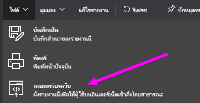
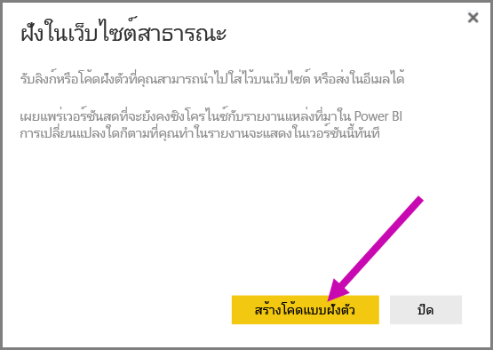
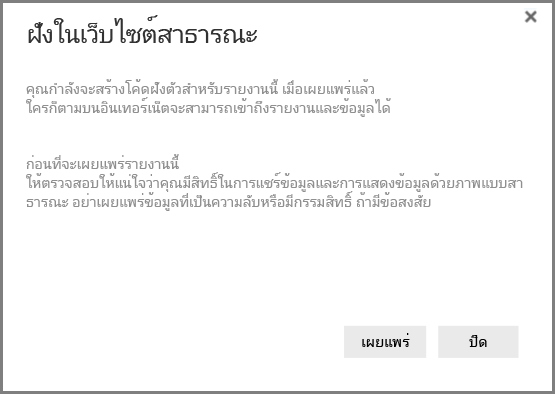

# เผยแพร่บนเว็บจาก Power BI

ด้วย Power BI **เผยแพร่ไปยังเว็บ** คุณสามารถฝังการแสดงภาพ Power BI แบบโต้ตอบแบบออนไลน์ เช่นโพสต์ในบล็อก เว็บไซต์ ผ่านทางอีเมลหรือ social media บนอุปกรณ์ใดก็ได้อย่างง่ายดาย

คุณยังสามารถทำแก้ไข ปรับปรุง การรีเฟรช หรือยกเลิกแชร์ภาพที่คุณเผยแพร่ได้อย่างง่ายดาย

> [!WARNING]
> เมื่อคุณใช้**เผยแพร่ไปยังเว็บ**รายงานหรือรูปภาพที่คุณเผยแพร่สามารถดูได้ โดยทุกคนบนอินเทอร์เน็ต ไม่มีการรับรองตัวตนใช้เมื่อดูรายงานเหล่านี้ ใช้เพียงการเผยแพร่ไปยังเว็บด้วยรายงานและข้อมูลที่ทุกคนบนอินเทอร์เน็ต (ไม่มีการรับรองตัวตนของผู้เข้าชม) ควรสามารถมองเห็น สิ่งนี้รวมถึงข้อมูลระดับรายละเอียดที่จะรวมอยู่ในรายงานของคุณ ก่อนที่จะเผยแพร่รายงานนี้ ให้ตรวจสอบให้แน่ใจว่าคุณมีสิทธิ์ในการแชร์ข้อมูลและการแสดงข้อมูลด้วยภาพแบบสาธารณะ อย่าเผยแพร่ข้อมูลที่เป็นความลับหรือมีกรรมสิทธิ์ ถ้ามีข้อสงสัย ให้ตรวจสอบนโยบายขององค์กรของคุณก่อนเผยแพร่

## วิธีใช้เผยแพร่ไปยังเว็บ

**เผยแพร่ไปยังเว็บ**พร้อมใช้งานบนรายงานในเวิร์กสเปซส่วนบุคคล หรือกลุ่มที่คุณสามารถแก้ไขได้  คุณไม่สามารถใช้เผยแพร่ไปยังเว็บด้วยรายงานที่ถูกแชร์กับคุณ หรือรายงานที่ขึ้นกับความปลอดภัยระดับแถวเพื่อรักษาความปลอดภัยของข้อมูล ดู**ข้อจำกัด**ด้านล่างสำหรับรายชื่อทั้งหมดของกรณีที่เผยแพร่ไปยังเว็บนั้นไม่รองรับ โปรดดู**การเตือน**ในตอนต้นของบทความนี้ก่อนที่ใช้เผยแพร่ไปยังเว็บ

คุณสามารถดูวิธีการที่ฟีเจอร์นี้ทำงานใน*วิดีโอสั้น ๆ*ต่อไปนี้ แล้ว ทำตามขั้นตอนด้านล่างเพื่อลองทำด้วยตนเอง

<iframe width="560" height="315" src="https://www.youtube.com/embed/UF9QtqE7s4Y" frameborder="0" allowfullscreen></iframe>

ขั้นตอนต่อไปนี้อธิบายวิธีการใช้**เผยแพร่ไปยังเว็บ**

1. ในรายงานในพื้นที่ทำงานของคุณซึ่งคุณสามารถแก้ไขได้ ให้เลือก**ไฟล์ > เผยแพร่ไปยังเว็บ**
   
   

2. ตรวจทานเนื้อหาบนกล่องโต้ตอบ และเลือก**สร้างโค้ดฝังตัว**ดังที่แสดงในกล่องโต้ตอบต่อไปนี้
   
   

3. ตรวจทานคำเตือนที่แสดงในกล่องโต้ตอบต่อไปนี้ และยืนยันว่าข้อมูลสามารถฝังในเว็บไซต์สาธารณะได้ ถ้าเป็น่นนั้น เลือก **เผยแพร่**
   
   

4. กล่องโต้ตอบที่ปรากฏขึ้นมีลิงก์ที่สามารถถูกส่งในอีเมล ถูกฝังลงในโค้ด (เช่น iFrame) หรือคุณสามารถวางในเว็บเพจหรือบล็อกของคุณได้โดยตรง
   
   

5. ถ้าก่อนหน้านี้คุณได้สร้างโค้ดฝังตัวสำหรับรายงาน โค้ดฝังตัวจะปรากฏขึ้นอย่างรวดเร็ว คุณสามารถสร้างโค้ดฝังตัวหนึ่งโค้ดสำหรับแต่ละรายงาน
   
   

## ทิปส์และเคล็ดลับสำหรับโหมดมุมมอง

เมื่อคุณฝังเนื้อหาภายในโพสต์ในบล็อก คุณโดยทั่วไปแล้วจำเป็นต้องพอดีภายในขนาดระบุของหน้าจอ  คุณยังสามารถปรับความสูงและความกว้างเป็นแท็ก iFrame ตามความจำเป็น แต่คุณอาจจำเป็นต้องให้แน่ใจว่า รายงานของคุณพอดีกับภายในพื้นที่ที่ระบุของ iFrame ดังนั้นคุณยังต้องตั้งค่าเป็นโหมดมุมมองที่เหมาะสมเมื่อทำการแก้ไขรายงาน

ตารางต่อไปนี้มีคำแนะนำเกี่ยวกับโหมดมุมมอง และวิธีจะปรากฏเมื่อถูกฝังตัว

| โหมดมุมมอง | มันจะเห็นอย่างไรเมื่อถูกฝังตัว |
| --- | --- |
|  |**ทำให้พอดีกับหน้า**จะคำนึงถึงความสูงของหน้าและความกว้างของรายงานของคุณ ถ้าคุณตั้งค่าหน้าของคุณเป็นอัตราส่วน 'แบบไดนามิก' เช่น 16:9 หรือ 4:3 เนื้อหาของคุณจะปรับขนาดให้พอดีภายในตัว iFrame ที่คุณระบุ เมื่อฝังใน iFrame โดยใช้**ให้พอดีกับหน้า**อาจก่อให้เกิด**letterboxing**ที่พื้นหลังสีเทาถูกแสดงในพื้นที่ของ iFrame หลังจากเนื้อหาถูกปรับขนาดให้พอดีกับภายใน iFrame เมื่อต้องการย่อ letterboxing ให้เล็กที่สุด ให้ตั้งค่าความสูง/กว้าง iFrame ของคุณอย่างเหมาะสม |
|  |**ขนาดจริง**จะให้แน่ใจว่า รายงานเก็บรักษาขนาดตามที่ตั้งค่าหน้ารายงาน นี่อาจทำให้แถบเลื่อนที่มีอยู่ใน iFrame ของคุณ ตั้งค่าความสูง iFrame และความกว้างเพื่อหลีกเลี่ยงแถบเลื่อน |
|  |**จัดพอดีกับความกว้าง**ให้แน่ใจว่า เนื้อหาพอดีกับพื้นที่แนวนอนของ iFrame ของคุณ เส้นขอบจะยังคงแสดงอยู่ แต่เนื้อหาจะปรับมาตราส่วนเพื่อใช้ช่องว่างแนวนอนที่มีทั้งหมด |

## ทิปส์และเคล็ดลับสำหรับความกว้างและความสูงของ iFrame

โค้ดฝังตัวที่คุณได้รับหลังจากที่คุณเผยแพร่ไปยังเว็บจะมีลักษณะดังต่อไปนี้

คุณสามารถแก้ไขความกว้างและความสูงด้วยตนเอง เพื่อให้แน่ใจอย่างแม่นยำว่าคุณต้องการให้พอดีกับหน้าลงในที่คุณกำลังฝังอย่างไร

เพื่อปรับให้พอดีมากขึ้น คุณสามารถลองเพิ่มพิกเซล 56 ไปยังมิติความสูงของ iFrame สิ่งนี้ปรับให้เหมาะกับขนาดปัจจุบันของแถบด้านล่าง ถ้าหน้าของรายงานใช้ขนาดแบบไดนามิก ตารางด้านล่างแสดงขนาดบางอย่างคุณสามารถทำให้พอดีโดยไม่ต้องจัดแบบ letterbox

| อัตราส่วน | ขนาด | มิติ (ความกว้าง x ความสูง) |
| --- | --- | --- |
| 16:9 |ขนาดเล็ก |640 x 416 px |
| 16:9 |ขนาดปานกลาง |800 x 506 px |
| 16:9 |ขนาดใหญ่ |960 x 596 px |
| 4:3 |ขนาดเล็ก |640 x 536 px |
| 4:3 |ขนาดปานกลาง |800 x 656 px |
| 4:3 |ขนาดใหญ่ |960 x 776 px |

## การจัดโค้ดแบบฝังตัว

เมื่อคุณสร้างโค้ดฝังตัวที่**เผยแพร่ไปยังเว็บ** คุณสามารถจัดการรหัสที่คุณสร้างจากเมนู**ตั้งค่า**ของ Power BI service การจัดการโค้ดแบบฝังตัวมีความสามารถในการลบภาพปลายทางหรือรายงานสำหรับรหัส (แสดงโค้ดฝังตัวที่ไม่สามารถใช้งาน) หรือได้รับรหัสฝังตัวอีกครั้ง

1. เพื่อจัดการฝังรหัส**เผยแพร่ไปยังเว็บ**ของคุณ เปิดเฟือง**การตั้งค่า** แล้วเลือก**จัดการโค้ดฝังตัว**
   
   

2. รายการของโค้ดแบบฝังตัวที่คุณสร้างแสดงขึ้นมา ดังที่แสดงในรูปต่อไปนี้
   
   

3. สำหรับแต่ละโค้ดฝังตัวที่**เผยแพร่ไปยังเว็บ**ในรายการ คุณสามารถเรียกใช้โค้ดฝัง หรือลบโค้ดฝังตัว แล้วสร้างลิงก์ใดๆ ที่รายงานหรือรูปใช้งานไม่ได้
   
   

4. ถ้าคุณเลือก**ลบ** คุณถูกถามว่าคุณแน่ใจว่าคุณต้องการลบโค้ดแบบฝังตัว
   
   

## อัปเดตรายงานและรีเฟรชข้อมูล

หลังจากที่คุณสร้างโค้ดฝังตัวของ**การเผยแพร่ไปยังเว็บ**ของคุณและแชร์ไฟล์ มีการอัปเดรายงานและมีการเปลี่ยนแปลงใดๆ ที่คุณทำ อย่างไรก็ตาม สิ่งสำคัญคือต้องทราบว่าสามารถใช้เวลาสักครู่สำหรับการปรับปรุงให้มองเห็นโดยผู้ใช้ของคุณ ปรับปรุงไปยังรายงานหรือรูปใช้เวลาประมาณหนึ่งชั่วโมงสะท้อนในการเผยแพร่โค้ดฝังตัวในเว็บ

เมื่อคุณเริ่มต้นใช้**การเผยแพร่ไปยังเว็บ**เพื่อรับโค้ดแบบฝังตัว ลิงก์โค้ดแบบฝังตัวจะเปิดใช้งานทันที และสามารถดูได้โดยทุกคนที่เปิดลิงก์  หลังจากดำเนินการเผยแพร่ครั้งแรกบนเว็บ ทำการปรับปรุงการรายงานหรือภาพที่เผยแพร่ไปยังจุดเชื่อมโยงเว็บ อาจใช้เวลาประมาณหนึ่งชั่วโมงที่จะเห็นได้โดยผู้ใช้ของคุณ

เมื่อต้องการเรียนรู้เพิ่มเติม ให้ดู**วิธีการทำงาน**ส่วนในภายหลังในบทความนี้ ถ้าคุณต้องการอัปเดตความสามารถใช้งานแบบทันทีของคุณ คุณสามารถลบโค้ดแบบฝังตัวและสร้างขึ้นใหม่

## การรีเฟรชข้อมูล

รีเฟรชข้อมูลเป็นภาพสะท้อนในรายงานแบบฝังตัวหรือแบบรูปภาพอัตโนมัติของคุณ อาจใช้เวลาประมาณ 1 ชั่วโมงสำหรับรีเฟรชข้อมูลเพื่อให้สามารถมองเห็นได้จากโค้ดแบบฝังตัว คุณสามารถปิดการใช้งานรีเฟรชโดยอัตโนมัติ โดยการเลือก**อย่ารีเฟรช**ตามกำหนดการสำหรับชุดข้อมูลที่ถูกใช้โดยรายงาน  

## ภาพแบบกำหนดเอง

ภาพแบบกำหนดเองรองรับ**การเผยแพร่ไปยังเว็บ** เมื่อคุณใช้การเผยแพร่ไปยังเว็บ ผู้ใช้ที่คุณแชร์ภาพที่เผยแพร่ของคุณ ไม่จำเป็นต้องเปิดใช้งานภาพวิชวลแบบกำหนดเองเพื่อดูรายงาน

## ข้อจำกัด

**เผยแพร่ไปยังเว็บ**ได้รับการรองรับสำหรับแหล่งข้อมูลส่วนใหญ่ และรายงานใน Power BI service อย่างไรก็ตาม มีดังต่อไปนี้**ขณะนี้ไม่ได้รับการรองรับหรือไม่พร้อมใช้งาน** ด้วยเผยแพร่ไปยังเว็บ

1. รายงานการใช้ความปลอดภัยระดับแถว
2. รายงานที่ใช้แหล่งข้อมูลแบบไลฟ์ใดๆ รวมถึง Analysis Services Tabular ที่โฮสต์ภายในองค์กร Analysis Services Multidimensional และ Azure Analysis Services
3. รายงานทีแชร์กับคุณโดยตรง หรือผ่าแพ็คเนื้อหาขององค์กร
4. รายงานในกลุ่มที่คุณไม่ใช่สมาชิกที่มีสิทธิ์แก้ไข
5. ภาพวิชวล " R " จะไม่ได้รับการรองรับในการเผยแพร่รายงานเว็บ
6. การส่งออกข้อมูลจากภาพในรายงานที่เผยแพร่ไปยังเว็บ
7. ArcGIS Maps สำหรับ Power BI
8. [รักษาข้อมูลความเป็นความลับหรือกรรมสิทธิ์](#publish-to-web-from-power-bi)

## การตั้งค่าผู้เช่า

ผู้ดูแลระบบ power BI สามารถเปิดหรือปิดใช้งานการเผยแพร่ไปยังฟีเจอร์ของเว็บ พวกเขายังอาจจำกัดการเข้าถึงกลุ่มทีเป็นแบบเฉพาะ ความสามารถสร้างโค้ดแบบฝังตัวได้เปลี่ยน โดยยึดตามการตั้งค่านี้

|ฟีเจอร์ |เปิดใช้งานทั้งองค์กร |ปิดใช้งานทั้งองค์กร |กลุ่มความปลอดภัยเฉพาะ   |
|---------|---------|---------|---------|
|**เผยแพร่ไปยังเว็บ**ภายใต้เมนู**ไฟล์**ของรายงาน|เปิดใช้งานสำหรับทั้งหมด|ไม่แสดงทั้งหมด|ผู้ใช้หรือกลุ่มที่ได้รับอนุญาตเท่านั้นที่สามารถดูได้|
|**จัดการโค้ดฝังตัว**ภายใต้**การตั้งค่า**|เปิดใช้งานสำหรับทั้งหมด|เปิดใช้งานสำหรับทั้งหมด|เปิดใช้งานสำหรับทั้งหมด  * **ลบ**ตัวเลือกสำหรับผู้ใช้หรือกลุ่มที่ได้รับอนุญาตเท่านั้น * **รับรหัส**เปิดใช้งานสำหรับทั้งหมด|
|**โค้ดฝังตัว**ในพอร์ทัลของผู้ดูแลระบบ|สถานะจะแสดงหนึ่งในรายการต่อไปนี้ * ใช้งานอยู่ * ไม่ได้รับการสนับสนุน * ถูกบล็อก|สถานะจะแสดง**ปิดใช้งาน**|สถานะจะแสดงหนึ่งในรายการต่อไปนี้ * ใช้งานอยู่ * ไม่ได้รับการสนับสนุน * ถูกบล็อก  ถ้าผู้ใช้จะไม่ได้รับอนุญาตโดยยึดตามการตั้งค่าผู้เช่า สถานะจะแสดงเป็น**ถูกละเมิด**|
|รายงานที่เผยแพร่แล้วที่มีอยู่|เปิดใช้งานทั้งหมด|ปิดใช้งานทั้งหมด|รายงานยังคงแสดงทั้งหมด|

## ทำความเข้าใจเกี่ยวกับคอลัมน์สถานะโค้ดฝังตัว

เมื่อดูหน้า**จัดการโค้ดแบบฝังตัว**เพื่อ**เผยแพร่ไปยังเว็บ**ฝังรหัสของคุณ ให้คอลัมน์สถานะ ฝังรหัสใช้งานอยู่ตามค่าเริ่มต้น แต่คุณอาจพบสถานะใดๆ อยู่ในรายการด้านล่าง

| สถานะ | คำอธิบาย |
| --- | --- |
| **ใช้งานอยู่** |รายงานจะพร้อมใช้งานสำหรับผู้ใช้อินเทอร์เน็ตเพื่อดูและโต้ตอบ |
| **ถูกบล็อก** |เนื้อหาของรายงานการละเมิด[ เงื่อนไขการใช้บริการ Power BI](https://powerbi.microsoft.com/terms-of-service) มันถูกบล็อก โดย Microsoft ติดต่อฝ่ายสนับสนุนหากคุณเชื่อว่าเนื้อหาที่ถูกบล็อกมาจากความผิดพลาด |
| **ไม่รองรับ** |ชุดข้อมูลของรายงานใช้ความปลอดภัยระดับแถว หรือไม่รองรับการกำหนดค่าอื่น ดูส่วน**ข้อจำกัด**สำหรับรายการทั้งหมด |
| **ถูกละเมิด** |โค้ดฝังอยู่ภายนอกนโยบายที่กำหนดไว้โดยผู้เช่า ซึ่งมักเกิดขึ้นเมื่อสร้างโค้ดฝังตัว แล้วเผยแพร่ไปยังการตั้งค่าผู้เช่าเว็บถูกเปลี่ยนเพื่อไม่รวมผู้ใช้ที่เป็นเจ้าของโค้ดแบบฝัง ถ้าการตั้งค่าผู้เช่าถูกปิด หรือผู้ใช้ไม่ได้รับอนุญาตให้สร้างโค้ดแบบฝังตัว ที่มีอยู่โค้ดฝังตัวจะแสดงสถานะ**ถูกละเมิด** |

## วิธีการรายงานข้อจำกัดเกี่ยวกับการเผยแพร่ไปยังเนื้อหาบนเว็บ

เพื่อรายงานที่เกี่ยวกับเนื้อหา**เผยแพร่ไปยังเว็บ**แบบฝังหรือบล็อก ใช้ไอคอน**ค่าสถานะ**ในแถบด้านล่าง ถูกแสดงในรูปต่อไปนี้ คุณจะถูกขอให้ส่งอีเมลไปยังไมโครซอฟท์เพื่ออธิบายสิ่งที่ต้องคำนึงถึง Microsoft จะประเมินเนื้อหาที่ยึดตามเงื่อนไขการใช้บริการ Power BI และดำเนินการที่เหมาะสม

เพื่อรายงานข้อจำกัด เลือกไอคอน**สถานะ**ในแถบด้านล่างของการเผยแพร่ไปยังรายงานบนเว็บที่คุณเห็น

## สิทธิ์และราคาการใช้งาน

คุณจำเป็นต้องเป็นผู้ใช้ Microsoft Power BI เพื่อใช้**เผยแพร่ไปยังเว็บ** ผู้บริโภคของรายงานของคุณ (ผู้อ่าน ผู้ชม) ไม่จำเป็นต้องเป็นผู้ใช้ Power BI

## ทำงานอย่างไร (รายละเอียดทางเทคนิค)

เมื่อคุณสร้างในรหัสที่ฝังโดยใช้**เผยแพร่ไปยังเว็บ** รายงานจะทำให้ผู้ใช้มองเห็นบนอินเทอร์เน็ต สามารถใช้งานแบบสาธารณะ ดังนั้นคุณสามารถคาดหวังผู้ชมแชร์รายงานผ่านสื่อทางสังคมในอนาคตได้อย่างง่ายดาย ขณะที่ผู้ใช้ดูรายงาน โดยเปิดผ่าน URL สาธารณะโดยตรงหรือดูแบบฝังในเว็บเพจหรือบล็อก Power BI เก็บการให้คำนิยามรายงานและผลลัพธ์ของคิวรี่ที่จำเป็นต้องดูรายงาน วิธีนี้ช่วยให้สามารถดูรายงาน โดยผู้ใช้พร้อมกันโดยไม่มีผลกระทบต่อประสิทธิภาพการทำงาน

แคชเป็นแบบ long-lived ดังนั้นถ้าคุณปรับปรุงคำนิยามรายงาน(ตัวอย่าง ถ้าคุณเปลี่ยนโหมดมุมมอง) หรือรีเฟรชข้อมูลรายงาน อาจใช้เวลาประมาณหนึ่งชั่วโมงก่อนที่เปลี่ยนแปลง ซึ่งเห็นในเวอร์ชันของรายงานที่ดูโดยผู้ใช้ของคุณ จึงขอแนะนำให้คุณเริ่มทำงานก่อน และสร้างโค้ดฝังตัว**เผยแพร่ไปยังเว็บ** เมื่อเพียงคุณพอใจกับการตั้งค่า

มีคำถามเพิ่มเติมหรือไม่ [ลองไปที่ชุมชน Power BI](http://community.powerbi.com/)
