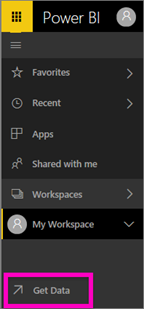
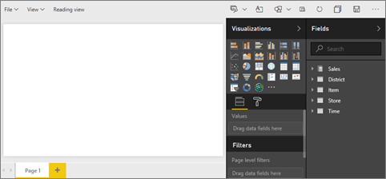

# สร้างรายงานใหม่ในบริการ Power BI โดยการนำเข้าชุดข้อมูล
คุณได้อ่าน[รายงานใน Power BI](consumer/end-user-reports.md)และตอนนี้ คุณต้องการสร้างรายงานของคุณเอง มีวิธีการสร้างรายงานหลากหลายวิธี และในบทความนี้เราจะเริ่มต้นด้วยการสร้างรายงานพื้นฐานจากชุดข้อมูล Excel โดยใช้บริการ Power BI เมื่อคุณทำความเข้าใจพื้นฐานของการสร้างรายงาน การ**ขั้นตอนถัดไป**ที่ด้านล่างจะพาคุณไปยังหัวข้อการรายงานขั้นสูงเพิ่มเติม  

> **เคล็ดลับ**: เมื่อต้องการสร้างรายงาน โดยการคัดลอกรายงานที่มีอยู่ ดู[คัดลอกรายงาน](power-bi-report-copy.md)
> 
> ### ข้อกำหนดเบื้องต้น
> - บริการ Power BI (สำหรับการสร้างรายงานโดยใช้ Power BI Desktop ให้ดู [มุมมองรายงานบนเดสก์ท็อป](desktop-report-view.md))  
> - ตัวอย่างการวิเคราะห์การค้าปลีก

## นำเข้าชุดข้อมูล
วิธีการสร้างรายงานนี้เริ่มต้น ด้วยชุดข้อมูลและพื้นที่ว่างเปล่ารายงานว่างเปล่า เมื่อต้องติดตาม[ดาวน์โหลดชุดข้อมูล Excel ตัวอย่างการวิเคราะห์ร้านค้าปลีก](http://go.microsoft.com/fwlink/?LinkId=529778)และบันทึกไปยัง OneDrive for Business (ที่ต้องการ) หรือภายในเครื่อง

1. เราจะสร้างรายงานในพื้นที่ทำงานบริการ Power BI ดังนั้นให้เลือกพื้นที่ทำงานมีอยู่ หรือสร้างขึ้นใหม่
   
   
2. จากด้านล่างของ navpane ซ้าย เลือก**รับข้อมูล**
   
   
3. เลือก**แฟ้ม**และนำทางไปยังตำแหน่งที่คุณบันทึกตัวอย่างการวิเคราะห์ร้านค้าปลีก
   
    
4. สำหรับการดำเนินการนี้ เลือก**นำเข้า**
   
   
5. หลังจากที่ชุดข้อมูลจะถูกนำเข้า เลือก**ชุดข้อมูลมุมมอง**
   
   
6. ดูชุดข้อมูลที่เปิดตัวแก้ไขรายงานจริงขึ้น  คุณจะเห็นรายงานเครื่องมือการแก้ไขและพื้นที่ว่างเปล่า
   
   

> **เคล็ดลับ**: ถ้าคุณไม่คุ้นเคยกับรายงานพื้นที่แก้ไข หรือต้องการการทบทวน[ชมการแนะนำของตัวแก้ไขรายงาน](service-the-report-editor-take-a-tour.md)ก่อนดำเนินการต่อ
> 
> 

## เพิ่มการวัดรัศมีลงในรายงาน
หลังจากที่ชุดข้อมูลของเราจะถูกนำเข้า มาเริ่มต้นการตอบคำถามบางอย่าง  เราหัวหน้าฝ่ายตลาดเจ้าหน้าที่ (CMO) ต้องการทราบเกี่ยวกับวิธีปิดเราที่การประชุมเป้าหมายการขายของปีนี้ การวัดจะเป็น[ตัวเลือกการแสดงภาพที่ดี](visuals/power-bi-report-visualizations.md)สำหรับการแสดงข้อมูลชนิดนี้

1. ในบานหน้าต่างเขตข้อมูล เลือก**ยอดขาย** > **ค่ายอดขายของปี** > **นี้**
   
    
2. แปลงภาพเป็นการวัด โดยการเลือกเทมเพลวัดจาก**แสดงภาพ**บานหน้าต่าง
   
    
3. ลาก**ยอดขาย** > **เป้าหมายยอดขาย** > **ของปีนี้**เพื่อ**ค่าเป้าหมาย**กัน ดูเหมือนว่าเรากำลังใกล้เคียงกับเป้าหมายของเรามาก
   
    
4. ในตอนนี้เป็นเวลาที่เหมาะสม[บันทึกรายงานของคุณ](service-report-save.md)
   
   

## เพิ่มชาร์ตพื้นที่และ slicer ในรายงาน
CMO ของเรามีคำถามบางอย่างเพิ่มเติมให้แก่เรา เธอต้องการทราบข้อมูลการขายปีนีเมื่อ้เปรียบเทียบกับปีที่แล้ว และเธอต้องการดูโดยการค้นหาด้วยเขตอำเภอ

1. ก่อนอื่น มาสร้างพื้นที่ว่างในพื้นที่รายงานก่อน เลือกตัววัด และย้ายไปมุมบนขวา จากนั้น จับ และลากมุมหนึ่ง และทำให้เล็กลง
2. ยกเลิกเลือกตัววัด ในบานหน้าต่างเขตข้อมูล เลือก**ยอดขาย** > **ค่ายอดขายของปีนี้** > **นี้**เลือก**ขาย** >  **ยอดขายของปีที่แล้ว**
   
    
3. แปลงภาพเป็นการวัด โดยการเลือกเทมเพลวัดจาก**แสดงภาพ**บานหน้าต่าง
4. เลือก**เวลา** > **รอบระยะเวลา**เพื่อเพิ่มไปยัง**แกน**กัน
   
    
5. เมื่อต้องการเรียงลำดับการแสดงภาพ โดยรอบระยะเวลา เลือกจุดไข่ปลา แล้วเลือก**เรียงลำดับตามระยะเวลา**
6. ตอนนี้มาเพิ่มตัวแบ่งส่วนข้อมูล เลือกพื้นที่ว่างบนพื้นที่รายงาน และเลือกตัวแบ่งส่วนข้อมูล     แม่แบบ เพิ่มตัวแบ่งส่วนข้อมูลที่ว่างเปล่าเมื่อต้องการพื้นที่ของเรา
   
        
7. จากบานหน้าต่างเขตข้อมูล เลือก**เขต** > **เขต** ย้าย และปรับขนาดตัวแบ่งส่วนข้อมูล
   
      
8. ใช้ตัวแบ่งส่วนข้อมูลเพื่อค้นหารูปแบบและข้อมูลเชิงลึก โดยเขต
   
     

สำรวจข้อมูลของคุณ และเพิ่มการแสดงภาพต่อไป เมื่อคุณค้นหาข้อมูลเชิงลึกที่น่าสนใจโดยเฉพาะอย่างยิ่ง[ปักหมุดเหล่านั้นไปยังแดชบอร์ด](service-dashboard-pin-tile-from-report.md)

## ขั้นตอนถัดไป
* [เพิ่มหน้าใหม่ลงในรายงาน](power-bi-report-add-page.md)  
* เรียนรู้วิธีการ[ปักหมุดภาพไปยังแดชบอร์ด](service-dashboard-pin-tile-from-report.md)   
* มีคำถามเพิ่มเติมหรือไม่ [ลองไปที่ชุมชน Power BI](http://community.powerbi.com/)

