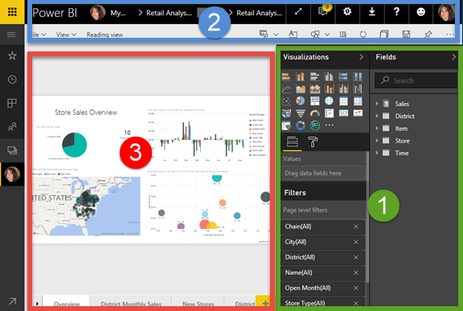
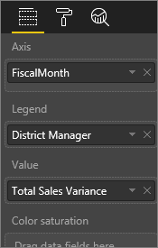
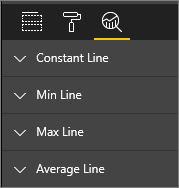
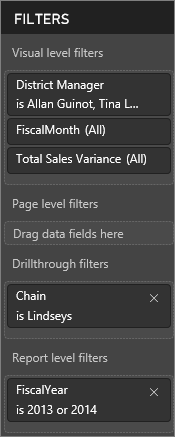

# ตัวแก้ไขรายงาน... ชมการแนะนำ
## แก้ไขรายงานในบริการ Power BI และ Power BI Desktop
ตัวแก้ไขรายงานในบริการ Power BI และตัวแก้ไขรายงานใน Power BI Desktop จะคล้ายกันอย่างมาก วิดีโอแสดงตัวแก้ไขรายงานใน Power BI Desktop และบทความนี้แสดงตัวแก้ไขรายงานในบริการ Power BI 

## ความแตกต่างระหว่าง*ผู้สร้าง*รายงานและ*ผู้บริโภค*รายงาน
ความสามารถในการสร้างและแก้ไขรายงานจะจำกัดอยู่เฉพาะกับเจ้าของรายงาน (หรือที่เรียกว่า*ผู้สร้าง*) ถ้าคุณกำลัง*การใช้งาน*รายงานที่แชร์กับคุณ คุณจะยังคงสามารถเปิดและโต้ตอบกับรายงานในบริการ Power BI ได้ใน [มุมมองการอ่านเท่านั้น](service-reading-view-and-editing-view.md) และจะไม่สามารถใช้คุณลักษณะที่ครอบคลุมทั้งหมดที่มีพร้อมใช้งานสำหรับผู้สร้างรายงาน  

เมื่อต้องการเรียนรู้เพิ่มเติมเกี่ยวกับรายงานในมุมมองการอ่าน ดู[มุมมองการอ่านและมุมมองแก้ไขในบริการ Power BI](service-reading-view-and-editing-view.md) 

<iframe width="560" height="315" src="https://www.youtube.com/embed/IkJda4O7oGs" frameborder="0" allowfullscreen></iframe>

ในบริการ Power BI การ*ตัวแก้ไขรายงาน*พร้อมใช้งานใน[มุมมองการแก้ไข](service-reading-view-and-editing-view.md)เท่านั้น การเปิดรายงานในมุมมองการแก้ไข คุณต้องเป็นเจ้าของรายงานหรือเป็นผู้สร้าง

ตัวแก้ไขรายงาน Power BI สร้างขึ้นจาก 3 ส่วนด้วยกัน:  

1. **ช่องข้อมูล** **การแสดงภาพ**และพื้นที่**ตัวกรอง**
2. แถบนำทางด้านบน    
3. พื้นที่รายงาน     

## 1. พื้นที่ตัวแก้ไขรายงาน

มี 3 พื้นที่ที่สามารถมองเห็นได้เมื่อคุณเปิดรายงาน: การแสดงภาพ ตัวกรอง และช่องข้อมูล พื้นที่ทางด้านซ้าย การแสดงภาพและตัวกรอง ควบคุมลักษณะปรากฏของการแสดงภาพของคุณ -- ประเภท สี กรอง การจัดรูปแบบ  พื้นที่ทางด้านขวา ช่องข้อมูล จัดการข้อมูลสำคัญที่ใช้ในการแสดงภาพ 

เนื้อหาที่แสดงในตัวแก้ไขรายงานแตกต่างกัน ตามการเลือกของคุณที่ดำเนินการในพื้นที่รายงาน  ตัวอย่างเช่น เมื่อคุณเลือกภาพแต่ละภาพ 

|  |  |
| --- | --- |
|  |<ul><li>ด้านบนของพื้นที่การแสดงภาพระบุชนิดของภาพที่ใช้อยู่ ในตัวอย่างนี้จะเป็นแผนภูมิคอลัมน์แบบกลุ่ม  </li> <li>ด้านล่างของพื้นที่การแสดงภาพ (คุณอาจจำเป็นต้องเลื่อนลง) แสดงช่องข้อมูลที่มีการใช้ในภาพ แผนภูมินี้จะใช้ FiscalMonth, DistrictManager และค่าผลต่างยอดขายรวม   </li><li>พื้นที่ตัวกรอง (คุณอาจจำเป็นต้องเลื่อนลง) แสดงตัวกรองใด ๆ ที่มีการนำไปใช้   </li><li>พื้นที่ช่องข้อมูลแสดงรายการตารางที่พร้อมใช้งาน หากคุณขยายชื่อของตาราง ช่องข้อมูลดังกล่าวจะเป็นตัวสร้างตารางนั้น แบบอักษรสีเหลืองช่วยให้คุณทราบว่าอย่างน้อยหนึ่งช่องข้อมูลจากตารางนั้นจะถูกใช้ในการแสดงภาพ  </li><li> การแสดงพื้นที่การจัดรูปแบบ สำหรับการแสดงภาพที่เลือก ให้เลือกไอคอนลูกกลิ้งระบายสี  </li><li> เมื่อต้องการแสดงพื้นที่ Analystics เลือกไอคอนแว่นขยาย</ul> |

## พื้นที่การแสดงภาพ (จากบนลงล่าง)

ตรงนี้คือที่ที่คุณเลือกประเภทของการแสดงภาพ รูปภาพขนาดเล็กจะเรียกว่า*เทมเพลต* ในรูปด้านบน มีการเลือกแผนภูมิแท่งแบบกลุ่ม ถ้าคุณไม่เลือกประเภทของการแสดงภาพก่อน แต่เริ่มสร้างภาพโดยการเลือกช่องข้อมูลต่าง ๆ Power BI จะเลือกประเภทการแสดงภาพให้คุณ คุณสามารถใช้ส่วนที่เลือกของ Power BI ได้ต่อไปหรือเปลี่ยนประเภทได้โดยการเลือกเทมเพลตอื่น เปลี่ยนได้หลายครั้งตามที่คุณต้องการเพื่อหาประเภทการแสดงภาพที่เหมาะสมที่สุดในการแสดงข้อมูลของคุณ

### จัดการช่องข้อมูลที่ใช้ในภาพของคุณ

กลุ่มข้อมูล (บางครั้งเรียกว่า*บ่อ*) แสดงในพื้นที่นี้แตกต่างกันขึ้นอยู่กับประเภทของการแสดงภาพที่คุณเลือก  ตัวอย่างเช่น ถ้าคุณเลือกแผนภูมิแท่ง คุณจะเห็นกลุ่มข้อมูลของ: ค่า แกน และคำอธิบายแผนภูมิ เมื่อคุณเลือกหนึ่งช่องข้อมูลหรือลากช่องข้อมูลลงบนพื้นที่ดังกล่าว Power BI จะเพิ่มพื้นที่ข้อมูลนั้นไปยังหนึ่งกลุ่มข้อมูล  นอกจากนี้ คุณยังสามารถลากเขตข้อมูลจากรายการพื้นที่ข้อมูลลงในกลุ่มข้อมูลได้โดยตรง  บางกลุ่มข้อมูลจะจำกัดเฉพาะสำหรับข้อมูลบางประเภท  ตัวอย่างเช่น **ค่า**จะไม่ยอมรับช่องข้อมูลที่ไม่ใช่ตัวเลข ดังนั้นถ้าคุณลากช่อง**ชื่อพนักงาน**ลงในการกลุ่มข้อมูล**ค่า** Power BI จะเปลี่ยนเป็น**จำนวนชื่อพนักงาน**

### เลือกพื้นที่ข้อมูล
เมื่อต้องการลบช่องข้อมูลออกจากการแสดงภาพ เลือกแบบ**X**ทางด้านขวาของชื่อช่องข้อมูล

สำหรับข้อมูลเพิ่มเติม ดู[เพิ่มการแสดงภาพไปยังรายงาน Power BI](power-bi-report-add-visualizations-i.md)

### จัดรูปแบบภาพของคุณ
เลือกไอคอนลูกกลิ้งระบายสีเพื่อแสดงพื้นที่จัดรูปแบบ ตัวเลือกที่พร้อมใช้งานขึ้นอยู่กับประเภทของการแสดงภาพที่เลือก

ความสามารถในการจัดรูปแบบเกือบไม่มีที่สิ้นสุด  เมื่อต้องการเรียนรู้เพิ่มเติม สำรวจด้วยตัวเองหรือเยี่ยมชมบทความเหล่านี้:

* [กำหนดชื่อเรื่องแสดงภาพ พื้นหลัง และคำอธิบายแผนภูมิ](power-bi-visualization-customize-title-background-and-legend.md)
* [จัดรูปแบบสี](service-getting-started-with-color-formatting-and-axis-properties.md)
* [คุณสมบัติแกน X และแกน Y ที่กำหนดด้วยตนเอง](power-bi-visualization-customize-x-axis-and-y-axis.md)

### เพิ่มการวิเคราะห์ไปยังการแสดงภาพของคุณ
เมื่อต้องการแสดงพื้นที่ Analystics เลือกไอคอนแว่นขยาย ตัวเลือกที่พร้อมใช้งานขึ้นอยู่กับประเภทของการแสดงภาพที่เลือก

    
มีพื้นที่การวิเคราะห์ในบริการ Power BI คุณสามารถเพิ่มรายการอ้างอิงแบบไดนามิกเพื่อจัดรูปแบบข้อมูล และโฟกัสไปที่แนวโน้มที่สำคัญหรือข้อมูลเชิงลึก เมื่อต้องการเรียนรู้เพิ่มเติม ดู[พื้นที่การวิเคราะห์ในบริการ Power BI](service-analytics-pane.md)หรือ[พื้นที่การวิเคราะห์ใน Power BI Desktop](desktop-analytics-pane.md)

- - -
## พื้นที่ตัวกรอง
ใช้พื้นที่ตัวกรองเพื่อดู ตั้งค่า และปรับเปลี่ยนตัวกรองแบบถาวรไปยังรายงานของคุณที่หน้า รายงาน การเจาะลึกข้อมูล และระดับภาพ ใช่ คุณสามารถกรองเพิ่มเติมบนหน้ารายงานและรูปภาพได้โดยการเลือกองค์ประกอบของภาพ หรือโดยใช้เครื่องมือเช่น ตัวแบ่งส่วนข้อมูล แต่การใชพื้นที่ตัวกรอง สถานะของตัวกรองจะถูกบันทึกกับรายงาน 

พื้นที่ตัวกรองมีคุณลักษณะอื่นหนึ่งคุณลักษณะที่ทรงพลัง ความสามารถในการกรองโดยใช้พื้นที่ข้อมูล***ซึ่งไม่ได้มีการใช้อยู่แล้วในหนึ่งภาพในรายงานของคุณ*** อนุญาตให้ฉันอธิบาย เมื่อคุณสร้างหน้ารายงาน Power BI จะเพิ่มช่องข้อมูลทั้งหมดที่คุณใช้ในการแสดงภาพของคุณไปยังพื้นที่ตัวกรองระดับภาพของพื้นที่ตัวกรองโดยอัตโนมัติ  แต่ถ้าคุณต้องการตั้งค่าภาพ หน้า การเจาะลึกผ่านข้อมูล หรือตัวกรองรายงาน โดยใช้พื้นที่ข้อมูลที่ไม่ได้ใช้ในการแสดงภาพในขณะนี้ ทำได้โดยเพียงลากไปยังหนึ่งในกลุ่มตัวกรอง   

สำหรับข้อมูลเพิ่มเติม ดู[เพิ่มตัวกรองไปในรายงาน](power-bi-report-add-filter.md)

- - -
## พื้นที่ช่องข้อมูล
พื้นที่ข้อมูลแสดงตารางและพื้นที่ข้อมูลที่มีอยู่ในข้อมูลของคุณ และจะพร้อมใช้งานสำหรับคุณในการสร้างการแสดงภาพ

|  |  |
| --- | --- |
|  |<ul><li>ลากช่องข้อมูลไปยังหน้าดังกล่าวเพื่อเริ่มการแสดงภาพแบบใหม่  นอกจากนี้ คุณยังสามารถลากช่องข้อมูลลงในการแสดงภาพที่มีอยู่เพื่อเพิ่มช่องข้อมูลเมื่อต้องการแสดงภาพนั้น  </li> <li>เมื่อคุณเพิ่มเครื่องหมายถูกถัดจากช่องข้อมูล Power BI จะเพิ่มช่องดังกล่าวไปยังการแสดงภาพที่มีใช้งานอยู่ (หรือการแสดงภาพใหม่) นอกจากนี้ จะตัดสินใจว่าจะวางช่องนั้นในกลุ่มข้อมูลใด  ตัวอย่างเช่น ควรใช้ช่องข้อมูลในคำอธิบายแผนภูมิ แกน หรือค่าหรือไม่? Power BI จะทำการสุ่มเพื่อให้ได้ผลดีที่สุด และคุณสามารถย้ายจากกลุ่มข้อมูลดังกล่าวที่ไปยังอีกกลุ่ม ถ้าจำเป็น   </li><li>ไม่ว่าวิธีใด แต่ละช่องข้อมูลที่เลือกจะถูกเพิ่มไปยังพื้นที่การแสดงภาพในตัวแก้ไขรายงาน</li></ul> |

**หมายเหตุ**: ถ้าคุณกำลังใช้ Power BI Desktop คุณจะมีตัวเลือกในการแสดง/ซ่อนช่องข้อมูล เพิ่มการคำนวณ และอื่น ๆ

### ไอคอนช่องข้อมูลหมายความว่าอะไร?
* **ผลรวม ∑** การรวมคือ ค่าตัวเลขที่นำมาสรุปรวมกันหรือทำให้เป็นค่าเฉลี่ย ยกตัวอย่างเช่น ผลรวมเป็นการนำเข้าข้อมูล (ที่กำหนดในแบบจำลองข้อมูลที่เป็นไปตามรายงานของคุณ)
  สำหรับข้อมูลเพิ่มเติม ดู[ผลรวมในรายงาน Power BI](service-aggregates.md)
*  **คำนวณหน่วยวัด (หรือที่เรียกว่าช่องข้อมูลที่คำนวณ)**  
   แต่ละคำนวณช่องข้อมูลที่คำนวณจะมีสูตรที่ตายตัว คุณไม่สามารถเปลี่ยนการคำนวณได้ ตัวอย่างเช่น ถ้านั่นเป็นผลรวม ค่านั้นจะสามารถเป็นผลรวมได้เท่านั้น สำหรับข้อมูลเพิ่มเติม [อ่านการทำความเข้าใจเกี่ยวกับหน่วยวัด](desktop-measures.md)
*  **ช่องข้อมูลที่ไม่ซ้ำกัน**  
   ช่องข้อมูลที่มีไอคอนนี้จะนำเข้าจาก Excel และมีการตั้งค่าให้แสดงค่าทั้งหมด แม้ว่าเป็นค่าที่ซ้ำกัน ตัวอย่างเช่น ข้อมูลของคุณอาจมีสองบันทึกสำหรับผู้ที่มีชื่อ 'John Smith' และแต่ละรายการจะถือว่าไม่ซ้ำกันและจะไม่นำมารวมกัน  
* **ช่องข้อมูลภูมิศาสตร์**  
   สามารถใช้พื้นที่ข้อมูลตำแหน่งที่ตั้งในการสร้างการแสดงภาพของแผนที่ได้ 
* **ลำดับชั้น**  
   เลือกลูกศรเพื่อแสดงช่องข้อมูลที่ประกอบเป็นค่าลำดับชั้น 

- - -
## 2. แถบนำทางด้านบน
การดำเนินการที่พร้อมใช้งานจากแถบนำทางด้านบนมีจำนวนมากมาย โดยมีการดำเนินการใหม่ที่เพิ่มเข้ามาตลอดเวลา สำหรับข้อมูลเกี่ยวกับการดำเนินการเฉพาะ ให้ใช้สารบัญการจัดเก็บเอกสาร Power BI หรือกล่องการค้นหา

## 3. พื้นที่รายงาน
พื้นที่รายงานคือ ตำแหน่งที่แสดงงานของคุณ เมื่อคุณใช้พื้นที่่ช่องข้อมูล ตัวกรอง และพื้นที่การแสดงภาพเพื่อสร้างภาพ ภาพเหล่านี้จะถูกสร้างขึ้นและแสดงอยู่บนพื้นที่รายงานของคุณ แต่ละแถบที่ด้านล่างของพื้นที่แสดงหน้าในรายงานดังกล่าว เลือกแถบเพื่อเปิดหน้านั้น 

## ขั้นตอนถัดไป:
[สร้างรายงาน](service-report-create-new.md)

อ่านเพิ่มเติมเกี่ยวกับรายงานใน[บริการ Power BI](service-reports.md), [Power BI Desktop](desktop-report-view.md)และ[Power BI สำหรับมือถือ](mobile-apps-view-phone-report.md)

[Power BI - แนวคิดพื้นฐาน](service-basic-concepts.md)

มีคำถามเพิ่มเติมหรือไม่? [ลองไปที่ชุมชน Power BI](http://community.powerbi.com/)

