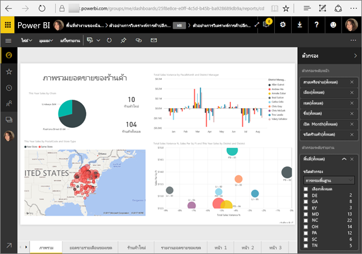
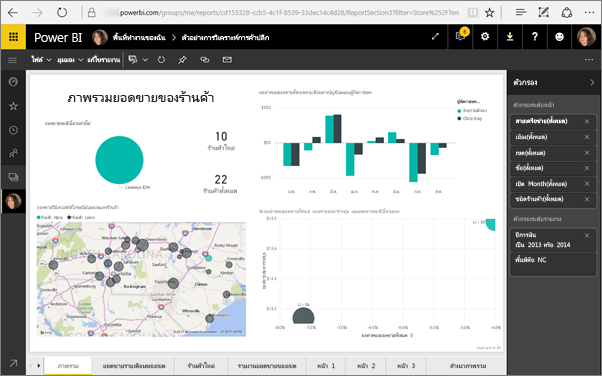

# <a name="filter-a-report-using-query-string-parameters-in-the-url"></a>กรองรายงานโดยใช้พารามิเตอร์สตริงของแบบสอบถามใน URL
เมื่อคุณเปิดรายงานในบริการ Power BI แต่ละหน้าของรายงานมี URL ของตัวเองไม่ซ้ำกัน เมื่อต้องกรองหน้ารายงานนั้น คุณสามารถใช้บานหน้าต่างตัวกรองบนพื้นที่รายงาน  หรือคุณสามารถเพิ่มพารามิเตอร์สตริงของแบบสอบถามไปยัง URL เพื่อกรองรายงาน บางครั้งคุณมีรายงานที่คุณต้องการแสดงให้แก่ผู้ร่วมงาน และคุณต้องการกรองไว้ล่วงหน้าสำหรับพวกเขา วิธีหนึ่งที่ทำได้ก็คือ การเริ่มต้นด้วย URL ที่เป็นค่าเริ่มต้นสำหรับรายงาน เพิ่มพารามิเตอร์ตัวกรองไปยัง URL และจากนั้น ส่งอีเมล URL ทั้งหมดให้พวกเขา



<iframe width="640" height="360" src="https://www.youtube.com/embed/WQFtN8nvM4A?list=PLv2BtOtLblH3YE_Ycas5B1GtcoFfJXavO&amp;showinfo=0" frameborder="0" allowfullscreen></iframe>

## <a name="query-string-parameter-syntax-for-filtering"></a>ไวยากรณ์พารามิเตอร์สตริงของแบบสอบถามสำหรับการกรอง
ไวยากรณ์จะค่อนข้างตรงไปตรงมา กล่าวคือ เริ่มต้นด้วย URL ของรายงาน เพิ่มเครื่องหมายคำถาม แล้วจึงเพิ่่มไวยากรณ์ตัวกรองของคุณ

URL?filter=***ตาราง***/***เขตข้อมูล*** eq '***ค่า***'


* **ชื่อตาราง** และ **เขตข้อมูล**จำเป็นต้องระบตัวพิมพ์ใหญ-่เล็ก**แต่ค่า**ไม่จำเป็น
* ยังคงสามารถกรองข้อมูลของเขตข้อมูลที่ถูกซ่อนจากมุมมองรายงาน
* **ค่า**ต้องอยู่ระหว่างเครื่องหมายอัญประกาศเดี่ยว
* ชนิดเขตข้อมูลจะต้องเป็นตัวเลขหรือสตริง
* ชื่อตารางและเขตข้อมูลต้องไม่มีช่องว่าง

ถ้ายังคงสับสน ให้อ่านต่อไป เราจะอธิบายในรายละเอียด  

## <a name="filter-on-a-field"></a>ตัวกรองบนเขตข้อมูล
สมมติว่า URL ในรายงานของเราเป็นดังนี้


และจะเห็นได้ในการจัดรูปแบบการแสดงข้อมูลแผนที่ (ด้านบน) ที่เรามีร้านค้าใน North Carolina

>[!NOTE]
>ตัวอย่างนี้จะยึดตาม [ตัวอย่างการวิเคราะห์ร้านค้าปลีก](sample-datasets.md)
> 

เพื่อกรองรายงานสำหรับแสดงข้อมูลเฉพาะสำหรับร้านค้าใน "NC" (North Carolina) ให้เพิ่มข้อมูลต่อไปนี้ลงใน URL:

?filter=Store/Territory eq 'NC'


>[!NOTE]
>*NC* เป็นค่าสำหรับ North Carolina ที่จัดเก็บไว้ในเขตข้อมูล **Territory** ในตาราง **Store**
> 
> 

รายงานของเราถูกกรองสำหรับ North Carolina แล้ว กล่าวคือ การจัดรูปแบบการแสดงข้อมูลทั้งหมดบนหน้ารายงานจะแสดงข้อมูลเฉพาะ North Carolina เท่านั้น



## <a name="filter-on-multiple-fields"></a>ตัวกรองบนหลายเขตข้อมูล
คุณยังสามารถกรองบนเขตข้อมูลหลายรายการได้โดยการเพิ่มพารามิเตอร์เพิ่มเติมไปยัง URL ของคุณ ลองย้อนกลับไปยังพารามิเตอร์ตัวกรองต้นฉบับของเรา

```
?filter=Store/Territory eq 'NC'
```

เมื่อต้องการกรองข้อมูลในเขตข้อมูลเพิ่มเติม เพิ่มข้อ`and`และเขตข้อมูลอื่นในรูปแบบเดียวกับด้านบน ต่อไปนี้เป็นตัวอย่างหนึ่ง:

```
?filter=Store/Territory eq 'NC' and Store/Chain eq 'Fashions Direct'
```

<iframe width="640" height="360" src="https://www.youtube.com/embed/0sDGKxOaC8w?showinfo=0" frameborder="0" allowfullscreen></iframe>


### <a name="using-dax-to-filter-on-multiple-values"></a>ใช้ DAX เพื่อกรองข้อมูลสำหรับค่าหลายค่า
อีกวิธีหนึ่งเพื่อกรองหลายเขตข้อมูลคือ การสร้างคอลัมน์จากการคำนวณที่รวมเขตข้อมูลสองเขตเป็นค่าเดียว จากนั้น คุณก็สามารถกรองค่านั้นได้

ตัวอย่างเช่น เรามีสองเขตข้อมูล: Territory และ Chain ใน Power BI Desktop คุณสามารถ[สร้างคอลัมน์จากการคำนวณ](desktop-tutorial-create-calculated-columns.md) (เขตข้อมูล) ที่เรียกว่า TerritoryChain ได้ โปรดจำไว้ว่า ชื่อ**เขตข้อมูล**ต้องไม่มีช่องว่าง นี่คือสูตร DAX สำหรับคอลัมน์นั้น

TerritoryChain = [Territory] & "-" & [Chain]

เผยแพร่รายงานไปยังบริการ Power BI จากนั้นใช้สตริงแบบสอบถาม URL ในการกรองเพื่อแสดงข้อมูลสำหรับร้านค้า Lindseys ใน NC เท่านั้น

    https://app.powerbi.com/groups/me/reports/8d6e300b-696f-498e-b611-41ae03366851/ReportSection3?filter=Store/TerritoryChain eq 'NC–Lindseys'

## <a name="pin-a-tile-from-a-filtered-report"></a>ปักหมุดไทล์จากรายงานที่กรองแล้ว
เมื่อคุณได้กรองรายงานโดยใช้พารามิเตอร์สตริงของแบบสอบถาม คุณสามารถปักหมุดการจัดรูปแบบการแสดงข้อมูลจากรายงานไปยังแดชบอร์ดของคุณได้ ไทล์ในแดชบอร์ดจะแสดงข้อมูลที่กรองแล้ว และการเลือกไทล์แดชบอรดจะเปิดรายงานที่ใช้ในการสร้าง  อย่างไรก็ตาม การที่คุณกรองโดยใช้ URL จะไม่ได้บันทึกไว้ร่วมกับรายงาน และเมื่อมีการเลือกไทล์แดชบอร์ด รายงานก็เปิดขึ้นมาในสถานะยังไม่กรอง  ซึ่งหมายความว่า ข้อมูลที่แสดงในไทล์แดชบอร์ดจะไม่ตรงกับข้อมูลที่แสดงในการจัดรูปแบบการแสดงข้อมูลในรายงาน

อาจเป็นประโยชน์ในบางกรณีที่คุณต้องการดูผลลัพธ์ที่แตกต่างกันระหว่างข้อมูลแบบกรองแล้วบนแดชบอร์ดกับแบบยังไม่ได้กรองในรายงาน

## <a name="limitations-and-troubleshooting"></a>ข้อจำกัดและการแก้ไขปัญหา
มีบางสิ่งที่ควรระวังเมื่อใช้พารามิเตอร์สตริงของแบบสอบถาม

* การกรองสตริงแบบสอบถามใช้ไม่ได้กับ [เผยแพร่ไปยังเว็บ](service-publish-to-web.md) หรือ Power BI Embedded   
* ชนิดเขตข้อมูลจะต้องเป็นตัวเลขหรือสตริง
* ชื่อตารางและเขตข้อมูลต้องไม่มีช่องว่าง

## <a name="next-steps"></a>ขั้นตอนถัดไป
[ปักหมุดการจัดรูปแบบการแสดงข้อมูลไปยังแดชบอร์ด](service-dashboard-pin-tile-from-report.md)  
[ลองใช้เลย - ใช้ได้ฟรี!](https://powerbi.com/)

มีคำถามเพิ่มเติมหรือไม่ [ลองถามชุมชน Power BI](http://community.powerbi.com/)

